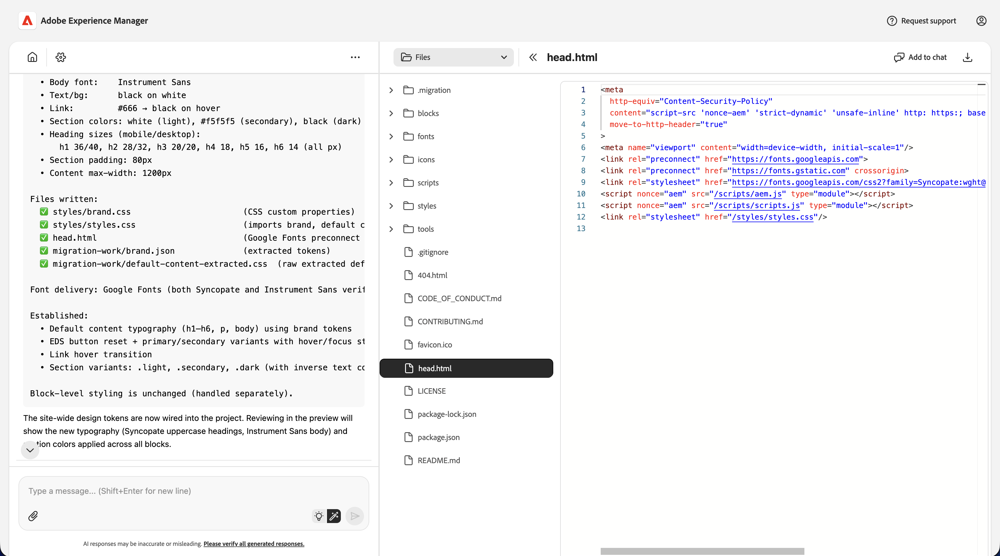

# Console de modernisation de l’expérience {#console-reference}

Guide de référence de l’interface et des fonctionnalités de la console de modernisation de l’expérience

>[!NOTE]
>
>Si vous souhaitez utiliser la console de modernisation de l’expérience, vous pouvez demander l’accès pour garantir une expérience d’intégration fluide.

## Vue d’ensemble {#overview}

La console de modernisation de l’expérience est un environnement de développement hébergé et assisté par l’IA pour Edge Delivery Services, exposé sous la forme d’une interface web sur [`aemcoder.adobe.io`.](https://aemcoder.adobe.io) Une fois connecté à son projet GitHub, vous pouvez commencer immédiatement à demander des modifications en langage naturel sans configuration supplémentaire ni configuration de l’environnement local.

>[!TIP]
>
>Si vous souhaitez commencer immédiatement à utiliser la console, consultez le document [Prise en main de l’agent de modernisation de l’expérience](/help/ai-in-aem/agents/brand-experience/modernization/getting-started.md).

## Fonctionnalités {#capabilities}

Fonctionnalités principales de la console :

* Panneau de conversation interactif avec l’agent et ses compétences
* Aperçu AEM en direct pour un retour visuel immédiat sur les modifications
* Explorateur de fichiers de contenu et visionneuse Markdown
* Synchronisation de contenu avec [la création de documents](https://da.live)
* Explorateur de code et visionneuse diff pour la révision des modifications apportées
* Intégration GitHub avec la possibilité de créer des demandes d’extraction à partir de modifications

Les développeurs gardent le contrôle total sur les navires. Toutes les modifications apportées par le biais de la console doivent être examinées et approuvées avant le déploiement, afin d’assurer la gouvernance, la cohérence de la marque et la sécurité.

## Navigation {#navigation}

Après vous être connecté à la console à l’adresse [aemcoder.adobe.io](https://aemcoder.adobe.io) vous accédez à la [page d’accueil](#home-page) de la console. Une fois que vous avez commencé à discuter, vous accédez directement à la [page de conversation](#chat-page) lors des visites ultérieures de l’agent de modernisation de l’expérience.

### Barre de menus {#menu-bar}

La barre de menus supérieure affiche les éléments suivants :

* Titre **&#x200B;**&#x200B;sur la gauche qui renvoie à la page d&#39;accueil lorsque l&#39;utilisateur clique dessus
* Un bouton **Demander l’assistance** où vous pouvez envoyer des détails sur les problèmes rencontrés
* Un bouton **Compte** à droite pour passer en mode sombre et vous déconnecter de la console

## Page d’accueil {#home-page}

La page **Accueil** est le point de départ pour utiliser la console.

* En haut se trouve une [entrée d’invite](#prompt-input) pour envoyer des requêtes à la console.
* Sous le panneau d’invite se trouvent des invites pour commencer votre projet.
* Un bouton **Commencer à discuter** qui vous mène à la [page de conversation](#chat-page).
* Un bouton **Paramètres** pour accéder à la page [paramètres du projet](#settings-page)

### Invite d&#39;entrée {#prompt-input}

L’entrée rapide fournit des commandes pour interagir avec l’IA.

* **Modes de planification/d’exécution** (icône d’ampoule et de baguette magique) : basculez entre les modes de planification et d’exécution, respectivement
   * **Mode Plan** : l’IA analyse les requêtes et décrit une approche sans apporter de modifications, ce qui est utile pour comprendre la stratégie avant la validation.
   * **Mode d’exécution** : l’IA exécute le plan et apporte des modifications réelles au fichier.
* **Joindre les fichiers** (icône de trombone) : chargez et joignez des fichiers à l’invite pour obtenir un contexte supplémentaire (par exemple, conceptions de référence, captures d’écran, spécifications).
* **File d’attente des invites** (icône d’horloge) : d’autres invites peuvent être mises en file d’attente pour être automatiquement exécutées une fois l’invite en cours terminée.

## Page de conversation {#chat-page}

La page [**Chat**](https://aemcoder.adobe.io/chat) est la principale interface permettant d’interagir avec l’agent de modernisation de l’expérience. Cette page est divisée en un panneau redimensionnable [panneau de conversation](#chat-panel) et [panneau d’espace de travail.](#workspace-panel)

## Panneau de conversation {#chat-panel}

Le panneau de conversation vous permet d’afficher et de poursuivre votre conversation avec l’agent de modernisation de l’expérience. Le panneau de conversation comprend l’historique des messages de conversation et une [entrée d’invite](#prompt-input) pour envoyer des requêtes supplémentaires à la console.

L’en-tête du panneau de conversation comprend des liens permettant d’accéder aux vues [Accueil](#home-page) et [Paramètres](#settings-page) et aux actions de conversation.

* **Actions de conversation**
   * **Effacer la conversation** : permet de réinitialiser la conversation et d’effacer la fenêtre contextuelle de l’IA. Utilisez cette option pour démarrer une nouvelle tâche sans rapport avec la conversation précédente.
   * **Télécharger le chat** : télécharge l’historique des conversations sous forme de fichier Markdown.

## Panneau Workspace {#workspace-panel}

Le panneau Espace de travail affiche tout le contenu et le code de votre site. L’en-tête situé en haut du panneau comprend un sélecteur permettant de sélectionner l’affichage sur lequel vous souhaitez placer le focus. Les actions disponibles dans l’en-tête de l’espace de travail changeront en fonction de la vue actuellement sélectionnée.

### Vues du contenu {#content-view}

Les **vues de contenu** contiennent plusieurs modes d’affichage du contenu de page sélectionné. Un navigateur de fichiers réductible affiche tout le contenu de page disponible pour votre site.

* **Aperçu** (document avec icône de loupe) pour visualiser le contenu HTML rendu
* **Vue Document** (icône de document) pour afficher la structure de contenu de création de documents sous-jacente, respectivement
* **vue** (icône de code) pour afficher le html brut brut
* **Mode Markdown (création AEM)** (icône de paragraphe) pour afficher la structure de contenu Markdown sous-jacente
* **Vue XML JCR (création AEM)** (icône de données) pour afficher la structure de contenu XML JCR résultante

Les actions suivantes sont disponibles dans les vues de contenu :

* Icône **Actualiser** pour mettre à jour le rendu du panneau d’aperçu.
* **Mode réactif** pour afficher le contenu HTML rendu en mode bureau, tablette ou mobile
* **Mode Inspecteur** (icône sélectionner) pour ajouter des éléments de la page à votre invite de contexte supplémentaire
* **Nouvelle fenêtre** (icône Ouvrir dans) pour ouvrir l’URL d’aperçu dans un nouvel onglet (pour un aperçu complet sur le bureau)
* **Supprimer** supprime la page sélectionnée de l’espace de travail. Le contenu prévisualisé ou publié ne sera pas supprimé.
* Le bouton **Erreurs** (création dans AEM) ouvre une fenêtre modale pour afficher les erreurs sur la page sélectionnée.
* Le bouton **Charger le contenu** ouvre une fenêtre modale pour charger des fichiers vers AEM.

### Vues du code {#code-view}

Les **vues de code** fournissent des outils permettant de parcourir vos fichiers de projet et de gérer les modifications de code. La vue comprend un explorateur de fichiers pour obtenir un aperçu de vos fichiers de code ou de vos modifications en tant que diffs, ainsi qu’une zone d’aperçu pour afficher le ou les fichiers sélectionnés.

* **Fichiers** pour parcourir les fichiers de code dans l’espace de travail actuel.
* **Modifications** pour afficher les différences des modifications de fichiers créées par votre travail sur le projet

#### Actions sur le fichier {#file-actions}

* **Ajouter au chat** ajoute le fichier sélectionné (ou les lignes sélectionnées du fichier) au panneau de chat pour le contexte.
* **Télécharger** téléchargez le fichier sélectionné vers votre système de fichiers local

#### Actions sur les modifications {#changes-actions}

* **Ajouter** (icône +) pour préparer le fichier modifié
* **Ignorer** (icône de flèche) pour ignorer le fichier modifié
* **Supprimer** (icône de corbeille) pour supprimer le fichier non intermédiaire
* **Actualiser** (icône actualiser) pour actualiser la liste des modifications
* **Changer de branche** : change de branche dans le même référentiel
* **Sync** : extrait les dernières modifications de l’origine distante.
* **Push** : ouvre une boîte de dialogue modale pour pousser les modifications de l’espace de travail vers GitHub

Lors de l’envoi des modifications, vous devez d’abord disposer de modifications intermédiaires à inclure dans l’envoi. Lors du transfert, vous pouvez choisir de créer une requête de tirage ou de transférer directement vers la branche actuelle

D’autres actions de projet GitHub peuvent être effectuées sur la page [paramètres](#settings-page).

## Page des paramètres {#settings-page}

La page [**Paramètres** &#x200B;](https://aemcoder.adobe.io/settings) vous permet de gérer les paramètres de base de la console. Elle est divisée en plusieurs sections, comme suit :

Si vous apportez une modification à une valeur d’une section, cliquez sur **Enregistrer** pour enregistrer ces modifications dans la section concernée. Cliquez sur l’icône Précédent pour revenir à la vue précédente.

* **Projet** vous permet d’afficher et de modifier les paramètres du projet, tels que la gestion de votre connexion GitHub et la personnalisation de l’URL de la bibliothèque.
   * **Connexion/Reconnexion** : lance l’authentification GitHub.
   * **Changer de référentiel** : remplace l’espace de travail par un autre référentiel. Tout travail non engagé sera perdu.
   * **Déconnexion** : se déconnecte de GitHub
   * **URL de bibliothèque** - Cette URL pointe vers un fichier library.json qui définit les blocs disponibles, leurs variantes et un exemple de contenu.
   * **URL de base du site** - URL d’origine du site web en cours de migration
* **Autorisations de l’agent** - Autoriser l’agent à accéder aux options de configuration
   * **Autoriser LLM à accéder à admin.hlx.page en mon nom** - Lorsqu&#39;il est activé, l&#39;assistant d&#39;IA peut récupérer les configurations et les métadonnées du site à partir de Adobe Experience Manager à l&#39;aide de vos informations d&#39;identification IMS.
   * **Jeton IMS personnalisé** - Vous pouvez fournir un jeton IMS personnalisé à utiliser à la place de votre jeton de session par défaut.
* **Informations d’identification** vous permet de spécifier un jeton d’accès personnel pour Figma afin que la console [&#x200B; puisse accéder aux blocs de conception de votre projet](/help/ai-in-aem/agents/brand-experience/modernization/prompting-guide.md#figma-block-migration).
   * Le jeton nécessite les portées en lecture seule suivantes :
      * `file_content:read`
      * `file_metadata:read`
      * `library_assets:read`
      * `library_content:read`
      * `team_library_content:read`
      * `file_dev_resources:read`
      * `projects:read`
   * [Voir la documentation Figma](https://help.figma.com/hc/en-us/articles/8085703771159-Manage-personal-access-tokens) pour plus d’informations sur la configuration des jetons d’accès personnels.
* **Assistance** résume les informations partagées avec l’équipe d’assistance d’Adobe lorsque vous effectuez une demande d’assistance.
   * **Demande d’assistance** - Cliquez pour lancer une demande d’assistance auprès d’Adobe sans quitter la console.
* **Zone dangereuse** contient des paramètres qui peuvent rétablir votre espace de travail.
   * **Réinitialiser l’espace de travail** - Cliquez pour réinitialiser l’espace de travail à son état initial. Cette opération est irréversible.
