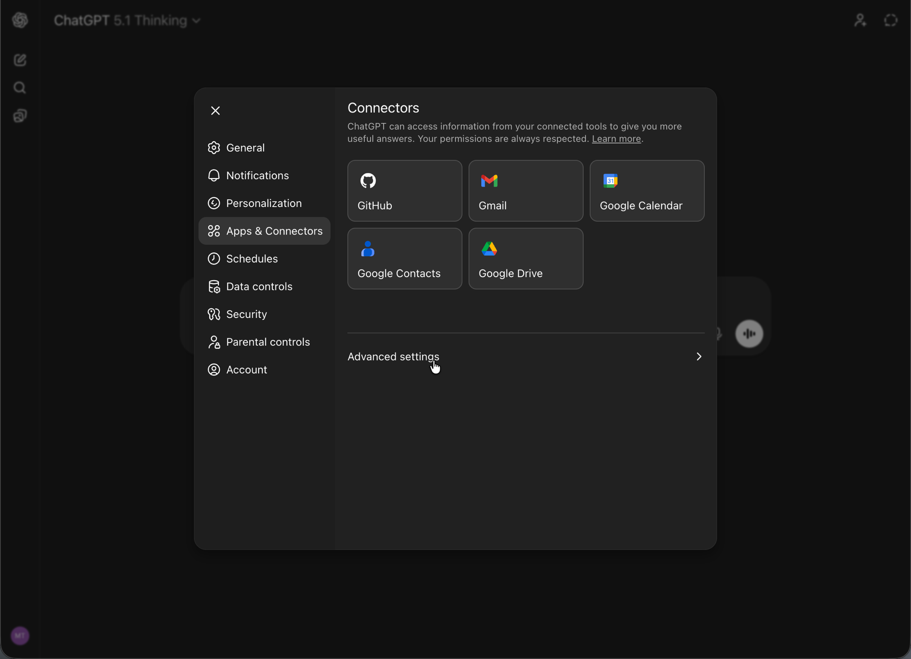
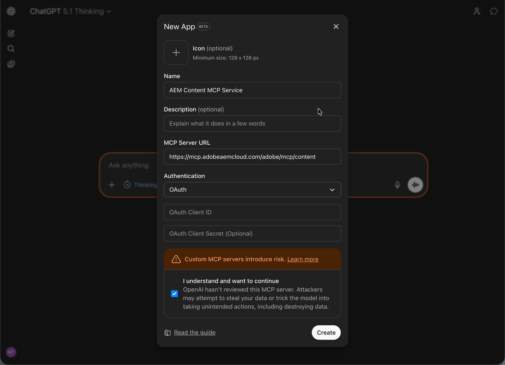

# Configuration de OpenAI ChatGPT avec AEM MCP {#setup-chatgpt}

Pour connecter OpenAI ChatGPT aux serveurs MCP AEM, procédez comme suit.

* Ajoutez une ou plusieurs URL de serveur MCP AEM dans la zone où les connexions ou outils MCP sont configurés.
* Déclenchez la connexion et connectez-vous avec votre Adobe ID en cas de redirection.
* Dans une conversation, référencez les outils AEM configurés dans vos invites, par exemple :

  ```
  "Using the configured AEM MCP tools, list all sites in the author environment."
  ```








