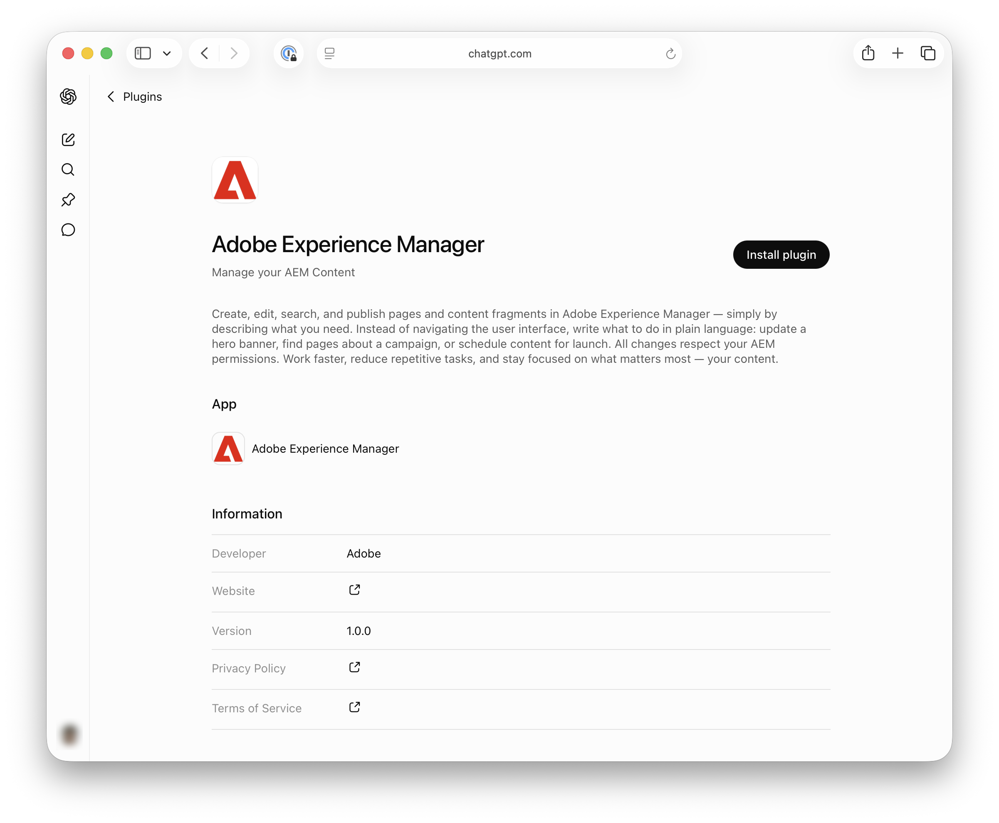
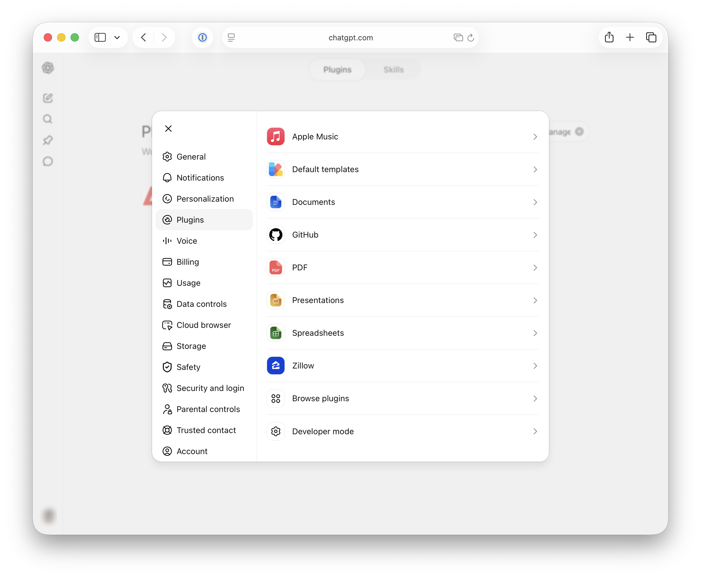

# Configuration de OpenAI ChatGPT avec AEM MCP {#setup-chatgpt}

Cet article couvre deux manières distinctes d’utiliser le ChatGPT OpenAI avec AEM :

- Configurez manuellement un ou plusieurs serveurs MCP d’AEM dans le module ChatGPT (les serveurs décrits à la section [Utilisation de MCP avec AEM as a Cloud Service — Serveurs MCP](/help/ai-in-aem/mcp-support/using-mcp-with-aem-as-a-cloud-service.md#mcp-servers)).
- Installez le plug-in Adobe Experience Manager à partir de la marketplace du plug-in ChatGPT. Il dispose actuellement de la parité des fonctionnalités avec le serveur MCP de contenu et exposera un sous-ensemble croissant d’outils disponibles dans les serveurs MCP d’AEM.

## Configuration manuelle des serveurs MCP d’AEM dans le ChatGPT {#manual-configure-aems-mcp-servers-in-chatgpt}

Cette section décrit l’approche **configuration manuelle**, qui consiste à ajouter un ou plusieurs serveurs MCP d’AEM au module ChatGPT en tant qu’applications ou connecteurs personnalisés.

&#x200B;* Ajoutez une ou plusieurs URL de serveur MCP AEM dans la zone où les connexions ou outils MCP sont configurés.
&#x200B;* Déclenchez la connexion et connectez-vous avec votre Adobe ID en cas de redirection.
&#x200B;* Dans une conversation, référencez les outils AEM configurés dans vos invites, par exemple :

  ```
  "Using the configured AEM MCP tools, list all sites in the author environment."
  ```

>[!NOTE]
>
>L’interface utilisateur de OpenAI ChatGPT peut changer et n’est pas définitive. Ces instructions sont fournies à titre d’illustration.

1. Ouvrez **Paramètres** pour accéder à la zone où les connexions ou outils MCP sont configurés.

   

1. Dans **Applications et connecteurs**, ouvrez **Paramètres avancés** pour gérer les options de connecteur et les options liées au MCP.

   

1. Activez le **mode Développeur** dans **Applications et connecteurs** afin de pouvoir ajouter et configurer un plug-in personnalisé.

   

1. Démarrez **Créer une application** (ou un contrôle équivalent) pour ajouter une entrée d’application pour votre serveur MCP AEM.

   

1. Remplissez le formulaire **Nouvelle application** par exemple, nommez l’application et saisissez l’URL de votre serveur AEM MCP et tout autre champ obligatoire, puis **Enregistrez**.

   

1. Confirmez que le service **AEM Content MCP** (ou votre application configurée) apparaît dans **Applications et connecteurs** pour que ChatGPT puisse l’utiliser.

   

1. Dans une conversation, écrivez une invite qui indique à ChatGPT d’utiliser les **outils AEM configurés** (par exemple, pour interroger du contenu ou des sites de création).

   

## Installer le plug-in Adobe Experience Manager (marketplace du plug-in ChatGPT) {#install-adobe-experience-manager-plugin}

Cette section décrit le **plug-in installable** de la marketplace du plug-in ChatGPT (au lieu d’ajouter une URL de serveur MCP personnalisée). Il comprend un sous-ensemble des outils disponibles dans les serveurs MCP AEM.

>[!NOTE]
>
>L’interface utilisateur de OpenAI ChatGPT peut changer et n’est pas définitive. Ces instructions sont fournies à titre d’illustration.

Vous pouvez accéder au plug-in Adobe Experience Manager de deux façons. Utilisez la méthode la plus pratique, puis suivez les étapes de connexion ci-après.

**Option 1 : ouvrir directement la page du plug-in**

Accédez à [&#128279;](https://chatgpt.com/plugins/plugin_asdk_app_6a35d3c1258081919c084a1fd22cd02d) puis choisissez **Installer le plug-in**.



**Option 2 : Rechercher le plug-in sur la marketplace**

1. Dans **Paramètres**, choisissez **Modules externes**, puis au bas de la liste choisissez **Parcourir les modules externes**.

   

1. Recherchez **&#x200B;**, puis sélectionnez-le.

   

**Connexion et confirmation**

Après avoir localisé ou installé le plug-in à l’aide de l’une des options ci-dessus, effectuez la connexion :

1. Sélectionnez **Se connecter avec Adobe Experience Manager** et connectez-vous à AEM après redirection.

   

1. Confirmez que la bannière verte indique que Adobe Experience Manager est maintenant connecté.

   
