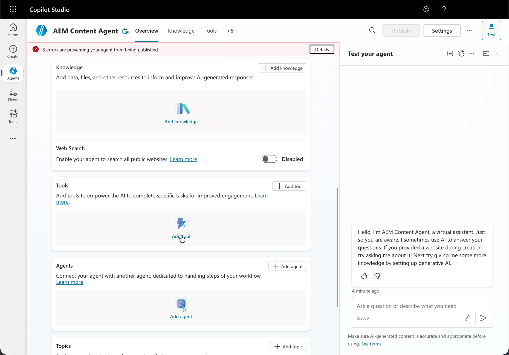
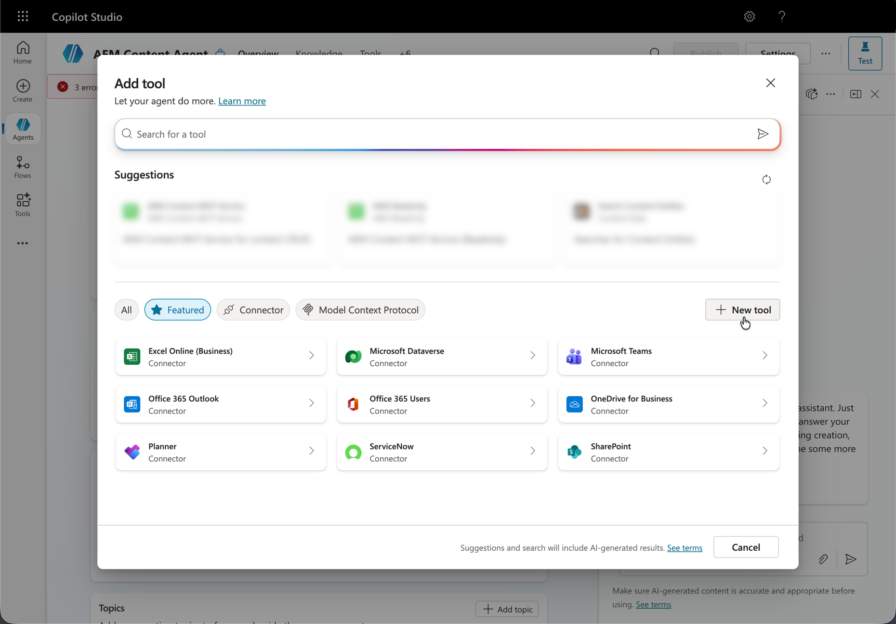
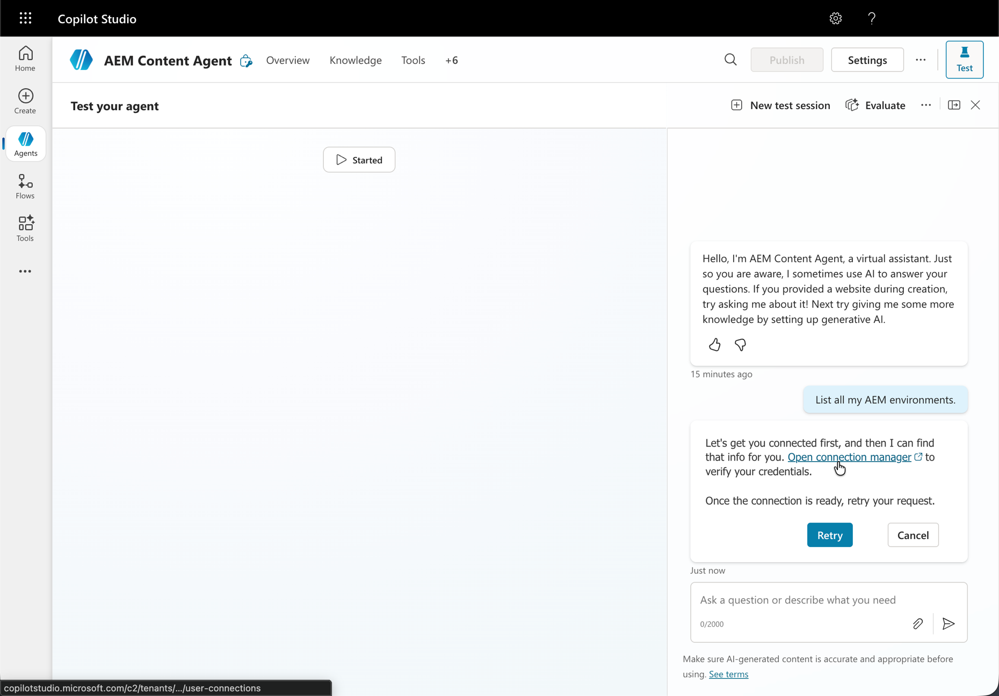

# Configuration de Microsoft Copilot Studio avec AEM MCP {#setup-microsoft-copilot-studio}

Pour connecter Microsoft Copilot Studio aux serveurs MCP AEM, procédez comme suit.

* Créez un agent.
* Accédez à la section Outil et cliquez sur **Ajouter un outil**.
* Sélectionnez un outil existant ou créez-en un.
* Configurez un nouvel outil MCP pointant vers une ou plusieurs URL de serveur MCP AEM.
* Établissez une connexion qui peut être partagée ou dédiée entre les agents.
* Connectez-vous à l’aide de votre Adobe ID lors de la redirection.
* Vous pouvez éventuellement activer le mode de confirmation automatique ou exiger une confirmation de l’utilisateur final pour toutes les interactions de l’outil.
* Lors du test de l’agent, ouvrez d’abord le gestionnaire de connexions pour attribuer une connexion à votre session, puis appuyez sur **Réessayer**.

