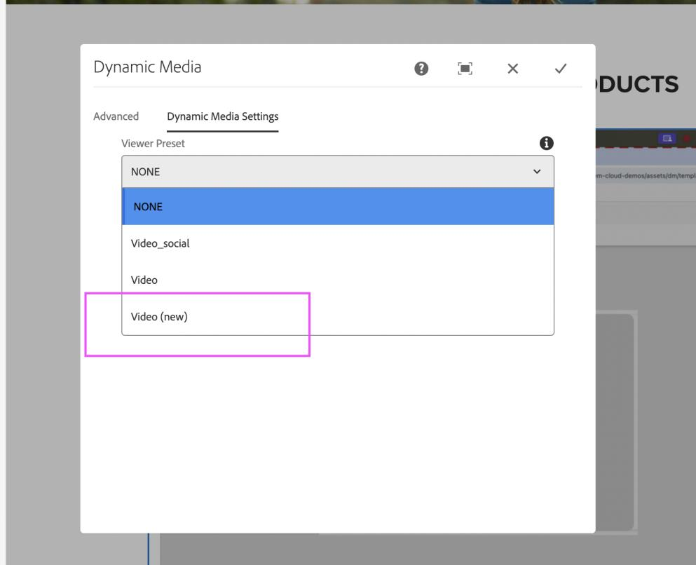

# Nouvelle visionneuse de vidéos dans Dynamic Media {#new-video-viewer-dynamic-media}

La nouvelle visionneuse de vidéos pour Dynamic Media offre une expérience de lecture vidéo modernisée dans Adobe Experience Manager (AEM). Il offre une expérience de visionnage cohérente et extensible dans les environnements de création, de prévisualisation et de Sites, tout en continuant à travailler avec les workflows Dynamic Media existants.

Les visionneuses de vidéos existantes dans Dynamic Media prennent en charge les principales exigences de lecture, mais offrent une extensibilité limitée et une intégration au niveau de l’événement pour les scénarios d’intégration et d’analyse modernes

La nouvelle visionneuse de vidéos résout ces restrictions en :

* Offrir une expérience de lecture plus cohérente
* Autoriser la sélection explicite des visionneuses
* Emission d&#39;événements de lecture structurés pour la consommation programmatique
* Prise en charge de l’intégration avec des analyses externes et des systèmes externes

La visionneuse est disponible en tant qu’option supplémentaire et nécessite une sélection explicite lorsqu’elle est prise en charge. Il ne remplace pas automatiquement les visionneuses de vidéos existantes.

La nouvelle visionneuse de vidéos est destinée aux entreprises qui ont besoin d’une expérience vidéo améliorée et extensible sans interrompre les implémentations existantes.

> **REMARQUE**
>
> La nouvelle visionneuse de vidéos est une fonctionnalité à disponibilité limitée. Vous pouvez l’activer en créant un [&#x200B; ticket d’assistance &#x200B;](https://helpx.adobe.com/fr/enterprise/using/support-for-experience-cloud.html).

## Fonctionnement de la nouvelle visionneuse de vidéos {#how-it-works}

Le fonctionnement de la nouvelle visionneuse de vidéos est le suivant :

1. Une ressource vidéo est ingérée dans un dossier synchronisé avec Dynamic Media.
2. Vous pouvez prévisualiser la vidéo à partir de la page des détails de la ressource à l’aide de **Vidéo (nouvelle)**.
3. La nouvelle visionneuse de vidéos peut être sélectionnée dans le composant **Dynamic Media** lors de la création de pages Sites.
4. Pendant la lecture, la visionneuse émet des événements structurés dans la fenêtre parente.
5. Des modificateurs de visionneuse facultatifs peuvent être utilisés pour contrôler le comportement de lecture.

## Principales différences par rapport à la visionneuse de vidéos existante {#key-differences}

| Aire | Description |
|------|-------------|
| Disponibilité des visionneuses | S’affiche sous la forme d’une nouvelle option nommée **Vidéo (nouvelle)** |
| Sélection de la visionneuse | Doit être explicitement sélectionné |
| Extensibilité | Émet des événements de lecture structurés |
| Intégration | Continue de travailler avec les workflows Dynamic Media existants |

## Prérequis {#prerequisites}

Avant d’utiliser la nouvelle visionneuse de vidéos, assurez-vous que les conditions préalables suivantes sont remplies :

| Condition requise | Description |
|------------|-------------|
| Synchronisation Dynamic Media | Le dossier de ressources doit être synchronisé avec Dynamic Media. |
| Profil vidéo | Un profil vidéo doit être appliqué au dossier. |
| Contenu vidéo | Une vidéo doit être ingérée dans le dossier . |

La nouvelle visionneuse de vidéos est disponible à partir de la version 2025.7.0 d’AEM as a Cloud Service **&#x200B;**.

Pour activer ou désactiver la nouvelle visionneuse de vidéos, contactez l’assistance clientèle d’Adobe.

## Prévisualisation de la nouvelle visionneuse de vidéos {#preview}

Pour prévisualiser la nouvelle visionneuse de vidéos à partir de la page des détails de la ressource, procédez comme suit :

1. Accédez à **Assets** > **Fichiers**, puis ouvrez le dossier contenant la ressource vidéo.
2. Cliquez sur la ressource vidéo pour ouvrir la page des détails de la ressource.
3. Dans le panneau de gauche, cliquez sur **Visionneuses**.
4. Dans le panneau **Visionneuses**, sélectionnez **Vidéo (nouvelle)**.
5. Cliquez sur **URL** pour copier le lien d’aperçu.
   

## Utilisation de la nouvelle visionneuse de vidéos dans Sites {#use-in-sites}

La nouvelle visionneuse de vidéos est disponible via le composant **Dynamic Media** existant dans AEM Sites.

### Ajout du composant Dynamic Media

Pour ajouter une vidéo à l’aide du composant Dynamic Media, procédez comme suit :

1. Ouvrez la page dans l’**éditeur Sites**.
2. Faites glisser le composant **Dynamic Media** vers l’emplacement souhaité sur la page.
3. Sélectionnez le composant **Dynamic Media** sur la page.
4. Cliquez sur le composant pour ouvrir le sélecteur de ressources.
5. Sélectionnez une ressource vidéo.

### Configuration de la visionneuse

Pour configurer le paramètre prédéfini de visionneuse, procédez comme suit :

1. Sélectionnez le composant **Dynamic Media** sur la page.
2. Cliquez sur **Configurer** dans la barre d’outils du composant.
   

3. Dans la boîte de dialogue **Paramètres Dynamic Media**, sélectionnez **Vidéo (nouvelle)** dans la liste déroulante **Paramètre prédéfini de la visionneuse**.
   

4. Saisissez les modificateurs requis dans le champ **Modificateurs de visionneuse** (par exemple, `autoplay=true&muted=true`).
   

5. Enregistrez les modifications.

La vidéo se charge sur la page à l’aide de la nouvelle visionneuse de vidéos.

> **Remarque :** la nouvelle visionneuse de vidéos ne remplace pas automatiquement les vidéos existantes. Les utilisateurs doivent sélectionner manuellement **Vidéo (nouvelle)** dans le **Paramètre prédéfini de visionneuse** lors de l’utilisation du composant Dynamic Media, ou mettre à jour les URL directes pour pointer vers la nouvelle visionneuse de vidéos, si nécessaire.

### Migration de vidéos à l’aide d’URL directes

Si vos vidéos sont accessibles via des URL directes au lieu du composant Dynamic Media, vous pouvez les basculer vers la nouvelle visionneuse de vidéos en mettant à jour l’URL. Par exemple : `https://s7d1.scene7.com/dmviewers/html5/VideoViewer.html?asset=<video-asset>`

## Modificateurs de visionneuse {#viewer-modifiers}

Les modificateurs de visionneuse vous permettent de contrôler le chargement des ressources, le comportement de la lecture, la sélection du format de diffusion en continu et la présentation de la visionneuse.

| Modificateur | Description |
|--------|-------------|
| `asset` | Indique l’identifiant de ressource de la vidéo ou de la visionneuse de vidéos adaptative. |
| `posterimage` | Indique l’image affichée avant le début de la lecture. |
| `serverurl` | Indique le chemin d’accès racine de la diffusion d’images. |
| `contenturl` | Indique le chemin d’accès racine du contenu. |
| `videoserverurl` | Indique le chemin d’accès racine du serveur vidéo. |
| `sources.dash` | Indique l’URL de manifeste DASH pour la lecture. |
| `sources.hls` | Indique l’URL de manifeste HLS pour la lecture. |
| `autoplay=true` | Démarre la lecture automatiquement au chargement de la vidéo. |
| `controls=true/false` | Affiche ou masque les commandes de lecture vidéo. |
| `loop=true` | Redémarre la lecture automatiquement une fois la vidéo terminée. |
| `muted=true` | Démarre la lecture en mode silencieux. |
| `playbackrates` | Spécifie les options de vitesse de lecture disponibles. |
| `playback` | Indique le format de diffusion en continu (auto, hls, dash ou progressive). |
| `progressivebitrate` | Indique le débit de la lecture progressive. |
| `initialbitrate` | Indique le débit initial pour la diffusion en continu adaptative. |
| `isletterboxed=true/false` | Contrôle si la vidéo est en boîte aux lettres ou étirée. |
| `customcss` | Spécifie un fichier CSS personnalisé pour le style de la visionneuse. |
| `transition` | Spécifie le comportement d&#39;affichage ou de masquage de la transition pour les contrôles de visionneuse. |

Les modificateurs sont spécifiés en tant que paramètres de requête dans le champ **Modificateurs de visionneuse**.

## Événements pris en charge {#supported-events}

La nouvelle visionneuse de vidéos émet les événements suivants lors de la lecture :

| Type d’événement | Description |
|-----------|-------------|
| jouer | La vidéo commence à être lue. |
| pause | La vidéo est en pause |
| chercher | Recherche d’utilisateurs dans la vidéo |
| charger | La vidéo est chargée |
| fermer | Le lecteur est fermé |
| metadata | Métadonnées telles que la durée |
| jalon | Jalon de lecture atteint |
| current_time | Position de lecture périodique |
| plein écran | Entrer en mode plein écran |
| un_fullscreen | Quitter le plein écran |

## Gérer les événements dans la fenêtre parente {#handling-events}

La nouvelle visionneuse de vidéos envoie des messages liés à la lecture à la page parente lors des interactions vidéo.

Pour gérer ces événements, l’application parent doit écouter les événements de message du navigateur et valider l’origine du message avant de traiter les données.

La payload de l’événement comprend des informations telles que le type d’événement, l’état de lecture, l’heure de lecture actuelle et des métadonnées supplémentaires. Ces événements peuvent être utilisés pour prendre en charge le suivi analytique, les interactions personnalisées ou l’intégration à des systèmes externes

Adobe recommande de valider l’origine du message pour s’assurer que les événements sont traités uniquement à partir de domaines Dynamic Media approuvés.

## Rapport d’engagement vidéo pour la nouvelle visionneuse de vidéos {#video-engagement-report}

Le rapport d’engagement vidéo fournit des mesures d’analyse pour les vidéos lues à l’aide de la nouvelle visionneuse de vidéos dans Dynamic Media. Le rapport fournit des données de performances agrégées pour le mois spécifié et prend en charge les rapports mensuels.

Les rapports sont générés sur demande. Pour demander un rapport, créez un [ticket d’assistance](https://helpx.adobe.com/fr/enterprise/using/support-for-experience-cloud.html) et fournissez les détails suivants :

* Mois du rapport - Spécifiez le mois pour lequel le rapport est requis (par exemple, janvier 2026).
* Adresse e-mail de diffusion : adresse e-mail du groupe (recommandé) ou de la personne à laquelle envoyer le rapport

Le rapport fournit des mesures d’engagement par vidéo, notamment les vues, les impressions, la durée de visionnage, le taux d’achèvement et le score d’engagement.

### Format du rapport

* Les rapports sont diffusés au format CSV.
* Chaque ligne représente une seule vidéo.
* Les mesures sont agrégées pour la période de création de rapports sélectionnée.
* Les ressources supprimées sont exclues du rapport.
* Prend en charge le filtrage par `tenant_name`.

### Champs du rapport

Le rapport d’engagement vidéo comprend les champs suivants :

| Champ | Description | Calcul |
|-------|------------|-------------|
| `video_id` | Identifiant vidéo unique. | S/O |
| `video_name` | Nom de la ressource vidéo. | S/O |
| `video_created_date` | Date de création de la vidéo. | S/O |
| `duration_in_seconds` | Durée de la vidéo en secondes. | S/O |
| `video_views` | Nombre total d’événements de lecture vidéo au cours de la période de création de rapports sélectionnée. | S/O |
| `video_impressions` | Nombre total de fois où la vidéo a été chargée. | S/O |
| `video_watched_seconds` | Nombre total de secondes regardées pour tous les événements de lecture. | Somme des secondes regardées pour tous les événements de lecture |
| `play_rate` | Pourcentage de lectures vidéo par rapport au chargement vidéo. | (`video_views` ÷ `video_impressions`) × 100 |
| `avg_time_watched_in_seconds` | Durée moyenne de visionnage en secondes par vue. | `video_watched_seconds` ÷ `video_views` |
| `avg_completion_rate` | Pourcentage de vues ayant atteint l’achèvement de la vidéo complète. | (Vues terminées ÷ `video_views`) × 100 |
| `engagement_score` | Pourcentage de surveillance moyen sur tous les événements de lecture. | (Pourcentage total de la chronologie vidéo visionnée dans toutes les sessions ÷ `video_views`) |
| `tenant_name` | Identifiant de la société ou du client associé aux données. | S/O |

## Questions fréquentes {#faq-video-engagement}

+++Si une vidéo est définie pour être lue automatiquement, est-elle comptabilisée automatiquement comme une vue, ou uniquement après que l’utilisateur ou l’utilisatrice l’a regardée pendant une durée minimale ?

La lecture automatique est comptabilisée comme une vue vidéo. La lecture lancée automatiquement est enregistrée en tant que vue.

+++

+++Si un utilisateur ou une utilisatrice ne regarde qu’une partie d’une vidéo (par exemple, les 2 premières secondes et les 2 dernières secondes d’une vidéo de 10 secondes), est-elle comptabilisée comme une vue terminée ?

Une vue est comptabilisée comme terminée lorsque la lecture atteint la fin de la chronologie vidéo, même si des parties de la vidéo ont été ignorées.

+++

+++Si un utilisateur ou une utilisatrice passe la vidéo au peigne fin et la regarde à nouveau, le nombre de vues_vidéo, le score_d’engagement ou les deux augmentent-ils ?

Reregarder des parties de la vidéo n’augmente pas le nombre de vues_vidéo. Une lecture supplémentaire contribue au score de l’engagement.

+++

+++Si le même utilisateur regarde la même vidéo plusieurs fois sans recharger la page, comment les paramètres video_views et engagement_score sont-ils calculés ?

La lecture répétée sans recharger la page n’augmente pas le nombre de vues_vidéo. Une lecture supplémentaire contribue au score de l’engagement.

+++

+++La suspension et la reprise d’une vidéo affectent-elles le suivi de l’engagement ou le calcul du taux d’achèvement ?

La suspension et la reprise de la lecture n’affectent pas le suivi de l’engagement ou le calcul du taux d’achèvement.

+++
