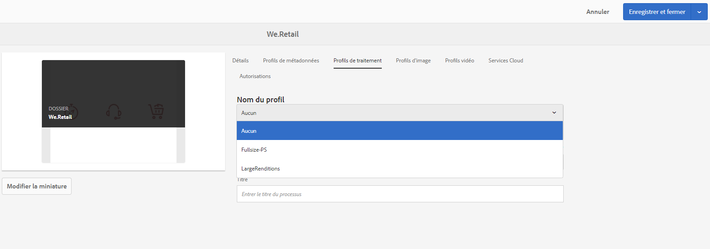

# Ajout de ressources numériques à Adobe Experience Manager {#add-assets-to-experience-manager}

Le téléchargement de vos fichiers numériques vers Adobe Experience Manager enrichit le contenu binaire du fichier avec des métadonnées enrichies, des balises intelligentes, des rendus et d’autres services de gestion des actifs numériques (DAM). Vous pouvez télécharger divers types de fichiers (images, fichiers PDF, fichiers bruts, etc.) depuis votre dossier local ou un lecteur réseau vers Experience Manager Assets.

Plusieurs méthodes de téléchargement sont fournies. Outre le téléchargement de navigateur le plus souvent utilisé, il existe d’autres méthodes pour ajouter des ressources au référentiel Experience Manager, notamment des clients de bureau, tels qu’Adobe Asset Link ou l’application de bureau Experience Manager, des scripts de téléchargement et d’assimilation que les clients créeraient et des intégrations d’assimilation automatisées ajoutées en tant qu’extensions AEM.

Nous allons nous concentrer sur les méthodes de téléchargement pour les utilisateurs finaux ici et fournir des liens vers des articles décrivant les aspects techniques du transfert et de l’assimilation de ressources à l’aide des API et des SDK Experience Manager.

Bien que vous puissiez télécharger et gérer n’importe quel fichier binaire dans Experience Manager, les formats de fichier les plus courants prennent en charge des services supplémentaires, tels que l’extraction de métadonnées ou la génération d’aperçus/rendus. Pour plus d’informations, reportez-vous aux formats [de fichier](file-format-support.md) pris en charge.

Vous pouvez également choisir d’effectuer un traitement supplémentaire sur les fichiers téléchargés. Un certain nombre de profils de traitement de fichiers peuvent être configurés sur le dossier, dans lequel les fichiers sont téléchargés, pour ajouter des métadonnées, des rendus ou des services de traitement d’images spécifiques. Voir Traitement [supplémentaire](#additional-processing) ci-dessous pour plus d’informations.

> [!NOTE]
>
> Experience Manager en tant que service Cloud utilise une nouvelle méthode de téléchargement des ressources : le transfert binaire direct. Il est pris en charge par défaut par les fonctionnalités et les clients du produit prêt à l’emploi, tels que l’interface utilisateur d’AEM, Adobe Asset Link, l’application de bureau AEM, et donc transparent pour les utilisateurs finaux.
>
> Le code de téléchargement personnalisé ou étendu par les équipes techniques des clients doit utiliser les nouvelles API et les nouveaux protocoles de téléchargement.

## Upload assets {#upload-assets}

Pour télécharger un fichier (ou plusieurs fichiers), vous pouvez les sélectionner sur votre bureau et les faire glisser dans l’interface utilisateur (navigateur Web) vers le dossier de destination. Vous pouvez également lancer le téléchargement à partir de l’interface utilisateur.

1. Dans l’interface utilisateur Ressources, accédez à l’emplacement où vous souhaitez ajouter des ressources numériques.
1. Pour transférer les ressources, effectuez l’une des opérations suivantes :

   * On the toolbar, tap the **[!UICONTROL Create]** icon. Ensuite, dans le menu, appuyez sur **[!UICONTROL Fichiers]**. Au besoin, vous pouvez renommer le fichier dans la boîte de dialogue affichée.
   * Dans un navigateur prenant en charge HTML5, faites glisser les ressources directement sur l’interface utilisateur Ressources. La boîte de dialogue permettant de renommer les fichiers n’est pas affichée.
   

   Pour sélectionner plusieurs fichiers, appuyez sur la touche Ctrl ou Commande et sélectionnez les fichiers dans la boîte de dialogue du sélecteur de fichiers. Lorsque vous utilisez un iPad, vous ne pouvez sélectionner qu’un seul fichier à la fois.

<!-- #ENGCHECK do we support pausing? I couldn't get pause to show with 1.5GB upload.... If not, this should be removed#

   You can pause the uploading of large assets (greater than 500 MB) and resume it later from the same page. Tap the **[!UICONTROL Pause]** icon beside progress bar that appears when an upload starts.

   

   The size above which an asset is considered a large asset is configurable. For example, you can configure the system to consider assets above 1000 MB (instead of 500 MB) as large assets. In this case, **[!UICONTROL Pause]** appears on the progress bar when assets of size greater than 1000 MB are uploaded.

   The Pause button does not show if a file greater than 1000 MB is uploaded with a file less than 1000 MB. However, if you cancel the less than 1000 MB file upload, the **[!UICONTROL Pause]** button appears.

   To modify the size limit, configure the `chunkUploadMinFileSize` property of the `fileupload`node in the CRX repository.

   When you click the **[!UICONTROL Pause]** icon, it toggles to a **[!UICONTROL Play]** icon. To resume uploading, click the **[!UICONTROL Play]** icon.

   
-->

1. To cancel an ongoing upload, click close (`X`) next to the progress bar. Lorsque vous annulez le transfert, AEM Assets supprime la partie partiellement transférée de la ressource.

   Si vous annulez le transfert avant la fin de l’opération, AEM Assets arrête le transfert du fichier en cours et actualise le contenu. Toutefois, les fichiers déjà téléchargés ne sont pas supprimés.

<!-- #ENGCHECK do we support pausing? I couldn't get pause to show with 1.5GB upload.... If not, this should be removed#
   The ability to resume uploading is especially helpful in low-bandwidth scenarios and network glitches, where it takes a long time to upload a large asset. You can pause the upload operation and continue later when the situation improves. When you resume, uploading starts from the point where you paused it.
-->

<!-- #ENGCHECK assuming this is not relevant? please remove after confirming#
   During the upload operation, AEM saves the portions of the asset being uploaded as chunks of data in the CRX repository. When the upload completes, AEM consolidates these chunks into a single block of data in the repository.

   To configure the cleanup task for the unfinished chunk upload jobs, go to `https://[aem_server]:[port]/system/console/configMgr/org.apache.sling.servlets.post.impl.helper.ChunkCleanUpTask`.
-->

1. La boîte de dialogue Télécharger les éléments d’AEM Assets affiche le nombre de fichiers dont le transfert a réussi et ceux dont le transfert a échoué.

De plus, l’interface utilisateur Assets affiche la ressource la plus récente que vous avez téléchargée ou le dossier que vous avez créé en premier.

> [!NOTE]
>
> Si vous devez télécharger des hiérarchies de dossiers imbriqués vers AEM, reportez-vous à la section Téléchargement [en masse des ressources](#bulk-upload)

<!-- #ENGCHECK I'm assuming this is no longer relevant.... If yes, this should be removed#

### Serial uploads {#serialuploads}

Uploading numerous assets in bulk consumes significant I/O resources, which may adversely impact the performance of your AEM Assets instance. In particular, if you have a slow internet connection, the time to upload drastically increases due to a spike in disk I/O. Moreover, your web browser may introduce additional restrictions to the number of POST requests AEM Assets can handle for concurrent asset uploads. As a result, the upload operation fails or terminate prematurely. In other words, AEM assets may miss some files while ingesting a bunch of files or altogether fail to ingest any file.

To overcome this situation, AEM Assets ingests one asset at a time (serial upload) during a bulk upload operation, instead of the concurrently ingesting all the assets.

Serial uploading of assets is enabled by default. To disable the feature and allow concurrent uploading, overlay the `fileupload` node in Crx-de and set the value of the `parallelUploads` property to `true`.

### Streamed uploads {#streamed-uploads}

If you upload many assets to AEM, the I/O requests to server increase drastically, which reduces the upload efficiency and can even cause some upload task to time out. AEM Assets supports streamed uploading of assets. Streamed uploading reduces the disk I/O during the upload operation by avoiding asset storage in a temporary folder on the server before copying it to the repository. Instead, the data is transferred directly to the repository. This way, the time to upload large assets and the possibility of timeouts is reduced. Streamed upload is enabled by default in AEM Assets.

>[!NOTE]
>
>Streaming upload is disabled for AEM running on JEE server with servlet-api version lower than 3.1.
-->

### Gestion des téléchargements lorsque des ressources existent déjà {#handling-upload-existing-file}

Si vous transférez une ressource portant le même nom qu’une ressource déjà disponible à l’emplacement où vous transférez la ressource, un message d’avertissement s’affiche.

Vous pouvez choisir de remplacer une ressource existante, de créer une autre version ou de garder les deux en renommant la nouvelle ressource téléchargée. Si vous remplacez une ressource existante, les métadonnées de la ressource et les modifications antérieures (annotations, recadrage, etc.) que vous avez apportées à la ressource existante sont supprimées. If you choose to keep both assets, the new asset is renamed with the number `1` appended to its name.

>[!NOTE]
>
>When you select **[!UICONTROL Replace]** in the [!UICONTROL Name Conflict] dialog, the asset ID is regenerated for the new asset. Cet ID est différent de l’ID de la ressource précédente.
>
>Si l’option Statistiques des ressources est activée pour effectuer le suivi des impressions/clics avec Adobe Analytics, l’ID de ressource régénéré invalide les données capturées pour la ressource sur Analytics.

Pour conserver la ressource en double dans les ressources AEM, appuyez/cliquez sur **[!UICONTROL Conserver]**. Pour supprimer le fichier en double que vous avez téléchargé, appuyez/cliquez sur **[!UICONTROL Supprimer]**.

### Gestion des noms de fichier et caractères interdits {#filename-handling}

AEM Assets vous empêche de télécharger des fichiers dont les noms contiennent des caractères interdits. Si vous tentez de télécharger un fichier dont le nom de fichier contient un caractère non autorisé ou plus, AEM Assets affiche un message d’avertissement et interrompt le téléchargement jusqu’à ce que vous supprimiez ces caractères ou que vous les téléchargiez avec un nom autorisé.

To suit specific file naming conventions for your organization, the [!UICONTROL Upload Assets] dialog lets you specify long names for the files that you upload.

Toutefois, la liste de caractères suivante, séparée par des espaces, n’est pas prise en charge :

* asset file name must not contain `* / : [ \\ ] | # % { } ? &`
* asset folder name must not contain `* / : [ \\ ] | # % { } ? \" . ^ ; + & \t`

## Bulk upload of assets {#bulk-upload}

Pour télécharger un plus grand nombre de fichiers, notamment s’ils existent dans une hiérarchie de dossiers imbriqués sur le disque, vous pouvez utiliser les méthodes suivantes :

* Utilisez un script ou un outil de téléchargement personnalisé qui exploite les API [de téléchargement de](developer-reference-material-apis.md#asset-upload-technical)fichier. Un tel outil personnalisé peut ajouter une gestion supplémentaire des ressources (par exemple, traduire des métadonnées ou renommer des fichiers), si nécessaire.
* Utilisez l’application [de bureau](https://docs.adobe.com/content/help/en/experience-manager-desktop-app/using/using.html) Experience Manager pour télécharger des hiérarchies de dossiers imbriqués.

> [!NOTE]
>
> Le téléchargement en masse dans le cadre de la migration de contenu à partir d’autres systèmes lors de la configuration et du déploiement vers Experience Manager nécessite une planification, une réflexion et un choix minutieux d’outils. Consultez le guide [de](/help/implementing/deploying/overview.md) déploiement pour en savoir plus sur les approches de migration de contenu.

## Téléchargement de fichiers à l’aide de clients de bureau {#upload-assets-desktop-clients}

Outre l’interface utilisateur du navigateur Web, Experience Manager prend en charge d’autres clients sur le bureau. Ils fournissent également une expérience de téléchargement sans avoir à accéder au navigateur Web.

* [Adobe Asset Link](https://helpx.adobe.com/enterprise/using/adobe-asset-link.html) permet d’accéder aux ressources d’AEM dans les applications de bureau Adobe Photoshop, Adobe Illustrator et Adobe InDesign. Vous pouvez télécharger le document actuellement ouvert dans AEM directement depuis l’interface utilisateur d’Adobe Asset Link depuis ces applications de bureau.
* [L’application](https://docs.adobe.com/content/help/en/experience-manager-desktop-app/using/using.html) de bureau Experience Manager simplifie l’utilisation des ressources sur le bureau, indépendamment du type de fichier ou de l’application native qui les gère. Il est particulièrement utile de télécharger des fichiers dans des hiérarchies de dossiers imbriqués à partir de votre système de fichiers local, car le téléchargement de navigateur ne prend en charge que le téléchargement de listes de fichiers plats.

## Traitement supplémentaire {#additional-processing}

Pour effectuer un traitement supplémentaire sur les fichiers téléchargés, vous pouvez utiliser les profils de traitement des fichiers sur le dossier, dans lequel les fichiers sont téléchargés. Ils sont disponibles dans la boîte de dialogue **[!UICONTROL Propriétés]** du dossier.

Les profils suivants sont disponibles :

* [Les profils](metadata-profiles.md) de métadonnées vous permettent d’appliquer des propriétés de métadonnées par défaut aux fichiers téléchargés dans ce dossier.
* [Les profils](asset-microservices-configure-and-use.md#processing-profiles) de traitement vous permettent d’appliquer le traitement des rendus et de générer des rendus en plus des rendus par défaut.

De plus, si Contenu multimédia dynamique est activé dans votre environnement :

* [Les profils](dynamic-media/image-profiles.md) d’image vous permettent d’appliquer un recadrage spécifique (**[!UICONTROL recadrage]** dynamique et recadrage de pixels) et une configuration d’accentuation aux fichiers téléchargés.
* [Les profils](dynamic-media/video-profiles.md) vidéo vous permettent d’appliquer des profils de codage vidéo spécifiques (résolution, format, paramètres).

> [!NOTE]
>
> Le recadrage des médias dynamiques et d’autres opérations sur les ressources ne sont pas destructifs, c’est-à-dire qu’elles ne modifient pas l’original téléchargé, mais fournissent plutôt des paramètres de recadrage ou de transformation des médias à effectuer lors de la diffusion des ressources.

Pour les dossiers auxquels un profil de traitement est affecté, le nom du profil s’affiche sur la vignette en mode Carte. En mode Liste, le nom du profil s’affiche dans la colonne **[!UICONTROL Profil de traitement.]**

## Téléchargement ou importation de fichiers à l’aide d’API {#upload-using-apis}

Les détails techniques des API et du protocole de téléchargement, ainsi que les liens vers le SDK open source et les exemples de clients sont fournis dans la section de téléchargement [de](developer-reference-material-apis.md#asset-upload-technical) ressources de la référence du développeur.

>[!MORELIKETHIS]
>
>* [Appli de bureau Adobe Experience Manager](https://docs.adobe.com/content/help/en/experience-manager-desktop-app/using/introduction.html)
>* [Adobe Asset Link](https://www.adobe.com/creativecloud/business/enterprise/adobe-asset-link.html)
>* [Documentation d’Adobe Asset Link](https://helpx.adobe.com/enterprise/using/adobe-asset-link.html)
>* [Référence technique pour le transfert de ressources](developer-reference-material-apis.md#asset-upload-technical)

