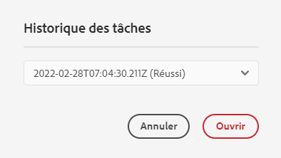

# Ajoutez vos ressources numériques à [!DNL Adobe Experience Manager] as a [!DNL Cloud Service] [!DNL Assets] {#add-assets-to-experience-manager}

[!DNL Adobe Experience Manager Assets] accepte différents types de ressources numériques provenant de nombreuses sources. Il stocke les binaires et les rendus créés. Il peut aussi effectuer le traitement des ressources à l’aide de divers services de workflow et [!DNL Adobe Sensei], ce qui permet la distribution via de nombreux canaux sur différentes surfaces.

[!DNL Adobe Experience Manager] enrichit le contenu binaire des fichiers numériques chargés avec des métadonnées enrichies, des balises intelligentes, des rendus et autres services de gestion des ressources numériques (DAM). Vous pouvez charger divers types de fichiers, tels que des images, des documents et des fichiers d’images brutes, depuis votre dossier local ou un lecteur réseau vers [!DNL Experience Manager Assets].

Outre le chargement par navigateur, méthode la plus courante, il existe d’autres façons d’ajouter des ressources au référentiel [!DNL Experience Manager]. Ces autres méthodes incluent les clients de bureau, comme Adobe Asset Link ou l’application de bureau [!DNL Experience Manager], les scripts de chargement et d’ingestion créés par les clients ou les clientes et les intégrations d’ingestion automatisées ajoutées sous la forme d’extensions [!DNL Experience Manager].

[!DNL Experience Manager] permet de charger et de gérer n’importe quel fichier binaire. Cependant, les formats de fichiers les plus courants prennent en charge des services supplémentaires, tels que l’extraction de métadonnées ou la génération d’aperçus et de rendus. Voir [Formats de fichiers pris en charge](file-format-support.md) pour plus d’informations.

Vous pouvez également choisir d’effectuer un traitement supplémentaire sur les fichiers chargés. Plusieurs profils de traitement des ressources peuvent être configurés sur le dossier dans lequel les ressources sont chargées, afin d’ajouter des services de traitement des images, des rendus ou des métadonnées spécifiques. Voir [Traitement des ressources lorsqu’elles sont chargées](#process-when-uploaded).

[!DNL Assets] fournit les méthodes de chargement suivantes. Adobe vous recommande de comprendre votre cas d’utilisation et l’applicabilité d’une option de chargement avant de l’utiliser.

| Méthode de chargement | Quand l’utiliser ? | Personnage principal |
|---------------------|----------------|-----------------|
| [Interface utilisateur de la console de ressources](#upload-assets) | Chargement occasionnel, facilité de pression et déplacement, chargement à partir du Finder. À ne pas utiliser pour charger de nombreuses ressources. | Tous les utilisateurs |
| [API de chargement](#upload-using-apis) | Pour les décisions dynamiques pendant le chargement. | Développeur |
| Application de bureau [[!DNL Experience Manager] &#x200B;](https://experienceleague.adobe.com/docs/experience-manager-desktop-app/using/using.html?lang=fr) | Ingestion de ressources en faible volume, mais pas pour la migration. | Administrateur, spécialiste marketing |
| [[!DNL Adobe Asset Link]](https://helpx.adobe.com/fr/enterprise/using/adobe-asset-link.html) | Utile lorsque les créatifs et les spécialistes marketing travaillent sur des ressources à partir des applications de bureau [!DNL Creative Cloud] prises en charge. | Créatif, spécialiste marketing |
| [Outil d’ingestion en masse de ressources](#asset-bulk-ingestor) | Recommandé pour les migrations à grande échelle et les ingestions en masse occasionnelles. Uniquement pour les magasins de données pris en charge. | Administrateur, développeur |

## Charger des ressources {#upload-assets}

<!-- #ENGCHECK do we support pausing? I couldn't get pause to show with 1.5GB upload.... If not, this should be removed#

   You can pause the uploading of large assets (greater than 500 MB) and resume it later from the same page. Select the **[!UICONTROL Pause]** icon beside progress bar that appears when an upload starts.

   The size above which an asset is considered a large asset is configurable. For example, you can configure the system to consider assets above 1000 MB (instead of 500 MB) as large assets. In this case, **[!UICONTROL Pause]** appears on the progress bar when assets of size greater than 1000 MB are uploaded.

   The [!UICONTROL Pause] option does not show if a file greater than 1000 MB is uploaded with a file less than 1000 MB. However, if you cancel the less than 1000 MB file upload, the **[!UICONTROL Pause]** option appears.

   To modify the size limit, configure the `chunkUploadMinFileSize` property of the `fileupload` node in the CRX repository.

   When you click the **[!UICONTROL Pause]** icon, it toggles to a **[!UICONTROL Play]** icon. To resume uploading, click **[!UICONTROL Play]** option.
-->

<!-- #ENGCHECK do we support pausing? I couldn't get pause to show with 1.5GB upload.... If not, this should be removed#
   The ability to resume uploading is especially helpful in low-bandwidth scenarios and network glitches, where it takes a long time to upload a large asset. You can pause the upload operation and continue later when the situation improves. When you resume, uploading starts from the point where you paused it.
-->

<!-- #ENGCHECK assuming this is not relevant? remove after confirming#
   During the upload operation, [!DNL Experience Manager] saves the portions of the asset being uploaded as chunks of data in the CRX repository. When the upload completes, [!DNL Experience Manager] consolidates these chunks into a single block of data in the repository.

   To configure the cleanup task for the unfinished chunk upload jobs, go to `https://[aem_server]:[port]/system/console/configMgr/org.apache.sling.servlets.post.impl.helper.ChunkCleanUpTask`.
-->

Pour charger un ou plusieurs fichiers, vous pouvez les sélectionner sur votre bureau et les faire glisser vers le dossier de destination dans l’interface utilisateur (navigateur web). Vous pouvez également lancer le chargement à partir de l’interface utilisateur.

>[!IMPORTANT]
>
>Les ressources que vous chargez dans Experience Manager dont le nom de fichier est supérieur à 100 caractères ont un nom raccourci lorsqu’elles sont utilisées dans Dynamic Media.
>
>Les 100 premiers caractères du nom de fichier sont utilisés tels quels ; les caractères restants sont remplacés par une chaîne alphanumérique. Cette méthode de changement de nom garantit un nom unique lorsque la ressource est utilisée dans Dynamic Media. Elle est également prévue pour s’adapter à la longueur maximale du nom du fichier de ressource autorisée dans Dynamic Media.


1. Dans l’interface utilisateur [!DNL Assets], accédez à l’emplacement où vous voulez ajouter des ressources numériques.
1. Pour charger les ressources, effectuez l’une des opérations suivantes :

   * Dans la barre d’outils, cliquez sur **[!UICONTROL Créer]** > **[!UICONTROL Fichiers]**. Au besoin, vous pouvez renommer le fichier dans la boîte de dialogue affichée.
   * Dans un navigateur prenant en charge HTML5, faites glisser directement les ressources dans l’interface utilisateur [!DNL Assets]. La boîte de dialogue permettant de renommer les fichiers n’est pas affichée.

   

   Pour sélectionner plusieurs fichiers, sélectionnez la touche `Ctrl` ou `Command` et sélectionnez les ressources dans la boîte de dialogue de sélecteur de fichiers. Si vous utilisez un iPad, vous ne pouvez sélectionner qu’un seul fichier à la fois.

1. Pour annuler une opération de chargement en cours, cliquez sur le bouton de fermeture (`X`) en regard de la barre de progression. Lorsque vous annulez le chargement, [!DNL Assets] supprime la partie partiellement chargée de la ressource.
Si vous annulez un chargement avant la fin de l’opération, [!DNL Assets] arrête le chargement du fichier en cours et actualise le contenu. Toutefois, les fichiers déjà chargés ne sont pas supprimés.

1. La boîte de dialogue de progression du chargement dans [!DNL Assets] affiche le nombre de fichiers dont le chargement a réussi et ceux dont le chargement a échoué.
De plus, l’interface utilisateur [!DNL Assets] affiche la ressource la plus récente que vous avez chargée ou le dossier que vous avez créé en premier.

>[!NOTE]
>
>Pour charger des hiérarchies de dossiers imbriqués, voir [Chargement en masse de ressources](#bulk-upload).

<!-- #ENGCHECK I'm assuming this is no longer relevant.... If yes, this should be removed#

### Serial uploads {#serialuploads}

Uploading numerous assets in bulk consumes significant I/O resources, which may adversely impact the performance of [!DNL Assets]. In particular, if you have a slow internet connection, the time to upload drastically increases due to a spike in disk I/O. Moreover, your web browser may introduce additional restrictions to the number of POST requests [!DNL Assets] can handle for concurrent asset uploads. As a result, the upload operation fails or terminate prematurely. In other words, [!DNL Assets] may miss some files while ingesting a bunch of files or altogether fail to ingest any file.

To overcome this situation, [!DNL Assets] ingests one asset at a time (serial upload) during a bulk upload operation, instead of the concurrently ingesting all the assets.

Serial uploading of assets is enabled by default. To disable the feature and allow concurrent uploading, overlay the `fileupload` node in CRX-DE and set the value of the `parallelUploads` property to `true`.

### Streamed uploads {#streamed-uploads}

If you upload many assets to [!DNL Experience Manager], the I/O requests to server increase drastically, which reduces the upload efficiency and can even cause some upload task to time out. [!DNL Assets] supports streamed uploading of assets. Streamed uploading reduces the disk I/O during the upload operation by avoiding asset storage in a temporary folder on the server before copying it to the repository. Instead, the data is transferred directly to the repository. This way, the time to upload large assets and the possibility of timeouts is reduced. Streamed upload is enabled by default in [!DNL Assets].

>[!NOTE]
>
>Streaming upload is disabled for [!DNL Experience Manager] running on JEE server with servlet-api version lower than 3.1.
-->

### Gestion des chargements pour les ressources existantes {#handling-upload-existing-file}

Vous pouvez charger une ressource avec le même chemin d’accès (même nom et même emplacement) que celui d’une ressource existante. Cependant, une boîte de dialogue d’avertissement s’affiche avec les options suivantes :

* Remplacer la ressource existante : si vous remplacez une ressource existante, les métadonnées de la ressource et les modifications antérieures (annotations, recadrage, etc.) apportées à une ressource existante sont supprimées.

  >[!NOTE]
  >
  >L’option permettant de remplacer des ressources n’est pas disponible si la ressource est verrouillée ou extraite.

* Créer une autre version : une nouvelle version de la ressource existante est créée dans le référentiel. Vous pouvez afficher les deux versions dans la [!UICONTROL Chronologie] et revenir à la version précédente si nécessaire.
* Conserver les deux : si vous choisissez de conserver les deux ressources, la nouvelle ressource est renommée.

Pour conserver le duplicata de ressource dans [!DNL Assets], cliquez sur **[!UICONTROL Conserver]**. Pour supprimer la ressource en double que vous avez chargée, appuyez/cliquez sur **[!UICONTROL Supprimer]**.

### Gestion des noms de fichier et caractères interdits {#filename-handling}

[!DNL Experience Manager Assets] vous empêche de charger des ressources dont le nom de fichier contient des caractères interdits. Si vous essayez de charger une ressource dont le nom de fichier contient un ou plusieurs caractères interdits, [!DNL Assets] affiche un message d’avertissement à ce sujet et interrompt l’opération jusqu’à ce que vous supprimiez les caractères concernés ou utilisiez un nom autorisé.

Pour prendre en compte les conventions de dénomination de fichiers en vigueur dans votre entreprise, la boîte de dialogue [!UICONTROL Charger des ressources] vous permet de spécifier des noms longs pour les fichiers chargés. Les caractères suivants ne sont pas pris en charge (ils sont répertoriés ici et séparés par des espaces) :

* Caractères non valides pour le nom de dossier de la ressource : `* / : [ \\ ] | # % { } ? &`
* Caractères non valides pour le nom de dossier de la ressource : `* / : [ \\ ] | # % { } ? \" . ^ ; + & \t`

## Chargement massif de ressources {#bulk-upload}

L’outil d’ingestion en masse de ressources peut traiter efficacement de nombreuses ressources. Cependant, une ingestion à grande échelle ne consiste pas simplement en un important vidage de fichiers ou une simple migration. Pour qu’une ingestion à grande échelle s’intègre à un projet pertinent qui réponde à vos besoins et qui soit efficace, planifiez la migration et traitez l’organisation des ressources. Toutes les ingestions étant différentes, les généralisations sont à éviter ; il faut tenir compte des nuances de la composition du référentiel et des besoins commerciaux. Voici quelques suggestions globales pour planifier et exécuter une ingestion en masse :

* Traiter les ressources : supprimez les ressources qui ne sont pas nécessaires dans le DAM. Envisagez de supprimer les ressources inutilisées, obsolètes ou dupliquées. Cette méthode de gestion permet de réduire les données transférées et les ressources ingérées afin d’accélérer les ingestions.
* Organiser les ressources : envisagez d’organiser le contenu dans un ordre logique, par exemple par taille de fichier, format de fichier, cas d’utilisation ou priorité. En général, les fichiers complexes volumineux nécessitent un traitement plus lourd. Vous pouvez également envisager d’ingérer des fichiers volumineux séparément à l’aide de l’option de filtrage de taille de fichier (décrite ci-dessous).
* Étaler les ingestions : envisagez de diviser votre ingestion en plusieurs projets d’ingestion en masse. Cela vous permet de voir le contenu plus tôt et de mettre à jour votre ingestion si nécessaire. Vous pouvez par exemple ingérer des ressources à fort besoin de traitement pendant les heures creuses ou graduellement en plusieurs tranches. Cependant, vous pouvez ingérer en une seule fois des ressources plus petites et plus simples qui ne nécessitent pas un traitement important.

Pour charger un plus grand nombre de fichiers, utilisez l’une des méthodes suivantes. Voir aussi les [cas d’utilisation et méthodes](#upload-methods-comparison)

* [API de chargement de ressources](developer-reference-material-apis.md#asset-upload) : utilisez un script ou un outil de chargement personnalisé qui utilise les API pour ajouter un traitement supplémentaire des ressources (par exemple, traduire des métadonnées ou renommer des fichiers), si nécessaire.
* Application de bureau [[!DNL Experience Manager] &#x200B;](https://experienceleague.adobe.com/docs/experience-manager-desktop-app/using/using.html?lang=fr) : utile pour les professionnels de la création et les spécialistes marketing qui chargent des ressources depuis leur système de fichiers local. Utilisez-la pour charger des dossiers imbriqués disponibles en local.
* [Outil d’ingestion en masse](#asset-bulk-ingestor) : utilisez-le pour l’ingestion de grandes quantités de ressources, occasionnellement ou au départ, lors du déploiement de [!DNL Experience Manager].

### Outil d’importation en bloc de ressources {#asset-bulk-ingestor}

Cet outil est fourni uniquement au groupe des administrateurs et administratrices pour l’ingestion à grande échelle de ressources à partir de magasins de données Azure ou S3. Consultez la vidéo présentant la configuration et l’ingestion.

>[!VIDEO](https://video.tv.adobe.com/v/341383/?quality=12&learn=on&captions=fre_fr)

L’image suivante illustre les différentes étapes de l’ingestion de ressources dans Experience Manager à partir d’un magasin de données :


**Conditions préalables**

Un compte ou un compartiment de stockage externe d’Azure ou d’AWS est nécessaire pour utiliser cette fonctionnalité.

>[!NOTE]
>
>Créez le conteneur ou le compartiment de compte de stockage comme privé et acceptez les connexions uniquement à partir de requêtes autorisées. Toutefois, des restrictions supplémentaires sur les connexions réseau entrantes ne sont pas prises en charge.

>[!NOTE]
>
>Les comptes de stockage externe peuvent avoir une réglementation en matière de nom de fichier/dossier différente de celle de l’outil Importer en bloc. Consultez [Gestion des noms de fichier lors de l’importation en bloc](#filename-handling-bulkimport) pour plus d’informations sur les noms interdits/placés dans une séquence d’échappement.


### Configuration de l’outil d’importation en bloc {#configure-bulk-ingestor-tool}

Pour configurer l’outil dʼimportation en bloc, procédez comme suit :

1. Accédez à **[!UICONTROL Outils]** > **[!UICONTROL Ressources]** > **[!UICONTROL Importation en masse]**. Sélectionnez l’option **[!UICONTROL Créer]**.

1. Indiquez un titre pour la configuration de lʼimportation en bloc dans le champ **[!UICONTROL Titre]**.

1. Sélectionnez le type de source de données dans la liste déroulante **[!UICONTROL Importer Source]**.

1. Indiquez les valeurs permettant de créer une connexion avec la source de données. Par exemple, si vous sélectionnez **Stockage Azure Blob** comme source de données, spécifiez les valeurs du compte de stockage Azure, du conteneur dʼobjets blob Azure et de la clé d’accès Azure.

1. Sélectionnez le mode d’authentification requis dans la liste déroulante. La **clé d’accès Azure** fournit un accès complet au compte de stockage Azure, tandis que le **jeton SAS Azure** permet à l’administrateur ou l’administratrice de limiter les fonctionnalités du jeton à l’aide d’autorisations et de politiques d’expiration.

1. Indiquez le nom du dossier racine qui contient les ressources de la source de données dans le champ **[!UICONTROL Dossier source]**.

1. (Facultatif) Indiquez la taille de fichier minimale des ressources en Mo à inclure dans le processus d’ingestion dans le champ **[!UICONTROL Filtrer par taille minimale]**.

1. (Facultatif) Indiquez la taille de fichier maximale des ressources en Mo à inclure dans le processus d’ingestion dans le champ **[!UICONTROL Filtrer par taille maximale]**.

1. (Facultatif) Spécifiez une liste de types MIME, séparés par des virgules, à exclure du processus dʼingestion dans le champ **[!UICONTROL Exclure les types MIME]**. Par exemple, `image/jpeg, image/.*, video/mp4`. Voir [tous les formats de fichier pris en charge](/help/assets/file-format-support.md).

1. Spécifiez une liste de types MIME, séparés par des virgules, à inclure dans le processus dʼingestion dans le champ **[!UICONTROL Inclure les types MIME]**. Voir [tous les formats de fichier pris en charge](/help/assets/file-format-support.md).

1. Sélectionnez lʼoption **[!UICONTROL Supprimer le fichier source après lʼimportation]** afin de supprimer les fichiers originaux du magasin de données source après lʼimportation des fichiers dans [!DNL Experience Manager].

1. Sélectionnez le **[!UICONTROL Mode d’importation]**. Les modes suivants sont disponibles : **Ignorer**, **Remplacer** ou **Créer une version**. Le mode par défaut est Ignorer. Dans ce mode, l’outil d’ingestion ignore l’importation d’une ressource si elle existe déjà. Voir la signification de [Remplacer et créer des options de version](#handling-upload-existing-file).

1. Pour définir un emplacement dans la gestion des ressources numériques (DAM) où les ressources doivent être importées à l’aide du champ **[!UICONTROL Dossier cible des ressources]**, indiquez un chemin d’accès. Par exemple, `/content/dam/imported_assets`.

1. (Facultatif) Spécifiez le fichier de métadonnées à importer, fourni au format CSV, dans le champ **[!UICONTROL Fichier de métadonnées]**. Spécifiez le fichier CSV dans l’emplacement de l’objet blob source et indiquez le chemin d’accès lors de la configuration de l’outil d’importation en bloc. Le format de fichier CSV référencé dans ce champ est identique à celui du format de fichier CSV lorsque vous [importez et exportez des métadonnées de ressources en masse](https://experienceleague.adobe.com/docs/experience-manager-cloud-service/content/assets/admin/metadata-import-export.html?lang=fr). Si vous sélectionnez lʼoption **Supprimer le fichier source après lʼimportation**, filtrez les fichiers CSV à l’aide des champs **Exclure** ou **Inclure le type MIME** ou **Filtrer par chemin dʼaccès/fichier**. Vous pouvez utiliser une expression régulière pour filtrer les fichiers CSV dans ces champs.

1. Cliquez sur **[!UICONTROL Enregistrer]** pour enregistrer la configuration.

### Gestion de la configuration de l’outil d’importation en bloc {#manage-bulk-import-configuration}

Après avoir configuré l’outil d’importation en bloc, vous pouvez effectuer des tâches afin de tester la configuration et de vous assurer quʼelle réponde à vos besoins avant de procéder à lʼingestion de ressources en bloc dans votre instance Experience Manager. Pour afficher les options disponibles afin de gérer la configuration de votre outil d’importation en masse, sélectionnez la configuration disponible dans **[!UICONTROL Outils]** > **[!UICONTROL Ressources]** > **[!UICONTROL Importation en masse]**.

### *Modifier la configuration {#edit-configuration}

Pour modifier les détails de configuration, sélectionnez la configuration, puis cliquez sur **[!UICONTROL Modifier]**. Notez que certains éléments ne sont pas modifiables, tels que le titre de la configuration et de la source de données d’importation.

### Supprimer la configuration {#delete-configuration}

Sélectionnez la configuration souhaitée et cliquez sur **[!UICONTROL Supprimer]** pour supprimer la configuration dʼimportation en bloc.

### Valider la connexion à la source de données {#validate-connection}

Pour valider la connexion à la source de données, sélectionnez la configuration, puis cliquez sur **[!UICONTROL Vérifier]**. Si la connexion est établie, Experience Manager affiche le message suivant :


### Appeler une exécution test pour la tâche d’importation en bloc {#invoke-test-run-bulk-import}

Sélectionnez la configuration et cliquez sur **[!UICONTROL Exécution dʼessai]** pour lancer une exécution test pour la tâche d’importation en bloc. Experience Manager affiche les informations suivantes sur la tâche d’importation en bloc :


### Gestion des noms de fichier lors de l’importation en bloc {#filename-handling-bulkimport}

Lorsque vous importez des ressources ou des dossiers en bloc, [!DNL Experience Manager Assets] importe toute la structure de ce qui existe dans la source d’import. [!DNL Experience Manager] suit les règles intégrées pour les caractères spéciaux dans les noms de ressources et de dossiers ; par conséquent, ces noms de fichier doivent être assainis. Pour les noms de dossier et de ressource, le titre défini par l’utilisateur reste inchangé et est stocké dans `jcr:title`.

Lors de l’importation en bloc, [!DNL Experience Manager] recherche les dossiers existants pour éviter de réimporter les ressources et les dossiers et vérifie également les règles d’assainissement appliquées dans le dossier parent où l’importation a lieu. Si les règles d’assainissement sont appliquées dans le dossier parent, les mêmes règles sont appliquées à la source d’importation. Pour une nouvelle importation, les règles d’assainissement suivantes sont appliquées pour gérer les noms de fichiers des ressources et dossiers.

**Noms interdits dans l’importation en bloc**

Les caractères suivants ne sont pas autorisés dans les noms de fichier et de dossier :

* Caractères de contrôle et d’utilisation privée (0x00 à 0x1F, \u0081, \uE000)
* Noms de fichiers ou de dossiers se terminant par un point (.)

Les fichiers ou les dossiers dont les noms correspondent à ces conditions sont ignorés pendant le processus d’importation et marqués comme un échec.

**Gestion du nom des ressources dans l’importation en bloc**

Pour les noms de fichiers de ressources, le nom et le chemin JCR sont assainis à l’aide de l’API : `JcrUtil.escapeIllegalJcrChars`.

* Les caractères Unicode ne sont pas modifiés.
* Remplacez les caractères spéciaux par leur code d’échappement d’URL, par exemple, `new%asset.png` est remplacé par `new%25asset.png` :

  ```
                  URL escape code   
  
  "               %22
  %               %25
  '               %27
  *               %2A
  /               %2F
  :               %3A
  [               %5B
  \n              %0A
  \r              %0D
  \t              %09
  ]               %5D
  |               %7C
  ```

**Gestion du nom du dossier dans l’importation en bloc**

Pour les noms de fichiers de dossiers, le nom et le chemin JCR sont assainis à l’aide de l’API : `DamUtil.getSanitizedFolderName`.

* Les caractères majuscules sont convertis en minuscules.
* Les caractères Unicode ne sont pas modifiés.
* Remplacez les caractères spéciaux par un tiret (’-’), par exemple, `new folder` est remplacé par `new-folder` :

  ```
  "                           
  #                         
  %                           
  &                          
  *                           
  +                          
  .                           
  :                           
  ;                          
  ?                          
  [                           
  ]                           
  ^                         
  {                         
  }                         
  |                           
  /         It is used for split folder in cloud storage and is pre-handled, no conversion here.
  \         Not allowed in Azure, allowed in AWS.
  \t
  space     It is the space character.
  ```

<!-- 
[!DNL Experience Manager Assets] manages the forbidden characters in the filenames while you upload assets or folders. [!DNL Experience Manager] updates only the node names in the DAM repository. However, the `title` of the asset or folder remains unchanged.

Following are the file naming conventions that are applied while uploading assets or folders in [!DNL Experience Manager Assets]:

| Characters &Dagger; | When occurring in file names | When occurring in folder names | Example |
|---|---|---|---|
| `. / : [ ] | *` | Replaced with `-` (hyphen). | Replaced with `-` (hyphen). A `.` (dot) in the filename extension is retained as is. | Replaced with `-` (hyphen). | `myimage.jpg` remains as is and `my.image.jpg` changes to `my-image.jpg`. |
| `% ; # , + ? ^ { } "` and whitespaces | Whitespaces are retained | Replaced with `-` (hyphen). | `My Folder.` changes to `my-folder-`. |
| `# % { } ? & .` | Replaced with `-` (hyphen). | NA. | `#My New File.` changes to `-My New File-`. |
| Uppercase characters | Casing is retained as is. | Changed to lowercase characters. | `My New Folder` changes to `my-new-folder`. |
| Lppercase characters | Casing is retained as is. | Casing is retained as is. | NA. |

&Dagger; The list of characters is a whitespace-separated list.
-->

#### Planification d’une importation en bloc ponctuelle ou récurrente {#schedule-bulk-import}

Pour planifier une importation en bloc ponctuelle ou récurrente, procédez comme suit :

1. Créez une configuration d’importation en bloc.
1. Sélectionnez la configuration et sélectionnez **[!UICONTROL Planification]** dans la barre d’outils.
1. Définissez une ingestion ponctuelle ou planifiez une planification horaire, quotidienne ou hebdomadaire. Cliquez sur **[!UICONTROL Envoyer]**.

   


#### Affichage du dossier cible des ressources {#view-assets-target-folder}

Pour afficher l’emplacement cible Ressources où les ressources sont importées après l’exécution de la tâche d’importation en masse, sélectionnez la configuration, puis cliquez sur **[!UICONTROL Afficher les ressources]**.

#### Exécution de l’outil d’importation en bloc {#run-bulk-import-tool}

Une fois la [configuration de l’outil d’importation en bloc](#configure-bulk-ingestor-tool) et éventuellement la [gestion de la configuration de l’outil d’importation en bloc](#manage-bulk-import-configuration) terminées, vous pouvez exécuter la tâche de configuration pour démarrer l’ingestion en masse des ressources.

Pour démarrer le processus d’importation en masse, accédez à **[!UICONTROL Outils]** > **[!UICONTROL Ressources]** > **[!UICONTROL Importation en masse]**, sélectionnez [Configuration de l’importation en masse](#configure-bulk-ingestor-tool), puis cliquez sur **[!UICONTROL Exécuter]**. Cliquez à nouveau sur **[!UICONTROL Exécuter]** pour confirmer.

Experience Manager met à jour le statut de la tâche à **Traitement** et à **Réussi** lors de la réussite de la tâche. Pour afficher les ressources importées dans Experience Manager, cliquez sur **Afficher les ressources**.

Lorsque la tâche est en cours, vous pouvez également sélectionner la configuration et cliquer sur **Arrêter** pour arrêter le processus d’ingestion en bloc. Cliquez sur **Exécuter** pour reprendre le processus dʼingestion. Vous pouvez également cliquer sur **Exécution d’essai** pour connaître les détails des ressources qui sont toujours en attente d’importation.

#### Gestion des tâches après lʼexécution {#manage-jobs-after-execution}

Experience Manager vous permet de consulter l’historique des tâches d’importation en bloc. Lʼhistorique de la tâche comprend le statut de la tâche, le créateur ou la créatrice de la tâche, les journaux, ainsi que dʼautres détails tels que la date et lʼheure de début, la date et lʼheure de création et la date et lʼheure de fin.

Pour accéder à l’historique des tâches d’une configuration, sélectionnez la configuration, puis cliquez sur **[!UICONTROL Historique des tâches]**. Sélectionnez une tâche, puis cliquez sur **Ouvrir**.



Experience Manager affiche l’historique des tâches. Sur la page Historique des tâches d’importation en bloc, vous pouvez également cliquer sur **Supprimer** afin de supprimer cette tâche de la configuration d’importation en bloc.


## Chargement de ressources à l’aide de clients pour ordinateur de bureau {#upload-assets-desktop-clients}

Outre l’interface utilisateur du navigateur web, [!DNL Experience Manager] prend en charge d’autres clients pour ordinateur de bureau. Ils permettent également de charger du contenu sans devoir passer par le navigateur web.

* [[!DNL Adobe Asset Link]](https://helpx.adobe.com/fr/enterprise/using/adobe-asset-link.html) permet d’accéder aux ressources [!DNL Experience Manager] dans les applications de bureau Adobe Photoshop, Adobe Illustrator et Adobe InDesign. Ces applications vous offrent la possibilité de charger directement le document ouvert vers [!DNL Experience Manager] depuis l’interface utilisateur d’Adobe Asset Link.
* L’[[!DNL Experience Manager] application de bureau](https://experienceleague.adobe.com/docs/experience-manager-desktop-app/using/using.html?lang=fr) simplifie l’utilisation des ressources sur l’ordinateur, indépendamment du type de fichier ou de l’application native affectée à leur gestion. Il est utile de charger des fichiers dans des hiérarchies de dossiers imbriqués à partir de votre système de fichiers local, car le chargement par le navigateur ne prend en charge que les listes de fichiers plats.

## Traiter les ressources lorsqu’elles sont chargées {#process-when-uploaded}

Pour effectuer un traitement supplémentaire sur les ressources chargées, vous pouvez appliquer des profils de traitement aux dossiers de chargement. Les profils sont disponibles sur la page **[!UICONTROL Propriétés]** d’un dossier dans [!DNL Assets]. Une ressource numérique sans extension ou dotée d’une extension incorrecte ne sera pas traitée comme vous le souhaitez. Par exemple, lors du chargement de ces ressources, il est possible que rien ne se produise ou qu’un profil de traitement incorrect s’applique à la ressource. Les utilisateurs peuvent toujours stocker les fichiers binaires dans le module DAM.


Les onglets suivants sont disponibles :

* Les [profils de métadonnées](metadata-profiles.md) vous permettent d’appliquer des propriétés de métadonnées par défaut aux ressources chargées dans ce dossier.
* Les [profils de traitement](asset-microservices-configure-and-use.md) vous permettent de générer davantage de rendus que ce qui est possible par défaut.

De plus, si [!DNL Dynamic Media] est activé sur votre déploiement, les onglets suivants sont disponibles :

* Les [[!DNL Dynamic Media] profils d’image](dynamic-media/image-profiles.md) vous permettent d’appliquer un recadrage spécifique (**[!UICONTROL Recadrage intelligent]** et recadrage de pixels) et une configuration d’accentuation aux ressources chargées.
* Les [[!DNL Dynamic Media] profils vidéo](dynamic-media/video-profiles.md) vous permettent d’appliquer des profils de codage vidéo spécifiques (résolution, format, paramètres).

>[!NOTE]
>
>Les opérations de recadrage de [!DNL Dynamic Media] et d’autres opérations sur les ressources ne sont pas destructives, c’est-à-dire que les opérations ne modifient pas l’original chargé. Celui-ci fournit en revanche des paramètres de recadrage ou de transformation lors de la diffusion des ressources.

Pour les dossiers auxquels un profil de traitement est affecté, le nom du profil s’affiche sur la vignette en mode Carte. Dans la vue Liste, le nom du profil s’affiche dans la colonne **[!UICONTROL Profil de traitement]**.

## Chargement ou ingestion de fichiers à l’aide d’API {#upload-using-apis}

Les détails techniques du protocole et des API de chargement, ainsi que les liens vers les exemples de clients et le SDK Open Source, sont fournis dans la section [Chargement de ressources](developer-reference-material-apis.md#asset-upload) de la documentation de référence du développeur.

## Conseils, bonnes pratiques et restrictions {#tips-limitations}

* Le chargement binaire direct est une nouvelle méthode de chargement de ressources. Il est pris en charge par défaut par les clients et fonctionnalités du produit, comme l’interface utilisateur d’[!DNL Experience Manager], [!DNL Adobe Asset Link] et l’appli de bureau [!DNL Experience Manager]. Le code personnalisé ou étendu par les équipes techniques des clients doit utiliser les nouvelles API et les nouveaux protocoles de chargement.

* [!DNL Experience Manager Assets] prend désormais en charge les dossiers contenant un grand nombre de ressources enfants. Une fois qu’un dossier contient plus de 1 000 enfants directs (des ressources ou des sous-dossiers), l’interface utilisateur d’administration utilise un index mis à jour de manière asynchrone pour répertorier le contenu du dossier. Ainsi, il peut y avoir un court délai dans la visibilité des dossiers et ressources nouvellement créés (généralement quelques secondes seulement) et lors de l’ouverture d’un tel dossier dans la vue Administration, une bannière s’affiche pour informer les utilisateurs finaux de ce comportement, indiquant ce qui suit : « Ce répertoire contient plus de 1 000 éléments. Les chargements et la création de nouveaux dossiers peuvent être retardés. »

* Lorsque vous sélectionnez **[!UICONTROL Remplacer]** dans la boîte de dialogue [!UICONTROL Conflit de noms], l’ID de la ressource est régénéré pour la nouvelle ressource. Cet ID est différent de celui de la ressource précédente. Si la fonction [Statistiques sur les ressources](/help/assets/assets-insights.md) est activée pour effectuer le suivi des impressions/clics avec [!DNL Adobe Analytics], l’ID de ressource régénéré invalide les données capturées pour la ressource dans [!DNL Analytics].

* Certaines méthodes de chargement n’empêchent pas le chargement de ressources dont les noms de fichier contiennent des [caractères interdits](#filename-handling). Les caractères sont remplacés par le symbole `-`.

* Le téléchargement de ressources à l’aide du navigateur prend uniquement en charge les listes de fichiers plats et non les hiérarchies de dossiers imbriqués. Pour charger toutes les ressources dans un dossier imbriqué, utilisez l’[appli de bureau](#upload-assets-desktop-clients).

* La méthode d’importation en bloc importe la structure entière du dossier telle qu’elle existe sur la source de données. Cependant, seuls les dossiers non vides sont créés dans [!DNL Experience Manager].


<!-- TBD: Link to file name handling in DA docs when it is documented. 
-->

**Voir également**

* [Traduire les ressources](translate-assets.md)
* [API HTTP Assets](mac-api-assets.md)
* [Formats de fichiers pris en charge par Assets](file-format-support.md)
* [Rechercher des ressources](search-assets.md)
* [Ressources connectées](use-assets-across-connected-assets-instances.md)
* [Rapports de ressources](asset-reports.md)
* [Schémas de métadonnées](metadata-schemas.md)
* [Télécharger des ressources](download-assets-from-aem.md)
* [Gestion des métadonnées](manage-metadata.md)
* [Facettes de recherche](search-facets.md)
* [Gérer les collections](manage-collections.md)
* [Import des métadonnées en bloc](metadata-import-export.md)
* [Publier des ressources sur AEM et Dynamic Media](/help/assets/publish-assets-to-aem-and-dm.md)

>[!MORELIKETHIS]
>
>* Application de bureau [[!DNL Adobe Experience Manager] &#x200B;](https://experienceleague.adobe.com/docs/experience-manager-desktop-app/using/introduction.html?lang=fr)
>* [À propos d’ [!DNL Adobe Asset Link]](https://www.adobe.com/fr/creativecloud/business/enterprise/adobe-asset-link.html)
>* [[!DNL Adobe Asset Link] documentation](https://helpx.adobe.com/fr/enterprise/using/adobe-asset-link.html)
>* [Référence technique pour le chargement de ressources](developer-reference-material-apis.md#asset-upload)
