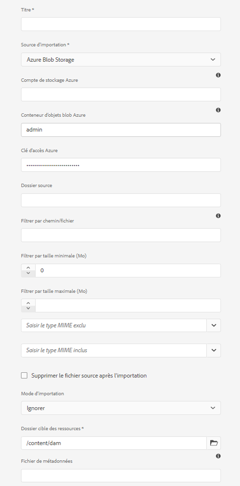

# Ajouter les ressources numériques à [!DNL Adobe Experience Manager] en tant que [!DNL Cloud Service] [!DNL Assets] {#add-assets-to-experience-manager}

[!DNL Adobe Experience Manager Assets] accepte de nombreux types de ressources numériques provenant de nombreuses sources. Il stocke les binaires et les rendus créés, peut effectuer le traitement des ressources à l&#39;aide de divers flux de travail et services [!DNL Adobe Sensei], permet la distribution à travers de nombreux canaux sur de nombreuses surfaces.

[!DNL Adobe Experience Manager] enrichit le contenu binaire des fichiers numériques chargés avec des métadonnées enrichies, des balises intelligentes, des rendus et autres services de gestion des ressources numériques (DAM). Vous pouvez charger divers types de fichiers, tels que des images, des documents et des fichiers d’images brutes, depuis votre dossier local ou un lecteur réseau vers [!DNL Experience Manager Assets].

Outre la méthode la plus courante qui consiste à utiliser le navigateur, il existe d’autres méthodes pour ajouter des ressources au référentiel [!DNL Experience Manager], y compris des clients de bureau, comme Adobe Asset Link ou l’application de bureau [!DNL Experience Manager], des scripts de chargement et d’ingestion créés par les clients, ou encore des intégrations d’ingestion automatisées ajoutées sous la forme d’extensions [!DNL Experience Manager].

[!DNL Experience Manager] permet de charger et de gérer n’importe quel fichier binaire. Cependant, les formats de fichiers les plus courants prennent en charge des services supplémentaires, tels que l’extraction de métadonnées ou la génération d’aperçus et de rendus. Pour plus d’informations, reportez-vous aux [formats de fichiers pris en charge](file-format-support.md).

Vous pouvez également choisir d’effectuer un traitement supplémentaire sur les fichiers chargés. Plusieurs profils de traitement de ressources peuvent être configurés sur le dossier dans lequel les ressources sont chargées, afin d’ajouter des services de traitement des images, des rendus ou des métadonnées spécifiques. Voir [Traitement des ressources lorsqu’elles sont chargées](#process-when-uploaded).

[!DNL Assets] fournit les méthodes de téléchargement suivantes. Adobe vous recommande de comprendre votre cas d’utilisation et l’applicabilité d’une option de chargement avant de l’utiliser.

| Méthode de chargement | Quand l’utiliser ? | Personnage principal |
|---------------------|----------------|-----------------|
| [Interface utilisateur de la console de ressources](#upload-assets) | Chargement occasionnel, facilité de pression et déplacement, chargement à partir du Finder. Ne l’utilisez pas pour charger un grand nombre de ressources. | Tous les utilisateurs |
| [API de chargement](#upload-using-apis) | Pour les décisions dynamiques pendant le chargement. | Développeur |
| Application de bureau [[!DNL Experience Manager] ](https://experienceleague.adobe.com/docs/experience-manager-desktop-app/using/using.html?lang=fr) | Importation de ressources en faible volume, mais pas pour la migration. | Administrateur, professionnels du marketing |
| [[!DNL Adobe Asset Link]](https://helpx.adobe.com/fr/enterprise/admin-guide.html/enterprise/using/adobe-asset-link.ug.html) | Utile lorsque les créatifs et les professionnels du marketing travaillent sur des ressources à partir des applications de bureau [!DNL Creative Cloud] prises en charge. | Créatif, professionnel du marketing |
| [Outil d’ingestion en masse de ressources](#asset-bulk-ingestor) | Recommandé pour les migrations à grande échelle et les ingestions en masse occasionnelles. Uniquement pour les magasins de données pris en charge. | Administrateur, développeur |

## Chargement des ressources {#upload-assets}

<!-- #ENGCHECK do we support pausing? I couldn't get pause to show with 1.5GB upload.... If not, this should be removed#

   You can pause the uploading of large assets (greater than 500 MB) and resume it later from the same page. Tap the **[!UICONTROL Pause]** icon beside progress bar that appears when an upload starts.

   The size above which an asset is considered a large asset is configurable. For example, you can configure the system to consider assets above 1000 MB (instead of 500 MB) as large assets. In this case, **[!UICONTROL Pause]** appears on the progress bar when assets of size greater than 1000 MB are uploaded.

   The [!UICONTROL Pause] option does not show if a file greater than 1000 MB is uploaded with a file less than 1000 MB. However, if you cancel the less than 1000 MB file upload, the **[!UICONTROL Pause]** option appears.

   To modify the size limit, configure the `chunkUploadMinFileSize` property of the `fileupload` node in the CRX repository.

   When you click the **[!UICONTROL Pause]** icon, it toggles to a **[!UICONTROL Play]** icon. To resume uploading, click **[!UICONTROL Play]** option.
-->

<!-- #ENGCHECK do we support pausing? I couldn't get pause to show with 1.5GB upload.... If not, this should be removed#
   The ability to resume uploading is especially helpful in low-bandwidth scenarios and network glitches, where it takes a long time to upload a large asset. You can pause the upload operation and continue later when the situation improves. When you resume, uploading starts from the point where you paused it.
-->

<!-- #ENGCHECK assuming this is not relevant? remove after confirming#
   During the upload operation, [!DNL Experience Manager] saves the portions of the asset being uploaded as chunks of data in the CRX repository. When the upload completes, [!DNL Experience Manager] consolidates these chunks into a single block of data in the repository.

   To configure the cleanup task for the unfinished chunk upload jobs, go to `https://[aem_server]:[port]/system/console/configMgr/org.apache.sling.servlets.post.impl.helper.ChunkCleanUpTask`.
-->

Pour charger un ou plusieurs fichiers, vous pouvez les sélectionner sur votre bureau et les faire glisser vers le dossier de destination dans l’interface utilisateur (navigateur web). Vous pouvez également lancer le chargement à partir de l’interface utilisateur.

1. Dans l’interface utilisateur [!DNL Assets], accédez à l’emplacement où vous voulez ajouter des ressources numériques.
1. Pour charger les ressources, effectuez l’une des opérations suivantes :

   * Dans la barre d’outils, cliquez sur **[!UICONTROL Créer]** > **[!UICONTROL Fichiers]**. Au besoin, vous pouvez renommer le fichier dans la boîte de dialogue affichée.
   * Dans un navigateur prenant en charge HTML5, faites glisser directement les ressources dans l’interface utilisateur [!DNL Assets]. La boîte de dialogue permettant de renommer les fichiers n’est pas affichée.

   

   Pour sélectionner plusieurs fichiers, sélectionnez la touche `Ctrl` ou `Command` et sélectionnez les ressources dans la boîte de dialogue de sélecteur de fichiers. Si vous utilisez un iPad, vous ne pouvez sélectionner qu’un seul fichier à la fois.

1. Pour annuler une opération de chargement en cours, cliquez sur le bouton de fermeture (`X`) en regard de la barre de progression. Lorsque vous annulez le chargement, [!DNL Assets] supprime la partie partiellement chargée de la ressource.
Si vous annulez un chargement avant la fin de l’opération, [!DNL Assets] arrête le chargement du fichier en cours et actualise le contenu. Toutefois, les fichiers déjà chargés ne sont pas supprimés.

1. La boîte de dialogue de progression du chargement dans [!DNL Assets] affiche le nombre de fichiers dont le chargement a réussi et ceux dont le chargement a échoué.
De plus, l’interface utilisateur [!DNL Assets] affiche la ressource la plus récente que vous avez chargée ou le dossier que vous avez créé en premier.

>[!NOTE]
>
>Pour charger des hiérarchies de dossiers imbriqués, voir [Chargement en masse de ressources](#bulk-upload).

<!-- #ENGCHECK I'm assuming this is no longer relevant.... If yes, this should be removed#

### Serial uploads {#serialuploads}

Uploading numerous assets in bulk consumes significant I/O resources, which may adversely impact the performance of [!DNL Assets]. In particular, if you have a slow internet connection, the time to upload drastically increases due to a spike in disk I/O. Moreover, your web browser may introduce additional restrictions to the number of POST requests [!DNL Assets] can handle for concurrent asset uploads. As a result, the upload operation fails or terminate prematurely. In other words, [!DNL Assets] may miss some files while ingesting a bunch of files or altogether fail to ingest any file.

To overcome this situation, [!DNL Assets] ingests one asset at a time (serial upload) during a bulk upload operation, instead of the concurrently ingesting all the assets.

Serial uploading of assets is enabled by default. To disable the feature and allow concurrent uploading, overlay the `fileupload` node in CRX-DE and set the value of the `parallelUploads` property to `true`.

### Streamed uploads {#streamed-uploads}

If you upload many assets to [!DNL Experience Manager], the I/O requests to server increase drastically, which reduces the upload efficiency and can even cause some upload task to time out. [!DNL Assets] supports streamed uploading of assets. Streamed uploading reduces the disk I/O during the upload operation by avoiding asset storage in a temporary folder on the server before copying it to the repository. Instead, the data is transferred directly to the repository. This way, the time to upload large assets and the possibility of timeouts is reduced. Streamed upload is enabled by default in [!DNL Assets].

>[!NOTE]
>
>Streaming upload is disabled for [!DNL Experience Manager] running on JEE server with servlet-api version lower than 3.1.
-->

### Gestion des chargements lorsque des ressources existent déjà {#handling-upload-existing-file}

Vous pouvez charger une ressource avec le même chemin d’accès (même nom et même emplacement) que celui d’une ressource existante. Cependant, une boîte de dialogue d’avertissement s’affiche avec les options suivantes :

* Remplacer la ressource existante : si vous remplacez une ressource existante, les métadonnées de la ressource et les modifications antérieures (annotations, recadrage, etc.) apportées à une ressource existante sont supprimées.
* Créer une autre version : une nouvelle version de la ressource existante est créée dans le référentiel. Vous pouvez afficher les deux versions dans le [!UICONTROL Journal] et revenir à la version précédente si nécessaire.
* Conservez les deux : Si vous choisissez de conserver les deux fichiers, le nouveau fichier est renommé.

Pour conserver le duplicata de ressource dans [!DNL Assets], cliquez sur **[!UICONTROL Conserver]**. Pour supprimer le fichier de duplicata que vous avez téléchargé, cliquez sur **[!UICONTROL Supprimer]**.

### Gestion des noms de fichier et caractères interdits {#filename-handling}

[!DNL Experience Manager Assets] tente de vous empêcher de charger des ressources dont le nom de fichier contient des caractères interdits. Si vous essayez de charger une ressource dont le nom de fichier contient un ou plusieurs caractères interdits, [!DNL Assets] affiche un message d’avertissement à ce sujet et interrompt l’opération jusqu’à ce que vous supprimiez les caractères concernés ou utilisiez un nom autorisé.

Pour prendre en compte les conventions d’appellation en vigueur dans votre entreprise, la boîte de dialogue [!UICONTROL Charger les ressources] vous permet de spécifier des noms longs pour les fichiers chargés. Les caractères suivants ne sont pas pris en charge (ils sont répertoriés ici et séparés par des espaces) :

* Caractères non valides pour le nom de fichier de la ressource `* / : [ \\ ] | # % { } ? &`
* Caractères non valides pour le nom de dossier de la ressource `* / : [ \\ ] | # % { } ? \" . ^ ; + & \t`

## Chargement en masse de ressources {#bulk-upload}

L’outil d’ingestion de ressources en masse peut traiter efficacement un très grand nombre de ressources. Cependant, une ingestion à grande échelle ne consiste pas simplement en un important vidage de fichiers ou une simple migration. Pour qu’une ingestion à grande échelle s’intègre à un projet pertinent qui réponde à vos besoins et qui soit efficace, planifiez la migration et traitez l’organisation des ressources. Toutes les ingestions étant différentes, les généralisations sont à éviter ; il faut tenir compte des nuances de la composition du référentiel et des besoins commerciaux. Voici quelques suggestions globales pour planifier et exécuter une ingestion en masse :

* Traiter les ressources : supprimez les ressources qui ne sont pas nécessaires dans le DAM. Envisagez de supprimer les ressources inutilisées, obsolètes ou dupliquées. Cela permet de réduire les données transférées et les ressources ingérées afin d’accélérer les ingestions.
* Organiser les ressources : envisagez d’organiser le contenu dans un ordre logique, par exemple par taille de fichier, format de fichier, cas d’utilisation ou priorité. En général, les fichiers complexes volumineux nécessitent un traitement plus lourd. Vous pouvez également envisager d’ingérer des fichiers volumineux séparément à l’aide de l’option de filtrage de taille de fichier (décrite ci-dessous).
* Étaler les ingestions : envisagez de diviser votre ingestion en plusieurs projets d’ingestion en masse. Cela vous permet de voir le contenu plus tôt et de mettre à jour votre ingestion si nécessaire. Vous pouvez par exemple ingérer des ressources à fort besoin de traitement pendant les heures creuses ou graduellement en plusieurs tranches. Cependant, vous pouvez ingérer en une seule fois des ressources plus petites et plus simples qui ne nécessitent pas un traitement important.

Pour charger un plus grand nombre de fichiers, utilisez l’une des méthodes suivantes. Voir aussi les [cas d’utilisation et méthodes](#upload-methods-comparison)

* [API de chargement de ressources](developer-reference-material-apis.md#asset-upload-technical) : utilisez un script ou un outil de chargement personnalisé qui utilise les API pour ajouter un traitement supplémentaire des ressources (par exemple, traduire des métadonnées ou renommer des fichiers), si nécessaire.
* Application de bureau [[!DNL Experience Manager] ](https://experienceleague.adobe.com/docs/experience-manager-desktop-app/using/using.html) : utile pour les professionnels de la création et du marketing qui chargent des ressources depuis leur système de fichiers local. Utilisez-la pour charger des dossiers imbriqués disponibles en local.
* [Outil d’ingestion en masse](#asset-bulk-ingestor) : utilisez-le pour l’ingestion de grandes quantités de ressources, occasionnellement ou au départ, lors du déploiement de [!DNL Experience Manager].

### Outil d’ingestion en masse de ressources {#asset-bulk-ingestor}

Cet outil est fourni uniquement au groupe des administrateurs pour l’ingestion à grande échelle de ressources à partir de magasins de données Azure ou S3. Consultez la vidéo présentant la configuration et l’ingestion.

>[!VIDEO](https://video.tv.adobe.com/v/329680/?quality=12&learn=on)

Procédez de la manière suivante pour configurer l’outil :

1. Accédez à **[!UICONTROL Outils]** > **[!UICONTROL Ressources]** > **[!UICONTROL Importation en masse]**. Sélectionnez l’option **[!UICONTROL Créer]**.

1. Sur la page [!UICONTROL Configuration de l’importation en masse], indiquez les valeurs requises.

   * [!UICONTROL Titre] : un titre descriptif.
   * [!UICONTROL Importer la source] : sélectionnez la source de données appropriée.
   * [!UICONTROL Filtrer par taille minimale] : indiquez la taille de fichier minimale des ressources en Mo.
   * [!UICONTROL Filtrer par taille maximale] : indiquez la une taille de fichier maximale des ressources en Mo.
   * [!UICONTROL Exclure les types Mime] : liste séparée par des virgules des types MIME à exclure de l’ingestion. Par exemple, `image/jpeg, image/.*, video/mp4`.
   * [!UICONTROL Inclure les types MIME] : liste séparée par des virgules des types MIME à inclure dans l’ingestion. Voir [tous les formats de fichier pris en charge](/help/assets/file-format-support.md).
   * [!UICONTROL Mode d’importation] : sélectionnez Ignorer, Remplacer ou Créer une version. Le mode par défaut est Ignorer. Dans ce mode, l’outil d’ingestion ignore l’importation d’une ressource si elle existe déjà. Voir la signification de [Remplacer et créer des options de version](#handling-upload-existing-file).
   * [!UICONTROL Dossier cible des ressources] : importer un dossier dans la gestion des actifs numériques (DAM) où les ressources doivent être importées. Par exemple, `/content/dam/imported_assets`

1. Vous pouvez supprimer, modifier, exécuter et en faire plus avec les configurations que vous avez créées pour l’outil d’ingestion. Lorsque vous sélectionnez une configuration d’importation en masse pour l’outil d’ingestion, les options suivantes sont disponibles dans la barre d’outils.

   * [!UICONTROL Modifier] : modifiez la configuration sélectionnée.
   * [!UICONTROL Supprimer] : supprime la configuration sélectionnée.
   * [!UICONTROL Vérifier] : validez la connexion au magasin de données.
   * [!UICONTROL Exécution à vide] : appelez une série de tests de l’ingestion en masse.
   * [!UICONTROL Exécuter] : exécutez la configuration sélectionnée.
   * [!UICONTROL Arrêter] : terminez une configuration active.
   * [!UICONTROL Planification] : Définissez une planification ponctuelle ou périodique pour assimiler des ressources.
   * [!UICONTROL État de la tâche] : afficher l’état de la configuration lorsqu’elle est utilisée dans une tâche d’importation en cours ou pour une tâche terminée.
   * [!UICONTROL Historique] des tâches : Instances précédentes de la tâche.
   * [!UICONTROL Afficher les ressources] : afficher le dossier cible s’il existe.

   

Pour planifier une importation en vrac unique ou périodique, procédez comme suit :

1. Créez une configuration d’importation en bloc.
1. Sélectionnez la configuration et **[!UICONTROL Planification]** dans la barre d’outils.
1. Définissez une ingestion ponctuelle ou planifiez une planification horaire, quotidienne ou hebdomadaire. Cliquez sur **[!UICONTROL Envoyer]**.

   

## Chargement de ressources à l’aide de clients pour ordinateur de bureau {#upload-assets-desktop-clients}

Outre l’interface utilisateur du navigateur web, [!DNL Experience Manager] prend en charge d’autres clients pour ordinateur de bureau. Ils permettent également de charger du contenu sans devoir passer par le navigateur web.

* [[!DNL Adobe Asset Link]](https://helpx.adobe.com/fr/enterprise/using/adobe-asset-link.html) permet d’accéder aux ressources [!DNL Experience Manager] dans les applications de bureau Adobe Photoshop, Adobe Illustrator et Adobe InDesign. Ces applications vous offrent la possibilité de charger directement le document ouvert vers [!DNL Experience Manager] depuis l’interface utilisateur d’Adobe Asset Link.
* L’[[!DNL Experience Manager] application de bureau](https://experienceleague.adobe.com/docs/experience-manager-desktop-app/using/using.html) simplifie l’utilisation des ressources sur l’ordinateur, indépendamment du type de fichier ou de l’application native affectée à leur gestion. Il est particulièrement utile de charger des fichiers dans des hiérarchies de dossiers imbriqués à partir de votre système de fichiers local, car le chargement à l’aide du navigateur ne prend en charge que les listes de fichiers plats.

## Traiter les ressources lorsqu’elles sont chargées {#process-when-uploaded}

Pour effectuer un traitement supplémentaire sur les ressources chargées, vous pouvez appliquer des profils de traitement aux dossiers de chargement. Les profils sont disponibles sur la page **[!UICONTROL Propriétés]** d’un dossier dans [!DNL Assets]. Une ressource numérique sans extension ou dotée d’une extension incorrecte ne sera pas traitée comme vous le souhaitez. Par exemple, lors du chargement de ces ressources, il est possible que rien ne se produise ou qu’un profil de traitement incorrect s’applique à la ressource. Les utilisateurs peuvent toujours stocker les fichiers binaires dans le module DAM.

Les onglets suivants sont disponibles :

* Les [profils de métadonnées](metadata-profiles.md) vous permettent d’appliquer des propriétés de métadonnées par défaut aux ressources chargées dans ce dossier.
* Les [profils de traitement](asset-microservices-configure-and-use.md) vous permettent de générer davantage de rendus que ce qui est possible par défaut.

De plus, si [!DNL Dynamic Media] est activé sur votre déploiement, les onglets suivants sont disponibles :

* Les [[!DNL Dynamic Media] profils d’image](dynamic-media/image-profiles.md) vous permettent d’appliquer un recadrage spécifique (**[!UICONTROL Recadrage intelligent]** et recadrage de pixels) et une configuration d’accentuation aux ressources chargées.
* Les [[!DNL Dynamic Media] profils vidéo](dynamic-media/video-profiles.md) vous permettent d’appliquer des profils de codage vidéo spécifiques (résolution, format, paramètres).

>[!NOTE]
>
>Les opérations de recadrage de [!DNL Dynamic Media] et d’autres opérations sur les ressources ne sont pas destructives, c’est-à-dire que les opérations ne modifient pas l’original chargé. Celui-ci fournit en revanche des paramètres de recadrage ou de transformation lors de la diffusion des ressources.

Pour les dossiers auxquels un profil de traitement est affecté, le nom du profil s’affiche sur la vignette en mode Carte. En mode Liste, le nom du profil s’affiche dans la colonne **[!UICONTROL Profil de traitement.]**

## Chargement ou ingestion de fichiers à l’aide d’API {#upload-using-apis}

Les détails techniques du protocole et des API de chargement, ainsi que les liens vers les exemples de clients et le SDK Open Source, sont fournis dans la section [Chargement de ressources](developer-reference-material-apis.md#asset-upload-technical) de la documentation de référence du développeur.

## Conseils, bonnes pratiques et limites {#tips-limitations}

* Le transfert binaire direct est une nouvelle méthode de téléchargement des ressources. Il est pris en charge par défaut par les fonctionnalités du produit et les clients, tels que l&#39;interface utilisateur [!DNL Experience Manager], [!DNL Adobe Asset Link] et l&#39;application de bureau [!DNL Experience Manager]. Tout code personnalisé personnalisé personnalisé ou étendu par les équipes techniques du client doit utiliser les nouvelles API et protocoles de téléchargement.

* Adobe recommande d’ajouter jusqu’à 1 000 ressources dans chaque dossier de [!DNL Experience Manager Assets]. Bien que vous puissiez ajouter d’autres ressources à un dossier, il est possible que vous rencontriez des problèmes de performances tels que la navigation plus lente vers ces dossiers.

* Lorsque vous sélectionnez **[!UICONTROL Remplacer]** dans la boîte de dialogue [!UICONTROL Conflit de noms], l’ID de la ressource est régénéré pour la nouvelle ressource. Cet ID est différent de celui de la ressource précédente. Si [Asset Insights](/help/assets/assets-insights.md) est activé pour effectuer le suivi des impressions ou des clics avec [!DNL Adobe Analytics], l’ID de ressource régénéré invalide les données capturées pour la ressource sur [!DNL Analytics].

* Certaines méthodes de téléchargement n’empêchent pas le téléchargement de fichiers dont les noms contiennent [caractères interdits](#filename-handling). Les caractères sont remplacés par le symbole `-`.

* Le téléchargement de fichiers à l’aide du navigateur ne prend en charge que les listes de fichiers plats et non les hiérarchies de dossiers imbriquées. Pour télécharger tous les fichiers contenus dans un dossier imbriqué, utilisez [application de bureau](#upload-assets-desktop-clients).

<!-- TBD: Link to file name handling in DA docs when it is documented. 
-->

>[!MORELIKETHIS]
>
>* Application de bureau [[!DNL Adobe Experience Manager] ](https://experienceleague.adobe.com/docs/experience-manager-desktop-app/using/introduction.html?lang=fr)
>* [À propos d’ [!DNL Adobe Asset Link]](https://www.adobe.com/creativecloud/business/enterprise/adobe-asset-link.html)
>* [[!DNL Adobe Asset Link] documentation](https://helpx.adobe.com/enterprise/using/adobe-asset-link.html)
>* [Référence technique pour le chargement de ressources](developer-reference-material-apis.md#asset-upload-technical)

