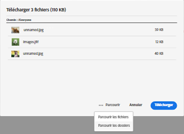
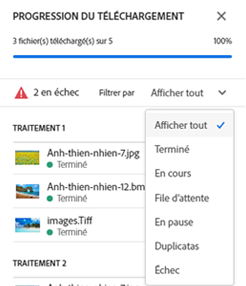
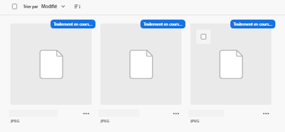
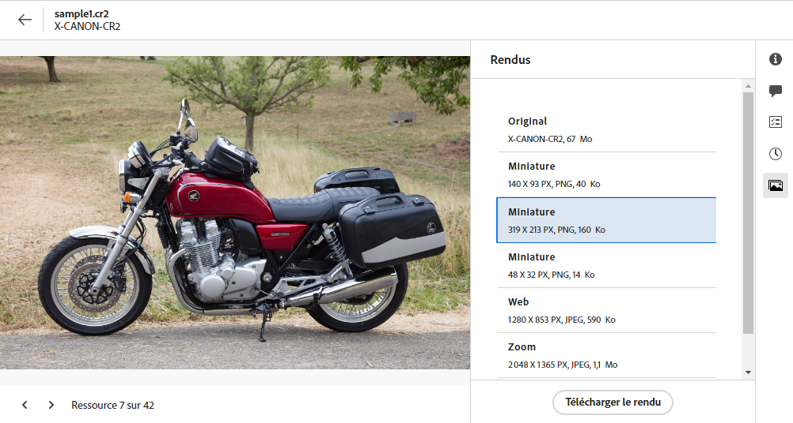
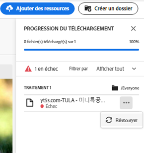
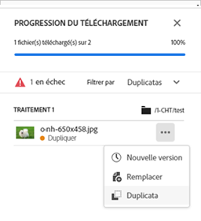
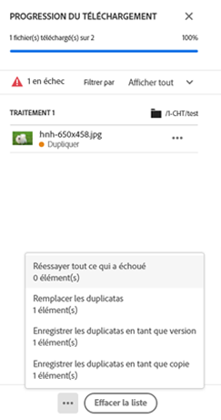
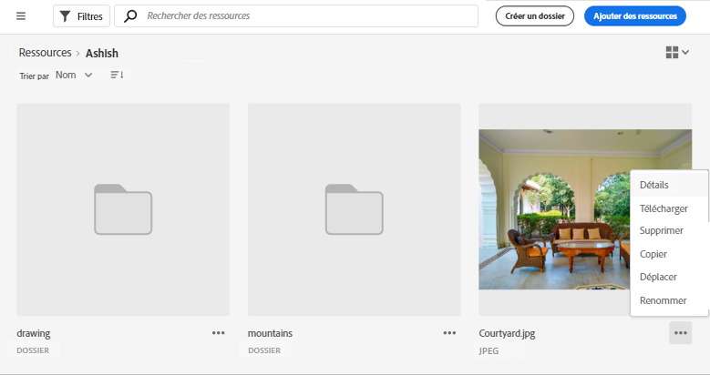

# Charger des ressources {#add-assets}

<table>
    <tr>
        <td>
            <i>Nouveau</i> <a href="/help/assets/dynamic-media/dm-prime-ultimate.md"><b>Dynamic Media Prime et Ultimate</b></a>
        </td>
        <td>
            <i>Nouveau</i> <a href="/help/assets/assets-ultimate-overview.md"><b>AEM Assets Ultimate</b></a>
        </td>
        <td>
            <i>Nouvelle</i> <a href="/help/assets/integrate-aem-assets-edge-delivery-services.md"><b>Intégration d’AEM Assets à Edge Delivery Services</b></a>
        </td>
        <td>
            <i>Nouveau</i> <a href="/help/assets/aem-assets-view-ui-extensibility.md"><b>Extensibilité de l’interface utilisateur</b></a>
        </td>
          <td>
            <i>Nouveau</i> <a href="/help/assets/dynamic-media/enable-dynamic-media-prime-and-ultimate.md"><b>Activation de Dynamic Media Prime et Ultimate</b></a>
        </td>
    </tr>
    <tr>
        <td>
            <a href="/help/assets/search-best-practices.md"><b>Bonnes pratiques de recherche</b></a>
        </td>
        <td>
            <a href="/help/assets/metadata-best-practices.md"><b>Bonnes pratiques relatives aux métadonnées</b></a>
        </td>
        <td>
            <a href="/help/assets/product-overview.md"><b>Hub de contenus</b></a>
        </td>
        <td>
            <a href="/help/assets/dynamic-media-open-apis-overview.md"><b>Fonctionnalités Dynamic Media avec OpenAPI</b></a>
        </td>
        <td>
            <a href="https://developer.adobe.com/experience-cloud/experience-manager-apis/"><b>Documentation de développement pour AEM Assets</b></a>
        </td>
    </tr>
</table>

Pour ajouter de nouvelles ressources à utiliser, chargez quelques ressources à partir de votre système de fichiers local. <!-- TBD: Many of the [common file formats are supported](/help/assets/supported-file-formats-assets-view.md). -->

Vous pouvez utiliser les méthodes suivantes pour charger une ou plusieurs ressources ou un dossier contenant des ressources :

* Faites glisser des ressources ou des dossiers sur l’interface utilisateur et suivez les instructions à l’écran.
* Cliquez sur l’option **[!UICONTROL Ajouter des ressources]** dans la barre d’outils et ajoutez des fichiers à la boîte de dialogue de chargement.

<!-- TBD: Update this GIF
 -->

Vous pouvez utiliser l’une de ces méthodes pour charger des ressources après avoir créé un dossier. Pour créer un dossier vide, cliquez sur **[!UICONTROL Créer un dossier]** dans la barre d’outils. [!DNL Assets view] offre de puissantes fonctionnalités de recherche plein texte, mais vous pouvez également utiliser des dossiers pour mieux organiser vos ressources.

Une fois les fichiers sélectionnés, une boîte de dialogue de confirmation s’affiche pour vous permettre d’ajouter d’autres fichiers ou de supprimer les fichiers déjà sélectionnés. Pour ajouter d’autres fichiers à une sélection, cliquez sur **[!UICONTROL Parcourir]** et sélectionnez **[!UICONTROL Parcourir les fichiers]** ou **[!UICONTROL Parcourir les dossiers]**. Ajoutez d’autres fichiers ou d’autres dossiers du même dossier ou d’un autre dossier.

Une fois tous les fichiers placés en file d’attente, cliquez sur **[!UICONTROL Charger]**.

*Image : avant de charger les ressources sélectionnées, vous pouvez ajouter ou supprimer des ressources de la file d’attente.*

>[!TIP]
>
>Si vous téléchargez une structure de dossiers dans la vue Assets, vous n’avez pas besoin de créer un fichier ZIP avec la structure de dossiers. Vous pouvez directement charger des structures de dossiers. Un fichier ZIP chargé dans la vue Assets est stocké en tant que ressource ZIP et n’est pas extrait automatiquement après le chargement.

## Afficher la progression et le statut du chargement {#upload-progress}

Lorsque vous chargez de nombreuses ressources ou des dossiers imbriqués vers [!DNL Assets view], le chargement de certaines ressources peut échouer pour diverses raisons, telles que des problèmes de ressources en double ou de réseau.

Pour suivre la progression du chargement, cliquez sur l’option **[!UICONTROL Progression du chargement]** de la barre d’outils. Un panneau affiche la progression du chargement de toutes les ressources.

Pour afficher un sous-ensemble de ressources en fonction de la progression ou du statut du chargement, utilisez le filtre **[!UICONTROL Progression du chargement]** dans la barre latérale. Les différents filtres sont destinés à afficher toutes les ressources, les chargements terminés, les chargements en cours, les ressources mises en file d’attente à charger, les chargements suspendus, les ressources en double et les ressources dont le chargement a échoué.

*Image : filtrez les ressources que vous avez tenté de charger en fonction de leur statut de chargement ou de la progression du chargement.*

Immédiatement après le chargement des ressources, [!DNL Assets view] les traite pour générer des miniatures et traiter les métadonnées. Le traitement de nombreuses ressources prend du temps. Si aucune miniature n’apparaît et qu’un message de traitement s’affiche sur la miniature de l’espace réservé, vérifiez à nouveau le dossier au bout de quelques minutes. Pendant le traitement, [!DNL Assets view] génère les rendus, ajoute des balises intelligentes et indexe les détails de la ressource pour la recherche.

*Image : les ressources chargées affichent le statut de traitement sur la mosaïque qui est traitée.*

## Rendus de ressources {#renditions}

[!DNL Assets view] traite les ressources chargées en temps quasi réel et génère des rendus pour de nombreux types de fichiers pris en charge. Créés pour les images, les rendus sont des versions redimensionnées de l’image chargée. Vous pouvez télécharger non seulement la ressource, mais également les rendus pour utiliser une version appropriée. Vous pouvez afficher tous les rendus d’une ressource lorsque vous [prévisualisez une ressource](/help/assets/navigate-assets-view.md#preview-assets).

*Image : affichage et téléchargement des rendus.*

## Gérer les chargements ayant échoué {#resolve-upload-fails}

Si le chargement d’une ressource prise en charge échoue pour une raison quelconque, cliquez sur **[!UICONTROL Réessayer]** dans le volet [!UICONTROL Progression du chargement].

*Image : réessayez si le chargement d’un fichier pris en charge échoue pour une raison quelconque.*

Si vous tentez de charger des ressources en double, elles ne seront chargées que lorsque vous aurez explicitement confirmé le chargement. Dans un premier temps, le chargement de ressources en double s’affiche comme ayant échoué. Pour résoudre ce problème, vous pouvez simplement créer une nouvelle version, supprimer et remplacer les ressources existantes, ou créer un doublon en renommant la ressource. Vous pouvez résoudre ces échecs une ressource à la fois ou les résoudre ensemble pour tous les doublons ayant échoué.

*Image : pour les ressources en double dont le chargement échoue par défaut, gérez leurs chargements un par un.*

*Image : pour les ressources en double qui ne parviennent pas à se charger par défaut, gérez en une fois le chargement de toutes les ressources.*

>[!TIP]
>
>Vous pouvez charger des ressources vers le référentiel DAM directement depuis vos applications de bureau [!DNL Creative Cloud].
<!--TBD
See how [[!DNL Assets view] integrates with [!DNL Adobe Asset Link]](/help/assets/integration-assets-view.md).
-->

## Suppression de ressources ou de dossiers {#delete-assets}

Les utilisateurs peuvent supprimer individuellement des ressources ou des dossiers dont ils n’ont plus besoin. Pour supprimer une ressource ou un dossier, effectuez l’une des opérations suivantes :

* Utilisez l’option disponible dans la miniature d’une ressource ou d’un dossier.

  

  *Image : les actions relatives aux fichiers et aux dossiers sont disponibles sur la mosaïque de la ressource ou du dossier.*

* Sélectionnez une ressource ou un dossier et cliquez sur  **[!UICONTROL Supprimer]** dans la barre d’outils.

## Étapes suivantes {#next-steps}

* [Regardez cette vidéo expliquant comment charger des ressources dans la vue Assets](https://experienceleague.adobe.com/docs/experience-manager-learn/assets-essentials/basics/creating.html?lang=fr)

* Faites vos commentaires sur le produit en utilisant l’option [!UICONTROL Commentaires] disponible dans l’interface utilisateur de la vue Assets

* Faites des commentaires sur la documentation en utilisant l’option [!UICONTROL Modifier cette page]  ou [!UICONTROL Enregistrer un problème]  disponible dans la barre latérale droite.

* Contactez l’[assistance clientèle](https://experienceleague.adobe.com/fr?support-solution=General&amp;lang=fr#support).
