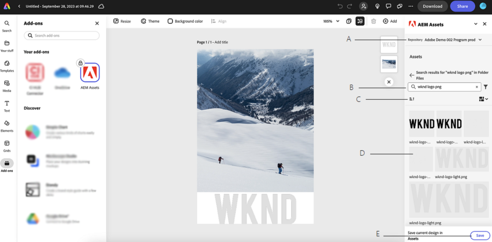

# Module complémentaire AEM Assets pour Adobe Express {#assets-addon-adobe-express}

Le module complémentaire AEM Assets pour Adobe Express vous permet d’accéder directement aux ressources stockées dans AEM Assets depuis l’interface utilisateur d’Adobe Express. Vous pouvez placer du contenu géré dans AEM Assets dans la zone de travail d’Express, puis enregistrer du contenu nouveau ou modifié dans un référentiel AEM Assets. Le module complémentaire offre les avantages clés suivants :

* Réutilisation accrue du contenu en modifiant et en enregistrant de nouvelles ressources dans AEM.

* Réduction du temps et des efforts en général pour créer de nouvelles ressources ou créer de nouvelles versions des ressources existantes.

## Conditions préalables {#prerequisites}

Droits d’accès à Adobe Express et à au moins un environnement dans AEM Assets. L’environnement peut être l’un des référentiels dans les Assets Essentials as a Cloud Service ou Assets.

## Ajout d’un module complémentaire AEM Assets à Adobe Express {#access-assets-addon}

Effectuez les étapes suivantes pour ajouter le module complémentaire AEM Assets à l’Adobe Express :

1. Ouvrez l’application web d’Adobe Express.

1. Ouvrez un nouveau canevas vierge en chargeant un nouveau modèle ou projet ou en créant une ressource.

1. Cliquez sur **[!UICONTROL Add-ons]** dans le volet de navigation de gauche.

1. Spécifiez **[!UICONTROL AEM Assets]** dans la barre de recherche disponible en haut de la section [!UICONTROL Modules complémentaires] et cliquez sur le module complémentaire AEM Assets.

   

1. Cliquez sur **[!UICONTROL Ajouter]**. Le module complémentaire s’affiche dans la liste de **[!UICONTROL Vos modules complémentaires]** . Cliquez à nouveau sur le module complémentaire pour afficher le contenu dans le volet de navigation de droite. Le module complémentaire affiche la liste des référentiels auxquels vous avez droit, ainsi que la liste des ressources et des dossiers disponibles au niveau racine.

   Utilisez la barre de recherche pour rechercher les ressources que vous devez utiliser dans la zone de travail.

   

   A. Sélectionnez votre référentiel AEM Assets B. Recherchez des ressources à l’aide de la barre de recherche C. Triez les ressources par ordre croissant ou décroissant D. Ressources et dossiers disponibles à l’emplacement sélectionné. E. Enregistrez vos modifications dans AEM Assets

## Utilisation d’AEM Assets dans l’éditeur d’Adobes Express {#use-aem-assets-in-express}

Après avoir ajouté le module complémentaire AEM Assets à Adobe Express, vous pouvez commencer à utiliser des images PNG et JPEG stockées dans le référentiel AEM Assets dans la zone de travail express. Accédez au dossier approprié et cliquez sur la ressource pour l’inclure dans la zone de travail.

## Enregistrement des projets d’Adobe Express dans AEM Assets {#save-express-projects-in-assets}

Après avoir incorporé les modifications appropriées dans la zone de travail express, vous pouvez les enregistrer dans le référentiel AEM Assets.

1. Cliquez sur **[!UICONTROL Enregistrer]** pour ouvrir la boîte de dialogue **[!UICONTROL Télécharger]**.
1. Spécifiez le nom et le format de la ressource. Vous pouvez enregistrer le contenu du canevas au format PNG ou JPEG.

1. Cliquez sur l’icône de dossier en regard du champ **[!UICONTROL Emplacement]**, accédez à l’emplacement où vous devez enregistrer la ressource, puis cliquez sur **[!UICONTROL Sélectionner]**. Le nom du dossier s’affiche dans le champ **[!UICONTROL Location]** .

1. Cliquez sur **[!UICONTROL Télécharger]** pour télécharger la ressource vers AEM Assets.

   
