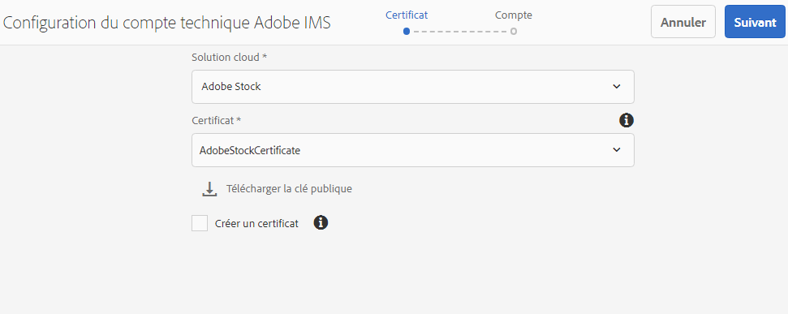
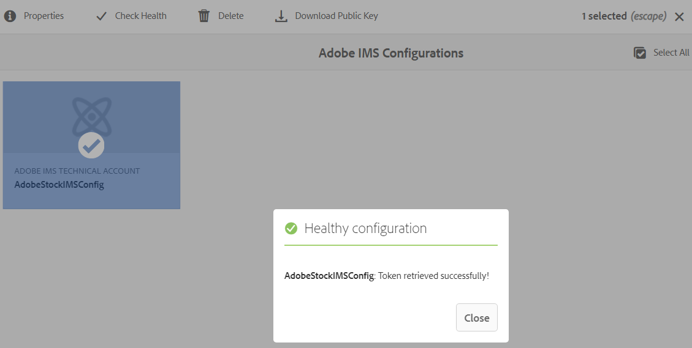
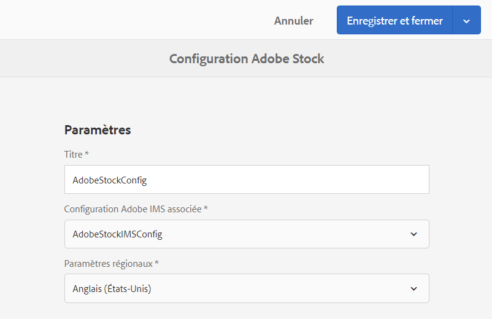
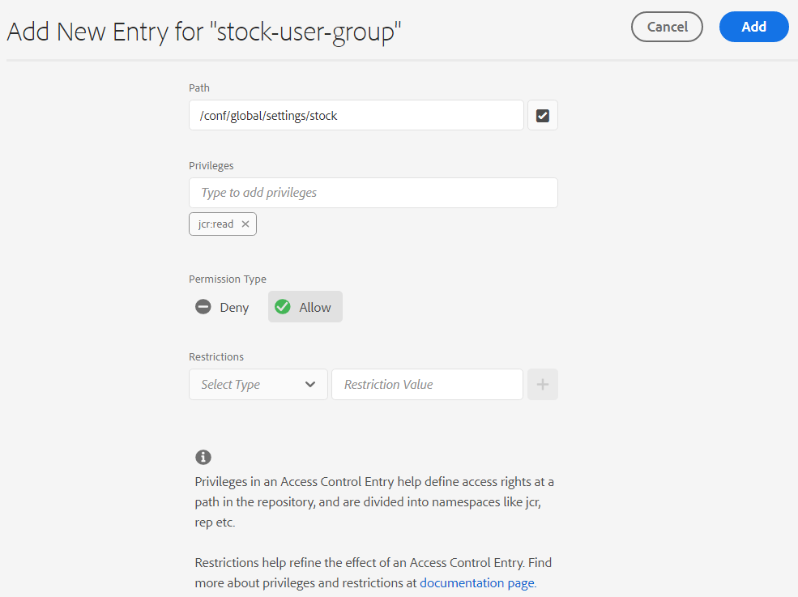
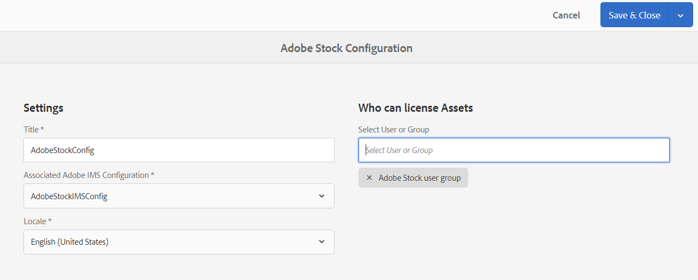
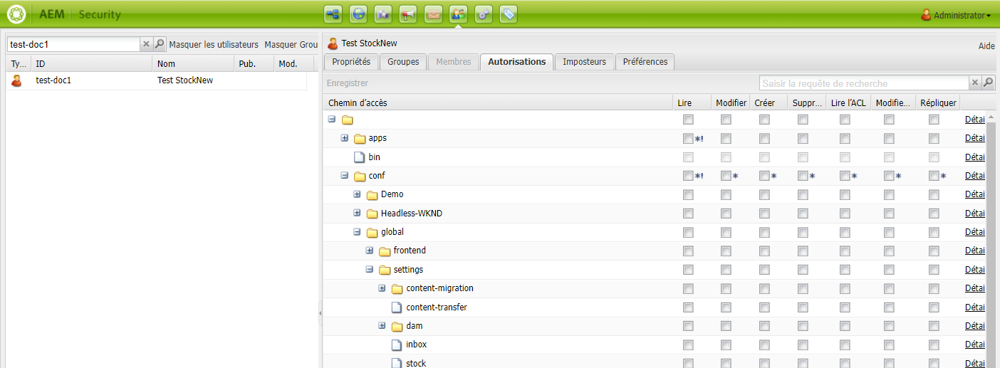
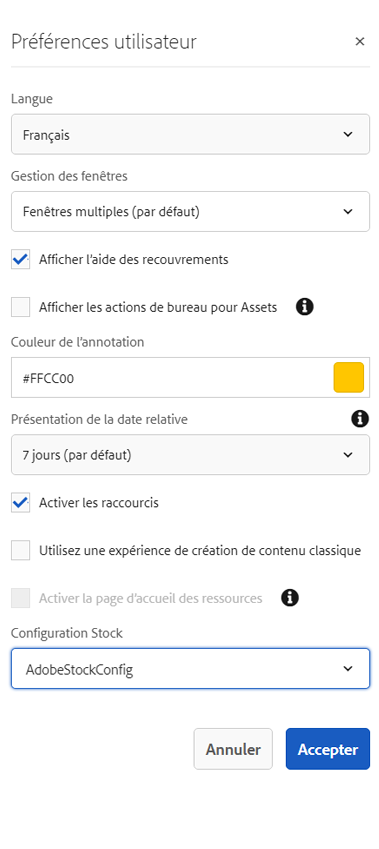

# Utilisation des ressources [!DNL Adobe Stock] dans [!DNL Adobe Experience Manager Assets] {#use-adobe-stock-assets-in-aem-assets}

Le service [!DNL Adobe Stock] permet aux créateurs et aux entreprises d’accéder à des millions de photos, de vecteurs, d’illustrations, de vidéos, de modèles et de ressources 3D organisés, de haute qualité et libres de droits pour tous leurs projets de création. 

[!DNL Adobe Stock] pour l’offre d’entreprise, inclut par défaut des droits de partage à l’échelle de l’entreprise. Une fois qu’une ressource a reçu une licence d’un utilisateur de votre entreprise, d’autres utilisateurs de votre entreprise peuvent l’identifier, la télécharger et l’utiliser sans avoir à la renouveler. Une fois qu’une ressource a reçu une licence de votre entreprise, le droit de l’utiliser est perpétuel.

Les entreprises peuvent intégrer leur entreprise [!DNL Adobe Stock] planifier avec [!DNL Experience Manager Assets] afin de s’assurer que les ressources sous licence sont largement disponibles pour leurs projets de création et marketing, avec les puissantes fonctionnalités de gestion des ressources de [!DNL Experience Manager]. [!DNL Experience Manager] Les utilisateurs peuvent rapidement rechercher, prévisualiser et acquérir sous licence des ressources Adobe Stock enregistrées dans [!DNL Experience Manager], sans quitter le [!DNL Experience Manager] .

## Intégration d’[!DNL Experience Manager] et [!DNL Adobe Stock] {#integrate-aem-and-adobe-stock}

[!DNL Experience Manager Assets] permet aux utilisateurs de rechercher, de prévisualiser, d’enregistrer et d’obtenir une licence. [!DNL Adobe Stock] ressources directement depuis [!DNL Experience Manager].

**Prérequis**

L’intégration nécessite :

* Une [!DNL Experience Manager Assets] as a [!DNL Cloud Service] instance
* Un [enterprise [!DNL Adobe Stock] plan](https://stockenterprise.adobe.com/)
* Un utilisateur disposant d’autorisations en Admin Console sur le profil de produit Stock par défaut
* Un utilisateur disposant d’autorisations sur le profil Accès des développeurs pour la création d’une intégration dans Adobe Developer Console

Une entreprise [!DNL Adobe Stock] plan,

* Fournit les droits de produit pour [!DNL Adobe Stock] (Stocks connectés à Experience Manager)
* Crédits achetés dans la variable [!DNL Adobe Admin Console] pour vos droits de stock
* Active l’authentification du compte de service (JWT) dans [!DNL Adobe Developer Console] pour vos droits de stock
* Permet de gérer les crédits et les licences à l’échelle mondiale à partir de [!DNL Adobe Admin Console]

Dans le droit, un profil de produit par défaut pour [!DNL Adobe Stock] existe dans [!DNL Admin Console]. Plusieurs profils peuvent être créés et ils déterminent qui peut acquérir des ressources Stock sous licence. Un utilisateur disposant d’un accès direct au profil de produits peut accéder à [https://stock.adobe.com/](https://stock.adobe.com/) et acquérir sous licence des ressources Stock. Cependant, il existe une autre méthode d’utilisation de l’accès développeur pour créer une intégration (API). Cette intégration authentifie la communication entre [!DNL Experience Manager Assets] et [!DNL Adobe Stock].

>[!NOTE]
>
>L’authentification du compte de service Stock (JWT) est fournie avec les droits Enterprise Stock.
>
>L’intégration ne prend pas en charge l’authentification Oauth pour les droits d’entreprise Stock.

<!--
### Create an IMS configuration {#create-an-ims-configuration}

1. In the [!DNL Experience Manager] user interface, navigate to **[!UICONTROL Tools]** > **[!UICONTROL Security]** > **[!UICONTROL Adobe IMS Configurations]**. Click **[!UICONTROL Create]** and select **[!UICONTROL Cloud Solution]** > **[!UICONTROL Adobe Stock]**.
1. Either reuse an existing certificate or select **[!UICONTROL Create new certificate]**.
1. Click **[!UICONTROL Create certificate]**. Once created, download the public key. Click **[!UICONTROL Next]**. Leave the [!UICONTROL Adobe IMS Technical Account Configuration] screen open to provide the required values shortly.
1. Access [Adobe Developer Console](https://console.adobe.io). Ensure that your account has administrator permissions for the organization for which the integration is required.
1. Click **[!UICONTROL Create new project]** and click **[!UICONTROL Add API]**. Select **[!UICONTROL Adobe Stock]** from the list of APIs that are available to you. Select [!UICONTROL OAUTH 2.0 Web].
1. Provide **[!UICONTROL Default redirect URI]** and **[!UICONTROL Redirect URI pattern]** values. Click **[!UICONTROL Save configured API]**. Copy the generated ID and secret.
1. In [!UICONTROL Adobe IMS Technical Account Configuration] screen, provide the values in the boxes titled **[!UICONTROL Title]**, **[!UICONTROL Authorization Server]**, **[!UICONTROL API Key]**, **[!UICONTROL Client Secret]**, and **[!UICONTROL Payload]**. For detailed information about these values, see [JWT authentication quick start](https://www.adobe.io/authentication/auth-methods.html#!AdobeDocs/adobeio-auth/master/JWT/JWT.md).

-->
<!-- TBD: Update the URL to update the terminology when AIO team updates their documentation URL. Logged issue github.com/AdobeDocs/adobeio-auth/issues/63.
-->

<!--
### Create [!DNL Adobe Stock] configuration in [!DNL Experience Manager] {#create-adobe-stock-configuration-in-aem}

1. In the [!DNL Experience Manager], navigate to **[!UICONTROL Tools]** > **[!UICONTROL Cloud Services]** > **[!UICONTROL Adobe Stock]**.
1. Click **[!UICONTROL Create]** to create a configuration and associate it with your existing IMS Configuration. Select `PROD` as the environment parameter.
1. In **[!UICONTROL Licensed Assets Path]** field, leave a location as is. Do not change the location where you want to store the [!DNL Adobe Stock] assets.
1. Complete creation by adding all the required properties. Click **[!UICONTROL Save & Close]**.
1. Add [!DNL Experience Manager] users or groups, who can license the assets.

>[!NOTE]
>
>If there are multiple [!DNL Adobe Stock] configurations, select the desired configuration in User Preferences panel. To access the panel from Experience Manager home page, click the user icon and then click **[!UICONTROL User Preferences]** > **[!UICONTROL Stock Configuration]**.

-->

## Étapes d’intégration [!DNL Experience Manager] et [!DNL Adobe Stock] {#integration-steps}

Pour intégrer [!DNL Experience Manager] et [!DNL Adobe Stock], effectuez les étapes suivantes dans la séquence répertoriée :

1. [Obtention d’un certificat public](#public-certificate)

   Dans [!DNL Experience Manager], créez un compte IMS et générez un certificat public (clé publique).

1. [Création d’une connexion au compte de service (JWT)](#createnewintegration)

   Dans [!DNL Adobe Developer Console], créez un projet pour votre [!DNL Adobe Stock] organisation. Dans le projet, configurez une API à l’aide de la clé publique pour créer une connexion au compte de service (JWT). Obtenez les informations d’identification du compte de service et les informations de charge utile JWT.

1. [Configuration du compte IMS](#create-ims-account-configuration)

   Dans [!DNL Experience Manager], configurez le compte IMS à l’aide des informations d’identification du compte de service et de la charge utile JWT.

1. [Configuration du service cloud](#configure-the-cloud-service)

   Dans [!DNL Experience Manager], configurez une [!DNL Adobe Stock] service cloud à l’aide du compte IMS.

### Création d’une configuration IMS {#create-an-ims-configuration}

La configuration IMS authentifie votre [!DNL Experience Manager Assets] instance d’auteur avec [!DNL Adobe Stock] droits.

La configuration IMS comprend deux étapes :

* [Obtention d’un certificat public](#public-certificate)
* [Configuration du compte IMS](#create-ims-account-configuration)

### Obtention d’un certificat public {#public-certificate}

La clé publique (certificat) authentifie votre profil de produit dans Adobe Developer Console.

1. Connectez-vous à [!DNL Experience Manager Assets] instance cloud.

1. Dans le panneau **[!UICONTROL Outils]**, accédez à **[!UICONTROL Sécurité]** > **[!UICONTROL Configurations d’Adobe IMS]**.

1. Dans la page Configurations d’Adobe IMS, cliquez sur **[!UICONTROL Créer]**. Le **[!UICONTROL Configuration du compte technique Adobe IMS]** s’ouvre.

1. Dans le **[!UICONTROL Certificat]** onglet, sélectionnez **[!UICONTROL Adobe Stock]** de la **[!UICONTROL Solution cloud]** liste déroulante

1. Vous pouvez créer un certificat ou réutiliser un certificat existant pour la configuration.

   Pour créer un certificat, sélectionnez l’option **[!UICONTROL Création d’un certificat]** et indiquez un **alias** pour la clé publique. L’alias constitue le nom de la clé publique.

1. Cliquez sur **[!UICONTROL Créer un certificat]**. Cliquez sur **[!UICONTROL OK]** pour générer la clé publique.

1. Cliquez sur l’icône **[!UICONTROL Télécharger la clé publique]** et enregistrez le fichier de clé publique (.crt) sur votre ordinateur. La clé publique est utilisée ultérieurement pour configurer l’API de votre client Brand Portal et générer les informations d’identification de compte de service dans la Developer Console Adobe.

   Cliquez sur **[!UICONTROL Suivant]**.

   

1. Dans le **Compte** , le compte Adobe IMS est créé, ce qui nécessite les informations d’identification du compte de service.

   Ouvrez un nouvel onglet et [créer une connexion au compte de service (JWT) dans Adobe Developer Console ;](#createnewintegration).

### Création d’une connexion au compte de service (JWT) {#createnewintegration}

Dans Adobe Developer Console, les projets et les API sont configurés au niveau de l’organisation. La configuration d’une API crée une connexion au compte de service (JWT). Il existe deux méthodes pour configurer l’API : générer une paire de clés (clés privée et publique) ou télécharger une clé publique. Dans cet exemple, les informations d’identification du compte de service sont générées en chargeant la clé publique.

Pour générer les informations d’identification du compte de service et la charge utile JWT :

1. Connectez-vous à Adobe Developer Console avec les privilèges d’administrateur système. L’URL par défaut est  [https://www.adobe.com/go/devs_console_ui](https://www.adobe.com/go/devs_console_ui).

   Assurez-vous d’avoir sélectionné l’organisation IMS appropriée (droits Stock) dans la liste déroulante (organisation).

1. Cliquez sur **[!UICONTROL Create new project]** (Créer un projet). Un projet vierge portant un nom généré par le système est créé pour votre organisation.

   Cliquez sur **[!UICONTROL Modifier le projet]**. Mettez à jour le **[!UICONTROL Titre du projet]** et **[!UICONTROL Description]**, puis cliquez sur **[!UICONTROL Enregistrer]**.

1. Dans l’onglet **[!UICONTROL Project overview]** (Aperçu du projet), cliquez sur **[!UICONTROL Add API]** (Ajouter une API).

1. Dans le **[!UICONTROL Ajout d’une fenêtre d’API]**, sélectionnez **[!UICONTROL Adobe Stock]**. Cliquez sur **[!UICONTROL Suivant]**.

1. Dans le **[!UICONTROL Configuration de l’API]** fenêtre, sélectionnez **[!UICONTROL Compte de service (JWT)]** authentification. Cliquez sur **[!UICONTROL Suivant]**.

   

1. Cliquez sur **[!UICONTROL Chargement de votre clé publique]**. Cliquez sur **[!UICONTROL Sélectionner un fichier]** et téléchargez la clé publique (fichier .crt) que vous avez téléchargée dans le [Obtention d’un certificat public](#public-certificate) . Cliquez sur **[!UICONTROL Suivant]**.

1. Vérifiez la clé publique et cliquez sur **[!UICONTROL Next]** (Suivant).

1. Sélectionnez la valeur par défaut **[!UICONTROL Adobe Stock]** profil de produit et cliquez sur **[!UICONTROL Enregistrer l’API configurée]**.

1. Une fois l’API configurée, vous êtes redirigé vers sa page d’aperçu. Dans le volet de navigation de gauche, sous **[!UICONTROL Credentials]** (Informations d’identification), cliquez sur **[!UICONTROL Service Account (JWT)]** (Compte de service (JWT)). Ici, vous pouvez afficher les informations d’identification et effectuer des actions telles que générer des jetons JWT, copier les informations d’identification et récupérer le secret client.

1. Dans l’onglet **[!UICONTROL Client Credentials]** (Informations d’identification client), copiez l’**[!UICONTROL ID client]**.

   Cliquez sur **[!UICONTROL Retrieve Client Secret]** (Récupérer le secret client) et copiez le **[!UICONTROL secret client]**.

   

1. Accédez à l’onglet **[!UICONTROL Generate JWT]** (Générer le jeton JWT) et copiez les informations **[!UICONTROL JWT Payload]** (Charge utile JWT).

Vous pouvez maintenant utiliser l’ID client (clé API), le secret client et la charge utile JWT pour [configurer le compte IMS](#create-ims-account-configuration) dans [!DNL Experience Manager Assets].

### Configuration du compte IMS {#create-ims-account-configuration}

Vous devez avoir la variable [certificate](#public-certificate) et [Informations d’identification du compte de service (JWT)](#createnewintegration) pour configurer le compte IMS.

Pour configurer le compte IMS :

1. Ouvrez la configuration IMS et accédez à l’onglet **[!UICONTROL Compte]**. Vous avez maintenu la page ouverte lors de l’[obtention du certificat public](#public-certificate).

1. Spécifiez un **[!UICONTROL titre]** pour le compte IMS.

   Dans le **[!UICONTROL Serveur d’autorisation]** , saisissez l’URL : [https://ims-na1.adobelogin.com/](https://ims-na1.adobelogin.com/).

   Saisissez l’identifiant du client dans le champ **[!UICONTROL Clé API]** champ, **[!UICONTROL Secret du client]**, et **[!UICONTROL Payload]** (charge utile JWT) que vous avez copié pendant la [création de la connexion au compte de service (JWT)](#createnewintegration).

1. Cliquez sur **[!UICONTROL Créer]**. Une configuration de compte IMS est créée.

   

1. Sélectionnez la configuration de compte IMS et cliquez sur **[!UICONTROL Contrôle de l’intégrité]**.

   Cliquez sur **[!UICONTROL Vérifier]** dans la boîte de dialogue. Une fois la configuration réussie, un message s’affiche avec la mention *Jeton récupéré avec succès*.

   

### Configuration du service cloud {#configure-the-cloud-service}

Pour configurer la variable [!DNL Adobe Stock] service cloud :

1. Dans le [!DNL Experience Manager] interface utilisateur, accédez à **[!UICONTROL Outils]** > **[!UICONTROL Cloud Services]** > **[!UICONTROL Adobe Stock]**.

1. Dans le [!DNL Adobe Stock Configurations] page, cliquez sur **[!UICONTROL Créer]**.

1. Spécifiez un **[!UICONTROL Titre]** pour la configuration cloud.

   Sélectionnez la configuration IMS créée lors de la [configuration du compte IMS](#create-ims-account-configuration).

   Sélectionnez vos paramètres régionaux dans la liste déroulante.

   

1. Cliquez sur **[!UICONTROL Enregistrer et fermer]**.

   Votre [!DNL Experience Manager Assets] L’instance d’auteur est désormais intégrée à [!DNL Adobe Stock]. Vous pouvez créer plusieurs [!DNL Adobe Stock] configurations (par exemple, les configurations basées sur des paramètres régionaux). Vous pouvez désormais accéder à, rechercher et acquérir sous licence la variable [!DNL Adobe Stock] ressources de l’ [!DNL Experience Manager] de l’interface utilisateur.

   

   >[!NOTE]
   >
   >À ce stade de l’intégration, seuls les administrateurs peuvent accéder à la variable [!DNL Adobe Stock] ressources, rechercher des ressources Stock (à l’aide de l’omni-recherche) et accorder une licence à l’objet [!DNL Adobe Stock] ressources.
   >
   >Les administrateurs peuvent ajouter des utilisateurs ou des groupes à la variable [!DNL Adobe Stock] service cloud et attribuer des autorisations à ces utilisateurs non-administrateurs dans [!DNL Experience Manager] pour accéder à la configuration Stock.

1. Pour ajouter des utilisateurs ou des groupes, sélectionnez l’option [!DNL Adobe Stock] configuration cloud et cliquez sur **[!UICONTROL Propriétés]**.

1. Recherchez pour ajouter les utilisateurs ou les groupes auxquels vous avez attribué des autorisations d’accès à la configuration Adobe Stock. Voir [attribuer des autorisations à un groupe d’utilisateurs](#assign-permissions-to-group).

## Attribution d’autorisations à un groupe d’utilisateurs {#assign-permissions-to-group}

Les administrateurs peuvent créer des groupes d’utilisateurs et accorder des autorisations à certains utilisateurs ou groupes pour accéder à la variable [!DNL Adobe Stock] service cloud.

Voici les autorisations requises pour qu’un utilisateur puisse rechercher et acquérir sous licence des ressources Adobe Stock :

* Configurez le chemin d’accès : `/conf/global/settings/stock`
* Autorisations: `jcr:read`
* Type d’autorisation: `Allow`

Vous pouvez créer un groupe d’utilisateurs ou attribuer des autorisations à un groupe d’utilisateurs existant. Les autorisations peuvent être attribuées à partir de la fonction [!DNL Experience Manager Assets] ou à partir de [!DNL User Admin] Console.

**Pour donner accès à un groupe d’utilisateurs à partir de [!DNL Experience Manager]:**

1. Dans le [!DNL Experience Manager] interface utilisateur, accédez à **[!UICONTROL Outils]** > **[!UICONTROL Sécurité]** > **[!UICONTROL Groupes]**. Création d’un groupe d’utilisateurs pour [!DNL Adobe Stock].

1. Accédez à **[!UICONTROL Outils]** > **[!UICONTROL Sécurité]** > **[!UICONTROL Autorisations]**.

1. Recherchez le groupe d’utilisateurs dans le panneau de gauche et ajoutez de nouvelles **[!UICONTROL Entrée de contrôle d’accès (ACE)]** pour Adobe Stock.

   * Configurez le chemin d’accès : `/conf/global/settings/stock`
   * Autorisations: `jcr:read`
   * Type d’autorisation: `Allow`

   Cliquez sur **[!UICONTROL Ajouter]**.

   

1. Accédez à **[!UICONTROL Outils]** > **[!UICONTROL Cloud Services]** > **[!UICONTROL Adobe Stock]**. Sélectionnez la [!DNL Adobe Stock] configuration cloud et cliquez sur **[!UICONTROL Propriétés]**.

1. Ajoutez le groupe d’utilisateurs nouvellement créé au [!DNL Adobe Stock] configuration. Cliquez sur **[!UICONTROL Enregistrer et fermer]**.

   

**Pour donner accès à un utilisateur à partir de [!DNL User Admin Console]:**

1. Ouvrez le [!DNL Experience Manager] Admin Console utilisateur. L’URL par défaut est `http://localhost:4502/userdamin`.

1. Dans le panneau de gauche, recherchez l’utilisateur en saisissant la variable `user_id` ou `name`. Double-cliquez pour ouvrir les propriétés de l’utilisateur.

1. Accédez au **[!UICONTROL Autorisations]** et autorisez `read` les autorisations de la variable [!DNL Adobe Stock] configuration cloud : `/conf/global/settings/stock`.

   >[!CAUTION]
   >
   >Si la configuration cloud n’est pas autorisée, l’utilisateur ne peut accéder qu’à **[!UICONTROL Ressources]** dans le [!DNL Experience Manager] .
   >
   >Pour autoriser l’accès à [!UICONTROL Ressources] et [!DNL Adobe Stock] ressources, assurez-vous que la configuration cloud est autorisée pour l’utilisateur.

1. Cliquez sur **[!UICONTROL Enregistrer]** pour mettre à jour les autorisations.

   

1. Ajoutez l’utilisateur ou le groupe au [!DNL Adobe Stock] configuration du cloud.

## Accès aux ressources Adobe Stock {#access-stock-assets}

Un utilisateur non administrateur disposant d’autorisations pour la variable [!DNL Adobe Stock] la configuration cloud peut rechercher et attribuer une licence à la variable [!DNL Adobe Stock] ressources de la fonction [!DNL Experience Manager] .

L’utilisateur doit effectuer une étape supplémentaire pour activer la fonction [!DNL Adobe Stock] configuration du cloud avant d’accéder à [!DNL Adobe Stock] ressources. Il s’agit d’une activité ponctuelle. Si des autorisations sont attribuées à l’utilisateur sur plusieurs [!DNL Adobe Stock] configurations cloud, l’utilisateur peut sélectionner la configuration souhaitée dans la **[!UICONTROL Préférences utilisateur]**.

Pour activer le [!DNL Adobe Stock] configuration cloud :

1. Connectez-vous à [!DNL Experience Manager].

1. Cliquez sur l’icône de l’utilisateur dans le coin supérieur droit, puis cliquez sur **[!UICONTROL Mes préférences]**. Le **[!UICONTROL Préférences utilisateur]** s’ouvre.

1. Sélectionnez la **[!UICONTROL Configuration des stocks]** dans la liste déroulante, puis cliquez sur **[!UICONTROL Accepter]** pour activer la configuration.

   

1. Accédez à **[!UICONTROL Ressources]** > **[!UICONTROL Adobe Stock]**. Vous pouvez désormais afficher, rechercher et obtenir une licence. [!DNL Adobe Stock] ressources.

Le tableau suivant explique comment fonctionnent les autorisations utilisateur lors de l’accès au [!DNL Adobe Stock] ressources :

| User | Groupe | Autorisations | Configuration Accept Stock dans les préférences utilisateur | Accès aux ressources | Accès à Adobe Stock |
| --- | --- | --- | --- | --- | --- |
| admin | N/A | Tous | N/A | Oui | Oui |
| test-doc1 | Utilisateur DAM | /conf/global/settings/stock/cloud-config | Oui | Oui | Oui |
| test-doc1 | Utilisateur DAM | /conf/global/settings/stock/cloud-config | Non | Erreur : Échec du chargement des données | Non |
| test-doc1 | Utilisateur DAM | **allow**: /conf/global/settings/stock **deny**: /cloud-config | La configuration des stocks n’est pas visible | Oui | Non |

## Utilisation et gestion de ressources [!DNL Adobe Stock] dans [!DNL Experience Manager] {#usemanage}

Grâce à cette fonctionnalité, les entreprises peuvent permettre à leurs utilisateurs de travailler avec des ressources [!DNL Adobe Stock] dans [!DNL Experience Manager Assets]. Dans l’interface utilisateur [!DNL Experience Manager], les utilisateurs peuvent rechercher des ressources [!DNL Adobe Stock] et obtenir des licences pour les ressources requises.

Une fois qu’une ressource [!DNL Adobe Stock] est sous licence dans [!DNL Experience Manager], elle peut être utilisée et gérée comme une ressource standard. Dans [!DNL Experience Manager], les utilisateurs peuvent rechercher des ressources, les prévisualiser, les copier, les publier, les partager sur [!DNL Brand Portal] et les utiliser via l’application de bureau [!DNL Experience Manager], etc.

![Rechercher [!DNL Adobe Stock] ressources et filtrez les résultats de vos [!DNL Adobe Experience Manager] workspace](assets/adobe-stock-search-results-workspace.png)

**A.**[!DNL Adobe Stock] Rechercher les ressources semblables à celles dont l’ID est fourni. **B.** Rechercher les ressources correspondant à la forme ou à l’orientation que vous avez sélectionnée. **C.** Recherche d’un autre type de ressource pris en charge **D.** Ouvrir ou réduire le volet Filtres **E.** Licence et enregistrement de la ressource sélectionnée dans [!DNL Experience Manager] **F.** Enregistrez la ressource dans [!DNL Experience Manager] avec filigrane **G.** Exploration des ressources sur [!DNL Adobe Stock] site web similaire à la ressource sélectionnée **H.** Afficher les ressources sélectionnées sur [!DNL Adobe Stock] site web **I.** Nombre de ressources sélectionnées à partir des résultats de recherche **J.** Basculer entre le mode Carte et le mode Liste

### Recherche de ressources {#find-assets}

Vos utilisateurs [!DNL Experience Manager] peuvent rechercher des ressources dans [!DNL Experience Manager] et dans [!DNL Adobe Stock]. Lorsque l’emplacement de recherche n’est pas limité à [!DNL Adobe Stock], les résultats de recherche en provenance d’[!DNL Experience Manager] et d’[!DNL Adobe Stock] sont affichés.

* Pour rechercher des ressources [!DNL Adobe Stock], cliquez sur **[!UICONTROL Navigation]** > **[!UICONTROL Ressources]** > **[!UICONTROL Rechercher sur Adobe Stock]**.

* Pour rechercher des ressources dans [!DNL Adobe Stock] et [!DNL Experience Manager Assets], cliquez sur .

Vous pouvez également commencer à saisir `Location: Adobe Stock` dans la barre de recherche pour sélectionner des ressources [!DNL Adobe Stock] [!DNL Experience Manager] propose des fonctionnalités de filtrage avancé sur les ressources recherchées, ce qui permet aux utilisateurs de cibler rapidement les ressources requises à l’aide de filtres tels que les types de ressources pris en charge, l’orientation d’image et l’état de licence.

>[!NOTE]
>
>Ressources recherchées dans [!DNL Adobe Stock] s’affichent dans [!DNL Experience Manager]. Les ressources [!DNL Adobe Stock] ne sont pas récupérées ni stockées dans le référentiel [!DNL Experience Manager] tant qu’un utilisateur n’a pas [enregistré une ressource](/help/assets/aem-assets-adobe-stock.md#saveassets) ou [acquis sous licence et enregistré une ressource ](/help/assets/aem-assets-adobe-stock.md#licenseassets). Les ressources déjà stockées dans [!DNL Experience Manager] sont affichées et mises en surbrillance pour simplifier leur référencement et leur accès. En outre, les ressources [!DNL Stock] sont enregistrées avec quelques métadonnées supplémentaires pour indiquer la source comme étant [!DNL Stock].

![Filtres de recherche dans [!DNL Experience Manager] et surligné [!DNL Adobe Stock] ressources dans les résultats de recherche](assets/aem-search-filters2.jpg)

### Enregistrement et affichage des ressources requises {#saveassets}

Sélectionnez une ressource que vous souhaitez enregistrer dans [!DNL Experience Manager]. Cliquez sur [!UICONTROL Enregistrer] dans la barre d’outils supérieure, et indiquez le nom et l’emplacement de la ressource. Les ressources sans licence sont enregistrées en local avec un filigrane.

La prochaine fois que vous rechercherez des ressources, les ressources enregistrées seront mises en évidence avec un badge pour indiquer qu’elles sont disponibles dans [!DNL Experience Manager Assets].

>[!NOTE]
>
>Les ressources ajoutées récemment sont assorties d’un badge Nouvelle au lieu du badge Sous licence.

### Acquisition de ressources sous licence {#licenseassets}

Les utilisateurs peuvent acquérir des ressources [!DNL Adobe Stock] sous licence en utilisant le quota de leur abonnement pour entreprise [!DNL Adobe Stock]. Lorsque vous acquérez une ressource sous licence, elle est enregistrée sans filigrane, et elle peut être recherchée et utilisée dans [!DNL Experience Manager Assets].

![Boîte de dialogue permettant d’acquérir sous licence et d’enregistrer [!DNL Adobe Stock] ressources dans [!DNL Experience Manager Assets]](assets/aem-stock_licenseandsave.jpg)

### Accès aux propriétés de ressources et de métadonnées {#access-metadata-and-asset-properties}

Les utilisateurs peuvent accéder aux métadonnées et les prévisualiser, ce qui inclut les propriétés de métadonnées [!DNL Adobe Stock] des ressources enregistrées dans [!DNL Experience Manager], et ajouter des **[!UICONTROL Références de licence]** pour une ressource. Cependant, les mises à jour apportées à une référence de licence ne sont pas synchronisées entre [!DNL Experience Manager] et le site web d’[!DNL Adobe Stock].

Les utilisateurs peuvent afficher les propriétés de toutes les ressources, avec et sans licence.

## Limitations connues {#known-limitations}

* **Fonctionnalité de restriction des utilisateurs de l’octroi de licence ne fonctionne pas correctement**: Tous les utilisateurs qui `read` les autorisations de configuration de stock sont autorisées à rechercher et à accorder une licence à la variable [!DNL Adobe Stock] ressources.

* **Les utilisateurs non-administrateurs doivent activer manuellement la variable [!DNL Adobe Stock] configuration cloud**: Dans le **[!UICONTROL Préférences utilisateur]** , **[!UICONTROL Configuration des stocks]** affiche la variable [!DNL Adobe Stock] la configuration cloud est activée, mais elle ne fonctionne pas pour un utilisateur non administrateur. L’utilisateur doit cliquer sur le **[!UICONTROL Accepter]** pour activer la configuration Stock. En l’absence de cette étape, le système affiche un message d’erreur lors de l’accès à **[!UICONTROL Ressources]**.

* **L’avertissement d’image éditoriale n’est pas affiché** : lors de l’octroi d’une licence pour une image, les utilisateurs ne peuvent pas vérifier si une image est destinée à une utilisation éditoriale uniquement. Pour lutter contre une éventuelle utilisation abusive, les administrateurs peuvent désactiver l’accès aux ressources éditoriales à partir d’Admin Console.

* **Type de licence affiché incorrect** : il est possible qu’un type de licence incorrect apparaisse dans [!DNL Experience Manager] pour une ressource. Les utilisateurs peuvent se connecter au site web d’[!DNL Adobe Stock] pour afficher le type de licence.

* **Les champs de référence et les métadonnées ne sont pas synchronisés** : lorsqu’un utilisateur met à jour un champ de référence de licence, les informations de référence de licence sont mises à jour dans [!DNL Experience Manager], mais pas sur le site web d’[!DNL Adobe Stock]. De même, si l’utilisateur met à jour les champs de référence sur le site web d’[!DNL Adobe Stock], les mises à jour ne sont pas synchronisées dans [!DNL Experience Manager].

<!--
## Use and manage [!DNL Adobe Stock] assets in [!DNL Experience Manager] {#usemanage}

Using this capability, organizations users can work using [!DNL Adobe Stock] assets in [!DNL Experience Manager Assets]. From within the [!DNL Experience Manager] user interface, users can search [!DNL Adobe Stock] assets and license the required assets.

Once an [!DNL Adobe Stock] asset is licensed in [!DNL Experience Manager], it can be used and managed like a typical asset. In [!DNL Experience Manager], the users can search and preview the assets; copy and publish the assets; share the assets on [!DNL Brand Portal]; access and use the assets via [!DNL Experience Manager] desktop app; and so on.
-->

<!--  

*Figure: Search for [!DNL Adobe Stock] assets and filter results from your [!DNL Experience Manager] interface.*

**A.** Search assets similar to the assets whose [!DNL Adobe Stock] ID is provided. **B.** Search assets that match your selection of shape or orientation. **C.** Search for one of more supported asset types **D.** Open or collapse the filters pane **E.** License and save the selected asset in [!DNL Experience Manager] **F.** Save the asset in [!DNL Experience Manager] with watermark **G.** Explore assets on [!DNL Adobe Stock] website that are similar to the selected asset **H.** View the selected assets on [!DNL Adobe Stock] website **I.** Number of selected assets from the search results **J.** Switch between Card view and List view -->

<!--
### Find assets {#find-assets}

Your [!DNL Experience Manager] users, can search for assets in both, [!DNL Experience Manager] and [!DNL Adobe Stock]. When the search location is not limited to [!DNL Adobe Stock], the search results from [!DNL Experience Manager] and [!DNL Adobe Stock] are displayed.

* To search for [!DNL Adobe Stock] assets, click **[!UICONTROL Navigation]** > **[!UICONTROL Assets]** > **[!UICONTROL Search Adobe Stock]**.

* To search for assets across [!DNL Adobe Stock] and [!DNL Experience Manager Assets], click search .

Alternatively, start typing `Location: Adobe Stock` in the search bar to select [!DNL Adobe Stock] assets. [!DNL Experience Manager] offers advanced filtering capabilities on the searched assets, allowing users to quickly zero-in on the required assets using filters, such as types of supported assets, image orientation, and licensed state.

>[!NOTE]
>
>Assets searched from [!DNL Adobe Stock] are just displayed in [!DNL Experience Manager]. [!DNL Adobe Stock] assets are fetched and stored in [!DNL Experience Manager] repository only after a user either [saves an asset](/help/assets/aem-assets-adobe-stock.md#saveassets) or [licenses and saves an asset](/help/assets/aem-assets-adobe-stock.md#licenseassets). Assets that are already stored in [!DNL Experience Manager] are displayed and highlighted for ease of reference and access. Also, the [!DNL Stock] assets are saved with some additional metadata to indicate the source as [!DNL Stock].

*Figure: Search filters in [!DNL Experience Manager] and highlighted [!DNL Adobe Stock] assets in search results.*

### Save and view the required assets {#saveassets}

Select an asset that you want to save in [!DNL Experience Manager]. Click [!UICONTROL Save] in the toolbar at the top and provide the name and location of the asset. The unlicensed assets are saved locally with a watermark.

Next time when you search for assets, the saved assets are highlighted with a badge, to indicate that such assets are available in [!DNL Experience Manager Assets].

>[!NOTE]
>
>The recently added assets display a New badge instead of Licensed badge.

### License assets {#licenseassets}

Users can license [!DNL Adobe Stock] assets by using the quota of their [!DNL Adobe Stock] enterprise plan. When you license an asset, it is saved without a watermark and is available for searching and using in [!DNL Experience Manager Assets].

*Figure: Dialog to license and save [!DNL Adobe Stock] assets in [!DNL Experience Manager Assets].*

### Access metadata and asset properties {#access-metadata-and-asset-properties}

Users can access and preview the metadata, including the [!DNL Adobe Stock] metadata properties for the assets saved in [!DNL Experience Manager], and add **[!UICONTROL License References]** for an asset. However, the updates to license reference are not synced between [!DNL Experience Manager] and [!DNL Adobe Stock] website.

Users can see the properties for both, licensed and unlicensed assets.

*Figure: View and access metadata and license references of saved assets.*

## Known limitations {#known-limitations}

* **Editorial image warning is not displayed**: When licensing an image, users cannot check if an image is Editorial Use Only. To prevent possible misuse, the administrators can turn off the access to editorial assets from the Admin Console.

* **Wrong license type is displayed**: It is possible that an incorrect license type is displayed in [!DNL Experience Manager] for an asset. Users can log into the [!DNL Adobe Stock] website to see the license type.

* **Reference fields and metadata are not synced**: When a user updates a license reference field, the license reference information is updated in [!DNL Experience Manager] but not on the [!DNL Adobe Stock] website. Similarly, if the user updates the reference fields on the [!DNL Adobe Stock] website, the updates are not synchronized in [!DNL Experience Manager].
-->

>[!MORELIKETHIS]
>
>* [Tutoriel visuel sur l’utilisation de ressources Adobe Stock avec Experience Manager Assets](https://experienceleague.adobe.com/docs/experience-manager-learn/assets/creative-workflows/adobe-stock.html?lang=fr)
>* [Aide d’Adobe Stock pour entreprise](https://helpx.adobe.com/fr/enterprise/using/adobe-stock-enterprise.html)
>* [FAQ d’Adobe Stock](https://helpx.adobe.com/fr/stock/faq.html)

