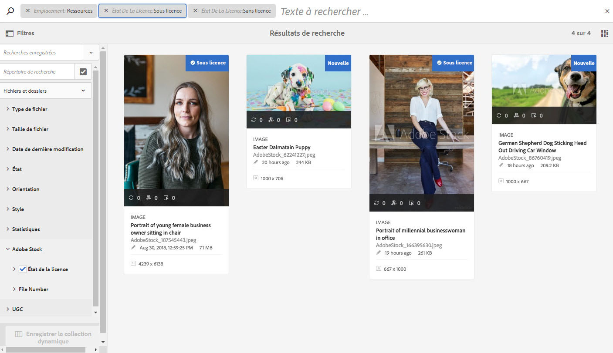
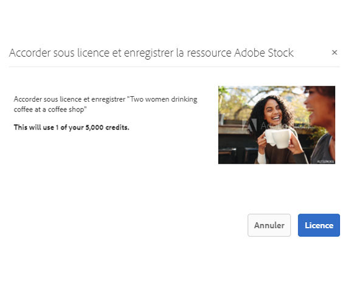
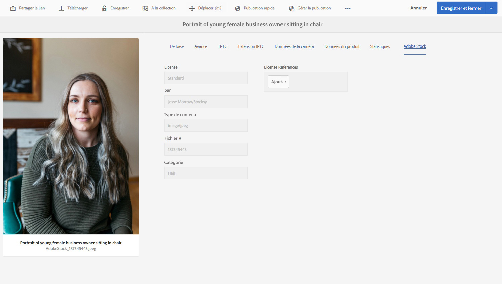

# Utilisation de ressources Adobe Stock dans AEM Assets {#use-adobe-stock-assets-in-aem-assets}

Les entreprises peuvent intégrer leur formule d’abonnement Adobe Stock pour entreprise dans AEM Assets pour s’assurer que les ressources sous licence sont mises à la disposition de leurs projets de création et marketing, tout en bénéficiant des puissantes fonctionnalités de gestion de ressources d’AEM.

Le service Adobe Stock permet aux créateurs et aux entreprises d’accéder à des millions de photos, de vecteurs, d’illustrations, de vidéos, de modèles et de ressources 3D organisés, de haute qualité et libres de droits pour tous leurs projets de création. Les utilisateurs d’AEM peuvent, en un éclair, rechercher, prévisualiser et acquérir sous licence des ressources Adobe Stock qui sont enregistrées dans AEM, sans quitter l’espace de travail d’AEM.

## Intégration d’AEM et d’Adobe Stock {#integrate-aem-and-adobe-stock}

Pour permettre à AEM et Adobe Stock de communiquer, créez une configuration IMS et une configuration Adobe Stock dans AEM.

>[!NOTE]
>
>Seuls les administrateurs d’AEM et les administrateurs d’Admin Console d’une entreprise peuvent procéder à l’intégration, dans la mesure où cette opération requiert des privilèges d’administrateur.

### Création d’une configuration d’IMS   {#create-an-ims-configuration}

1. Cliquez sur le logo AEM. Accédez à **[!UICONTROL Outils]** > **[!UICONTROL Sécurité]** > **[!UICONTROL Configurations d’Adobe IMS]**. Cliquez sur **[!UICONTROL Créer]** et sélectionnez ensuite **[!UICONTROL Solution cloud]** > **[!UICONTROL Adobe Stock]**.
1. Réutilisez un certificat existant ou sélectionnez **[!UICONTROL Créer un certificat]**.
1. Cliquez sur **[!UICONTROL Créer un certificat]**. Une fois le certificat créé, téléchargez la clé publique. Cliquez sur **[!UICONTROL Suivant]**.
1. Saisissez les valeurs appropriées dans les champs intitulés **[!UICONTROL Titre]**, **[!UICONTROL Serveur d’autorisation]**, **[!UICONTROL Clé API]**, **[!UICONTROL Secret du client]** et **[!UICONTROL Charge utile]**. Pour savoir comment récupérer ces valeurs à partir d’Adobe I/O, voir [JWT authentication quick start](https://www.adobe.io/authentication/auth-methods.html#!AdobeDocs/adobeio-auth/master/JWT/JWT.md) (Guide de démarrage rapide de l’authentification JWT).
1. Ajoutez la clé publique téléchargée à votre compte de service Adobe I/O.

### Création d’une configuration Adobe Stock dans AEM   {#create-adobe-stock-configuration-in-aem}

1. Dans l’interface utilisateur d’AEM, accédez à **[!UICONTROL Outils]** > **[!UICONTROL Cloud Services]** > **[!UICONTROL Adobe Stock]**.
1. Cliquez sur **[!UICONTROL Créer]** pour créer une configuration et l’associer à votre configuration IMS existante. Sélectionnez `PROD` comme paramètre d’environnement.
1. Ne modifiez pas l’emplacement défini dans le champ **[!UICONTROL Chemin d’accès aux ressources sous licence]**. Ne modifiez pas l’emplacement où vous souhaitez stocker les ressources Adobe Stock.
1. Pour terminer la procédure de création, ajoutez toutes les propriétés requises. Cliquez sur **[!UICONTROL Enregistrer et fermer]**.
1. Ajoutez les utilisateurs ou groupes AEM qui peuvent acquérir les ressources sous licence.

>[!NOTE]
>
>S’il existe plusieurs configurations Adobe Stock, sélectionnez celle de votre choix dans le panneau [!UICONTROL Préférences utilisateur] en cliquant sur le logo AEM dans l’interface utilisateur d’AEM.

## Utilisation et gestion de ressources Adobe Stock dans AEM {#usemanage}

Grâce à cette fonctionnalité, les entreprises peuvent permettre à leurs utilisateurs de travailler avec des ressources Adobe Stock dans AEM Assets. Dans l’interface utilisateur AEM, les utilisateurs peuvent rechercher des ressources Adobe Stock et obtenir des licences pour les ressources requises.

Une fois qu’une ressource Adobe Stock est sous licence dans AEM, elle peut être utilisée et gérée comme une ressource standard. Dans AEM, les utilisateurs peuvent rechercher des ressources, les prévisualiser, les copier, les publier, les partager sur Brand Portal et les utiliser via l’application de bureau AEM, etc.

<!--  
*Figure: Search for Adobe Stock assets and filter results from your AEM workspace* -->

**A.** Rechercher les ressources semblables à celles dont l’ID Adobe Stock est fourni. **B.** Rechercher les ressources correspondant à la forme ou à l’orientation que vous avez sélectionnée. **C.** Rechercher un ou plusieurs types de ressources pris en charge **D.** Ouvrir ou réduire le volet Filtres **E.** Acquérir sous licence et enregistrer la ressource sélectionnée dans AEM **F.** Enregistrer la ressource dans AEM avec un filigrane **G.** Explorer sur le site web d’Adobe Stock les ressources semblables à la ressource sélectionnée **H.** Afficher les ressources sélectionnées sur le site web d’Adobe Stock **I.** Nombre de ressources sélectionnées dans les résultats de la recherche **J.** Basculer entre les modes Carte et Liste

### Recherche de ressources {#find-assets}

Vos utilisateurs AEM peuvent rechercher des ressources dans AEM et dans Adobe Stock. Lorsque l’emplacement de recherche n’est pas limité à Adobe Stock, les résultats de recherche en provenance d’AEM et d’Adobe Stock sont affichés.

* Pour rechercher des ressources Adobe Stock, cliquez sur **[!UICONTROL Navigation]** > **[!UICONTROL Ressources]** > **[!UICONTROL Rechercher sur Adobe Stock]**.

* Pour rechercher des ressources dans Adobe Stock et AEM Assets, cliquez sur l’icône .

Vous pouvez également commencer à saisir `Location: Adobe Stock` dans la barre de recherche pour sélectionner des ressources Adobe Stock. AEM propose des fonctionnalités de filtrage avancé sur les ressources recherchées, ce qui permet aux utilisateurs de cibler rapidement les ressources requises à l’aide de filtres tels que les types de ressources pris en charge, l’orientation d’image et l’état de licence.

>[!NOTE]
>
>Les ressources recherchées dans Adobe Stock sont simplement affichées dans AEM. Les ressources Adobe Stock ne sont pas récupérées ni stockées dans le référentiel AEM tant qu’un utilisateur n’a pas [enregistré une ressource](/help/assets/aem-assets-adobe-stock.md#saveassets) ou [acquis une ressource sous licence](/help/assets/aem-assets-adobe-stock.md#licenseassets). Les ressources qui sont déjà stockées dans AEM sont affichées et mises en évidence pour que vous puissiez les référencer et y accéder facilement. En outre, ces ressources sont enregistrées avec quelques métadonnées supplémentaires pour indiquer la source comme étant Adobe Stock.

*Figure : Filtres de recherche dans AEM et ressources Adobe Stock mises en surbrillance dans les résultats de recherche*

### Enregistrement et affichage des ressources requises {#saveassets}

Sélectionnez une ressource que vous souhaitez enregistrer dans AEM. Cliquez sur Enregistrer dans la barre d’outils supérieure, et indiquez le nom et l’emplacement de la ressource. Les ressources sans licence sont enregistrées en local avec un filigrane.

La prochaine fois que vous rechercherez des ressources, les ressources enregistrées seront mises en évidence avec un badge pour indiquer qu’elles sont disponibles dans AEM Assets.

>[!NOTE]
>
>Les ressources ajoutées récemment sont assorties d’un badge Nouveau au lieu du badge Sous licence.

### Acquisition de ressources sous licence {#licenseassets}

Les utilisateurs peuvent acquérir des ressources Adobe Stock sous licence en utilisant le quota de leur abonnement Adobe Stock pour entreprise. Lorsque vous acquérez une ressource sous licence, elle est enregistrée sans filigrane, et elle peut être recherchée et utilisée dans AEM Assets.

*Figure : Boîte de dialogue permettant d’acquérir sous licence et d’enregistrer des ressources Adobe Stock dans AEM Assets*

### Accès aux propriétés de ressources et de métadonnées {#access-metadata-and-asset-properties}

Les utilisateurs peuvent accéder aux métadonnées et les prévisualiser, ce qui inclut les propriétés de métadonnées Adobe Stock des ressources enregistrées dans AEM, et ajouter des **[!UICONTROL Références de licence]** pour une ressource. Cependant, les mises à jour apportées à une référence de licence ne sont pas synchronisées entre AEM et le site web d’Adobe Stock.

Les utilisateurs peuvent afficher les propriétés de toutes les ressources, avec et sans licence.

*Figure : Affichage et accès aux métadonnées et aux références de licence des ressources enregistrées*

## Limitations connues {#known-limitations}

### L’avertissement d’image éditoriale ne s’affiche pas

Lors de l’acquisition d’une image sous licence, les utilisateurs ne peuvent pas vérifier si elle est destinée uniquement à un usage éditorial. Pour lutter contre une éventuelle utilisation abusive, les administrateurs peuvent désactiver l’accès aux ressources éditoriales à partir d’Admin Console.

### Le type de licence affiché est incorrect

Il est possible qu’un type de licence incorrect soit affiché pour une ressource dans AEM. Les utilisateurs peuvent se connecter au site web d’Adobe Stock pour afficher le type de licence.

### Les métadonnées et les champs de référence ne sont pas synchronisés

Lorsqu’un utilisateur met à jour un champ de référence de licence, les informations sur la référence de licence sont mises à jour dans AEM, mais pas sur le site web d’Adobe Stock. De même, si l’utilisateur met à jour les champs de référence sur le site web d’Adobe Stock, les mises à jour ne sont pas synchronisées dans AEM.

## Ressources connexes {#related-resources}

[Tutoriel visuel sur l’utilisation de ressources Adobe Stock avec AEM Assets](https://helpx.adobe.com/experience-manager/kt/assets/using/stock-assets-feature-video-use.html)

[Aide d’Adobe Stock pour entreprise](https://helpx.adobe.com/fr/enterprise/using/adobe-stock-enterprise.html)

[FAQ d’Adobe Stock](https://helpx.adobe.com/fr/stock/faq.html)
