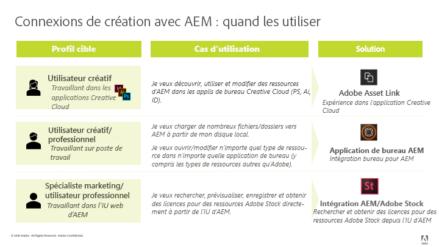

# Bonnes pratiques d’intégration d’AEM et de Creative Cloud {#aem-and-creative-cloud-integration-best-practices}

Adobe Experience Manager (AEM) Assets est une solution de gestion des ressources numériques (DAM) qui peut s’intégrer à Adobe Creative Cloud pour aider les utilisateurs de DAM à travailler avec des équipes créatives, en rationalisant la collaboration en matière de création de contenu.

Adobe Creative Cloud offre aux équipes créatives un écosystème de solutions et de services pour leur permettre de créer des ressources numériques. Il comprend des applications de bureau et mobiles, des services de cloud tels que le stockage avec une synchronisation sur poste de travail ou une expérience web, ainsi que des places de marché telles qu’Adobe Stock.

Lisez ce qui suit pour savoir quelles intégrations choisir entre poste de travail et DAM d’entreprise selon votre cas d’utilisation et découvrir quelles sont les meilleures pratiques associées aux workflows de connexion.

>[!NOTE]
>
>Le partage de dossiers d’AEM vers Creative Cloud est maintenant obsolète et n’est plus traité ci-après. Adobe recommande des fonctionnalités plus récentes, telles qu’Adobe Asset Link ou l’application de bureau AEM, pour fournir aux utilisateurs créatifs un accès aux ressources gérées dans AEM.

## Besoins en matière de collaboration des créatifs, spécialistes marketing et utilisateurs de DAM    {#collaboration-need-of-creatives-marketers-and-dam-users}

| Conditions requises | Cas d’utilisation | Surfaces impliquées |
|---|---|---|
| Simplifier l’expérience pour les créatifs utilisant un poste de travail | Simplifiez l’accès aux ressources depuis DAM (AEM Assets) pour les créatifs ou, plus largement, pour les utilisateurs sur poste de travail utilisant des applications de création de ressources natives. Ils ont besoin d’une méthode simple et rapide pour découvrir, utiliser (ouvrir), modifier et enregistrer les modifications dans AEM, ainsi que pour télécharger de nouveaux fichiers. | Poste de travail Windows ou Mac ; applications Creative Cloud |
| Fournir des ressources de grande qualité, prêtes à l’emploi depuis Adobe Stock | Les spécialistes marketing accélèrent le processus de création de contenu en contribuant à la recherche et à la découverte de ressources. Les créatifs utilisent les ressources approuvées directement dans leurs outils de création. | AEM Assets ; Adobe Stock Marketplace ; champs de métadonnées |
| Distribution et partage de ressources par sociétés | Les services internes/succursales locales et les partenaires externes, les distributeurs et les agences utilisent les ressources approuvées, partagées par la société mère. La société souhaite partager de manière sécurisée et transparente les ressources créées pour une réutilisation plus large. | Brand Portal, Asset Share Commons |

## Offres d’Adobe pour répondre aux besoins en matière de collaboration {#adobe-offerings-to-support-the-collaboration-need}

| Proposition de valeur pour les personnes impliquées | Offre d’Adobe | Surfaces impliquées |
|---|---|---|
| Les utilisateurs créatifs découvrent des ressources à partir d’AEM, les ouvrent et les utilisent, les modifient et téléchargent les modifications dans AEM et téléchargent aussi de nouveaux fichiers dans AEM sans quitter les applications Creative Cloud. | [Adobe Asset Link](https://helpx.adobe.com/fr/enterprise/using/adobe-asset-link.html) | Photoshop, Illustrator et InDesign |
| Les utilisateurs professionnels simplifient l’ouverture et l’utilisation des ressources, la modification et le chargement des modifications dans AEM et le chargement de nouveaux fichiers dans AEM à partir de l’environnement de poste de travail. Ils utilisent une intégration générique pour ouvrir n’importe quel type de ressource dans l’application de bureau native, y compris les applications autres qu’Adobe. | [Application de bureau AEM](https://docs.adobe.com/content/help/fr-FR/experience-manager-desktop-app/using/using.html) | Application de bureau AEM sous Windows et Mac |
| Les spécialistes marketing et les utilisateurs professionnels découvrent, prévisualisent, attribuent une licence et enregistrent les ressources Adobe Stock dans AEM. Les ressources sous licence et enregistrées fournissent des métadonnées Adobe Stock pour une meilleure gouvernance. | [Intégration d’Experience Manager et d’Adobe Stock](aem-assets-adobe-stock.md) | Interface web d’AEM |

Cet article porte principalement sur les deux premiers aspects des besoins en matière de collaboration. La distribution et la source des ressources à grande échelle sont brièvement mentionnées comme cas d’utilisation. Pour ces besoins, envisagez d’utiliser Adobe Brand Portal ou Asset Share Commons. D’autres solutions (par exemple, [AEM Assets Brand Portal](https://helpx.adobe.com/fr/experience-manager/brand-portal/user-guide.html), les solutions pouvant être créées en fonction des composants [Asset Share Commons](https://adobe-marketing-cloud.github.io/asset-share-commons/), [Partage de lien](share-assets.md) à l’aide de l’[interface utilisateur web d’AEM Assets](/help/assets/manage-digital-assets.md)) doivent être envisagées en fonction des besoins spécifiques.

Choix de la fonctionnalité à utiliser

### Correspondance des cas d’utilisation aux solutions Adobe    {#mapping-of-use-cases-and-adobe-solutions}

| Cas d’utilisation | Adobe Asset Link | Application de bureau AEM | Remarques ou autres méthodes |
|----------------------------------------------------------|-----------------------------------------------------------------------------------|--------------------------------------------------------------------|------------------------------------------------------------------------------------------------------------------------------------------|
| Découverte - parcours des dossiers AEM | Oui | Interface utilisateur web d’AEM + actions sur le poste de travail | Lors du parcours du partage réseau, désactivez les miniatures pour éviter de télécharger des fichiers binaires de ressources. |
| Découverte - accès aux collections AEM | Oui | Interface utilisateur web d’AEM + actions sur le poste de travail |  |
| Découverte - recherche de ressources à partir d’AEM | Oui | Interface utilisateur web d’AEM + actions sur le poste de travail |  |
| Utilisation - ouverture de la ressource | Oui | Oui - pour toutes les applications | [Ouverture depuis l’interface web](/help/assets/manage-digital-assets.md#previewing-assets) ou de l’outil de recherche |
| Utilisation - placement de la ressource d’AEM dans un document | Oui - incorporation | Oui - liaison ou incorporation | L’application de bureau AEM donne accès aux ressources sous forme de fichiers sur le système de fichiers local. Ces liens dans les applications natives sont représentés par des chemins d’accès locaux. |
| Modification - ouvrir pour modification | Oui - Action d’extraction | Oui - Action d’ouverture (dans le partage réseau) | L’[extraction dans AAL](https://helpx.adobe.com/fr/enterprise/using/manage-assets-using-adobe-asset-link.html) enregistre la ressource dans le compte de stockage Creative Cloud de l’utilisateur (synchronisé par l’application Creative Cloud) par défaut. |
| Modification - tâche en cours en dehors d’AEM | Oui - Ressource disponible dans le compte de stockage Creative Cloud de l’utilisateur synchronisé avec le poste de travail. | Oui |  |
| Modification - téléchargement des modifications | Oui - [Action d’archivage](https://helpx.adobe.com/fr/enterprise/using/manage-assets-using-adobe-asset-link.html) avec des commentaires facultatifs | Oui |  |
| Téléchargement - fichier unique | Oui - téléchargement du document actif | Oui | [Chargement via l’interface web](/help/assets/manage-digital-assets.md#uploading-assets) |
| Téléchargement - plusieurs fichiers/structures de dossiers hiérarchiques | Non | Oui | [Chargement via l’interface web](/help/assets/manage-digital-assets.md#uploading-assets) ; outil ou script personnalisé |
| Divers - utilisateur et connexion | L’utilisateur Creative Cloud connecté à l’application de bureau Creative Cloud est reconnu (SSO) | Utilisateur/connexion AEM | Les utilisateurs des deux solutions sont comptabilisés par rapport au quota d’utilisateurs AEM. |
| Divers - réseau et accès | Nécessite un accès depuis le poste de travail de l’utilisateur vers le déploiement AEM sur le réseau | Nécessite un accès depuis le poste de travail de l’utilisateur vers le déploiement AEM sur le réseau | Adobe Asset Link ne partage pas l’environnement du proxy réseau. |

<!-- Removing this row from table as migration guide is not yet final.
| Misc - Migrate large number of assets | No | No | [Migration Guide](/help/assets/assets-migration-guide.md) |
-->

Pour prendre en charge les cas d’utilisation de la distribution des ressources, d’autres solutions doivent être envisagées :

* [AEM Assets Brand Portal](https://helpx.adobe.com/fr/experience-manager/brand-portal/user-guide.html) pour un module complémentaire SaaS configurable pour AEM Assets afin de publier des ressources.

* Les solutions personnalisées sont créées à partir de la base de code [Asset Share Commons](https://adobe-marketing-cloud.github.io/asset-share-commons/).
* [Partage de liens](/help/assets/share-assets.md) AEM pour partager des ressources ad hoc à l’aide de liens.
* [Interface web d’AEM Assets](/help/assets/manage-digital-assets.md) avec des zones destinées aux parties externes, sécurisées par la configuration du contrôle d’accès AEM, et avec les ajustements de configuration informatique/réseau nécessaires pour permettre à ces utilisateurs externes d’accéder à AEM.

## Concepts clés et cas d’utilisation {#key-concepts-and-use-cases}

### Glossaire des termes courants {#glossary-of-common-terms}

* **Travail en cours ou travail créatif en cours (WIP) :** phase dans le cycle de vie des ressources où une ressource est soumise à de multiples modifications et n’est généralement pas encore prête à être partagée avec les équipes élargies.
* **Ressources prêtes après création :** ressources prêtes à être partagées avec l’équipe élargie ou sélectionnées/approuvées par l’équipe créative pour le partage avec les équipes marketing ou métier.

* **Approbation des ressources :** processus d’approbation traitant des ressources déjà transférées dans la gestion des ressources numériques, qui inclut généralement les approbations de marque, les validations juridiques, etc.
* **Ressource finale :** ressource qui a passé l’ensemble des      approbations/balisages de métadonnées et qui est prête à être utilisée par l’équipe élargie. Une telle ressource est stockée dans la gestion des ressources numériques et est accessible à tous les utilisateurs (ou à tous les utilisateurs intéressés). Elle peut être utilisée dans les canaux marketing ou par les équipes créatives de façon à créer des designs.

* **Mise à jour/modification mineure      d’une ressource :** modification légère et rapide d’une ressource numérique. Elle est souvent effectuée en réponse à une demande de modification mineure ou de retouche, à une révision de ressource ou à une approbation (par exemple, repositionnement, modification de la taille du texte, réglage de la luminosité/saturation, modification de la couleur, etc.).
* **Mise à jour/modification majeure      d’une ressource :** modification d’une ressource numérique qui requiert un travail considérable et doit parfois être effectuée sur une plus longue période. De multiples modifications sont généralement impliquées. La ressource doit être enregistrée à plusieurs reprises au cours de la mise à jour. Les mises à jour majeures d’une ressource entraînent généralement le passage de la ressource à l’étape de travail en cours (WIP).
* **DAM :** gestion des ressources numériques (en anglais, Digital Asset Management). Dans ce document, il est synonyme d’Adobe Experience Manager (AEM) Assets, sauf mention contraire.
* **Utilisateur créatif :** professionnel de la création qui crée des ressources numériques avec les applications et services Creative Cloud. Dans certains cas, un utilisateur créatif peut être membre d’une équipe créative qui peut utiliser Creative Cloud sans toutefois créer de ressources numériques (comme un directeur artistique ou un responsable d’équipe créative).
* **Utilisateur de la gestion des ressources numériques :** utilisateur ordinaire d’un système de gestion des ressources numériques (DAM, Digital Asset Management). Selon l’organisation, l’utilisateur de gestion des ressources numériques peut être un utilisateur marketing ou non, par exemple, un utilisateur métier, un bibliothécaire, un commercial, etc.

### Remarques concernant l’utilisation de l’intégration d’AEM et Creative Cloud {#considerations-when-using-aem-and-creative-cloud-integration}

<!--incomplete and TBD: 

* DA2.0 best practices: See troubleshooting.md
* Stock integration: See ?
* AAL: See ?
* BP: See ?

-->

Voici un bref résumé des bonnes pratiques pour l’intégration d’AEM et Creative Cloud. Lisez la suite de ce document pour obtenir une description détaillée des points suivants.

* **Pour les utilisateurs créatifs, utilisant Photoshop, InDesign ou Illustrator :** Adobe Asset Link offre une expérience utilisateur optimale, notamment la gestion des tâches en cours sur les ressources extraites à partir d’AEM.
* **Pour simplifier l’accès aux ressources depuis un poste de travail pour une application ou un format de fichier générique :** utilisez l’application de bureau AEM.
* **Déterminer pourquoi et quand stocker des ressources dans la gestion des ressources numériques :** identifiez quelles mises à jour doivent être mises à la disposition de l’équipe élargie au sein de votre organisation.
* **Surveiller le volume des ressources partagées :** Si votre cas d’utilisation est la distribution des ressources, la gouvernance et la sécurité peuvent être les aspects les plus importants. Envisagez d’utiliser des outils conçus pour effectuer les tâches à grande échelle, comme Brand Portal.
* **Comprendre le cycle de vie des ressources :** comprenez la façon dont les ressources sont traitées par les différentes équipes au sein de votre organisation.
* **Gérer avec soin les enregistrements fréquents des ressources :** Adobe Asset Link s’en charge à votre place avec PS, IA, ID. Pour d’autres applications, ne conservez pas de tâches en cours dans le dossier mappé/partagé, sauf si vous avez besoin de toutes les modifications dans DAM.

### Accès aux ressources Adobe Stock depuis AEM Assets {#access-to-adobe-stock-assets-from-aem-assets}

L’[intégration d’AEM et Adobe Stock](/help/assets/aem-assets-adobe-stock.md) permet aux utilisateurs d’AEM de rechercher, de prévisualiser, d’obtenir des licences et d’enregistrer des ressources d’Adobe Stock dans AEM. Les ressources sous licence et enregistrées d’Adobe Stock possèdent des métadonnées Stock qui peuvent être utilisées pour les rechercher avec des filtres supplémentaires.

Quelques points importants à savoir concernant cette intégration :

* Lorsque des ressources d’Adobe Stock sont enregistrées dans AEM, elles deviennent des ressources AEM Assets standard, avec un binaire enregistré dans le référentiel AEM. Certaines métadonnées liées à Adobe Stock sont enregistrées pour la ressource dans AEM. Sinon, le processus d’ingestion ressemble à celui de tout autre fichier. Par exemple, si les balises dynamiques sont actives, les balises sont ajoutées à ces fichiers lors de l’enregistrement.
* La ressource enregistrée dans AEM est une copie et non un lien vers Adobe Stock.

**Utilisation des ressources enregistrées depuis Adobe Stock dans AEM dans Creative Cloud**. Cette intégration est indépendante d’Adobe Asset Link, mais cette fonction reconnaît ces ressources enregistrées depuis Stock de cette manière et affiche d’autres métadonnées et une icône Stock sur ces ressources dans l’interface utilisateur de l’extension Adobe Asset Link dans Photoshop, Illustrator et InDesign. Les fichiers peuvent être parcourus, ouverts, etc., car il s’agit de ressources AEM normales lorsqu’ils sont enregistrés dans AEM.
Les utilisateurs créatifs utilisant les applications Creative Cloud avec l’extension Adobe Asset Link ont accès aux ressources déjà sous licence d’Adobe Stock dans AEM et peuvent aussi utiliser le panneau Bibliothèques Creative Cloud pour rechercher, prévisualiser et obtenir des licences pour les ressources Adobe Stock.
Les ressources d’Adobe Stock sous licence et enregistrées dans AEM sont accessibles aux équipes élargies qui accèdent au déploiement AEM Assets, tandis que les équipes créatives obtenant une licence pour des ressources d’Adobe Stock via le panneau Bibliothèques Creative Cloud y ont uniquement accès par défaut dans leur compte Creative Cloud.

## À propos du stockage de ressources dans un système de gestion des ressources numériques {#about-storing-assets-in-a-dam}

Pour établir un workflow efficace entre les équipes créatives et marketing/métier, et sélectionner les meilleures fonctionnalités de prise en charge, il est important de comprendre quand et pourquoi les ressources sont stockées dans la gestion des ressources numériques.

### Pourquoi les ressources sont-elles stockées dans la gestion des ressources numériques ?    {#why-assets-are-stored-in-dam}

Le stockage des ressources dans la gestion des ressources numériques permet d’en faciliter l’accès et de les retrouver plus aisément. Cela garantit que les ressources peuvent être exploitées par de nombreux utilisateurs au sein de votre organisation ou écosystème, qui comprend les partenaires, les clients, etc.

La plupart des entreprises choisissent de stocker uniquement les ressources pertinentes pour les processus marketing/métier en aval (publication sur des canaux tels que le canal web via AEM Sites ou d’autres canaux traités par Adobe Experience Cloud : Marketing Cloud, Advertising Cloud et mesurés par Analytics Cloud, satisfaction des besoins des utilisateurs et partenaires, etc.). En outre, les entreprises stockent les ressources qui peuvent être soumises à un processus de révision/approbation dans la gestion des ressources numériques. De cette manière, la gestion des ressources numériques stocke principalement les ressources ayant de grandes chances d’être exploitées, en évitant de stocker les ressources inactives.

Le stockage des ressources est soumis à des considérations techniques et d’utilisation des ressources. La gestion des ressources numériques fournit des services supplémentaires pour les ressources stockées, notamment l’extraction de métadonnées, le contrôle de versions, la génération d’aperçus/de transcodage, la gestion des références et l’ajout d’informations de contrôle d’accès. Ces services utilisent davantage de temps et de ressources de votre infrastructure.

Souvent, le stockage de toutes les ressources et mises à jour n’est pas souhaitable. Par exemple, si les mises à jour de ressources spécifiques sont de mauvaise qualité et utilisent les ressources en excès, les ressources peuvent être stockées dans la gestion des ressources numériques.

#### Quand les ressources sont-elles stockées dans la gestion des ressources numériques ?    {#when-assets-are-stored-in-dam}

Les équipes créatives (et les organisations) ne sont généralement pas intéressées par le stockage des ressources à chaque étape de leur cycle de vie. Par exemple, elles évitent de stocker des ressources dans les cas suivants :

* Si les ressources doivent être finalisées ou sont soumises à expérimentation
* Si les ressources ne passent pas le cycle de révision de l’équipe interne/créative
* L’équipe dispose de ressources plus pertinentes que celle en question pour présenter son travail à des équipes externes

En règle générale, les classes de ressources suivantes sont stockées dans la gestion des ressources numériques :

* Les ressources ayant atteint une certaine maturité et que l’on estime prêtes à être partagées
* Les ressources qui ont été présélectionnées par l’équipe créative
* Les formats de ressources spécifiques qui sont utilisables ou demandés par le marketing, selon un contrat ou un accord spécifique (par exemple, des fichiers JPG convertis à partir de fichiers RAW, des TIFF/images à partir d’originaux PSD)

#### Quand les mises à jour de ressources sont-elles stockées dans la gestion des ressources numériques ?    {#when-updates-to-assets-are-stored-in-dam}

En règle générale, seules les mises à jour des ressources pertinentes pour un large ensemble d’utilisateurs de la gestion des ressources numériques doivent être stockées dans la gestion des ressources numériques. Cela garantit que les utilisateurs (marketing et fonctions similaires) voient uniquement les versions appropriées dans la chronologie des ressources de la gestion des ressources numériques.

Généralement, il s’agit des modifications en rapport avec les principaux jalons dans le cycle de vie des ressources. Par exemple, la ressource initiale prête pour les spécialistes marketing ou une mise à jour officielle basée sur une demande/révision fournie par l’équipe créative doit être enregistrée et versionnée dans la gestion des ressources numériques.

Il peut s’agir, par exemple, d’une mise à jour de l’équipe créative pour révision par l’équipe marketing après une demande de modification de la ressource existante dans la gestion des ressources numériques. Elle doit être stockée et versionnée dans la gestion des actifs numériques à des fins de référence ou pour revenir à la version précédente.

Voici quelques exemples de mises à jour qui ne sont généralement pas pertinentes :

* Les premières versions des ressources transférées avant qu’elles ne soient prêtes pour révision par le marketing
* Les modifications fréquentes de la ressource par l’équipe créative pendant la phase de travail en cours et avant que l’équipe créative ne décide que la ressource est prête

### Accès des utilisateurs à la gestion des ressources numériques {#user-access-to-dam}

AEM Assets prend en charge deux types d’utilisateurs selon leur accès au déploiement d’AEM Assets. En règle générale, les utilisateurs à l’intérieur du réseau d’entreprise (pare-feu) ont un accès direct à la gestion des ressources numériques. Les autres utilisateurs à l’extérieur du réseau d’entreprise n’auront pas d’accès direct. Le type d’utilisateur détermine les intégrations qui peuvent être utilisées du point de vue technique.

#### Utilisateurs créatifs avec un accès direct à la gestion des ressources numériques    {#creative-users-with-direct-access-to-dam}

En règle générale, les équipes créatives internes, de même que les agences et les professionnels de la création intégrés au réseau interne ont accès à l’instance DAM, et peuvent se connecter à AEM. AEM et l’infrastructure réseau peuvent être configurés afin d’autoriser un accès direct aux parties externes (généralement, des entreprises de confiance telles que des agences travaillant pour un client) pour disposer d’un accès à AEM via le réseau (par le biais de la liste blanche des adresses IP ou d’un VPN, par exemple).

Dans ce cas, Adobe Asset Link ou l’application de bureau AEM permet d’accéder facilement aux ressources finales/approuvées et d’enregistrer les ressources préparées par les créatifs dans la gestion des ressources numériques.

#### Utilisateurs créatifs sans accès à la gestion des ressources numériques {#creative-users-without-access-to-dam}

Les agences externes et les indépendants sans accès direct à l’instance de la gestion des ressources numériques peuvent avoir besoin de l’accès aux ressources approuvées ou souhaiter ajouter leurs nouvelles créations dans la gestion des ressources numériques.

Utilisez les stratégies suivantes pour fournir un accès aux ressources finales/approuvées :

* Utilisez l’application de bureau si Asset Link ne fonctionne pas.
* Utilisez [AEM Assets Brand Portal](https://helpx.adobe.com/fr/experience-manager/brand-portal/user-guide.html) pour distribuer les ressources en toute sécurité aux partenaires externes.
* Utilisez une implémentation personnalisée d’un portail de distribution et de source basé sur [Asset Share Commons](https://adobe-marketing-cloud.github.io/asset-share-commons/)
* Utilisez la configuration du contrôle d’accès dans AEM et l’infrastructure réseau nécessaire (mise en liste blanche d’adresses IP et VPN, par exemple) pour permettre aux parties externes d’accéder à une zone de contenu dédiée dans DAM. Ils peuvent utiliser l’interface utilisateur web d’AEM pour obtenir des ressources et télécharger du nouveau contenu dans DAM.

#### Travail en cours sur les ressources d’AEM {#work-in-progress-on-assets-from-aem}

Comme nous l’avons vu dans ce document, il est recommandé d’effectuer des mises à jour importantes sur les ressources, parfois appelées tâche en cours, sans que toutes les modifications enregistrées dans le fichier local ne soient téléchargées dans AEM en tant que modifications. Cela accélère le travail d’un utilisateur sur poste de travail, limite la bande passante réseau utilisée et maintient le calendrier des ressources ciblé sur les mises à jour majeures et contrôlées.

Adobe Asset Link est adapté à cas d’utilisation :

* Lorsque les utilisateurs de Photoshop, InDesign ou Illustrator souhaitent modifier un fichier, ils effectuent une opération d’extraction sur la ressource donnée.
* La ressource est téléchargée en arrière-plan, placée dans le compte Creative Cloud des utilisateurs synchronisés sur le disque par l’application de bureau Creative Cloud et l’indicateur d’extraction est activé sur la ressource dans AEM afin de minimiser les conflits de modification.
* À ce stade, l’utilisateur utilise un fichier stocké localement dans l’emplacement synchronisé et peut continuer à travailler et à enregistrer les modifications nécessaires selon la fréquence nécessaire.
* De plus, comme la ressource figure dans le compte Creative Cloud, elle est également disponible sur d’autres appareils appartenant à l’utilisateur (par exemple, elle peut être ouverte ou modifiée dans une application mobile Creative Cloud dédiée) et peut être partagée avec d’autres utilisateurs Creative Cloud à des fins de collaboration.
* Lorsque l’utilisateur créatif a terminé d’apporter des modifications, il peut effectuer une opération d’archivage sur ce fichier dans son application Creative Cloud, en fournissant un commentaire facultatif. La ressource correspondante dans AEM est versionnée et mise à jour avec le nouveau binaire. Les utilisateurs d’AEM comme les spécialistes marketing ou les utilisateurs du cœur de métier ont accès aux modifications importantes des ressources, ou jalons, via l’interface utilisateur de chronologie d’AEM Assets.

L’application de bureau AEM propose un partage réseau pour les ressources ouvertes dans l’application native. Par défaut, toutes les modifications apportées localement sont téléchargées automatiquement dans AEM après un bref instant. Avec une telle configuration, les enregistrements fréquents durant la phase de tâche en cours seraient tous téléchargés dans AEM et versionnés, ce qui créerait un trafic réseau important et des défis d’évolutivité potentiels, sans mentionner les versions inutiles dans AEM.

L’approche recommandée dans ce cas consiste à utiliser une option dans l’application de bureau AEM pour désactiver les mises à jour automatisées et à télécharger manuellement les modifications des ressources dans AEM, en utilisant l’action de téléchargement des modifications dans l’interface utilisateur État de la ressource de l’application.

#### Chargement en masse dans DAM {#bulk-upload-to-dam}

Dans certains cas, il est possible que vous deviez télécharger simultanément un plus grand nombre de fichiers dans la gestion des actifs numériques, par exemple :

* Transfert des résultats de    séances photo ou de projets de plus grande envergure
* Chargement de ressources fournies par les agences de création
* Transfert de ressources sélectionnées à partir d’un plus grand ensemble si la sélection est effectuée en dehors de la gestion des ressources numériques

Notez que cette description fait référence aux transferts de fichiers du point de vue des opérations (par exemple, chaque semaine ou à chaque      séance photo), comme composante normale du workflow de l’utilisateur de bureau. Les migrations de ressources de grande taille ne sont pas abordées ici.

Vous pouvez utiliser les fonctionnalités de transfert suivantes :

* Pour télécharger des dossiers volumineux/hiérarchiques en bloc, utilisez l’application de bureau AEM qui propose une fonctionnalité de [téléchargement de dossiers](https://helpx.adobe.com/fr/experience-manager/desktop-app/aem-desktop-app.html#bulkupload). Vous pouvez également transférer des structures de dossiers hiérarchiques. Les ressources sont transférées en arrière-plan et, par conséquent, le transfert n’est pas associé à une session du navigateur web.
* Pour charger quelques fichiers à partir d’un seul dossier, faites-les glisser directement jusqu’à l’interface web ou utilisez l’option Créer dans l’interface web d’AEM Assets.
* En fonction des besoins de votre entreprise, vous pouvez également utiliser un outil de chargement personnalisé.

#### Gestion directe des ressources numériques depuis l’ordinateur de bureau {#managing-digital-assets-directly-from-desktop}

Si vous utilisez des partages de fichiers réseau pour gérer les ressources numériques, le fait d’utiliser uniquement un partage réseau mappé par l’application de bureau AEM peut être considéré comme une alternative pratique. Si vous choisissez de ne plus utiliser les partages de fichiers réseau, l’interface utilisateur web d’AEM propose un large éventail de fonctionnalités de gestion des ressources numériques qui vont bien au-delà de ce qui est possible sur un partage réseau (recherche, collections, métadonnées, collaboration, aperçus, etc.) et l’application de bureau AEM fournit un lien pratique pour connecter le référentiel de gestion des ressources numériques côté serveur au travail sur l’ordinateur de bureau.

Évitez d’utiliser l’application de bureau AEM pour gérer les ressources directement dans le partage réseau d’AEM Assets. Par exemple, évitez d’utiliser l’application de bureau AEM pour déplacer/copier plusieurs fichiers. Au lieu de cela, utilisez l’interface utilisateur web d’AEM Assets pour faire glisser des dossiers à partir du Finder/de l’Explorateur vers le partage réseau ou utilisez la fonctionnalité de chargement de dossier d’AEM Assets.

<!-- 
#### Asset migration {#asset-migration}

To plan and execute asset migrations from existing system to a new system or migration of large volume of assets stored on servers, see the [Migration Guide](/help/assets/assets-migration-guide.md). AEM desktop app and AEM to Creative Cloud integrations do not support such migrations. Due to the large volumes of assets to be ingested, and additional requirements around metadata mapping, transformation, and ingestion, migrations should be handled using different tools and approaches.
-->
