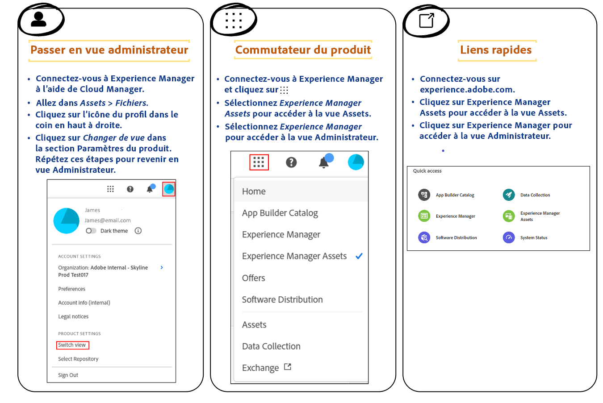

# Approuver des ressources pour le hub de contenus {#approve-assets-content-hub}

| [Bonnes pratiques de recherche](/help/assets/search-best-practices.md) | [Bonnes pratiques relatives aux métadonnées](/help/assets/metadata-best-practices.md) | [Hub de contenus](/help/assets/product-overview.md) | [Fonctionnalités Dynamic Media avec OpenAPI](/help/assets/dynamic-media-open-apis-overview.md) | [Documentation de développement pour AEM Assets](https://developer.adobe.com/experience-cloud/experience-manager-apis/) |
| ------------- | --------------------------- |---------|----|-----|

>[!AVAILABILITY]
>
>Le guide de Content Hub est désormais disponible au format PDF. Téléchargez l’intégralité du guide et utilisez l’assistant IA Adobe Acrobat pour répondre à vos requêtes.
>
>[!BADGE Guide PDF de Content Hub]{type=Informative url="https://helpx.adobe.com/content/dam/help/fr/experience-manager/aem-assets/content-hub.pdf"}

Les chefs de marque et les marketeurs contrôlent strictement les ressources de la marque. Seules les versions approuvées et les plus récentes de la ressource peuvent être utilisées dans Content Hub, ce qui permet d’assurer la cohérence de la marque sur tous les canaux et applications.

Vous pouvez approuver des ressources à l’aide d’AEM Assets as a Cloud Service afin de rationaliser la gestion des ressources et de garantir ainsi un processus contrôlé et efficace de gestion des ressources.

## Avant de commencer {#pre-requisites}

Avant de commencer, vous devez disposer des éléments suivants :

* Accès à AEM Assets as a Cloud Service

* Autorisations en écriture permettant de modifier les métadonnées des ressources afin de pouvoir modifier le champ **[!UICONTROL Statut]** disponible dans [Propriétés de la ressource](/help/assets/manage-organize-assets-view.md##manage-asset-status).

## Approuver des ressources pour le hub de contenus{#approve-assets-for-content-hub}

Les ressources marquées comme `approved` dans Assets as a Cloud Service sont automatiquement disponibles dans Content Hub.

>[!NOTE]
>
Assets as a Cloud Service et Content Hub doivent utiliser la même organisation pour que les ressources s’affichent dans Content Hub.

Pour définir le statut de la ressource comme `approved` à l’aide de la vue Assets dans AEM as a Cloud Service :

1. Sélectionnez la ressource, puis cliquez sur **[!UICONTROL Détails]** dans la barre d’outils.

1. Dans l’onglet **[!UICONTROL De base]**, sélectionnez le statut de la ressource comme `approved` dans la liste déroulante **[!UICONTROL Statut]**.
1. Cliquez sur **[!UICONTROL Enregistrer]**.

   >[!VIDEO](https://video.tv.adobe.com/v/3433172)

Si vous devez approuver des ressources à l’aide de la vue Administration, voir [Approuver des ressources à l’aide de la vue Administration](/help/assets/approve-assets.md#approve-assets).

## Approbation en bloc de ressources pour Content Hub à l’aide de la vue Assets {#bulk-approve-assets-content-hub}

Approbation en bloc de ressources à l’aide de la vue Assets pour AEM Assets as a Cloud Service. Toutes les ressources, approuvées en bloc, sont ensuite disponibles dans Content Hub.

Pour approuver en bloc des ressources dans un dossier dans la vue Assets :

1. Sélectionnez la ou les ressources, puis cliquez sur **[!UICONTROL Modifier les métadonnées en masse]**.

1. Sélectionnez **[!UICONTROL Approuvé]** dans le champ **[!UICONTROL Statut]** disponible dans la section [!UICONTROL Propriétés] du volet de droite.

1. Cliquez sur **[!UICONTROL Enregistrer]**.

## Automatiser l’approbation des ressources nouvellement ingérées dans la vue Administration {#automate-approval-newly-ingested-assets}

Après avoir basculé de la vue Assets vers la vue Administrateur, vous pouvez configurer les paramètres du dossier afin que toutes les nouvelles ressources ajoutées au dossier soient automatiquement approuvées.

Vous pouvez basculer entre les vues Admin et Assets des manières suivantes :

Pour automatiser l’approbation des ressources nouvellement ingérées dans [!DNL Experience Manager Admin view], procédez comme suit :

1. Créez un dossier dans l’environnement de création (https://author-pXXX-eYYY.adobeaemcloud.com). Remplacez _XXX_ par votre ID de programme et _YYY_ par l’ID d’environnement de l’Experience Manager.
1. Accédez à **[!UICONTROL Outils]** > **[!UICONTROL Assets]** > **[!UICONTROL Profils de métadonnées]**.
1. Cliquez sur **[!UICONTROL Créer]** en haut à droite de la page.
1. Ajoutez un titre de profil et cliquez sur **[!UICONTROL Créer]**. Le profil de métadonnées a été créé.
1. Sélectionnez le profil de métadonnées que vous venez de créer et cliquez sur **[!UICONTROL Modifier le(s) _(s)_]**.  Le formulaire **[!UICONTROL Modifier le profil de métadonnées]**s’ouvre avec l’onglet **[!UICONTROL De base]**en surbrillance.
1. Effectuez un glisser-déposer d’un **[!UICONTROL champ de texte monoligne]** de la section **[!UICONTROL Créer un formulaire]** sur le côté droit de la section Métadonnées du formulaire.
1. Cliquez sur le champ nouvellement ajouté, puis effectuez les mises à jour suivantes dans le panneau **[!UICONTROL Paramètres]** :
   1. Remplacez **[!UICONTROL Libellé du champ]** par _Assets approuvé_.
   1. Mettez à jour **[!UICONTROL Mappez à la propriété]** sur _./jcr:content/metadata/dam:status_.
   1. Remplacez la valeur Par défaut par _approuvé_.

1. Comme à l’étape 6, faites glisser un **[!UICONTROL champ de texte monoligne]** de la section **[!UICONTROL Créer un formulaire]** sur le côté droit vers la section Métadonnées du formulaire.
1. Cliquez sur le champ nouvellement ajouté, puis effectuez les mises à jour suivantes dans le panneau **[!UICONTROL Paramètres]** :
   1. Remplacez **[!UICONTROL Libellé du champ]** par _Cible d’activation_.
   1. Mettez à jour **[!UICONTROL Mappez à la propriété]** sur _./jcr:content/metadata/dam:activationTarget_.
   1. Remplacez la Valeur par défaut par _contenthub_.

1. Cliquez sur **[!UICONTROL Enregistrer]**.
1. Sur la page **[!UICONTROL Profils de métadonnées]**, sélectionnez le profil de métadonnées que vous venez de créer.
1. Cliquez sur **[!UICONTROL Appliquer le profil de métadonnées au(x) dossier(s)]** dans la barre d’actions supérieure.
1. Sélectionnez le ou les dossiers à approuver, puis cliquez sur **[!UICONTROL Appliquer]**.
     L’autorisation pour l’ensemble du dossier est définie pour approbation et toutes les ressources chargées dans ce dossier sont automatiquement approuvées.

   >[!VIDEO](https://video.tv.adobe.com/v/3427431)

>[!NOTE]
> 
Cette approche approuve les ressources nouvellement créées dans le dossier . Pour les ressources existantes dans le dossier , vous devez les sélectionner et les approuver manuellement.

## Gestion des ressources chargées à l’aide de Content Hub {#manage-assets-uploaded-using-content-hub}

[Les utilisateurs de Content Hub autorisés à ajouter des ressources](/help/assets/deploy-content-hub.md#onboard-content-hub-users-add-assets) peuvent [ajouter des ressources à Content Hub](/help/assets/upload-brand-approved-assets.md) à partir du système de fichiers local ou importer des ressources à partir de sources de données OneDrive ou Dropbox. Toutes les ressources s’affichent au niveau supérieur dans Content Hub, quelle que soit la structure de dossiers disponible sur votre système de fichiers local ou les sources de données OneDrive et du Dropbox afin d’améliorer les fonctionnalités de recherche.

L’affichage des ressources chargées à l’aide de Content Hub dépend de l’activation ou non [du bouton Validation automatique](/help/assets/configure-content-hub-ui-options.md#configure-import-options-content-hub) :

* Si le bouton **[!UICONTROL Approbation automatique]** est activé, les ressources que vous chargez à l’aide de Content Hub sont automatiquement disponibles.

* Si le bouton **[!UICONTROL Approbation automatique]** est désactivé, les ressources que vous chargez à l’aide de Content Hub ne s’affichent pas automatiquement. Les ressources sont disponibles dans le dossier `hydrated-assets` de votre environnement Assets as a Cloud Service. Accédez au dossier et [modifiez en masse](#bulk-approve-assets-content-hub) le statut de ces ressources sur `Approved` pour que ces ressources s’affichent dans Content Hub.

