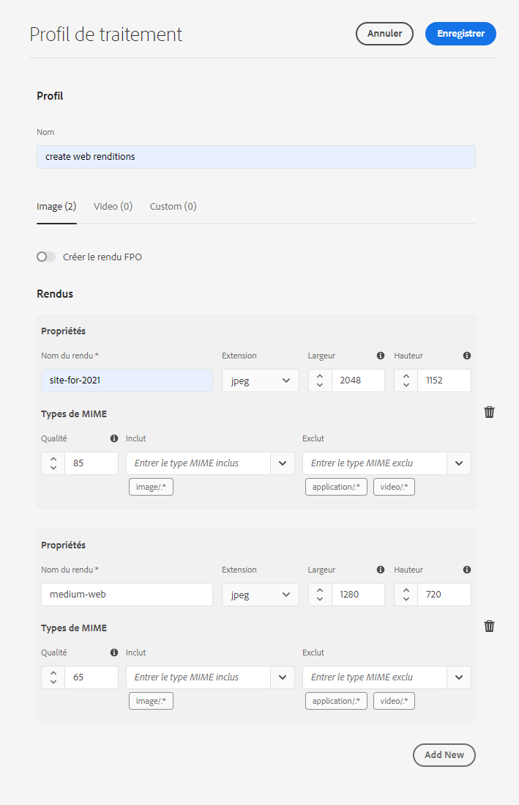
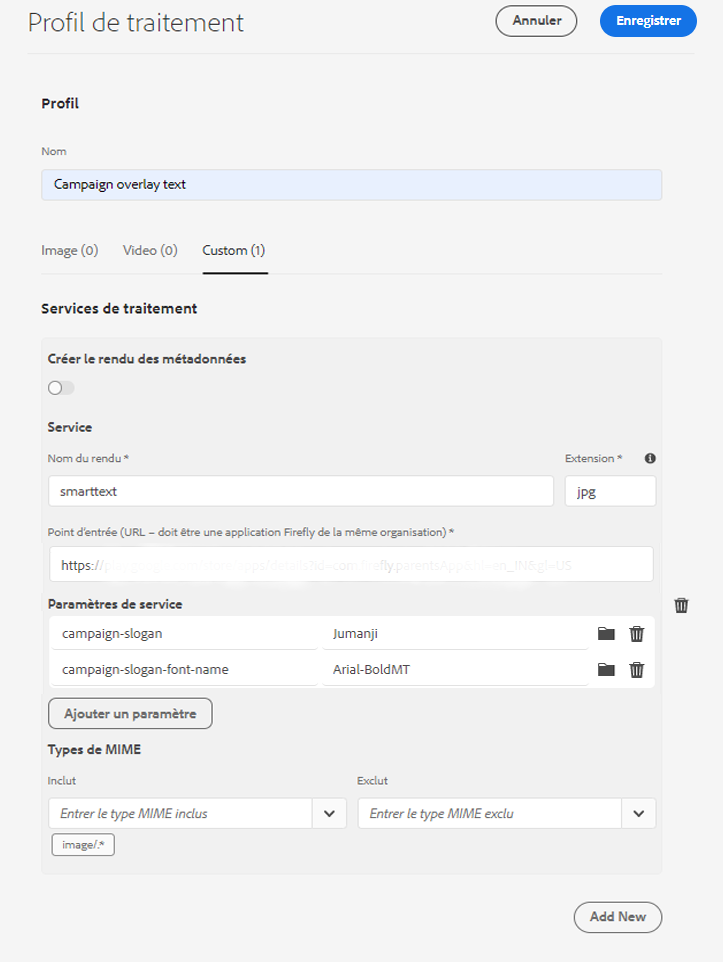
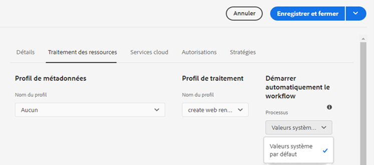

# Utilisation des microservices de ressources et des profils de traitement {#get-started-using-asset-microservices}

| [Bonnes pratiques de recherche](/help/assets/search-best-practices.md) | [ Bonnes pratiques en matière de métadonnées](/help/assets/metadata-best-practices.md) | [Hub de contenus](/help/assets/product-overview.md) | [Dynamic Media avec fonctionnalités OpenAPI](/help/assets/dynamic-media-open-apis-overview.md) | [Documentation destinée aux développeurs AEM Assets](https://developer.adobe.com/experience-cloud/experience-manager-apis/) |
| ------------- | --------------------------- |---------|----|-----|

Les microservices de ressource permettent un traitement évolutif et résilient des ressources à l’aide d’applications basées sur le cloud (également appelées secondaires). Adobe gère les services pour une gestion optimale des différents types de ressources et des options de traitement.

Les microservices de ressources vous permettent de traiter un [large éventail de types de fichiers](/help/assets/file-format-support.md), dans des formats prêts à l’emploi plus nombreux que les versions précédentes d’[!DNL Experience Manager]. Par exemple, l’extraction de miniatures des formats PSD et PSB est désormais possible, mais elle nécessitait auparavant des solutions tierces telles qu’[!DNL ImageMagick].

Le traitement des ressources dépend de la configuration des **[!UICONTROL profils de traitement]**. Experience Manager fournit une configuration par défaut de base et permet aux administrateurs d’ajouter une configuration de traitement des ressources plus spécifique. Les administrateurs créent, gèrent et modifient les configurations des workflows de post-traitement, y compris la personnalisation facultative. La personnalisation des workflows permet aux développeurs d’étendre l’offre par défaut.

<!-- Proposed DRAFT diagram for asset microservices flow - see section "asset-microservices-flow.png (asset-microservices-configure-and-use.md)" in the PPTX deck

https://adobe-my.sharepoint.com/personal/gklebus_adobe_com/_layouts/15/guestaccess.aspx?guestaccesstoken=jexDC5ZnepXSt6dTPciH66TzckS1BPEfdaZuSgHugL8%3D&docid=2_1ec37f0bd4cc74354b4f481cd420e07fc&rev=1&e=CdgElS
-->

>[!NOTE]
>
>Le traitement des ressources décrit ici remplace le modèle de workflow `DAM Update Asset` existant dans les versions précédentes d’[!DNL Experience Manager]. La plupart des étapes standard liées aux métadonnées et à la génération du rendu sont remplacées par le traitement des microservices de ressources, tandis que les étapes restantes, le cas échéant, peuvent être remplacées par la configuration du workflow de post-traitement.

## Présentation des options de traitement des ressources {#get-started}

[!DNL Experience Manager] autorise les niveaux de traitement suivants.

| Option | Description | Cas d’utilisation couverts |
|---|---|---|
| [Configuration par défaut](#default-config) | Elle est disponible en l’état et ne peut pas être modifiée. Cette configuration fournit des fonctionnalités de génération de rendu très élémentaires. | <ul> <li>Miniatures standard utilisées par l’interface utilisateur d’[!DNL Assets] (48, 140 et 319 pixels) </li> <li> Aperçu grand format (rendu web : 1 280 pixels). </li><li> Extraction des métadonnées et du texte</li></ul> |
| [Configuration personnalisée](#standard-config) | Configurée par les administrateurs via l’interface utilisateur. Fournit davantage d’options de génération de rendu en étendant l’option par défaut. Étend l’option prête à l’emploi pour fournir différents formats et rendus. | <ul><li>Rendu FPO. </li> <li>Change le format de fichier et la résolution des images.</li> <li> S’applique de manière conditionnelle aux types de fichiers configurés. </li> </ul> |
| [Profil personnalisé](#custom-config) | Configuré par les administrateurs via l’interface utilisateur pour utiliser du code personnalisé par le biais d’applications personnalisées afin d’appeler [Asset Compute Service](https://experienceleague.adobe.com/docs/asset-compute/using/introduction.html?lang=fr). Prend en charge des exigences plus complexes dans une méthode évolutive et basée sur le cloud. | Voir les [Cas d’utilisation autorisés](#custom-config) |

<!-- To create custom processing profiles specific to your custom requirements, say to integrate with other systems, see [post-processing workflows](#post-processing-workflows).
-->

## Formats de fichiers pris en charge {#supported-file-formats}

Les microservices de ressources prennent en charge un large éventail de formats de fichiers pour traiter et générer des rendus ou extraire des métadonnées. Voir [Formats de fichiers pris en charge](file-format-support.md) pour obtenir la liste complète des types MIME et les fonctionnalités prises en charge pour chaque type.

## Configuration par défaut {#default-config}

Certains paramètres par défaut sont préconfigurés pour garantir que les rendus par défaut requis dans Experience Manager sont disponibles. La configuration par défaut garantit également que les opérations d’extraction de métadonnées et de texte sont disponibles. Les utilisateurs peuvent commencer à charger ou à mettre à jour immédiatement les ressources, et le traitement de base est disponible par défaut.

Avec la configuration par défaut, seul le profil de traitement le plus élémentaire est configuré. Un tel profil de traitement n’est pas visible dans l’interface utilisateur et vous ne pouvez pas le modifier. Il s’exécute toujours pour traiter les ressources chargées. Ce profil de traitement par défaut permet de s’assurer que l’intégralité du traitement de base requis par [!DNL Experience Manager] est terminé sur toutes les ressources.

<!-- 
-->

## Configuration standard {#standard-config}

[!DNL Experience Manager] offre des fonctionnalités permettant de générer des rendus plus spécifiques pour des formats courants en fonction des besoins de l’utilisateur. Un administrateur peut créer des [!UICONTROL profils de traitement] supplémentaires pour faciliter la création de ce rendu. Les utilisateurs affectent alors un ou plusieurs des profils disponibles à des dossiers spécifiques afin qu’un traitement supplémentaire soit réalisé. Par exemple, le traitement supplémentaire peut générer des rendus pour le web, les appareils mobiles et les tablettes. La vidéo suivante explique comment créer et appliquer des [!UICONTROL Profils de traitement] et comment accéder aux rendus qui ont été créés.

* **Largeur et hauteur du rendu** : la spécification de hauteur et de largeur du rendu fournit les tailles maximales de l’image de sortie générée. Les microservices de ressources tentent de générer le rendu le plus grand possible, avec une largeur et une hauteur ne dépassant pas les valeurs spécifiées. Les proportions sont conservées, c’est-à-dire qu’elles sont identiques à l’original. Une valeur vide signifie que le traitement des ressources utilise, par défaut, la taille en pixels de l’original.

* **Règles d’inclusion de type MIME** : lors du traitement d’une ressource avec un type MIME spécifique, ce dernier est d’abord comparé à la valeur des types MIME exclus pour la spécification de rendu. En cas de correspondance avec cette liste, ce rendu spécifique n’est pas généré pour la ressource (liste bloquée). Dans le cas contraire, le type MIME est comparé au type MIME inclus et, si une correspondance est trouvée, le rendu est généré (liste autorisée).

* **Rendu FPO spécial** : lorsque vous placez des ressources de grande taille d’[!DNL Experience Manager] dans des documents [!DNL Adobe InDesign], un professionnel de la création attend un certain temps après avoir [placé une ressource](https://helpx.adobe.com/fr/indesign/using/placing-graphics.html). Pendant ce temps, l’utilisateur ne peut pas utiliser [!DNL InDesign]. Cela interrompt le flux créatif et a un impact négatif sur l’expérience utilisateur. Adobe permet de placer temporairement dans des documents [!DNL InDesign] les rendus de petite taille, qui peuvent être remplacés ultérieurement par des ressources pleine résolution à la demande. [!DNL Experience Manager] fournit des rendus utilisés uniquement pour placement (FPO). Ces rendus FPO ont une taille de fichier réduite, mais présentent les mêmes proportions.

Le profil de traitement peut inclure un rendu FPO (For Placement Only). Consultez la [documentation d’[!DNL Adobe Asset Link]](https://helpx.adobe.com/fr/enterprise/using/manage-assets-using-adobe-asset-link.html) afin de savoir si vous devez l’activer pour votre profil de traitement. Pour plus d’informations, voir la [documentation complète d’Adobe Asset Link](https://helpx.adobe.com/fr/enterprise/using/adobe-asset-link.html).

### Création d’un profil standard {#create-standard-profile}

Pour créer un profil de traitement standard, procédez comme suit :

1. Les administrateurs accèdent à **[!UICONTROL Outils]** > **[!UICONTROL Ressources]** > **[!UICONTROL Profils de traitement]**. Cliquez sur **[!UICONTROL Créer]**.
1. Fournissez un nom qui vous aide à identifier de manière unique le profil lors de l’application à un dossier.
1. Pour générer des rendus FPO, dans l’onglet **[!UICONTROL Image]**, activez **[!UICONTROL Créer le rendu FPO]**. Saisissez une valeur **[!UICONTROL Qualité]** de 1 à 100.
1. Pour générer d’autres rendus, cliquez sur **[!UICONTROL Ajouter nouveau]** et fournissez les informations suivantes :

   * Nom de fichier de chaque rendu.
   * Format de fichier (PNG, JPEG, GIF ou WebP) de chaque rendu.
   * Largeur et hauteur en pixels de chaque rendu. Si ces valeurs ne sont pas spécifiées, la taille totale en pixels de l’image d’origine est utilisée.
   * Qualité en pourcentage de chaque rendu JPEG et WebP.
   * Types MIME inclus et exclus pour définir l’applicabilité d’un profil.

   

1. Cliquez sur **[!UICONTROL Enregistrer]**.

<!-- TBD: Update the video link when a new video is available from Tech Marketing.

The following video demonstrates the usefulness and usage of standard profile.

>[!VIDEO](https://video.tv.adobe.com/v/29832?quality=9)
-->

<!-- This image was removed per cqdoc-15624, as requested by engineering.
  
 -->

## Profil et cas d’utilisation personnalisés {#custom-config}

L’[!DNL Asset Compute Service] prend en charge une variété de cas d’utilisation, tels que le traitement par défaut, le traitement de formats spécifiques à Adobe (par exemple, des fichiers Photoshop) et la mise en œuvre d’un traitement personnalisé ou spécifique à l’organisation. La personnalisation du workflow Ressource de mise à jour DAM requise par le passé est gérée automatiquement ou via la configuration des profils de traitement. Si ces options de traitement ne répondent pas aux besoins de l’entreprise, Adobe recommande de développer et d’utiliser le [!DNL Asset Compute Service] pour étendre les fonctionnalités par défaut. Pour obtenir aperçu, voir [Comprendre l’extensibilité et savoir quand l’utiliser](https://experienceleague.adobe.com/docs/asset-compute/using/extend/understand-extensibility.html?lang=fr).

>[!NOTE]
>
>Adobe recommande de n’utiliser une application personnalisée que si les besoins de l’entreprise ne peuvent pas être satisfaits à l’aide des configurations par défaut ou du profil standard.

Le profil personnalisé peut transformer des formats d’image, de vidéo, de document et autres formats de fichier en différents rendus, y compris des miniatures, du texte et des métadonnées extraits et des archives.

Les développeurs peuvent utiliser [!DNL Asset Compute Service] pour [créer des applications personnalisées](https://experienceleague.adobe.com/docs/asset-compute/using/extend/develop-custom-application.html?lang=fr) qui répondent aux cas d’utilisation pris en charge. [!DNL Experience Manager] peut appeler ces applications personnalisées à partir de l’interface utilisateur en utilisant des profils personnalisés configurés par les administrateurs. [!DNL Asset Compute Service] prend en charge les cas d’utilisation suivants d’appel de services externes :

* Utilisez l’[API ImageCutout](https://developer.adobe.com/photoshop/photoshop-api-docs/) d’[!DNL Adobe Photoshop] et enregistrez le résultat en tant que rendu.
* Appelez des systèmes tiers pour mettre à jour des données (par exemple, un système PIM).
* Utilisez l’API [!DNL Photoshop] pour générer une variété de rendus basés sur le modèle Photoshop.
* Utilisez l’[API Adobe Lightroom](https://developer.adobe.com/photoshop/photoshop-api-docs/) pour optimiser les ressources ingérées et les enregistrer en tant que rendus.

>[!NOTE]
>
>Vous ne pouvez pas modifier les métadonnées standard à l’aide des applications personnalisées. Vous ne pouvez que modifier des métadonnées personnalisées.

### Création d’un profil personnalisé {#create-custom-profile}

Pour créer un profil personnalisé, procédez comme suit :

1. Les administrateurs accèdent à **[!UICONTROL Outils]** > **[!UICONTROL Ressources]** > **[!UICONTROL Profils de traitement]**. Cliquez sur **[!UICONTROL Créer]**.
1. Cliquez sur l’onglet **[!UICONTROL Personnalisé]**. Cliquez sur **[!UICONTROL Ajouter nouveau]**. Indiquez le nom de fichier souhaité pour le rendu.
1. Fournissez les informations suivantes.

   * Nom de fichier de chaque rendu et extension de fichier prise en charge.
   * [URL de point d’entrée d’une application personnalisée App Builder](https://experienceleague.adobe.com/docs/asset-compute/using/extend/deploy-custom-application.html?lang=fr). L’application doit provenir de la même organisation que le compte Experience Manager.
   * Paramètres Ajouter un service pour [transmettre des informations ou des paramètres supplémentaires à l’application personnalisée](https://experienceleague.adobe.com/docs/asset-compute/using/extend/develop-custom-application.html?lang=fr#extend).
   * Types MIME inclus et exclus pour limiter le traitement à quelques formats de fichiers spécifiques.

   Cliquez sur **[!UICONTROL Enregistrer]**.

Les applications personnalisées sont des applications [Project App Builder](https://developer.adobe.com/app-builder/docs/overview/) découplées. Votre application personnalisée récupère tous les fichiers fournis s’ils sont configurés avec un profil de traitement. L’application doit filtrer les fichiers.

>[!CAUTION]
>
>Si l’application App Builder et le compte [!DNL Experience Manager] ne proviennent pas de la même organisation, l’intégration ne fonctionne pas.

### Exemple de profil personnalisé {#custom-profile-example}

Pour illustrer l’utilisation d’un profil personnalisé, considérons un exemple d’utilisation dans lequel il s’agit d’appliquer du texte personnalisé à des images de campagne. Vous pouvez créer un profil de traitement qui exploite l’API Photoshop pour modifier les images.

L’intégration d’Asset Compute Service permet à Experience Manager de transmettre ces paramètres à l’application personnalisée à l’aide du champ [!UICONTROL Paramètres de service]. L’application personnalisée appelle ensuite l’API Photoshop et transmet ces valeurs à l’API. Par exemple, vous pouvez transmettre le nom de la police ainsi que la couleur, l’épaisseur et la taille du texte pour ajouter le texte personnalisé aux images de campagne.

<!-- TBD: Check screenshot against the interface. -->

*Figure : Utilisez le champ [!UICONTROL Paramètres de service] pour transmettre des informations supplémentaires à des paramètres prédéfinis générés dans l’application personnalisée. Dans cet exemple, lorsque des images de campagne sont chargées, elles sont mises à jour avec le texte `Jumanji` dans la police `Arial-BoldMT`.*

## Utilisation de profils de traitement pour traiter des ressources {#use-profiles}

Créez les profils de traitement personnalisé supplémentaire et appliquez-les à des dossiers spécifiques pour qu’Experience Manager traite les ressources chargées ou mises à jour dans ces dossiers. Le profil de traitement standard intégré par défaut est toujours exécuté, mais il n’est pas visible dans l’interface utilisateur. Si vous ajoutez un profil personnalisé, les deux profils sont utilisés pour traiter les ressources chargées.

Appliquez des profils de traitement aux dossiers en utilisant l’une des méthodes suivantes :

* Les administrateurs peuvent sélectionner une définition de profil de traitement dans **[!UICONTROL Outils]** > **[!UICONTROL Assets]** > **[!UICONTROL Profils de traitement]** et utiliser l’action **[!UICONTROL Appliquer le profil aux dossiers]**. Cette action ouvre un navigateur de contenu qui vous permet d’accéder à des dossiers spécifiques, de les sélectionner et de confirmer l’application du profil.
* Les utilisateurs peuvent sélectionner un dossier dans l’interface utilisateur Assets, exécuter l’action **[!UICONTROL Propriétés]** pour ouvrir l’écran des propriétés du dossier, cliquer sur l’onglet **[!UICONTROL Traitement des ressources]** puis, dans la liste [!UICONTROL Profil de traitement], sélectionner le profil de traitement approprié pour ce dossier. Pour enregistrer les modifications, cliquez sur **[!UICONTROL Enregistrer et fermer]**.
  

* Les utilisateurs peuvent sélectionner des dossiers ou des ressources spécifiques dans l’interface utilisateur d’Assets pour appliquer un profil de traitement, puis sélectionner l’option  **[!UICONTROL Retraiter les ressources]** dans les options disponibles dans la partie supérieure.

>[!TIP]
>
>Un seul profil de traitement peut être appliqué à un dossier. Pour générer davantage de rendus, ajoutez d’autres définitions de rendu au profil de traitement existant.

Une fois qu’un profil de traitement a été appliqué à un dossier, toutes les nouvelles ressources chargées (ou mises à jour) dans ce dossier ou dans l’un de ses sous-dossiers sont traitées à l’aide du profil de traitement supplémentaire configuré. Ce dernier s’ajoute au profil par défaut standard.

>[!NOTE]
>
>Un profil de traitement appliqué à un dossier fonctionne pour l’ensemble de l’arborescence, mais il peut être remplacé par un autre qui est appliqué à un sous-dossier. Lorsque des ressources sont chargées dans un dossier, Experience Manager recherche un profil de traitement dans les propriétés du dossier conteneur. Si aucun dossier parent n’est appliqué, un dossier parent dans la hiérarchie est vérifié pour appliquer un profil de traitement.

Pour vérifier que les ressources sont traitées, prévisualisez les rendus générés dans la vue [!UICONTROL Rendus] dans le rail de gauche. Ouvrez l’aperçu des ressources et ouvrez le rail de gauche pour accéder à la vue **[!UICONTROL Rendus]**. Les rendus spécifiques situés dans le profil de traitement, pour lesquels le type de la ressource correspond aux règles d’inclusion du type MIME, doivent être visibles et accessibles.

*Figure : Exemple de deux rendus supplémentaires générés par un profil de traitement appliqué au dossier parent.*

## Workflows de post-traitement {#post-processing-workflows}

S’il s’avère qu’un traitement supplémentaire des ressources est nécessaire, mais qu’il ne peut pas être effectué à l’aide des profils de traitement, des workflows de post-traitement peuvent être ajoutés à la configuration. Le post-traitement permet d’ajouter un traitement entièrement personnalisé en plus du traitement configurable à l’aide des microservices de ressources.

Les workflows de post-traitement, ou [workflows Auto-start](https://experienceleague.adobe.com/docs/experience-manager-learn/assets/configuring/auto-start-workflows.html?lang=fr), s’ils sont configurés, sont automatiquement exécutés par [!DNL Experience Manager] une fois le traitement des microservices terminé. Il n’est pas nécessaire d’ajouter manuellement des lanceurs de workflows pour les déclencher. Voici quelques exemples :

* Étapes du workflow personnalisé de traitement des ressources.
* Intégrations pour ajouter des métadonnées ou des propriétés à des ressources provenant de systèmes externes (par exemple, des informations sur des produits ou des processus).
* Traitement supplémentaire effectué par des services externes.

Pour ajouter une configuration de workflow de post-traitement à [!DNL Experience Manager], procédez comme suit :

* Création d’un ou de plusieurs modèles de workflow. Ces modèles personnalisés sont appelés *modèles de workflow de post-traitement* dans cette documentation. Il s’agit de modèles de flux de workflow [!DNL Experience Manager] standard.
* Ajoutez les étapes de workflow spécifiques à ces modèles. Passez en revue les étapes du workflow par défaut et ajoutez toutes les étapes par défaut requises au workflow personnalisé. Les étapes sont exécutées sur les ressources en fonction d’une configuration de modèle de workflow. Par exemple, si vous souhaitez que le balisage intelligent soit appliqué automatiquement lors du chargement des ressources, ajoutez l’étape à votre modèle personnalisé de workflow de post-traitement.
* Ajoutez l’étape [!UICONTROL Processus terminé du workflow Ressource de mise à jour DAM] à la fin. En ajoutant cette étape, vous êtes certain que Experience Manager sait à quel moment le traitement se termine et la ressource peut être marquée comme traitée ; en d’autres termes, *Nouvelle* s’affiche sur la ressource.
* Création d’une configuration pour le service d’exécution de workflow personnalisé, lequel permet de configurer l’exécution d’un modèle de workflow de post-traitement selon le chemin d’accès (emplacement du dossier) ou une expression régulière.

Pour plus d’informations sur les étapes de workflow standard pouvant être utilisées dans le workflow de post-traitement, voir [Étapes du workflow de post-traitement](developer-reference-material-apis.md#post-processing-workflows-steps) (en anglais) dans la documentation de référence du développeur.

### Création de modèles de workflow de post-traitement {#create-post-processing-workflow-models}

Les modèles de workflow de post-traitement sont des modèles de workflow [!DNL Experience Manager]standard. Créez des modèles différents si un autre traitement doit être exécuté pour différents emplacements de référentiel ou types de ressource.

Les étapes de traitement sont ajoutées si nécessaire. Vous pouvez utiliser les étapes prises en charge qui sont disponibles, ainsi que n’importe quelle étape de workflow implémentée sur mesure.

Assurez-vous que la dernière étape de chaque workflow de post-traitement est `DAM Update Asset Workflow Completed Process`. La dernière étape permet de s’assurer qu’Experience Manager sait quand le traitement des ressources est terminé.

### Configuration de l’exécution du workflow de post-traitement {#configure-post-processing-workflow-execution}

Une fois que les microservices de ressources ont terminé le traitement des ressources chargées, vous pouvez définir un workflow de post-traitement pour continuer le traitement des ressources. Pour configurer le post-traitement à l’aide de modèles de workflow, vous pouvez effectuer l’une des opérations suivantes :

* [Appliquez un modèle de workflow dans le dossier Propriétés](#apply-workflow-model-to-folder).
* [Configurez le service d’exécution de workflow personnalisé](#configure-custom-workflow-runner-service).

#### Application d’un modèle de workflow à un dossier {#apply-workflow-model-to-folder}

Pour les cas d’utilisation standard de post-traitement, pensez à utiliser la méthode pour appliquer un workflow à un dossier. Pour appliquer un modèle de workflow dans le dossier [!UICONTROL Propriétés], procédez comme suit :

1. Créer un modèle de processus.
1. Sélectionnez un dossier, cliquez sur **[!UICONTROL Propriétés]** dans la barre d’outils, puis cliquez sur l’onglet **[!UICONTROL Traitement des ressources]**.
1. Sous **[!UICONTROL Workflow de démarrage automatique]**, sélectionnez le workflow requis, fournissez le titre du workflow, puis enregistrez les modifications.

   

#### Configuration du service d’exécution de workflow personnalisé {#configure-custom-workflow-runner-service}

Vous pouvez configurer le service d’exécution de workflow personnalisé pour les configurations avancées qui ne peuvent pas être réalisées facilement en appliquant un workflow à un dossier. Par exemple, un workflow qui utilise une expression régulière. Le gestionnaire de workflow personnalisé DAM Adobe CQ (`com.adobe.cq.dam.processor.nui.impl.workflow.CustomDamWorkflowRunnerImpl`) est un service OSGi. Il propose les deux options de configuration suivantes :

* Workflows de post-traitement par chemin d’accès (`postProcWorkflowsByPath`) : plusieurs modèles de workflow peuvent être répertoriés en fonction de différents chemins de référentiel. Chemins et modèles séparés à l’aide d’un deux-points. Les chemins de référentiel simples sont pris en charge. Mappez-les à un modèle de workflow dans le chemin `/var`. Par exemple : `/content/dam/my-brand:/var/workflow/models/my-workflow`.
* Workflows de post-traitement par expression (`postProcWorkflowsByExpression`) : plusieurs modèles de workflows peuvent être répertoriés en fonction de différentes expressions régulières. Les expressions et les modèles doivent être séparés par un signe « deux-points ». L’expression régulière doit pointer directement vers le nœud Ressource et non vers l’un des rendus ou fichiers. Par exemple : `/content/dam(/.*/)(marketing/seasonal)(/.*):/var/workflow/models/my-workflow`.

Pour savoir comment déployer une configuration OSGi, voir [déploiement vers [!DNL Experience Manager]](/help/implementing/deploying/overview.md).

#### Désactivation de l’exécution du workflow de post-traitement

Lorsque le post-traitement n’est pas nécessaire, créez et utilisez un modèle de workflow « vide » dans la sélection du __Processus de démarrage automatique__.

##### Création du modèle de workflow de démarrage automatique désactivé

1. Accédez à __Outils > Workflows > Modèles__.
1. Sélectionnez __Créer > Créer un formulaire de modèle__ dans la barre d’actions supérieure.
1. Attribuez un titre et un nom au nouveau modèle de processus, par exemple :
   * Titre : désactiver le workflow de démarrage automatique
   * Nom : disable-auto-start-workflow
1. Sélectionnez __Terminé__ pour créer le modèle de processus.
1. __Sélectionnez__ et __Modifiez__ le modèle de processus créé
1. Dans l’éditeur de modèle de processus, sélectionnez l’__Étape 1__ de la définition de modèle et supprimez-la.
1. Ouvrez le __Panneau latéral__ puis sélectionnez __Étapes__.
1. Faites glisser l’étape __Ressources de mise à jour de gestion des actifs numériques, processus terminé__ dans la définition de modèle.
1. Sélectionnez le bouton __Informations sur la page__ (en face du bouton [bascule] __Panneau latéral__), puis sélectionnez __Ouvrir les propriétés__.
1. Dans l’onglet __De base__, sélectionnez __Processus transitoire__.
1. Sélectionnez __Enregistrer et fermer__ à partir de la barre d’actions supérieure.
1. Sélectionnez __Synchronisation__ dans la barre d’actions supérieure.
1. Fermeture de l’éditeur de modèle de processus

##### Application du modèle de workflow de démarrage automatique désactivé

Suivez les étapes décrites dans la section [appliquer un modèle de workflow à un dossier](#apply-workflow-model-to-folder) et définissez le __workflow de démarrage automatique désactivé__ comme __workflow de démarrage automatique__ pour les dossiers qui ne nécessitent pas de post-traitement des ressources.

## Bonnes pratiques et restrictions {#best-practices-limitations-tips}

* Pour la conception des workflows, prenez en compte vos besoins pour tous les types de rendus. Si vous ne prévoyez pas la nécessité d’un rendu futur, supprimez son étape de création dans le workflow. Il est impossible par la suite de supprimer les rendus en masse. Les rendus superflus peuvent occuper beaucoup d’espace de stockage du fait d’une utilisation prolongée d’[!DNL Experience Manager]. Pour les ressources individuelles, vous pouvez supprimer manuellement les rendus à l’aide de l’interface utilisateur. Si plusieurs ressources sont concernées, vous pouvez, au choix, personnaliser [!DNL Experience Manager] pour supprimer des rendus spécifiques, ou supprimer les ressources et les charger à nouveau.
* Actuellement, la prise en charge se limite à la génération de rendus. La génération de nouvelles ressources n’est pas prise en charge.
* Actuellement, la taille de fichier maximale pour l’extraction des métadonnées est d’environ 15 Go. Lors du chargement de fichiers très volumineux, l’opération d’extraction des métadonnées peut parfois échouer.

**Voir également**

* [Traduire les ressources](translate-assets.md)
* [API HTTP Assets](mac-api-assets.md)
* [Formats de fichiers pris en charge par Assets](file-format-support.md)
* [Rechercher des ressources](search-assets.md)
* [Ressources connectées](use-assets-across-connected-assets-instances.md)
* [Rapports de ressources](asset-reports.md)
* [Schémas de métadonnées](metadata-schemas.md)
* [Télécharger des ressources](download-assets-from-aem.md)
* [Gestion des métadonnées](manage-metadata.md)
* [Facettes de recherche](search-facets.md)
* [Gérer les collections](manage-collections.md)
* [Import des métadonnées en bloc](metadata-import-export.md)
* [Publier des ressources sur AEM et Dynamic Media](/help/assets/publish-assets-to-aem-and-dm.md)

>[!MORELIKETHIS]
>
>* [Présentation d’Asset Compute Service](https://experienceleague.adobe.com/docs/asset-compute/using/introduction.html?lang=fr).
>* [Comprendre l’extensibilité et savoir quand l’utiliser](https://experienceleague.adobe.com/docs/asset-compute/using/extend/understand-extensibility.html?lang=fr).
>* [Comment créer des applications personnalisées](https://experienceleague.adobe.com/docs/asset-compute/using/extend/develop-custom-application.html?lang=fr).
>* [Types MIME pris en charge pour divers cas d’utilisation](/help/assets/file-format-support.md).

<!-- TBD: 
* How/where can admins check what's already configured and provisioned.
* How/where to request for new provisioning/purchase.
-->
