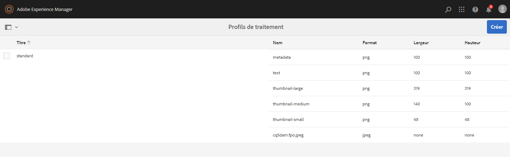
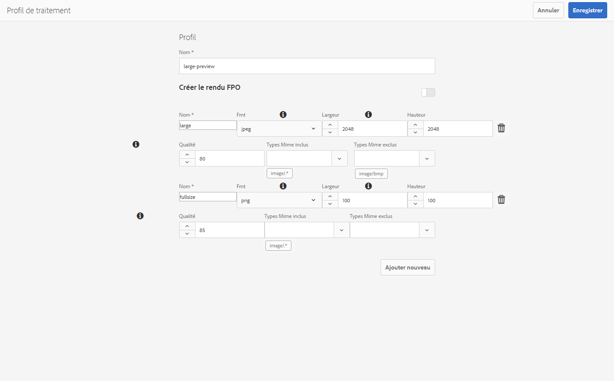
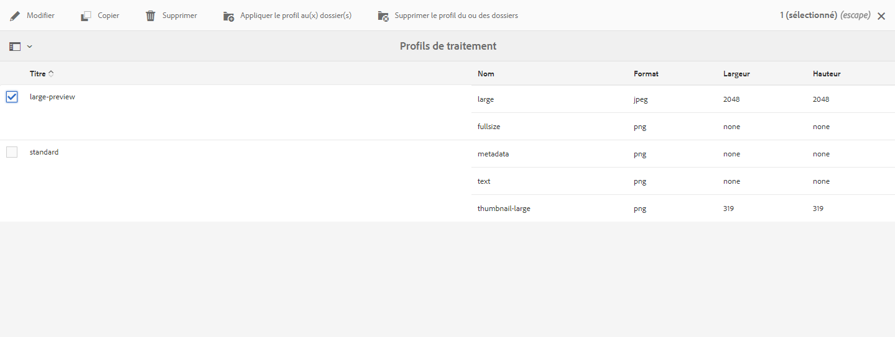
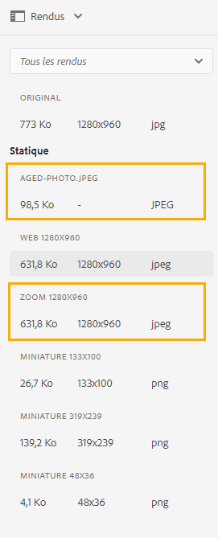

# Prise en main des microservices de ressources {#get-started-using-asset-microservices}

<!--

* Current capabilities of asset microservices offered. If workers have names then list the names and give a one-liner description. (The feature-set is limited for now and continues to grow. So will this article continue to be updated.)
* How to access the microservices. UI. API. Is extending possible right now?
* Detailed list of what file formats and what processing is supported by which workflows/workers process.
* How/where can admins check what's already configured and provisioned.
* How to create new config or request for new provisioning/purchase.

* [DO NOT COVER?] Exceptions or limitations or link back to lack of parity with AEM 6.5.

-->

Les microservices de ressources offrent un traitement évolutif et résilient des ressources à l’aide des services cloud, qui sont gérés par Adobe pour une gestion optimale des différents types de ressources et des différentes options de traitement.

Le traitement des ressources est effectué en fonction de la configuration dans les profils **[!UICONTROL de]** traitement, qui fournissent une configuration par défaut et permettent à l’administrateur d’ajouter une configuration de traitement des ressources plus spécifique. Pour permettre l’extensibilité et la personnalisation complète, le traitement des ressources permet une configuration facultative des processus de post-traitement, qui sont ensuite créés et maintenus par l’administrateur.

Vous trouverez ci-dessous un flux de haut niveau pour le traitement des ressources dans Experience Manager en tant que service Cloud.

<!-- Proposed DRAFT diagram for asset microservices flow - see section "asset-microservices-flow.png (asset-microservices-configure-and-use.md)" in the PPTX deck

https://adobe-my.sharepoint.com/personal/gklebus_adobe_com/_layouts/15/guestaccess.aspx?guestaccesstoken=jexDC5ZnepXSt6dTPciH66TzckS1BPEfdaZuSgHugL8%3D&docid=2_1ec37f0bd4cc74354b4f481cd420e07fc&rev=1&e=CdgElS
-->

>[!NOTE]
>
> Pour les clients qui effectuent une mise à jour à partir des versions précédentes d’Experience Manager - le traitement des ressources décrit dans cette section remplace le modèle de flux de travaux &quot;Mise à jour de la gestion des actifs numériques&quot; utilisé pour le traitement de l’assimilation des ressources auparavant. La plupart des étapes standard de génération de rendu et liées aux métadonnées sont remplacées par le traitement des microservices de ressources, et les étapes restantes, le cas échéant, peuvent être remplacées par la configuration du processus de post-traitement.

## Prise en main du traitement des ressources {#get-started}

Le traitement des ressources avec les microservices de ressources est préconfiguré avec une configuration par défaut, garantissant que les rendus par défaut requis par le système sont disponibles. Il garantit également la disponibilité des opérations d’extraction de métadonnées et de texte. Les utilisateurs peuvent commencer à télécharger ou à mettre à jour les ressources immédiatement et le traitement de base est disponible par défaut.

Pour des besoins spécifiques de génération de rendu ou de traitement des ressources, un administrateur AEM peut créer des profils [!UICONTROL de]traitement supplémentaires. Les utilisateurs peuvent affecter un ou plusieurs des profils disponibles à des dossiers spécifiques afin d’effectuer un traitement supplémentaire. Par exemple, pour générer des rendus spécifiques au Web, aux mobiles et aux tablettes. La vidéo suivante explique comment créer et appliquer des profils [!UICONTROL de] traitement et comment accéder aux rendus créés.

>[!VIDEO](https://video.tv.adobe.com/v/29832?quality=9)

Pour modifier le profil existant, voir [les configurations des microservices](#configure-asset-microservices)de ressources.
Pour créer des profils de traitement personnalisés spécifiques à vos besoins personnalisés, par exemple pour les intégrer à d’autres systèmes, voir Processus de [post-traitement](#post-processing-workflows).

## Configurations des microservices de ressources {#configure-asset-microservices}

Pour configurer les microservices de ressources, les administrateurs peuvent utiliser l’interface utilisateur de configuration sous **[!UICONTROL Outils > Ressources > Profils]** de traitement.

### Configuration par défaut {#default-config}

Avec la configuration par défaut, seul le profil de traitement [!UICONTROL standard] est configuré. Il est intégré et ne peut pas être modifié. Il est toujours exécuté pour s’assurer que tout le traitement requis par l’application est effectué.

Le profil de traitement standard fournit la configuration de traitement suivante :

* Miniatures standard utilisées par l’interface utilisateur d’Asset (48, 140 et 319 px)
* Aperçu grand format (rendu Web - 1 280 px)
* Extraction de métadonnées
* Extraction de texte

### Formats de fichiers pris en charge {#supported-file-formats}

Les microservices de ressources prennent en charge une grande variété de formats de fichier en termes de capacité à générer des rendus ou à extraire des métadonnées. Voir Formats [de fichiers](file-format-support.md) pris en charge pour obtenir la liste complète.

### Ajout de profils de traitement supplémentaires {#processing-profiles}

Des profils de traitement supplémentaires peuvent être ajoutés à l’aide de l’action **[!UICONTROL Créer]** .

Chaque configuration de profil de traitement comprend une liste de rendus. Pour chaque rendu, vous pouvez spécifier les éléments suivants :

* nom du rendu
* format de rendu (JPEG, PNG ou GIF sont pris en charge)
* largeur et hauteur du rendu en pixels (si elles ne sont pas spécifiées, la taille totale en pixels de l’original est prise en compte)
* qualité du rendu (pour JPEG) en pourcentage
* Les types MIME inclus et exclus définissent les types de ressource auxquels le profil de traitement s’applique.

Lorsqu’un nouveau profil de traitement est enregistré, il est ajouté à la liste des profils de traitement configurés. Ces profils de traitement peuvent ensuite être appliqués aux dossiers de la hiérarchie de dossiers afin de les rendre efficaces pour les transferts de fichiers et les ressources y effectuées.

#### Largeur et hauteur du rendu {#rendition-width-height}

La spécification de hauteur et de largeur du rendu fournit des tailles maximales de l’image de sortie générée. Le microservice d’actifs tente de générer le rendu le plus grand possible, dont la largeur et la hauteur ne sont pas supérieures respectivement à la largeur et à la hauteur spécifiées. Les proportions sont conservées, c&#39;est-à-dire identiques à l&#39;original.

Une valeur vide signifie que le traitement des fichiers prend la dimension de pixel de l’original.

#### Règles d’inclusion de type MIME {#mime-type-inclusion-rules}

Lorsqu’un fichier avec un type MIME spécifique est traité, le type MIME est d’abord vérifié par rapport à la valeur des types MIME exclus pour la spécification de rendu. S’il correspond à cette liste, ce rendu spécifique n’est pas généré pour la ressource (&quot;liste noire&quot;).

Dans le cas contraire, le type MIME est vérifié par rapport au type MIME inclus. S’il correspond à la liste, le rendu est généré (&quot;liste blanche&quot;).

#### Rendu FPO spécial {#special-fpo-rendition}

Le profil de traitement peut inclure un &quot;rendu FPO&quot; spécial, qui est utilisé lorsque [Adobe Asset Link](https://helpx.adobe.com/enterprise/using/adobe-asset-link.html) est utilisé avec Adobe InDesign pour placer des liens directs vers des ressources d’Experience Manager dans des documents InDesign.

Consultez la [documentation](https://helpx.adobe.com/enterprise/using/manage-assets-using-adobe-asset-link.html) d’Adobe Asset Link pour savoir si vous devez l’activer pour votre profil de traitement.

## Utiliser des microservices de ressources pour traiter des ressources {#use-asset-microservices}

Une fois des profils de traitement supplémentaires créés, ils doivent être appliqués à des dossiers spécifiques pour que Experience Manager les utilise dans le traitement des fichiers pour les fichiers téléchargés ou mis à jour dans ces dossiers. Le profil de traitement standard intégré est toujours exécuté.

Il existe deux méthodes pour que les profils de traitement soient appliqués aux dossiers :

* Les administrateurs peuvent sélectionner une définition de profil de traitement dans **[!UICONTROL Outils > Ressources > Profils]** de traitement et utiliser l’action **[!UICONTROL Appliquer le profil au dossier(s)]** . Il ouvre un navigateur de contenu qui vous permet de naviguer vers des dossiers spécifiques, de les sélectionner et de confirmer l’application du profil.
* Les utilisateurs peuvent sélectionner un dossier dans l’interface utilisateur Ressources, utiliser l’action **[!UICONTROL Propriétés]** pour ouvrir l’écran des propriétés du dossier, cliquer sur l’onglet **[!UICONTROL Profils de traitement]** et, dans la liste déroulante, sélectionner le profil de traitement approprié pour ce dossier. Le choix sera enregistré lors de l’action **[!UICONTROL Enregistrer et fermer]**.

>[!NOTE]
>
>Un seul profil de traitement peut être appliqué à un dossier spécifique. Si vous avez besoin de générer d’autres rendus, vous pouvez ajouter d’autres définitions de rendus au profil de traitement.

Après l’application d’un profil de traitement à un dossier, toutes les nouvelles ressources transférées (ou mises à jour) dans ce dossier ou dans l’un de ses sous-dossiers sont traitées à l’aide du profil de traitement supplémentaire configuré. Ce traitement supplémentaire s’ajoute au profil par défaut standard. Si vous appliquez plusieurs profils à un dossier, les fichiers téléchargés ou mis à jour sont traités à l’aide de chacun de ces profils.

>[!NOTE]
>
>Lorsque des fichiers sont téléchargés dans un dossier, Experience Manager recherche un profil de traitement dans les propriétés du dossier contenant. Si aucun profil n’est appliqué, il remonte dans l’arborescence de dossiers jusqu’à ce qu’il trouve un profil de traitement appliqué et l’utilise pour le fichier. Cela signifie qu’un profil de traitement appliqué à un dossier fonctionne pour l’arborescence entière, mais qu’il peut être remplacé par un autre profil appliqué à un sous-dossier.

Les utilisateurs peuvent vérifier que le traitement a eu lieu en ouvrant une ressource nouvellement chargée pour laquelle le traitement est terminé, en ouvrant l’aperçu de la ressource et en cliquant sur la vue **[!UICONTROL Rendus]** du rail de gauche. Les rendus spécifiques dans le profil de traitement, pour lesquels le type de ressource spécifique correspond aux règles d’inclusion de type MIME, doivent être visibles et accessibles.

*Figure : Exemple de deux rendus supplémentaires générés par un profil de traitement appliqué au dossier parent*

## Processus de post-traitement {#post-processing-workflows}

Dans le cas où un traitement supplémentaire des ressources est nécessaire et ne peut pas être effectué à l’aide des profils de traitement, des processus de post-traitement supplémentaires peuvent être ajoutés à la configuration. Cela permet d’ajouter un traitement entièrement personnalisé en plus du traitement configurable à l’aide des microservices de ressources.

Les processus de post-traitement, s’ils sont configurés, sont automatiquement exécutés par AEM une fois le traitement des microservices terminé. Il n’est pas nécessaire d’ajouter manuellement des lanceurs de processus pour les déclencher.

Voici quelques exemples :

* étapes de processus personnalisées pour le traitement des ressources, par exemple le code Java pour générer des rendus à partir de formats de fichier propriétaires.
* intégrations pour ajouter des métadonnées ou des propriétés à des ressources provenant de systèmes externes, par exemple des informations sur les produits ou les processus.
* traitement supplémentaire effectué par des services externes

L’ajout d’une configuration de processus de post-traitement à Experience Manager comprend les étapes suivantes :

* Création d’un ou de plusieurs modèles de processus. Nous les appellerons &quot;modèles de processus de post-traitement&quot;, mais il s’agit de modèles de processus AEM standard.
* Ajout d’étapes de processus spécifiques à ces modèles. Ces étapes seront exécutées sur les ressources en fonction de la configuration du modèle de processus.
* La dernière étape d&#39;un tel modèle doit être l&#39; `DAM Update Asset Workflow Completed Process` étape. Ceci est nécessaire pour s’assurer qu’AEM sait que le traitement est terminé et que la ressource peut être marquée comme traitée (&quot;Nouveau&quot;).
* Création d’une configuration pour le service d’exécution de flux de travail personnalisé, qui permet de configurer l’exécution d’un modèle de processus de post-traitement par chemin d’accès (emplacement du dossier) ou expression régulière

### Création de modèles de processus de post-traitement

Les modèles de processus de post-traitement sont des modèles de processus AEM standard. Veuillez en créer d&#39;autres si vous avez besoin d&#39;un traitement différent pour différents emplacements de référentiel ou types de ressources.

Les étapes de traitement doivent être ajoutées en fonction des besoins. Vous pouvez utiliser toutes les étapes prêtes à l’emploi prises en charge disponibles, ainsi que toutes les étapes de processus implémentées sur mesure.

La dernière étape de chacun des processus de post-traitement doit être la `DAM Update Asset Workflow Completed Process`. Cela permet de s’assurer que le fichier est correctement marqué comme &quot;traitement terminé&quot;.

### Configuration de l’exécution du processus de post-traitement

Pour configurer les modèles de processus de post-traitement à exécuter pour les ressources téléchargées ou mises à jour dans le système une fois le traitement des microservices de ressources terminé, le service Runner de processus personnalisé doit être configuré.

Le service d’exécution de processus personnalisé (`com.adobe.cq.dam.processor.nui.impl.workflow.CustomDamWorkflowRunnerImpl`) est un service OSGi et propose deux options de configuration :

* Processus de post-traitement par chemin (`postProcWorkflowsByPath`) : Plusieurs modèles de processus peuvent être répertoriés, en fonction de différents chemins d’accès au référentiel. Les chemins et les modèles doivent être séparés par un deux-points. Les chemins de référentiel simples sont pris en charge et doivent être mappés à un modèle de flux de travail dans le `/var` chemin d’accès. Par exemple: `/content/dam/my-brand:/var/workflow/models/my-workflow`.
* Processus de post-traitement par expression (`postProcWorkflowsByExpression`) : Plusieurs modèles de processus peuvent être répertoriés, en fonction d’expressions régulières différentes. Les expressions et les modèles doivent être séparés par un deux-points. L’expression régulière doit pointer directement vers le noeud Asset et non vers l’un des rendus ou des fichiers. Par exemple: `/content/dam(/.*/)(marketing/seasonal)(/.*):/var/workflow/models/my-workflow`.

>[!NOTE]
>
>Configuration de l’exécution de flux de travail personnalisé est une configuration d’un service OSGi. Voir [Déploiement sur Experience Manager](/help/implementing/deploying/overview.md) pour en savoir plus sur la manière de déployer une configuration OSGi.
> Contrairement aux déploiements sur site et aux services gérés d’AEM, la console Web OSGi n’est pas directement disponible dans les déploiements de services cloud.

Pour plus d’informations sur les étapes standard du processus qui peuvent être utilisées dans le processus de post-traitement, reportez-vous à la section [Procédure du processus](developer-reference-material-apis.md#post-processing-workflows-steps) de post-traitement dans la référence du développeur.
