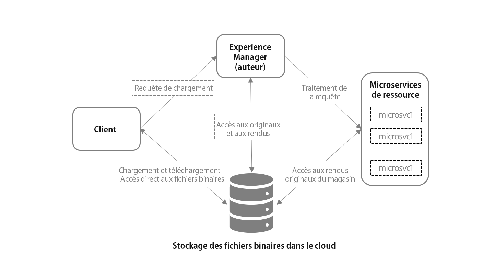

# Présentation de l’ingestion et du traitement des ressources à l’aide des microservices de ressources {#asset-microservices-overview}

<!--
First half of content at https://git.corp.adobe.com/aklimets/project-nui/blob/master/docs/Project-Nui-Asset-Compute-Service.md is useful for this article.
TBD: Post-GA we will provide detailed information at \help\assets\asset-microservices-configure-and-use.md. However, for GA, all information is added, in short, in this article.
-->

Adobe Experience Manager as a Cloud Service permet d’exploiter, en mode natif, les applications et fonctionnalités d’Experience Manager. L’ingestion et le traitement des ressources, basés sur la technologie des microservices de ressources, constituent deux points forts de cette nouvelle architecture. Les microservices de ressources offrent un traitement évolutif et résilient des ressources à l’aide des services cloud. Adobe gère les services cloud pour un traitement optimal des différents types de ressources et des options de traitement. Les principaux avantages des microservices de ressources, natifs dans le cloud, sont les suivants :

* Architecture évolutive qui permet un traitement transparent pour les opérations gourmandes en ressources.
* Indexation et extractions de texte efficaces qui n’affectent pas les performances de vos environnements Experience Manager.
* Dépendance moindre par rapport aux workflows pour gérer le traitement des ressources dans l’environnement Experience Manager. Outre une évolutivité accrue, cela permet de libérer des ressources et de réduire la charge sur Experience Manager.
* Amélioration de la résilience du traitement des ressources. Les problèmes potentiels liés à la gestion de fichiers atypiques, tels que des fichiers corrompus ou des fichiers extrêmement volumineux, n’ont plus d’incidence sur les performances du déploiement.
* Configuration simplifiée du traitement des ressources pour les administrateurs.
* La configuration du traitement des ressources est prise en charge par Adobe afin de fournir la meilleure configuration connue pour gérer les rendus, les métadonnées et l’extraction de texte pour divers types de fichiers.
* Le cas échéant, les services natifs de traitement de fichiers Adobe sont utilisés, ce qui se traduit par un résultat fidèle et une [gestion efficace des formats propriétaires Adobe](file-format-support.md).
* Possibilité de configurer le workflow de post-traitement de manière à ajouter des actions et des intégrations spécifiques à l’utilisateur.

L’utilisation des microservices de ressources permet de se passer d’outils et de méthodes de rendu tiers (comme ImageMagick et le transcodage FFmpeg) et de simplifier les configurations, tout en fournissant des fonctionnalités prêtes à l’emploi pour les types de fichiers courants.

## Architecture de haut niveau {#asset-microservices-architecture}

Un diagramme d’architecture de haut niveau illustre les principaux éléments de l’ingestion et du traitement des ressources, ainsi que le flux des ressources dans tout le système.

<!-- Proposed DRAFT diagram for asset microservices overview - see section "Asset processing - high-level diagram" in the PPTX deck

https://adobe-my.sharepoint.com/personal/gklebus_adobe_com/_layouts/15/guestaccess.aspx?guestaccesstoken=jexDC5ZnepXSt6dTPciH66TzckS1BPEfdaZuSgHugL8%3D&docid=2_1ec37f0bd4cc74354b4f481cd420e07fc&rev=1&e=CdgElS
-->

Les principales étapes de l’ingestion et du traitement des ressources à l’aide des microservices de ressources sont les suivantes :

* Les clients, tels que les navigateurs web ou Adobe Asset Link, envoient une requête de chargement à Experience Manager et commencent directement le transfert du binaire vers l’espace de stockage cloud.
* Une fois le chargement terminé, le client en informe Experience Manager.
* Experience Manager envoie une requête de traitement aux microservices de ressources. Le contenu de la requête dépend de la configuration des profils de traitement dans Experience Manager, lesquels indiquent les rendus à générer.
* Le serveur back-end des microservices de ressources reçoit la requête et, en fonction de cette dernière, la transmet à un ou plusieurs microservices. Chaque microservice accède directement au fichier binaire d’origine depuis l’espace de stockage cloud des binaires.
* Les résultats du traitement, tels que les rendus, sont stockés dans cet espace.
* Experience Manager est averti que le traitement est terminé, avec des pointeurs directs vers les binaires générés (rendus). Les rendus générés sont disponibles dans Experience Manager pour la ressource chargée.

Il s’agit du flux d’ingestion et de traitement de base des ressources. S’il est configuré, Experience Manager peut également démarrer un modèle de workflow personnalisé pour effectuer le post-traitement de la ressource. Il est possible, par exemple, d’exécuter des étapes personnalisées spécifiques à votre environnement, telles que récupérer des informations d’un système d’entreprise et les ajouter aux propriétés de la ressource.

L’ingestion et le flux de traitement sont des concepts clés de l’architecture des microservices de ressources d’Experience Manager.

* **Accès binaire direct** : les ressources sont transportées (et chargées) dans l’espace de stockage des binaires, une fois la configuration effectuée pour les environnements Experience Manager. Elles sont ensuite chargées dans AEM, puis dans les microservices de ressources. Enfin, les clients y ont accès directement pour mener à bien leur travail. Cela réduit la charge sur les réseaux et la duplication des binaires stockés.
* **Traitement externalisé** : le traitement des ressources s’effectue en dehors de l’environnement AEM, d’où une économie des ressources (processeur et mémoire), afin de fournir des fonctionnalités de gestion des ressources numériques essentielles et de permettre aux utilisateurs finaux d’effectuer des tâches interactives sur le système.

## Chargement de ressources avec accès direct aux binaires {#asset-upload-with-direct-binary-access}

Les clients Experience Manager, qui font partie de l’offre de produit, prennent tous en charge le chargement avec un accès direct aux binaires par défaut. Cela comprend notamment le chargement au moyen de l’interface web, d’Adobe Asset Link et de l’application de bureau AEM.

Vous pouvez utiliser des outils de téléchargement personnalisés qui fonctionnent directement avec les API HTTP AEM. Vous pouvez soit utiliser directement ces API, soit utiliser et étendre les projets Open Source suivants qui implémentent le protocole de chargement :

* [Bibliothèque de chargement Open Source](https://github.com/adobe/aem-upload)
* [Outil de ligne de commande Open Source](https://github.com/adobe/aio-cli-plugin-aem)

Pour plus d’informations, voir [Chargement de ressources](add-assets.md).

## Ajout d’une méthode de post-traitement des ressources personnalisée {#add-custom-asset-post-processing}

Les microservices de ressources configurables répondent généralement à tous les besoins de la plupart des clients en matière de traitement des ressources. Il est cependant des cas où un traitement supplémentaire peut s’avérer nécessaire. C’est notamment le cas lorsque les ressources doivent être traitées sur la base d’informations provenant d’autres systèmes par le biais d’intégrations. Des workflows de post-traitement personnalisés peuvent alors être utilisés.

Les workflows de post-traitement sont des modèles de workflow AEM standard, créés et gérés dans l’éditeur de processus d’AEM. Les clients peuvent configurer les workflows pour effectuer d’autres étapes de traitement sur un fichier. Ils peuvent, par exemple, utiliser des étapes de workflow prêtes à l’emploi et des workflows personnalisés.

Adobe Experience Manager peut être configuré de manière à déclencher automatiquement les workflows de post-traitement une fois le traitement des ressources terminé.

<!-- TBD asgupta, Engg: Create some asset-microservices-data-flow-diagram.
-->

>[!MORELIKETHIS]
>
>* [Prise en main des microservices de ressources](asset-microservices-configure-and-use.md)
>* [Formats de fichiers pris en charge](file-format-support.md)
>* [Adobe Asset Link](https://helpx.adobe.com/fr/enterprise/using/adobe-asset-link.html)
>* [Application de bureau AEM](https://docs.adobe.com/content/help/en/experience-manager-desktop-app/using/introduction.html)
>* [Documentation Apache Oak sur l’accès binaire direct](https://jackrabbit.apache.org/oak/docs/features/direct-binary-access.html)

