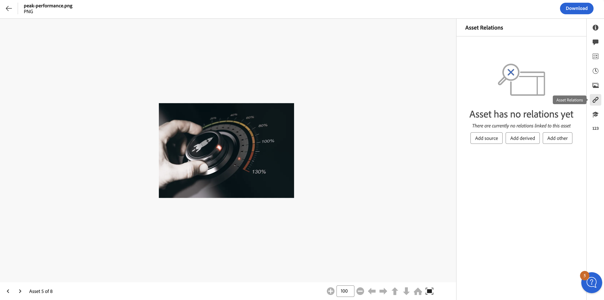
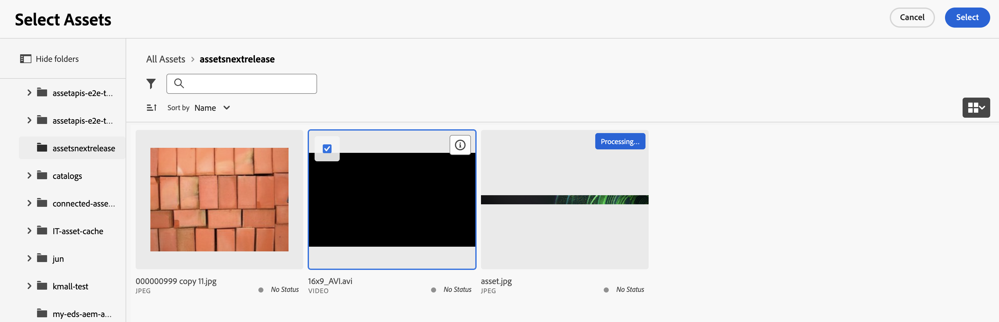
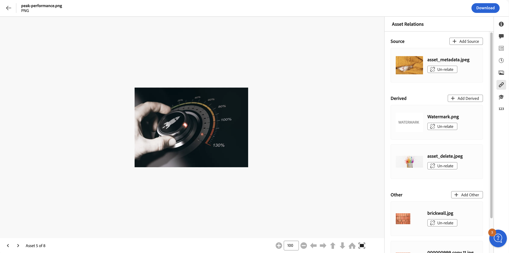

# Relations des ressources {#related-assets}

[!DNL Adobe Experience Manager Assets] vous permet de mettre en relation manuellement des ressources en fonction des besoins de votre organisation à l’aide de la fonctionnalité Ressources associées. Vous pouvez, par exemple, associer un fichier de licence à une ressource ou à une image/vidéo sur une rubrique similaire. Vous pouvez mettre en relation des ressources qui partagent certains attributs communs. Vous pouvez également utiliser la fonction pour créer des relations sources/dérivées entre les ressources. Par exemple, si vous disposez d’un fichier PDF généré à partir d’un fichier INDD, vous pouvez associer le fichier PDF à son fichier INDD source.

Grâce à cette fonctionnalité, vous avez la possibilité de partager un fichier PDF ou JPG basse résolution avec des fournisseurs ou des agences et de rendre le fichier INDD haute résolution disponible uniquement sur demande.

>[!NOTE]
>
>Seuls les utilisateurs disposant d’autorisations de modification des ressources peuvent mettre en relation et dissocier ces dernières.

## Étapes à suivre pour la mise en relation de ressources {#steps-to-relate-assets}

1. À partir de l’interface d’[!DNL Experience Manager], ouvrez la page **[!UICONTROL Propriétés]** d’une ressource que vous souhaitez mettre en relation.

   

1. Pour mettre en relation une autre ressource avec celle que vous avez sélectionnée, cliquez sur **[!UICONTROL Relations de ressources]** .
1. Utilisez l’une des méthodes suivantes :

   * Pour lier le fichier source de la ressource, sélectionnez **[!UICONTROL Ajouter une source]** dans la liste. Vous ne pouvez associer qu’une seule ressource en tant que source.
   * Pour lier un fichier dérivé, sélectionnez **[!UICONTROL Ajouter un élément dérivé]** dans la liste. Vous pouvez associer plusieurs ressources dans cette catégorie.
   * Pour créer une relation bidirectionnelle entre les ressources, sélectionnez **[!UICONTROL Ajouter un autre élément]** dans la liste. Vous pouvez associer plusieurs ressources dans cette catégorie.

1. Sur l’écran **[!UICONTROL Sélectionner des ressources]**, accédez à l’emplacement de la ressource à lier, puis sélectionnez-la. Vous pouvez sélectionner une ou plusieurs ressources en maintenant la touche Maj enfoncée tout en cliquant. Cela peut inclure n’importe quel [format de fichier pris en charge dans la vue Ressources](/help/assets/supported-file-formats-assets-view.md).

   

1. Cliquez sur **[!UICONTROL Sélectionner]**. Selon la relation que vous avez choisie à l’étape 3, la ressource liée est répertoriée sous une catégorie appropriée dans la section **[!UICONTROL Relations de ressources]**. Par exemple, si la ressource que vous avez associée est le fichier source de la ressource actuelle, elle est répertoriée sous **[!UICONTROL Source]**.

   

1. Cliquez sur **[!UICONTROL Dissocier]** , option disponible pour toutes les ressources liées dans chaque section ([!UICONTROL Source], [!UICONTROL Éléments dérivés] et [!UICONTROL Autres]), afin de dissocier une ressource.

## Traduire les ressources liées {#translating-related-assets}

La création de relations source/dérivés entre des ressources à l’aide de la fonctionnalité Ressources mises en relation est également utile dans les workflows de traduction. Lorsque vous exécutez un workflow de traduction sur une ressource dérivée, [!DNL Experience Manager Assets] récupère automatiquement toute ressource référencée par le fichier source et la soumet pour traduction. Ainsi, la ressource référencée par la ressource source est traduite avec les ressources source et dérivées. Si le fichier source est mis en relation avec une autre ressource, [!DNL Experience Manager Assets] récupère la ressource référencée et la soumet pour traduction.

Consultez [Traduire des ressources dans AEM](/help/assets/translate-assets.md).

## Étapes suivantes {#next-steps}

* Faites des commentaires sur le produit en utilisant l’option [!UICONTROL Commentaires] disponible dans l’interface utilisateur de la vue Assets

* Faites des commentaires sur la documentation en utilisant l’option [!UICONTROL Modifier cette page]  ou [!UICONTROL Enregistrer un problème]  disponible dans la barre latérale droite.

* Contactez l’[assistance clientèle](https://experienceleague.adobe.com/fr?support-solution=General#support).

>[!MORELIKETHIS]
>
>* [Afficher les versions d’une ressource](/help/assets/manage-organize-assets-view.md#view-versions)
>* [Traduire des ressources dans AEM](/help/assets/translate-assets.md)
>* [Formats de fichiers pris en charge dans la vue Ressources](/help/assets/supported-file-formats-assets-view.md).

**Voir également**

* [Traduire les ressources](/help/assets/translate-assets.md)
* [API HTTP Assets](/help/assets/mac-api-assets.md)
* [Formats de fichiers pris en charge par Assets](/help/assets/file-format-support.md)
* [Rechercher des ressources](/help/assets/search-assets.md)
* [Ressources connectées](/help/assets/use-assets-across-connected-assets-instances.md)
* [Rapports de ressources](/help/assets/asset-reports.md)
* [Schémas de métadonnées](/help/assets/metadata-schemas.md)
* [Télécharger des ressources](/help/assets/download-assets-from-aem.md)
* [Gestion des métadonnées](/help/assets/manage-metadata.md)
* [Gérer les modèles Dynamic Media](/help/assets/dynamic-media/manage-dynamic-media-templates.md)
* [Gérer les rapports](/help/assets/manage-reports-assets-view.md)
* [Facettes de recherche](/help/assets/search-facets.md)
* [Gérer les collections](/help/assets/manage-collections.md)
* [Import des métadonnées en bloc](/help/assets/metadata-import-export.md)
* [Publier des ressources sur AEM et Dynamic Media](/help/assets/publish-assets-to-aem-and-dm.md)
