# Rapports de ressources   {#asset-reports}

La création de rapports de ressources est un outil essentiel pour évaluer l’utilité de votre déploiement Adobe Experience Manager (AEM) Assets. Avec AEM Assets, vous pouvez générer divers rapports concernant vos ressources numériques. Les rapports fournissent des informations utiles concernant votre utilisation du système, la façon dont les utilisateurs interagissent avec les ressources et la façon dont les ressources sont téléchargées et partagées.

Utilisez les informations figurant dans les rapports de manière à obtenir des mesures de succès essentielles pour évaluer l’adoption d’AEM Assets au sein de votre entreprise et par les clients.

La structure de création de rapports dans AEM Assets exploite des tâches Sling de façon à traiter de manière asynchrone les demandes de rapports en respectant l’ordre. Elle est extensible pour les référentiels de grande taille. Le traitement asynchrone des rapports permet de générer des rapports de manière plus efficace et rapide.

L’interface de gestion de rapports est intuitive et inclut des options et des commandes précises pour accéder aux rapports archivés, ainsi qu’afficher les états d’exécution des rapports (réussite, échec et en file d’attente).

Lorsqu’un rapport est généré, vous êtes averti par <!-- through an email (optional) and --> une notification de boîte de réception. Vous pouvez afficher, télécharger ou supprimer un rapport de la page de liste des rapports, où tous les rapports précédemment générés sont affichés.

## Génération de rapports {#generate-reports}

AEM Assets génère les rapports standard suivants :

* Charger
* Téléchargement
* Expiration
* Modification
* Publier
* Publier sur Brand Portal
* Utilisation du disque
* Fichiers
* Partage de liens

Les administrateurs d’AEM peuvent facilement générer et personnaliser ces rapports pour votre implémentation. Un administrateur peut procéder comme suit pour générer un rapport :

1. Appuyez/cliquez sur le logo AEM, puis accédez à **[!UICONTROL Outils]** > **[!UICONTROL Ressources]** > **[!UICONTROL Rapports]**.

   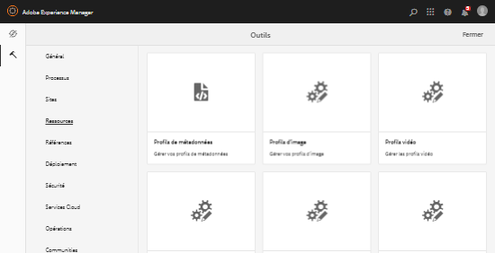

1. Sur la page Rapports de ressources, appuyez/cliquez sur **[!UICONTROL Créer]** dans la barre d’outils.
1. Sur la page **[!UICONTROL Créer un rapport]**, sélectionnez le rapport que vous souhaitez créer, puis appuyez/cliquez sur **[!UICONTROL Suivant]**.

   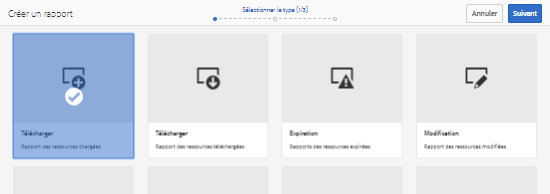

   >[!NOTE]
   >
   >Avant de générer un rapport **[!UICONTROL Ressource téléchargée]**, assurez-vous que le service de téléchargement de ressources est activé. Dans la console web (`https://[aem_server]:[port]/system/console/configMgr`), ouvrez la configuration **[!UICONTROL Enregistreur d’événements de la gestion des actifs numériques Day CQ]** et, le cas échéant, sélectionnez l’option **[!UICONTROL Ressource téléchargée (TÉLÉCHARGÉE)]** dans Types d’événement.

   >[!NOTE]
   >
   >Par défaut, les fragments de contenu et les partages de lien sont inclus dans le rapport Ressource téléchargée. Sélectionnez l’option appropriée pour créer un rapport de partages de lien ou pour exclure les fragments de contenu du rapport de téléchargement.

1. Configurez les détails du rapport, tels que le titre, la description, la miniature et le chemin du dossier dans le référentiel CRX où le rapport est stocké. Par défaut, le chemin du dossier est */content/dam*. Vous pouvez spécifier un autre chemin.

   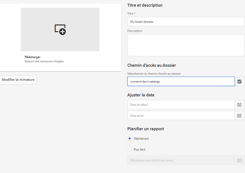

   Sélectionnez la période de votre rapport.

   Vous pouvez choisir de générer le rapport maintenant ou à une date et une heure ultérieures.

   >[!NOTE]
   >
   >Si vous choisissez de planifier le rapport à une date ultérieure, veillez à spécifier la date et l’heure actuelles dans le champ de date et heure. Si vous ne spécifiez aucune valeur, le moteur de création de rapports traite le rapport comme devant être généré immédiatement.

   Les champs de configuration peuvent varier en fonction du type de rapport que vous créez.

   Par exemple, le rapport **[!UICONTROL Utilisation du disque]** fournit des options pour inclure les rendus de ressources lors du calcul de l’espace disque utilisé par les ressources. Vous pouvez choisir d’inclure ou d’exclure les ressources figurant dans les sous-dossiers pour le calcul de l’utilisation du disque.

   >[!NOTE]
   >
   >Le rapport **[!UICONTROL Utilisation du disque]** n’inclut pas les champs de période, car il indique uniquement l’utilisation actuelle de l’espace disque.

   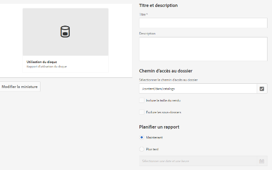

   Lorsque vous créez le rapport **[!UICONTROL Fichiers]**, vous pouvez inclure ou exclure les sous-dossiers. Cependant, vous ne pouvez pas inclure les rendus de ressources dans ce rapport.

   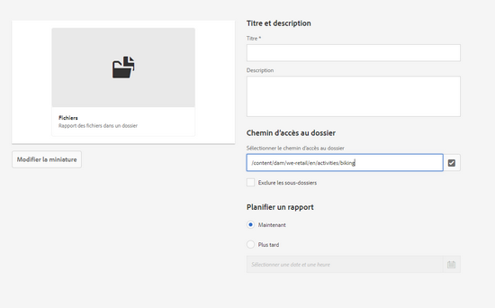

   Le rapport **[!UICONTROL Partage de liens]** affiche des URL vers des ressources partagées avec des utilisateurs externes à partir d’AEM Assets. <!-- It includes email ids of the user who shared the assets, emails ids of users with which the assets are shared, share date, and expiration date for the link. --> Les colonnes ne sont pas personnalisables.

   Le rapport **[!UICONTROL Partage de liens]** n’inclut pas d’options pour les sous-dossiers et les rendus, car il publie seulement les URL partagées qui apparaissent sous */var/dam/share*.

   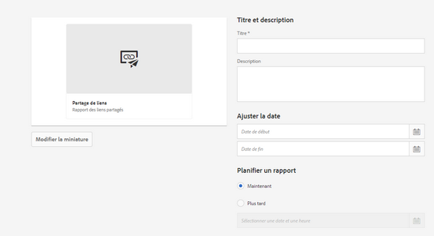

1. Appuyez/cliquez sur **[!UICONTROL Suivant]** dans la barre d’outils.

1. Sur la page **[!UICONTROL Configurer les colonnes]**, certaines colonnes sont sélectionnées pour apparaître dans le rapport par défaut. Vous pouvez sélectionner des colonnes supplémentaires. Désélectionnez une colonne sélectionnée pour l’exclure du rapport.

   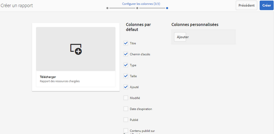

   Pour afficher un chemin de propriété ou un nom de colonne personnalisé, configurez les propriétés du binaire de ressource sous le nœud jcr:content dans CRX. Vous pouvez également l’ajouter dans le sélecteur de chemin de propriété.

   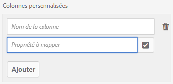

1. Appuyez/cliquez sur **[!UICONTROL Créer]** dans la barre d’outils. Un message indique que la génération du rapport a été lancée.
1. Sur la page Rapports de ressources, l’état de la génération des rapports repose sur l’état actuel de la tâche de rapport, par exemple, Réussite, Échec, En file d’attente ou Planifié. Le même état apparaît dans la boîte de réception des notifications.

   Pour afficher la page du rapport, appuyez/cliquez sur le lien du rapport. Vous pouvez également sélectionner le rapport et appuyer/cliquer sur l’icône Afficher de la barre d’outils.

   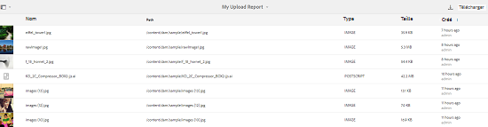

   Appuyez/cliquez sur l’icône Télécharger de la barre d’outils pour télécharger le rapport au format CSV.

## Ajout de colonnes personnalisées   {#add-custom-columns}

Vous pouvez ajouter des colonnes personnalisées aux rapports suivants pour afficher davantage de données en fonction de vos besoins :

* Charger
* Téléchargement
* Expiration
* Modification
* Publier
* Publier sur Brand Portal
* Fichiers

1. Appuyez/cliquez sur le logo AEM, puis accédez à **[!UICONTROL Outils]** > **[!UICONTROL Ressources]** > **[!UICONTROL Rapports]**.
1. Sur la page Rapports de ressources, appuyez/cliquez sur **[!UICONTROL Créer]** dans la barre d’outils.

1. Sur la page **[!UICONTROL Créer un rapport]**, sélectionnez le rapport que vous souhaitez créer, puis appuyez/cliquez sur **[!UICONTROL Suivant]**.
1. Configurez les détails du rapport, tels que le titre, la description, la miniature, le chemin du dossier, la période, et ainsi de suite.

1. Pour afficher une colonne personnalisée, spécifiez son nom sous **[!UICONTROL Colonnes personnalisées]**.

   

1. Ajoutez le chemin de la propriété sous le nœud `jcr:content` dans CRXDE à l’aide du sélecteur de chemin de propriété.

   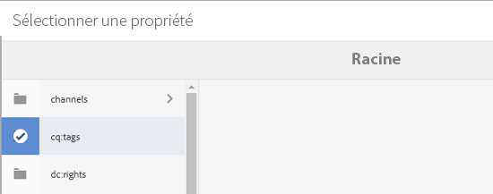

   Vous pouvez également saisir le chemin d’accès dans le champ de chemin d’accès à la propriété.

   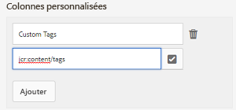

   Pour ajouter d’autres colonnes personnalisées, appuyez/cliquez sur **[!UICONTROL Ajouter]** et répétez les étapes 5 et 6.

1. Appuyez/cliquez sur **[!UICONTROL Créer]** dans la barre d’outils. Un message indique que la génération du rapport a été lancée.

## Configuration du service de purge {#configure-purging-service}

Pour supprimer les rapports dont vous n’avez plus besoin, configurez le service Purge des rapports de la gestion des actifs numériques à partir de la console web afin de purger les rapports existants en fonction de leur quantité et de leur âge.

1. Accédez à la console web (Configuration Manager) à partir de `https://[aem_server]:[port]/system/console/configMgr`.
1. Ouvrez la configuration **[!UICONTROL Service de purge des rapports de la gestion des actifs numériques]**.
1. Spécifiez la fréquence (intervalle) pour le service de purge dans le champ `scheduler.expression.name`. Vous pouvez également configurer l’âge et le seuil de quantité des rapports.
1. Enregistrez les modifications.
