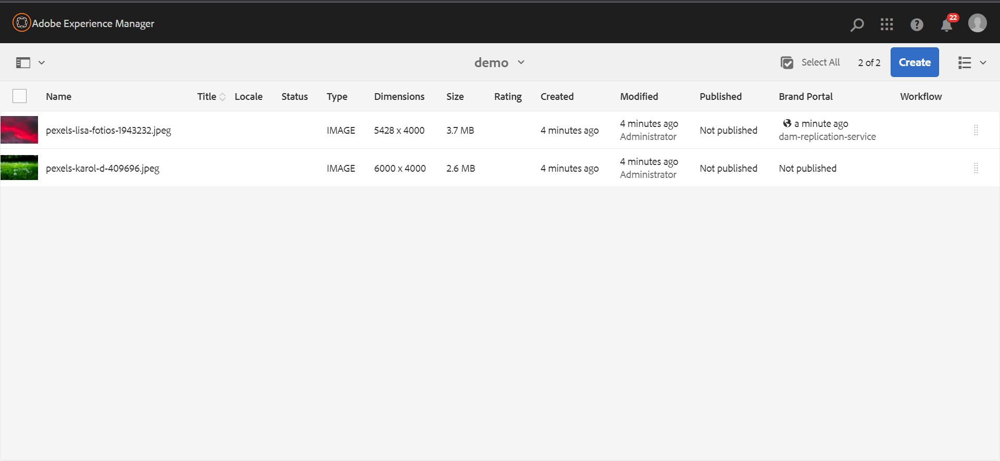

# Rapports de ressources {#asset-reports}

<table>
    <tr>
        <td>
            <i>Nouveau</i> <a href="/help/assets/dynamic-media/dm-prime-ultimate.md"><b>Dynamic Media Prime et Ultimate</b></a>
        </td>
        <td>
            <i>Nouveau</i> <a href="/help/assets/assets-ultimate-overview.md"><b>AEM Assets Ultimate</b></a>
        </td>
        <td>
            <i>Nouvelle</i> <a href="/help/assets/integrate-aem-assets-edge-delivery-services.md"><b>Intégration d’AEM Assets à Edge Delivery Services</b></a>
        </td>
        <td>
            <i>Nouveau</i> <a href="/help/assets/aem-assets-view-ui-extensibility.md"><b>Extensibilité de l’interface utilisateur</b></a>
        </td>
          <td>
            <i>Nouveau</i> <a href="/help/assets/dynamic-media/enable-dynamic-media-prime-and-ultimate.md"><b>Activation de Dynamic Media Prime et Ultimate</b></a>
        </td>
    </tr>
    <tr>
        <td>
            <a href="/help/assets/search-best-practices.md"><b>Bonnes pratiques de recherche</b></a>
        </td>
        <td>
            <a href="/help/assets/metadata-best-practices.md"><b>Bonnes pratiques relatives aux métadonnées</b></a>
        </td>
        <td>
            <a href="/help/assets/product-overview.md"><b>Hub de contenus</b></a>
        </td>
        <td>
            <a href="/help/assets/dynamic-media-open-apis-overview.md"><b>Fonctionnalités Dynamic Media avec OpenAPI</b></a>
        </td>
        <td>
            <a href="https://developer.adobe.com/experience-cloud/experience-manager-apis/"><b>Documentation de développement pour AEM Assets</b></a>
        </td>
    </tr>
</table>

| Version | Lien de l’article |
| -------- | ---------------------------- |
| AEM 6.5 | [Cliquez ici](https://experienceleague.adobe.com/docs/experience-manager-65/assets/administer/asset-reports.html?lang=fr) |
| AEM as a Cloud Service | Cet article |

Les rapports de ressources vous permettent d’évaluer l’utilité de votre déploiement [!DNL Adobe Experience Manager Assets]. Avec [!DNL Assets], vous pouvez générer divers rapports pour vos ressources numériques. Les rapports contiennent des informations utiles sur l’utilisation de votre système, sur la façon dont les utilisateurs et utilisatrices interagissent avec les ressources et sur la façon dont les ressources sont <!-- downloaded and --> partagées.

Utilisez les informations figurant dans les rapports de manière à obtenir des mesures de succès essentielles pour évaluer l’adoption d’[!DNL Assets] au sein de votre entreprise et par les clients.

La structure de création de rapports [!DNL Assets] utilise des tâches de [!DNL Sling] de manière asynchrone pour traiter les demandes de rapport de manière ordonnée. Il est extensible pour les référentiels de grande taille. Le traitement asynchrone des rapports augmente l’efficacité et la vitesse de génération des rapports.

L’interface de gestion des rapports est intuitive et contient des options et des contrôles précis pour accéder aux rapports archivés et afficher les statuts d’exécution des rapports (succès, échec et mise en file d’attente).

Lorsqu’un rapport est généré, vous êtes averti par <!-- through an email (optional) and --> une notification de boîte de réception. Vous pouvez afficher, télécharger ou supprimer un rapport de la page de liste des rapports, où tous les rapports précédemment générés sont affichés.

## Génération de rapports {#generate-reports}

[!DNL Experience Manager Assets] génère les rapports standard suivants :

* Chargement
* Téléchargement
* Expiration
* Modification
* Publication
* Publier sur [!DNL Brand Portal]
* Utilisation du disque
* Fichiers
* Partage de liens

<!-- Removed download report.
* Upload
* Download
* Expiration
* Modification
* Publish
* [!DNL Brand Portal] publish
* Disk Usage
* Files
* Link Share
-->

Les administrateurs d’[!DNL Adobe Experience Manager] peuvent facilement générer et personnaliser ces rapports pour votre implémentation. Un administrateur peut procéder comme suit pour générer un rapport :

1. Dans l’interface [!DNL Experience Manager], cliquez sur **[!UICONTROL Outils]** > **[!UICONTROL Ressources]** > **[!UICONTROL Rapports]**.

   

1. Sur la page [!UICONTROL Rapports de ressources], cliquez sur **[!UICONTROL Créer]** dans la barre d’outils.
1. Sur la page **[!UICONTROL Créer un rapport]**, sélectionnez le rapport que vous souhaitez créer, puis cliquez sur **[!UICONTROL Suivant]**.

   >[!NOTE]
   >
   >Accédez à un **profil de produit Administrateur AEM** pour créer un rapport **Télécharger**. Voir [Attribuer des profils de produit AEM](https://experienceleague.adobe.com/en/docs/experience-manager-cloud-service/content/onboarding/journey/assign-profiles-aem) pour vous donner le droit d’accéder à un profil de produit Administrateur AEM.

   

1. Configurez les détails du rapport, tels que le titre, la description, la miniature et le chemin du dossier. Par défaut, le chemin du dossier est `/content/dam`. Vous pouvez spécifier un autre chemin pour exécuter le rapport sur un dossier spécifique.

   

   Sélectionnez la période de votre rapport. Vous pouvez choisir de générer le rapport maintenant ou à une date et une heure ultérieures.

   >[!NOTE]
   >
   >Si vous choisissez de planifier le rapport à une date ultérieure, veillez à spécifier la date et l’heure dans les champs Date et Heure. Si vous ne spécifiez aucune valeur, le moteur de création de rapports traite le rapport comme devant être généré immédiatement.

   Les champs de configuration peuvent varier en fonction du type de rapport que vous créez. Par exemple, le rapport **[!UICONTROL Utilisation du disque]** fournit des options pour inclure les rendus de ressources lors du calcul de l’espace disque utilisé par les ressources. Vous pouvez choisir d’inclure ou d’exclure les ressources figurant dans les sous-dossiers pour le calcul de l’utilisation du disque.

   >[!NOTE]
   >
   >Le rapport **[!UICONTROL Utilisation du disque]** n’inclut pas les champs de période, car il indique uniquement l’utilisation actuelle de l’espace disque.

   

   Lorsque vous créez le rapport **[!UICONTROL Fichiers]**, vous pouvez inclure/exclure les sous-dossiers. Cependant, vous ne pouvez pas inclure les rendus de ressources dans ce rapport.

   

   Le rapport **[!UICONTROL Partage de liens]** affiche les URL des ressources qui sont partagées avec des utilisateurs externes à partir d’[!DNL Assets]. <!-- It includes email ids of the user who shared the assets, emails ids of users with which the assets are shared, share date, and expiration date for the link. --> Les colonnes ne sont pas personnalisables.

   Le rapport **[!UICONTROL Partage de liens]** n’inclut pas d’options pour les sous-dossiers et les rendus, car il ne publie que les URL partagées qui apparaissent sous `/var/dam/share`.

   

1. Cliquez sur **[!UICONTROL Suivant]** dans la barre d’outils.

1. Sur la page **[!UICONTROL Configurer les colonnes]**, certaines colonnes sont sélectionnées pour apparaître dans le rapport par défaut. Vous pouvez sélectionner plus de colonnes. Annulez la sélection d’une colonne pour l’exclure dans le rapport.

   

   Pour afficher un chemin de propriété ou un nom de colonne personnalisé, configurez les propriétés du binaire de ressource sous le nœud `jcr:content` dans CRX. Vous pouvez également l’ajouter par le biais d’un sélecteur de chemin de propriété.

   

1. Cliquez sur **[!UICONTROL Créer]** dans la barre d’outils. Un message indique que la génération du rapport a été lancée.
1. Sur la page [!UICONTROL Rapports de ressources], le statut de la génération des rapports repose sur l’état actuel du traitement de rapport ; par exemple [!UICONTROL Réussite], [!UICONTROL Échec], [!UICONTROL En file d’attente] ou [!UICONTROL Planifié]. Le même statut apparaît dans la boîte de réception de notifications. Pour afficher la page du rapport, cliquez sur le lien du rapport. Vous pouvez également sélectionner le rapport et cliquer sur **[!UICONTROL Afficher]** dans la barre d’outils.

   <!---->
   

   Cliquez sur **[!UICONTROL Télécharger]** dans la barre d’outils pour télécharger le rapport au format CSV.

   >[!NOTE]
   >
   >Vous pouvez générer des rapports en fonction des événements générés au cours des 360 derniers jours. Experience Manager conserve les données d’ID utilisateur pendant 30 jours.

## Ajout de colonnes personnalisées aux rapports {#add-custom-columns}

Vous pouvez également ajouter des colonnes personnalisées à ces rapports pour adapter l’affichage des données à vos besoins :

<!-- Remove download report.
* Upload
* Download
* Expiration
* Modification
* Publish
* [!DNL Brand Portal] publish
* Files
-->

* Chargement
* Expiration
* Modification
* Publication
* Publier sur [!DNL Brand Portal]
* Fichiers

Pour ajouter des colonnes personnalisées à ces rapports, procédez comme suit :

1. Dans le [!DNL Manager interface], cliquez sur **[!UICONTROL Outils]** > **[!UICONTROL Ressources]** > **[!UICONTROL Rapports]**.
1. Sur la page [!UICONTROL Rapports de ressources], cliquez sur **[!UICONTROL Créer]** dans la barre d’outils.

1. Dans la page **[!UICONTROL Créer un rapport]**, choisissez un rapport à créer. Cliquez sur **[!UICONTROL Suivant]**.

1. Configurez les détails du rapport, tels que le titre, la description, la miniature, le chemin du dossier et la période, le cas échéant. Cliquez sur **[!UICONTROL Suivant]**.

1. Sélectionnez les informations applicables dans la liste **[!UICONTROL Colonnes par défaut]**. Pour afficher une colonne personnalisée, spécifiez son nom sous **[!UICONTROL Colonnes personnalisées]**.

   

1. Ajoutez le chemin de la propriété sous le nœud `jcr:content` dans CRXDE à l’aide du sélecteur de chemin de propriété. Vous pouvez également saisir le chemin d’accès dans le champ de chemin d’accès à la propriété.

   

   Pour ajouter d’autres colonnes personnalisées, cliquez sur **[!UICONTROL Ajouter]** et répétez les étapes ci-dessus.

1. Cliquez sur **[!UICONTROL Créer]** dans la barre d’outils. Un message indique que la génération du rapport est lancée.

<!-- TBD: How to configure purge now? Is it using OSGi configurations?

## Configure purging service {#configure-purging-service}

To remove reports that you no longer require, configure the DAM Report Purge service from the web console to purge existing reports based on their quantity and age.

1. Access the web console (configuration manager) from `https://[aem_server]:[port]/system/console/configMgr`.
1. Open the **[!UICONTROL DAM Report Purge Service]** configuration.
1. Specify the frequency (time interval) for the purging service in the `scheduler.expression.name` field. You can also configure the age and the quantity threshold for reports.
1. Save the changes.
-->

## Informations de dépannage {#tips-troubleshoot}

* Si le [!UICONTROL rapport d’utilisation des disques] n’est pas généré et que vous utilisez [!DNL Dynamic Media], assurez-vous que toutes les ressources sont traitées correctement. Pour résoudre ce problème, retraitez les ressources puis générez de nouveau le rapport.

<!-- These notes were present in generate report section above. Removing commented text from in between the instructions to preserve the numbering of the ordered list.

TBD: How do enable this in CS now? Is it done using some OSGi config now?
   >[!NOTE]
   >
   >Before you can generate an **[!UICONTROL Asset Downloaded]** report, ensure that the Asset Download service is enabled. From the web console (`https://[aem_server]:[port]/system/console/configMgr`), open the **[!UICONTROL Day CQ DAM Event Recorder]** configuration, and select the **[!UICONTROL Asset Downloaded (DOWNLOADED)]** option in Event Types if not already selected.
-->

<!-- Removed download report.
   >[!NOTE]
   >
   >By default, the Content Fragments and link shares are included in the asset [!UICONTROL Download] report. Select the appropriate option to create a report of link shares or to exclude Content Fragments from the download report.

   >[!NOTE]
   >
   >The [!UICONTROL Download] report displays details of only those assets which are downloaded after selecting individually or are downloaded using Quick Action. However, it does not include the details of the assets that are inside a downloaded folder.
-->

**Voir également**

* [Traduire les ressources](translate-assets.md)
* [API HTTP Assets](mac-api-assets.md)
* [Formats de fichiers pris en charge par Assets](file-format-support.md)
* [Rechercher des ressources](search-assets.md)
* [Ressources connectées](use-assets-across-connected-assets-instances.md)
* [Schémas de métadonnées](metadata-schemas.md)
* [Télécharger des ressources](download-assets-from-aem.md)
* [Gestion des métadonnées](manage-metadata.md)
* [Facettes de recherche](search-facets.md)
* [Gérer les collections](manage-collections.md)
* [Import des métadonnées en bloc](metadata-import-export.md)
* [Publier des ressources sur AEM et Dynamic Media](/help/assets/publish-assets-to-aem-and-dm.md)
