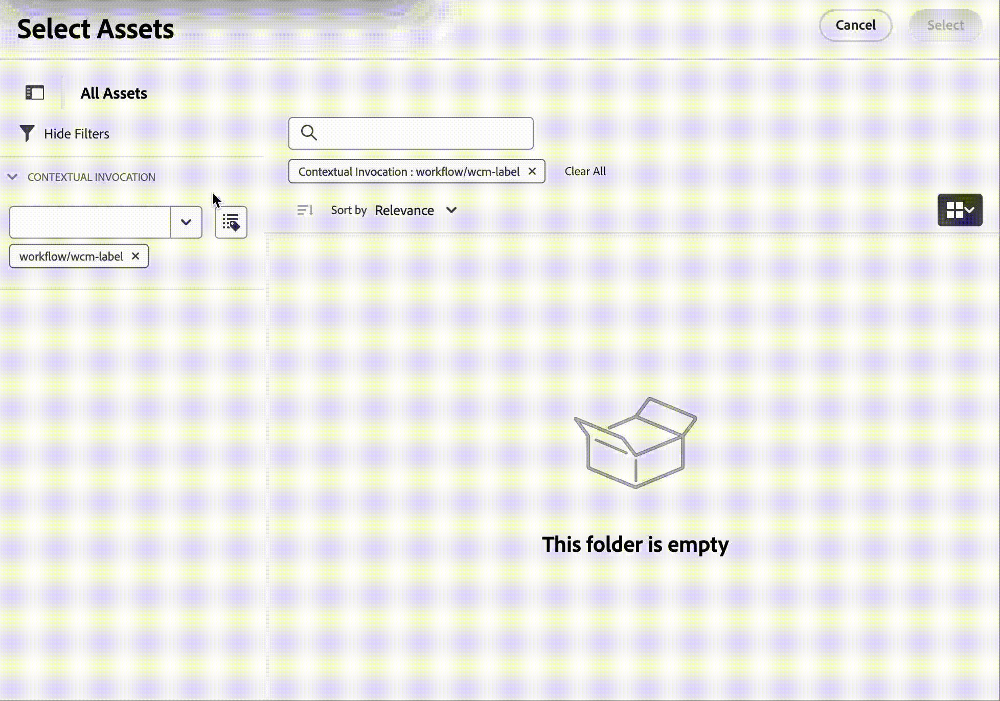

# Personnalisations du sélecteur de ressources {#asset-selector-customization}

Le sélecteur de ressources vous permet de personnaliser divers composants en fonction des préférences, des exigences ou des besoins fonctionnels. Vous pouvez personnaliser les composants suivants [Sélecteur de ressources Micro-Frontend](#overview-asset-selector.md) :

* [Personnalisation du panneau de filtrage](#customize-filter-panel)
* [Personnalisation des informations dans la vue modale](#customize-info-in-modal-view)
* [Activation ou désactivation du mode glisser-déposer](#enable-disable-drag-and-drop)
* [Sélection d’Assets](#selection-of-assets)
* [Personnalisation des ressources expirées](#customize-expired-assets)
* [Filtre d’appel contextuel](#contextual-invocation-filter)

Vous devez définir les conditions préalables dans le fichier **index.html** ou un fichier similaire dans l’implémentation de votre application pour définir les détails d’authentification pour accéder au référentiel [!DNL Experience Manager Assets]. Une fois que vous avez terminé, vous pouvez ajouter des fragments de code en fonction de vos besoins.

## Personnalisation du panneau de filtrage {#customize-filter-panel}

Vous pouvez ajouter le fragment de code suivant dans l’objet `assetSelectorProps` pour personnaliser le panneau de filtrage :

```
filterSchema: [
    {
    header: 'File Type',
    groupKey: 'TopGroup',
    fields: [
    {
    element: 'checkbox',
    name: 'type',
    options: [
    {
    label: 'Images',
    value: '<comma separated mimetypes, without space, that denote all images, for e.g., image/>',
    },
    {
    label: 'Videos',
    value: '<comma separated mimetypes, without space, that denote all videos for e.g., video/,model/vnd.mts,application/mxf>'
    }
    ]
    }
    ]
    },
    {
    fields: [
    {
    element: 'checkbox',
    name: 'type',
    options: [
    { label: 'JPG', value: 'image/jpeg' },
    { label: 'PNG', value: 'image/png' },
    { label: 'TIFF', value: 'image/tiff' },
    { label: 'GIF', value: 'image/gif' },
    { label: 'MP4', value: 'video/mp4' }
    ],
    columns: 3,
    },
    ],
    header: 'Mime Types',
    groupKey: 'MimeTypeGroup',
    },
    {
    fields: [
    {
    element: 'checkbox',
    name: 'property=metadata.application.xcm:keywords.value',
    options: [
    { label: 'Fruits', value: 'fruits' },
    { label: 'Vegetables', value: 'vegetables'}
    ],
    columns: 3,
    },
    ],
    header: 'Food Category',
    groupKey: 'FoodCategoryGroup',
    }
],
```

## Personnalisation des informations dans la vue modale {#customize-info-in-modal-view}

Vous pouvez personnaliser la vue des détails d’une ressource lorsque vous cliquez sur l’icône  . Exécutez le code ci-dessous :

```
// Create an object infoPopoverMap and set the property `infoPopoverMap` with it in assetSelectorProps
const infoPopoverMap = (map) => {
// for example, to skip `path` from the info popover view
let defaultPopoverData = PureJSSelectors.getDefaultInfoPopoverData(map);
return defaultPopoverData.filter((i) => i.label !== 'Path')
};
assetSelectorProps.infoPopoverMap = infoPopoverMap;
```

## Activation ou désactivation du mode glisser-déposer {#enable-disable-drag-and-drop}

Ajoutez les propriétés suivantes à `assetSelectorProp` pour activer le mode glisser-déposer. Pour désactiver la fonction glisser-déposer, remplacez le paramètre `true` par `false`.

```
rail: true,
acvConfig: {
dragOptions: {
allowList: {
'*': true,
},
},
selectionType: 'multiple'
}

// the drop handler to be implemented
function drop(e) {
e.preventDefault();
// following helps you get the selected assets – an array of objects.
const data = JSON.parse(e.dataTransfer.getData('collectionviewdata'));
}
```

## Sélection d’Assets {#selection-of-assets}

Le type de ressource sélectionné est un tableau d’objets qui contient des informations sur les ressources lors de l’utilisation des fonctions `handleSelection`, `handleAssetSelection`, et `onDrop`.

Exécutez les étapes suivantes pour configurer la sélection d’une ou de plusieurs ressources :

```
acvConfig: {
selectionType: 'multiple' // 'single' for single selection
}
// the `handleSelection` callback, always gets you the array of selected assets
```

**Syntaxe du schéma**

```
interface SelectedAsset {
    'repo:id': string;
    'repo:name': string;
    'repo:path': string;
    'repo:size': number;
    'repo:createdBy': string;
    'repo:createDate': string;
    'repo:modifiedBy': string; 
    'repo:modifyDate': string; 
    'dc:format': string; 
    'tiff:imageWidth': number;
    'tiff:imageLength': number;
    'repo:state': string;
    computedMetadata: Record<string, any>;
    _links: {
        'https://ns.adobe.com/adobecloud/rel/rendition': Array<{
            href: string;
            type: string;
            'repo:size': number;
            width: number;
            height: number;
            [others: string]: any;
        }>;
    };
}
```

Le tableau suivant décrit des propriétés importantes de l’objet Ressource sélectionnée.

| Propriété | Type | Description |
|---|---|---|
| *repo:repositoryId* | chaîne | Identifiant unique du référentiel dans lequel la ressource est stockée. |
| *repo:id* | chaîne | Identifiant unique de la ressource. |
| *repo:assetClass* | chaîne | Classification de la ressource (par exemple, image ou vidéo, document). |
| *repo:name* | chaîne | Nom de la ressource, y compris l’extension de fichier. |
| *repo:size* | nombre | Taille de la ressource en octets. |
| *repo:path* | chaîne | Emplacement de la ressource dans le référentiel. |
| *repo:ancestors* | `Array<string>` | Tableau d’éléments ancêtres de la ressource dans le référentiel. |
| *repo:state* | chaîne | État actuel de la ressource dans le référentiel (par exemple, active, supprimée, etc.). |
| *repo:createdBy* | chaîne | L’utilisateur, l’utilisatrice ou le système qui a créé la ressource. |
| *repo:createDate* | chaîne | Date et heure de création de la ressource. |
| *repo:modifiedBy* | chaîne | L’utilisateur, l’utilisatrice ou le système qui a modifié la ressource pour la dernière fois. |
| *repo:modifyDate* | chaîne | Date et heure de la dernière modification de la ressource. |
| *dc:format* | chaîne | Format de la ressource, tel que le type de fichier (par exemple, JPEG, PNG, etc.). |
| *tiff:imageWidth* | nombre | Largeur d’une ressource. |
| *tiff:imageLength* | nombre | Hauteur d’une ressource. |
| *computedMetadata* | `Record<string, any>` | Objet qui représente un compartiment pour tous les types de métadonnées de la ressource (référentiel, application ou métadonnées incorporées). |
| *_links* | `Record<string, any>` | Liens hypermédias pour la ressource associée. Inclut des liens pour des ressources telles que des métadonnées et des rendus. |
| *`_links.<https://ns.adobe.com/adobecloud/rel/rendition>`* | `Array<Object>` | Tableau d’objets contenant des informations sur les rendus de la ressource. |
| *`_links.<https://ns.adobe.com/adobecloud/rel/rendition[].href>`* | chaîne | URI du rendu. |
| *`_links.<https://ns.adobe.com/adobecloud/rel/rendition[].type>`* | chaîne | Type MIME du rendu. |
| *`_links.<https://ns.adobe.com/adobecloud/rel/rendition[].repo:size>`* | nombre | Taille du rendu en octets. |
| *`_links.<https://ns.adobe.com/adobecloud/rel/rendition[].width>`* | nombre | Largeur du rendu. |
| *`_links.<https://ns.adobe.com/adobecloud/rel/rendition[].height>`* | nombre | Hauteur du rendu. |

### Gestion de la sélection de ressources à l’aide du schéma d’objet {#handling-selection}

La propriété `handleSelection` est utilisée pour gérer des sélections uniques ou multiples de ressources dans le sélecteur de ressources. L’exemple ci-dessous indique la syntaxe de l’utilisation de `handleSelection`.


### Désactivation de la sélection d’Assets {#disable-selection}

L’option Désactiver la sélection permet de masquer ou de désactiver la sélection des ressources ou des dossiers. Elle masque la case à cocher de la carte ou de la ressource qui l’empêche d’être sélectionnée. Pour utiliser cette fonction, vous pouvez déclarer la position d’une ressource ou d’un dossier que vous souhaitez désactiver dans un tableau. Par exemple, si vous souhaitez désactiver la sélection d’un dossier apparaissant à la première position, vous pouvez ajouter le code suivant :
`disableSelection: [0]:folder`

Vous pouvez fournir au tableau une liste des types MIME (images, dossiers, fichiers ou autres types MIME, par exemple image/jpeg) que vous souhaitez désactiver. Les types MIME que vous déclarez sont mappés aux attributs `data-card-type` et `data-card-mimetype` d’une ressource.

En outre, il est possible de faire glisser Assets avec une sélection désactivée. Pour désactiver la fonction glisser-déposer d’un type de ressource spécifique, vous pouvez utiliser la propriété `dragOptions.allowList` .

La syntaxe de la sélection de désactivation est la suivante :

```
(args)=> {
    return(
        <ASDialogWrapper
            {...args}
            disableSelection={args.disableSelection}
            handleAssetSelection={action('handleAssetSelection')}
            handleSelection={action('handleSelection')}
            selectionType={args.selectionType}
        />
    );
}
```

>[!NOTE]
>
> Dans le cas d’une ressource, la case à cocher de sélection est masquée, alors que dans le cas d’un dossier, il n’est pas possible de sélectionner le dossier, mais la navigation du dossier en question continue à s’afficher.

<!--For a complete list of properties and detailed example, visit [Asset Selector Code Example](https://github.com/adobe/aem-assets-selectors-mfe-examples).-->

## Personnalisation des ressources expirées {#customize-expired-assets}

Le sélecteur de ressources vous permet de contrôler l’utilisation d’une ressource expirée. Vous pouvez personnaliser la ressource expirée avec un badge **Expiration prochaine** qui peut vous aider à connaître à l’avance les ressources qui vont expirer dans les 30 jours à compter de la date actuelle. De plus, il peut être personnalisé selon les besoins. Vous pouvez également autoriser la sélection d’une ressource expirée sur la zone de travail ou vice versa. La personnalisation d’une ressource expirée peut être effectuée à l’aide de fragments de code de différentes manières :

<!--{
    getExpiryStatus: function, // to control Expired/Expiring soon badges of the asset
    allowSelectionAndDrag: boolean, // set true to allow the selection of expired assets on canvas, set false, otherwise.
}-->

```
expiryOptions: {
    getExpiryStatus: getExpiryStatus;
}
```

### Sélection d’une ressource expirée {#selection-of-expired-asset}

Vous pouvez personnaliser l’utilisation d’une ressource expirée pour la rendre sélectionnable ou non sélectionnable. Vous pouvez personnaliser si vous souhaitez autoriser ou non le glisser-déposer d’une ressource expirée sur le canevas du sélecteur de ressources. Pour ce faire, utilisez les paramètres suivants pour rendre une ressource non sélectionnable sur la zone de travail :

```
expiryOptions:{
    allowSelectionAndDrop: false;
}
```
<!--
Additionally, To do this, navigate to **[!UICONTROL Disable default expiry behavior]** under the [!UICONTROL Controls] tab and set the boolean value to `true` or `false` as per the requirement. If `true` is selected, you can see the select box over the expired asset, otherwise it remains unselected. You can hover to the info icon of an asset to know the details of an expired asset. 

-->

### Définition de la durée d’une ressource expirée {#set-duration-of-expired-asset}

Le fragment de code suivant vous permet de définir le badge **Expiration prochaine** pour les ressources qui expirent dans les cinq jours suivants : <!--The `expirationDate` property is used to set the expiration duration of an asset. Refer to the code snippet below:-->

```
/**
  const getExpiryStatus = async (asset) => {
  if (!asset.expirationDate) {
    return null;
  }
  const currentDate = new Date();
  const millisecondsInDay = 1000 * 60 * 60 * 24;
  const fiveDaysFromNow = new Date(value: currentDate.getTime() + 5 * millisecondsInDay);
  const expirationDate = new Date(asset.expirationDate);
  if (expirationDate.getTime() < currentDate.getTime()) {
    return 'EXPIRED';
  } else if (expirationDate.getTime() < fiveDaysFromNow.getTime()) {
    return 'EXPIRING_SOON';
  } else {
    return 'NOT_EXPIRED';
  }
};
```

<!--In the above code snippet, the `getExpiryStatus` function is used to show the **Expiring soon** badge that have expiration date stored in `customExpirationDate`. Additionally, it sets the expiration date of an asset to five days from the current date. The `millisecondsInDay` helps you set expiry of an asset by specifying the time range in milliseconds. You can replace milliseconds with hours directly or customize function as per the requirement. Whereas, the `getTime()` function returns the number of milliseconds for the mentioned date. See [properties](#asset-selector-properties) to know about `expirationDate` property.-->

Reportez-vous à l’exemple suivant pour comprendre le fonctionnement de la propriété pour récupérer la date et l’heure actuelles :

```
const currentData = new Date();
currentData.getTime(),
```

renvoie `1718779013959` selon le format de date 2024-06-19T06:36:53.959Z.

### Personnaliser le message du toast d’une ressource expirée {#customize-toast-message}

La propriété `showToast` est utilisée pour personnaliser le message toast que vous souhaitez afficher sur une ressource expirée.

Syntaxe :

```
{
    type: 'ERROR', 'NEUTRAL', 'INFO', 'SUCCESS',
    message: '<message to be shown>',
    timeout: optional,
}
```

Le délai par défaut est de 500 millisecondes. En revanche, vous pouvez la modifier selon vos besoins. De plus, la transmission de la valeur `timeout: 0` permet de garder le toast ouvert jusqu&#39;à ce que vous cliquiez sur le bouton croix.

Vous trouverez ci-dessous un exemple d’affichage d’un message toast lorsqu’il est nécessaire pour interdire la sélection d’un dossier et afficher un message correspondant :

```
const showToast = {
    type: 'ERROR',
    message: 'Folder cannot be selected',
    timeout: 5000,
}
```

Utilisez le fragment de code suivant pour afficher un message de toast pour l’utilisation d’une ressource expirée :

```
(args) => {
    const [selectedAssets, setSelectedAssets] = useState([]);
    const [showToast, setShowToast] = React.useState(false);
    const handleAssetSelection = (assets) => {
        let directorySelectedFlag = false;
        const temp = assets.filter((asset) => {
            if (asset['repo:assetClass'] === 'directory') {
                directorySelectedFlag = true;
                setShowToast(true);
            }
            return !(asset['repo:assetClass'] === 'directory');
        });
        if (!directorySelectedFlag) {
            setShowToast(false);
        }
        setSelectedAssets(temp);
    };
    return (
        <ASDialogWrapper
            {...args}
            showToast={showToast ? args.showToast : null}
            selectedAssets={selectedAssets}
            handleAssetSelection={handleAssetSelection}
        />
    );
}
```

## Filtre d’appel contextuel{#contextual-invocation-filter}

Le sélecteur de ressources vous permet d’ajouter un filtre de sélecteur de balises. Il prend en charge un groupe de balises qui combine toutes les balises pertinentes avec un groupe de balises particulier. En outre, il vous permet de sélectionner des balises supplémentaires correspondant à la ressource que vous recherchez. De plus, vous pouvez définir les groupes de balises par défaut sous le filtre d’appel contextuel qui sont principalement utilisés par vous afin qu’ils vous soient accessibles en déplacement.

>
>
> * Vous devez ajouter un extrait de code d’appel contextuel pour activer le filtre de balisage dans la recherche.
> * Il est obligatoire d’utiliser la propriété name correspondant au type de groupe de balises `(property=xcm:keywords.id=)`.

Syntaxe :

```
const filterSchema=useMemo(() => {
    return: [
        {
            element: 'taggroup',
            name: 'property=xcm:keywords.id='
        },
    ];
}, []);
```

Pour ajouter des groupes de balises dans le panneau Filtres, il est obligatoire d’ajouter au moins un groupe de balises par défaut. En outre, utilisez le fragment de code ci-dessous pour ajouter les balises par défaut présélectionnées dans le groupe de balises.

```
export const WithAssetTags = (props) = {
const [selectedTags, setSelectedTags] = useState (
new Set(['orientation', 'color', 'facebook', 'experience-fragments:', 'dam', 'monochrome'])
const handleSelectTags = (selected) => {
setSelectedTags (new Set (selected)) ;
};
const filterSchema = useMemo ((); => {
    return {
        schema: [
            ｛
                fields: [
                    {
                    element: 'checkbox', 
                    name: 'property=xcm:keywords=', 
                    defaultValue: Array. from(selectedTags), 
                    options: assetTags, 
                    orientation: 'vertical',
                    },
                ],
    header: 'Asset Tags', 
    groupkey: 'AssetTagsGroup',
        ],
    },
｝；
}, [selectedTags]);
```



## Chargement dans le sélecteur de ressources {#upload-in-asset-selector}

Vous pouvez charger des fichiers ou des dossiers vers le sélecteur de ressources à partir de votre système de fichiers local. Pour charger des fichiers à l’aide du système de fichiers local, vous devez généralement utiliser une fonctionnalité de chargement fournie par une application front-end micro-Sélecteur de ressources. Plusieurs fragments de code requis pour appeler le téléchargement dans le sélecteur de ressources impliquent :

* [Fragment de code de formulaire de téléchargement de base](#basic-upload)
* [Chargement avec des métadonnées](#upload-with-metadata)
* [Chargement personnalisé](#customized-upload)
* [Téléchargement à l’aide de sources tierces](#upload-using-third-party-source)

### Formulaire de téléchargement de base {#basic-upload}

```
import { AllInOneUpload } from '@assets/upload';
import { TextField, ContextualHelp } from '@adobe/react-spectrum';

const repoId = 'author-p52554-e145207-cmstg.adobeaemcloud.com'
const apiToken = 'eyJhbG....';
const targetUploadPath = '/content/dam/hydrated-assets/cq/as/cq-assets-upload-storybook-testing';

export const UploadExample = () => {
    return (
        <>
            <TextField
                marginStart="size-200"
                width="size-6000"
                isDisabled={true}
                label="Target Upload Path"
                value={targetUploadPath}
                contextualHelp={
                    <ContextualHelp>
                        <Content>Use Storybook Controls panel to change the default upload location</Content>
                    </ContextualHelp>
                }
            />
            <AllInOneUpload
                repositoryId={repoId}
                apiToken={apiToken}
                targetUploadPath={targetUploadPath}
            />
        <>
    )
}
```

### Chargement avec des métadonnées {#upload-with-metadata}

```
import { AllInOneUpload } from '@assets/upload';

const repoId = 'author-p52554-e145207-cmstg.adobeaemcloud.com'
const apiToken = 'eyJhbG....';
const targetUploadPath = '/content/dam/hydrated-assets/cq/as/cq-assets-upload-storybook-testing';

/**
 * see https://git.corp.adobe.com/CQ/assets-upload/blob/main/packages/@assets/upload/stories/data/SampleMetadataSchemas.ts
 * for full schema shape used in rendered example below
 */
const metadataSchema = [
    {
        mapToProperty: 'gmo:lineofBusiness',
        label: 'Line of Business',
        placeholder: 'Select one',
        required: true,
        element: 'dropdown',
        dropdownOptions: [
            {
                id: 'corporate',
                name: 'Corporate',
            },
            {
                id: 'digital-media-dme',
                name: 'Digital Media (DMe)',
            },
            {
                id: 'digital-experience-dx',
                name: 'Digital Experience (DX)',
            },
            {
                id: 'business-solutions',
                name: 'Business Solutions',
            },
        ],
    },
    // ... see link above for full schema
    {
        mapToProperty: 'dam:assetStatus',
        value: 'approved',
        // hidden metadata element, this metadata will be applied to the asset without rendering UI for user input
        element: 'hidden',
    },
];

const handleMetadataFormChange = (event: MetadataChangeEvent) => {
    const { property, value } = event;

    console.log({ property, value });
}

const UploadExampleWithMetadataForm = () => {
    return (
        <AllInOneUpload
            repositoryId={repoId}
            apiToken={apiToken}
            targetUploadPath={targetUploadPath}
            metadataSchema={sampleMetadataSchema}
            onMetadataFormChange={handleMetadataFormChange}
        />
    )
}
```

### Chargement personnalisé {#customized-upload}

```
const MultipleAllInOneUploadExample = () => {
    const mfeRef = React.useRef<{ iframeRef: { current: HTMLIFrameElement } }>(null);

    return (
        <>
            <Button
                onPress={() => UploadCoordinator.initiateUpload(mfeRef.current?.iframeRef?.current)}
            >
                External Initiate Upload
            </Button>
            <AllInOneUpload
                {...otherProps}
                ref={mfeRef}
            />
        <>
    );
}
```

### Téléchargement à l’aide de sources tierces {#upload-using-third-party-source}

```
import { useState, useRef } from 'react';
import { AllInOneUpload, UploadCoordinator } from '@assets/upload';
import { Button, Flex, Divider } from '@adobe/react-spectrum';
import { sampleMetadataSchema } from './SampleMetadataSchemas';

const repoId = 'author-p52554-e145207-cmstg.adobeaemcloud.com'
const apiToken = 'eyJhbG....';
const targetUploadPath = '/content/dam/hydrated-assets/cq/as/cq-assets-upload-storybook-testing';

const defaultFiles = [
    new File(['file-content'], 'Controlled File 1'),
    new File(['file-content-with-more'], 'Controlled File 2')
];

const ControlledUploadExample = () => {
    const [controlledFiles, setControlledFiles] = useState<File[]>(defaultFiles)
    const inputRef = React.useRef<HTMLInputElement>(null);

    const handleFileInputChange = useCallback((e: ChangeEvent<HTMLInputElement>) => {
        if (e.target.files) {
            setMyFiles([...e.target.files]);
        }
    }, []);

    return (
        <Flex height="100%" alignItems="center" direction="column">
            <Flex direction="row" alignItems="center" justifyContent="center">
                <Button
                    variant="accent"
                    onPress={() => UploadCoordinator.initiateUpload()}
                    isDisabled={files.length < 1}
                >
                    External Initiate Upload
                </Button>
                <Button
                    variant="secondary"
                    onPress={() => {
                        inputRef.current?.click();
                    }}
                >
                    External Browse files
                </Button>
            </Flex>
            <Divider size="M" marginTop="size-200" />
            <AllInOneUpload
                repositoryId={repoId}
                apiToken={apiToken}
                targetUploadPath={targetUploadPath}
                files={controlledFiles}
                onFilesChange={setControlledFiles}
                hideUploadButton={true}
                metadataSchema={sampleMetadataSchema}
            />
            <input
                ref={inputRef}
                type="file"
                style={{ display: 'none' }}
                onChange={handleFileInputChange}
                multiple={true}
            />
        </Flex>
    )
}
```

>[!MORELIKETHIS]
>
>* [Propriétés du sélecteur de ressources](/help/assets/asset-selector-properties.md)
>* [Intégrer le sélecteur de ressources à diverses applications](/help/assets/integrate-asset-selector.md)
>* [Propriétés du sélecteur de ressources](/help/assets/asset-selector-properties.md)
>* [ API d’ouverture de média dynamique du sélecteur de ressources ](/help/assets/integrate-asset-selector-dynamic-media-open-api.md)
