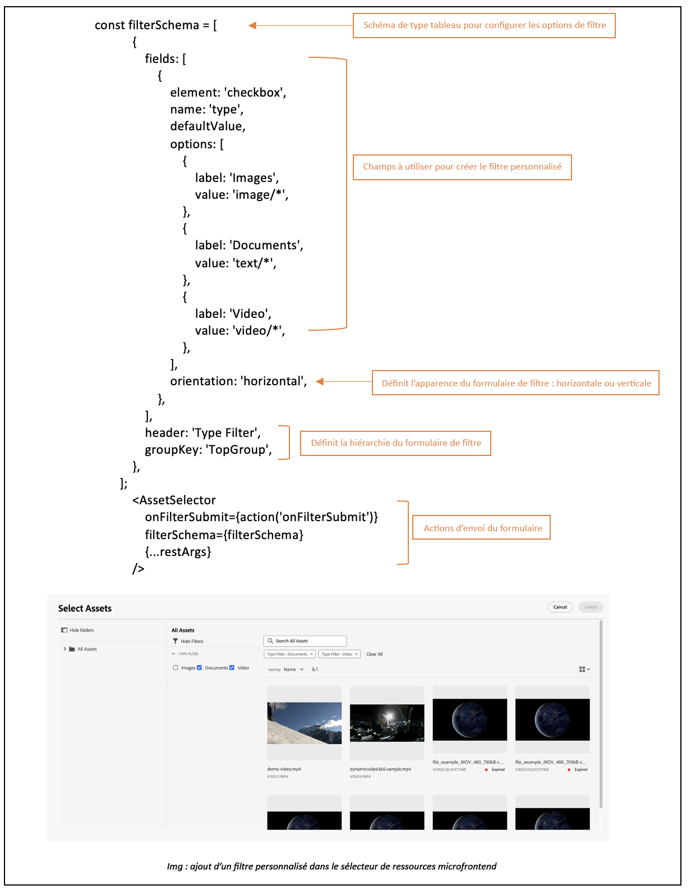

# Exemples d’utilisation des propriétés du sélecteur de ressources {#usage-examples}

Vous pouvez définir les [propriétés](#asset-selector-properties.md) du sélecteur de ressources dans le fichier `index.html` pour personnaliser l’affichage du sélecteur de ressources dans votre application.

## Exemple 1 : sélecteur de ressources en mode rail

Si la valeur de AssetSelector `rail` est définie sur `false` ou n’est pas mentionnée dans les propriétés, le sélecteur de ressources s’affiche par défaut dans la vue modale. La propriété `acvConfig` permet de définir des configurations plus détaillées, telles que le glisser-déposer. Visitez [ pour activer ou désactiver le glisser-déposer ](asset-selector-customization.md#enable-disable-drag-and-drop) afin de comprendre l’utilisation de la propriété `acvConfig`.

<!--
### Example 2: Use selectedAssets property in addition to the path property

Use the `path` property to define the folder name that displays automatically when the Asset Selector is rendered. In addition, use the `selectedAssets` property to define the IDs for the assets that you need to select within the folder. Moreover, when you want to display assets that are pre-defined within the folder, you can use selectedAssets property.

   
-->

## Exemple 2 : fenêtre contextuelle de métadonnées

Utilisez différentes propriétés pour définir les métadonnées d’une ressource que vous souhaitez afficher à l’aide d’une icône d’infos. La fenêtre contextuelle d’infos fournit l’ensemble des informations sur la ressource ou le dossier, y compris le titre, les dimensions, la date de modification, l’emplacement et la description d’une ressource. Dans l’exemple ci-dessous, diverses propriétés sont utilisées pour afficher les métadonnées d’une ressource, par exemple : la propriété `repo:path` spécifie l’emplacement d’une ressource. <!--`repo` represents the repository from where the asset is showing, whereas, `path` represents the route from where the asset or folder is rendered.-->

## Exemple 3 :propriété de filtre personnalisé dans la vue de rail

En plus de la recherche facettée, le sélecteur Assets vous permet de personnaliser divers attributs pour affiner votre recherche à partir de [!DNL Adobe Experience Manager] en tant qu’application [!DNL Cloud Service]. Ajoutez le code suivant pour ajouter des filtres de recherche personnalisés à votre application. Dans l’exemple ci-dessous, la recherche `Type Filter` qui filtre le type de ressource parmi les Images, Documents ou Vidéos ou le type de filtre que vous avez ajouté pour la recherche.

<!--

## Customization after integrating Asset Selector 

### Custom metadata

Assets display panel shows the out of the box metadata that can be displayed in the info of the asset. In addition to this, [!DNL Adobe Experience Manager] as a [!DNL Cloud Service] application allows configuration of the asset selector by adding custom metadata that is shown in info panel of the asset.
-->

>[!MORELIKETHIS]
>
>* [Personnalisation du sélecteur de ressources](/help/assets/asset-selector-customization.md)
>* [Propriétés du sélecteur de ressources](/help/assets/asset-selector-properties.md)
>* [ API d’ouverture de média dynamique du sélecteur de ressources ](/help/assets/integrate-asset-selector-dynamic-media-open-api.md)

