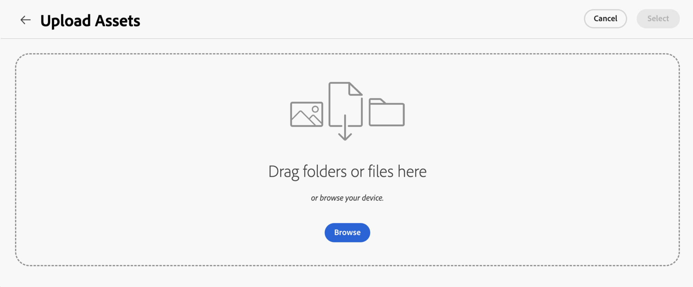

# Chargement de fichiers et de dossiers vers le sélecteur de ressources {#upload-files-folders}

Vous pouvez charger des fichiers ou des dossiers vers le sélecteur de ressources à partir de votre système de fichiers local. Pour charger des fichiers à l’aide du système de fichiers local, vous devez généralement utiliser une fonctionnalité de chargement fournie par une microapplication front-end du sélecteur de ressources.

## Chargement de ressources à partir du système de fichiers local {#basic-upload}

Pour ajouter des ressources au sélecteur de ressources, procédez comme suit :

1. Si vous utilisez la vue du rail, accédez aux points de suspension, puis cliquez sur  **[!UICONTROL Charger]**. D’un autre côté, cliquez sur  **[!UICONTROL Charger]** en haut à droite en cas de vue modale. L’écran [!UICONTROL Télécharger Assets] s’affiche.

   

   En outre, dans la section **[!UICONTROL Faire glisser des fichiers ou des dossiers ici]**, vous pouvez faire glisser les ressources depuis le système de fichiers local ou cliquer sur **[!UICONTROL Parcourir]** pour sélectionner manuellement les fichiers ou les dossiers disponibles sur le système de fichiers local. Cette liste des fichiers qui font partie de votre chargement est disponible sous forme de liste.

   

   Vous pouvez également prévisualiser les images sélectionnées à l’aide des miniatures et cliquer sur l’icône X pour supprimer une image particulière de la liste. L’icône X ne s’affiche que lorsque vous placez le pointeur de la souris sur le nom ou la taille de l’image. Vous pouvez également cliquer sur **[!UICONTROL Supprimer tout]** pour supprimer tous les éléments de votre liste de chargement.

1. Pour terminer le processus de chargement, cliquez sur **[!UICONTROL Charger]**. Les ressources chargées s’affichent. Voir [chargement de base](/help/assets/asset-selector-customization.md#basic-upload) pour obtenir le code configurable.

## Chargement de ressources avec des métadonnées {#upload-assets-with-metadata}

Vous pouvez ajouter des métadonnées aux ressources tout en les chargeant immédiatement dans votre application. Les métadonnées comprennent différents champs tels que l’objet commercial, les détails de produit, la campagne, etc. Pour ce faire, `metadataSchema` propriété est utilisée. Accédez à [Propriétés du sélecteur de ressources](/help/assets/asset-selector-properties.md) pour en savoir plus sur `metadataSchema` propriété.

Voir [Charger avec des métadonnées](/help/assets/asset-selector-customization.md#upload-with-metadata) pour le fragment de code requis pour la configuration.

1. Définissez le nom de votre chargement à l’aide du champ **[!UICONTROL Nom de la campagne]**. Vous pouvez utiliser un nom existant ou en créer un nouveau. Le sélecteur de ressources vous offre davantage d’options au fur et à mesure que vous saisissez le nom.

   Adobe recommande, en règle générale, de spécifier des valeurs dans le reste des champs afin de créer une expérience de recherche améliorée pour les ressources que vous avez chargées.

1. De même, définissez des valeurs pour les champs **[!UICONTROL Mots-clés]**, **[!UICONTROL Canaux]**, **[!UICONTROL Période]** et **[!UICONTROL Région]**. Le balisage et le regroupement des ressources par mots-clés, canaux et emplacement permet à toutes les personnes qui utilisent le contenu approuvé de votre entreprise de trouver ces ressources et de les organiser.

1. Cliquez sur **[!UICONTROL Charger]** pour charger des ressources dans le sélecteur de ressources. [!UICONTROL Consulter les détails] une boîte de confirmation s’affiche. Cliquez sur [!UICONTROL Continuer].

1. Assets démarre le chargement. Cliquez sur [!UICONTROL Nouveau chargement] pour redémarrer la procédure de chargement. Cliquez sur [!UICONTROL Terminé] pour terminer le chargement.

## Chargement personnalisé {#customize-upload}

Le sélecteur de ressources vous permet d’ajouter un formulaire de chargement personnalisé. Plusieurs personnalisations sont disponibles. Par exemple, la propriété [hideUploadButton](/help/assets/asset-selector-properties.md) permet de masquer le bouton de chargement affiché par défaut dans l&#39;application. Au lieu de cela, vous pouvez le personnaliser pour qu’il s’affiche en dehors de l’application MFE selon vos besoins. Voir [chargement personnalisé](/help/assets/asset-selector-customization.md#customized-upload) pour la configuration.

>[!MORELIKETHIS]
>
>* [Exemples de sélecteur de ressources](/help/assets/asset-selector-examples.md)
>* [Intégration du sélecteur de ressources à diverses applications](/help/assets/integrate-asset-selector.md)
>* [Propriétés du sélecteur de ressources](/help/assets/asset-selector-properties.md)
