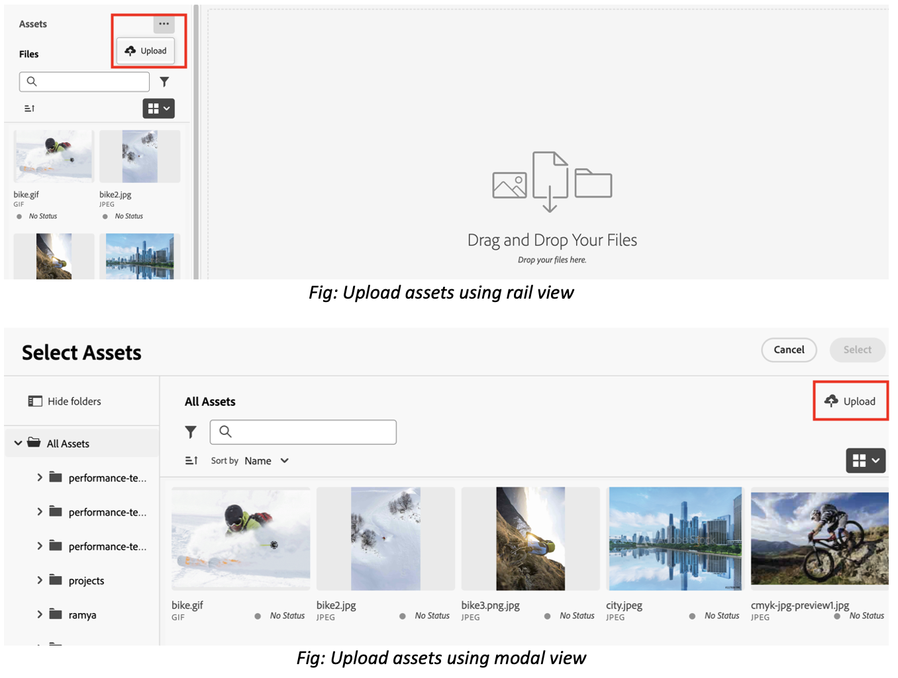

# Chargement de fichiers et de dossiers dans le sélecteur de ressources {#upload-files-folders}

| [Bonnes pratiques de recherche](/help/assets/search-best-practices.md) | [ Bonnes pratiques en matière de métadonnées](/help/assets/metadata-best-practices.md) | [Hub de contenus](/help/assets/product-overview.md) | [Dynamic Media avec fonctionnalités OpenAPI](/help/assets/dynamic-media-open-apis-overview.md) | [Documentation destinée aux développeurs AEM Assets](https://developer.adobe.com/experience-cloud/experience-manager-apis/) |
| ------------- | --------------------------- |---------|----|-----|

Vous pouvez charger des fichiers ou des dossiers vers le sélecteur de ressources à partir de votre système de fichiers local. Pour charger des fichiers à l’aide du système de fichiers local, vous devez généralement utiliser une fonctionnalité de chargement fournie par une application front-end micro-Sélecteur de ressources.

## Chargement de ressources à partir du système de fichiers local {#basic-upload}

Pour ajouter des ressources au sélecteur de ressources, procédez comme suit :

1. Si vous utilisez la vue de rail, sélectionnez les points de suspension, puis cliquez sur  **[!UICONTROL Télécharger]**. D’un autre côté, cliquez sur  **** en haut à droite en cas de vue modale. L’écran [!UICONTROL Télécharger Assets] s’affiche.

   

   De plus, dans la section **[!UICONTROL Faire glisser des fichiers ou des dossiers ici]** , vous pouvez soit faire glisser les ressources depuis le système de fichiers local, soit cliquer sur **[!UICONTROL Parcourir]** pour sélectionner manuellement les fichiers ou les dossiers disponibles sur le système de fichiers local. Cette liste des fichiers qui font partie de votre chargement est disponible sous forme de liste.

   

   Vous pouvez également prévisualiser les images sélectionnées à l’aide des miniatures, puis cliquer sur l’icône X pour supprimer une image particulière de la liste. L’icône X s’affiche uniquement lorsque vous placez le pointeur de la souris sur le nom ou la taille de l’image. Vous pouvez également cliquer sur **[!UICONTROL Tout supprimer]** pour supprimer tous les éléments de votre liste de chargement.

1. Pour terminer le processus de chargement, cliquez sur **[!UICONTROL Télécharger]**. Vos ressources chargées apparaissent. Voir [chargement de base](/help/assets/asset-selector-customization.md#basic-upload) pour connaître le code configurable.

## Chargement de ressources avec des métadonnées {#upload-assets-with-metadata}

Vous pouvez ajouter des métadonnées aux ressources tout en les chargeant immédiatement dans votre application. Les métadonnées comprennent divers champs tels que l’objet commercial, les détails du produit, la campagne, etc. Pour ce faire, la propriété `metadataSchema` est utilisée. Accédez à [propriétés du sélecteur de ressources](/help/assets/asset-selector-properties.md) pour en savoir plus sur la propriété `metadataSchema`.

Voir [chargement avec des métadonnées](/help/assets/asset-selector-customization.md#upload-with-metadata) pour connaître le fragment de code requis pour la configuration.

1. Définissez le nom de votre téléchargement à l’aide du champ **[!UICONTROL Nom de la campagne]**. Vous pouvez utiliser un nom existant ou en créer un nouveau. Le sélecteur de ressources vous fournit d’autres options lorsque vous saisissez le nom.

   En règle générale, Adobe recommande de spécifier des valeurs dans le reste des champs et de créer une expérience de recherche améliorée pour vos ressources chargées.

1. De même, définissez des valeurs pour les champs **[!UICONTROL Mots-clés]**, **[!UICONTROL Canaux]**, **[!UICONTROL Période]** et **[!UICONTROL Région]**. Le balisage et le regroupement des ressources par mots-clés, canaux et emplacement permet à toutes les personnes qui utilisent le contenu de votre entreprise approuvé de trouver ces ressources et de les organiser.

1. Cliquez sur **[!UICONTROL Télécharger]** pour télécharger des ressources vers le sélecteur de ressources. La boîte de confirmation [!UICONTROL Détails de la révision] s’affiche. Cliquez sur [!UICONTROL Continuer].

1. Assets commence le chargement. Cliquez sur [!UICONTROL Nouveau téléchargement] pour redémarrer la procédure de téléchargement. Cliquez sur [!UICONTROL Terminé] pour terminer le téléchargement.

## Chargement personnalisé {#customize-upload}

Le sélecteur de ressources vous permet d’ajouter un formulaire de téléchargement personnalisé. Plusieurs personnalisations sont disponibles. Par exemple, la propriété [hideUploadButton](/help/assets/asset-selector-properties.md) vous permet de masquer le bouton de téléchargement qui s’affiche par défaut dans l’application. Au lieu de cela, vous pouvez personnaliser le rendu en dehors de l’application MFE selon les besoins. Voir [téléchargement personnalisé](/help/assets/asset-selector-customization.md#customized-upload) pour la configuration.

>[!MORELIKETHIS]
>
>* [Exemples de sélecteur de ressources](/help/assets/asset-selector-examples.md)
>* [Intégrer le sélecteur de ressources à diverses applications](/help/assets/integrate-asset-selector.md)
>* [Propriétés du sélecteur de ressources](/help/assets/asset-selector-properties.md)
