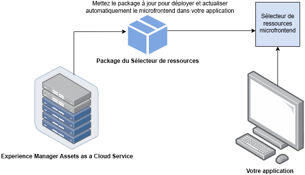

# Sélecteur de ressources micro front-end {#Overview}

Le sélecteur de ressources micro front-end fournit une interface utilisateur qui s’intègre facilement au référentiel [!DNL Experience Manager Assets as a Cloud Service] afin que vous puissiez parcourir ou rechercher des ressources numériques disponibles dans le référentiel et les utiliser dans votre expérience de création d’applications.

L’interface utilisateur micro front-end est mise à disposition dans votre expérience de l’application à l’aide du package Sélecteur de ressources. Toutes les mises à jour du package sont automatiquement importées et le dernier sélecteur de ressources déployé est automatiquement téléchargé dans votre application.



Le sélecteur de ressources offre de nombreux avantages, notamment :

* Facile à intégrer avec n’importe quelle application Adobe ou autre qu’Adobe utilisant la bibliothèque JavaScript Vanilla.
* Facile à gérer, car les mises à jour du package Sélecteur de ressources sont automatiquement déployées vers le sélecteur de ressources disponible pour votre application. Aucune mise à jour n’est requise dans votre application pour télécharger les dernières modifications.
* Facile à personnaliser, car il existe des propriétés qui contrôlent l’affichage du sélecteur de ressources dans votre application.

* Recherche de texte intégral, filtres prêts à l’emploi et filtres personnalisés pour accéder rapidement aux ressources à utiliser dans l’expérience de création.

* Possibilité de changer de référentiels au sein d’une organisation IMS pour la sélection de ressources.

* Possibilité de trier les ressources par nom, dimension et taille, et de les afficher en mode Liste, Grille, Galerie ou Cascade.

Le but de cet article est de montrer comment utiliser le sélecteur de ressources avec une application [!DNL Adobe] sous Unified Shell ou lorsque vous avez déjà généré un imsToken pour l’authentification. Dans cet article, ces workflows sont appelés flux non-SUSI.

Effectuez les tâches suivantes pour intégrer et utiliser le sélecteur de ressources avec votre référentiel [!DNL Experience Manager Assets as a Cloud Service] :

* [Intégration du sélecteur de ressources à l’aide de Vanilla JS](#integration-with-vanilla-js)
* [Définition des propriétés d’affichage du sélecteur de ressources](#asset-selector-properties)
* [Utilisation du sélecteur de ressources](#using-asset-selector)

## Intégration du sélecteur de ressources à l’aide de Vanilla JS {#integration-with-vanilla-js}

Vous pouvez intégrer n’importe quelle application [!DNL Adobe] ou autre qu’Adobe avec [!DNL Experience Manager Assets] as a [!DNL Cloud Service] et sélectionner des ressources dans l’application.

L’intégration est effectuée en important le package Sélecteur de ressources et en se connectant à Assets as a Cloud Service à l’aide de la bibliothèque JavaScript Vanilla. Vous devez modifier un `index.html` ou tout fichier approprié dans votre application vers -

* Définition des détails d’authentification
* Accès au référentiel Assets as a Cloud Service
* Configuration des propriétés d’affichage du sélecteur de ressources

<!--
Asset Selector supports authentication to the [!DNL Experience Manager Assets] as a [!DNL Cloud Service] repository using Identity Management System (IMS) properties such as `imsScope` or `imsClientID`. Authentication using these IMS properties is referred to as SUSI (Sign Up Sign In) flow in this article.

You can perform authentication without defining some of the IMS properties, such as `imsScope` or `imsClientID`, if:

*   You are integrating an [!DNL Adobe] application on [Unified Shell](https://experienceleague.adobe.com/docs/experience-manager-cloud-service/content/overview/aem-cloud-service-on-unified-shell.html?lang=en).
*   You already have an IMS token generated for authentication.

Accessing [!DNL Experience Manager Assets] as a [!DNL Cloud Service] repository without defining `imsScope` or `imsClientID` IMS properties is referred to as a non-SUSI flow in this article.
-->

Vous pouvez effectuer une authentification sans définir certaines des propriétés IMS, si :

* Vous intégrez une application [!DNL Adobe] sur [Unified Shell](https://experienceleague.adobe.com/docs/experience-manager-cloud-service/content/overview/aem-cloud-service-on-unified-shell.html?lang=fr).
* Un jeton IMS est déjà généré pour l’authentification.

## Prérequis {#prerequisites}

<!--
If your application requires user based authentication, out-of-the-box Asset Selector also supports a flow for authentication to the [!DNL Experience Manager Assets] as a [!DNL Cloud Service] repository using Identity Management System (IMS.)

You can use properties such as `imsScope` or `imsClientID` to retrieve `imsToken` automatically. You can use SUSI (Sign Up Sign In) flow and IMS properties. Also, you can obtain your own imsToken and pass it to Asset Selector by integrating within [!DNL Adobe] application on Unified Shell or if you already have an imsToken obtained via other methods (for example, using technical account). Accessing [!DNL Experience Manager Assets] as a [!DNL Cloud Service] repository without defining IMS properties (For example, `imsScope` and `imsClientID`) is referred to as a non-SUSI flow.
-->

Définissez les conditions préalables dans le fichier `index.html` ou un fichier similaire dans l’implémentation de votre application pour définir les détails d’authentification permettant d’accéder au référentiel [!DNL Experience Manager Assets] as a [!DNL Cloud Service]. Les prérequis sont les suivants :

* imsOrg
* imsToken
* apikey
<!--
The prerequisites vary if you are authenticating using a SUSI flow or a non-SUSI flow.

**Non-SUSI flow**

*   imsOrg
*   imsToken
*   apikey

For more information on these properties, see [Asset Selector Properties](#asset-selector-properties).

**SUSI flow**

*   imsClientId
*   imsScope
*   redirectUrl
*   imsOrg
*   apikey

For more information on these properties, see [Example for the SUSI flow](#susi-vanilla) and [Asset Selector Properties](#asset-selector-properties).
-->

## Installation {#installation}

Les sélecteurs de ressources sont disponibles via le réseau CDN ESM (par exemple, [esm.sh](https://esm.sh/)/[skypack](https://www.skypack.dev/)) et la version [UMD](https://github.com/umdjs/umd).

Dans les navigateurs utilisant la **version UMD** (recommandé) :

```
<script src="https://experience.adobe.com/solutions/CQ-assets-selectors/static-assets/resources/assets-selectors.js"></script>

<script>
  const { renderAssetSelector } = PureJSSelectors;
</script>
```

Dans les navigateurs avec la prise en charge `import maps` à l’aide de la **version du réseau CDN ESM** :

```
<script type="module">
  import { AssetSelector } from 'https://experience.adobe.com/solutions/CQ-assets-selectors/static-assets/resources/@assets/selectors/index.js'
</script>
```

Dans la fédération de modules Deno/Webpack à l’aide de la **version du réseau CDN ESM** :

```
import { AssetSelector } from 'https://experience.adobe.com/solutions/CQ-assets-selectors/static-assets/resources/@assets/selectors/index.js'
```

### Type de ressource sélectionné {#selected-asset-type}

Le type de ressource sélectionné est un tableau d’objets qui contient des informations sur les ressources lors de l’utilisation des fonctions `handleSelection`, `handleAssetSelection`, et `onDrop`.

**Syntaxe du schéma**

```
interface SelectedAsset {
    'repo:id': string;
    'repo:name': string;
    'repo:path': string;
    'repo:size': number;
    'repo:createdBy': string;
    'repo:createDate': string;
    'repo:modifiedBy': string; 
    'repo:modifyDate': string; 
    'dc:format': string; 
    'tiff:imageWidth': number;
    'tiff:imageLength': number;
    'repo:state': string;
    computedMetadata: Record<string, any>;
    _links: {
        'http://ns.adobe.com/adobecloud/rel/rendition': Array<{
            href: string;
            type: string;
            'repo:size': number;
            width: number;
            height: number;
            [others: string]: any;
        }>;
    };
}
```

Le tableau suivant décrit des propriétés importantes de l’objet Ressource sélectionnée.

| Propriété | Type | Explication |
|---|---|---|
| *repo:repositoryId* | chaîne | Identifiant unique du référentiel dans lequel la ressource est stockée. |
| *repo:id* | chaîne | Identifiant unique de la ressource. |
| *repo:assetClass* | chaîne | Classification de la ressource (par exemple, image ou vidéo, document). |
| *repo:name* | chaîne | Nom de la ressource, y compris l’extension de fichier. |
| *repo:size* | nombre | Taille de la ressource en octets. |
| *repo:path* | chaîne | Emplacement de la ressource dans le référentiel. |
| *repo:ancestors* | `Array<string>` | Tableau d’éléments ancêtres de la ressource dans le référentiel. |
| *repo:state* | chaîne | État actuel de la ressource dans le référentiel (par exemple, active, supprimée, etc.). |
| *repo:createdBy* | chaîne | L’utilisateur, l’utilisatrice ou le système qui a créé la ressource. |
| *repo:createDate* | chaîne | Date et heure de création de la ressource. |
| *repo:modifiedBy* | chaîne | L’utilisateur, l’utilisatrice ou le système qui a modifié la ressource pour la dernière fois. |
| *repo:modifyDate* | chaîne | Date et heure de la dernière modification de la ressource. |
| *dc:format* | chaîne | Format de la ressource, tel que le type de fichier (par exemple, JPEG, PNG, etc.). |
| *tiff:imageWidth* | nombre | Largeur d’une ressource. |
| *tiff:imageLength* | nombre | Hauteur d’une ressource. |
| *computedMetadata* | `Record<string, any>` | Objet qui représente un compartiment pour tous les types de métadonnées de la ressource (référentiel, application ou métadonnées incorporées). |
| *_links* | `Record<string, any>` | Liens hypermédias pour la ressource associée. Inclut des liens pour des ressources telles que des métadonnées et des rendus. |
| *_links.http://ns.adobe.com/adobecloud/rel/rendition* | `Array<Object>` | Tableau d’objets contenant des informations sur les rendus de la ressource. |
| *_links.http://ns.adobe.com/adobecloud/rel/rendition[].href* | chaîne | URI du rendu. |
| *_links.http://ns.adobe.com/adobecloud/rel/rendition[].type* | chaîne | Type MIME du rendu. |
| *_links.http://ns.adobe.com/adobecloud/rel/rendition[].&#39;repo:size&#39;* | nombre | Taille du rendu en octets. |
| *_links.http://ns.adobe.com/adobecloud/rel/rendition[].width* | nombre | Largeur du rendu. |
| *_links.http://ns.adobe.com/adobecloud/rel/rendition[].height* | nombre | Hauteur du rendu. |

Pour obtenir la liste complète des propriétés ainsi qu’un exemple détaillé, consultez la page [Exemple de code de sélecteur de ressources](https://github.com/adobe/aem-assets-selectors-mfe-examples).

<!--
### ImsAuthProps {#ims-auth-props}

The `ImsAuthProps` properties define the authentication information and flow that the Asset Selector uses to obtain an `imsToken`. By setting these properties, you can control how the authentication flow should behave and register listeners for various authentication events.

| Property Name | Description|
|---|---|
| `imsClientId`| A string value representing the IMS client ID used for authentication purposes. This value is provided by Adobe and is specific to your Adobe AEM CS organization.|
| `imsScope`| Describes the scopes used in authentication. The scopes determine the level of access that the application has to your organization resources. Multiple scopes can be separated by commas.|
| `redirectUrl` | Represents the URL where the user is redirected after authentication. This value is typically set to the current URL of the application. If a `redirectUrl` is not supplied, `ImsAuthService` will use the redirectUrl used to register the `imsClientId`|
| `modalMode`| A boolean indicating whether the authentication flow should be displayed in a modal (pop-up) or not. If set to `true`, the authentication flow is displayed in a pop-up. If set to `false`, the authentication flow is displayed in a full page reload. _Note:_ for better UX, you can dynamically control this value if the user has browser pop-up disabled. |
| `onImsServiceInitialized`| A callback function that is called when the Adobe IMS authentication service is initialized. This function takes one parameter, `service`, which is an object representing the Adobe IMS service. See [`ImsAuthService`](#imsauthservice-ims-auth-service) for more details.|
| `onAccessTokenReceived`| A callback function that is called when an `imsToken` is received from the Adobe IMS authentication service. This function takes one parameter, `imsToken`, which is a string representing the access token. |
| `onAccessTokenExpired`| A callback function that is called when an access token has expired. This function is typically used to trigger a new authentication flow to obtain a new access token. |
| `onErrorReceived`| A callback function that is called when an error occurs during authentication. This function takes two parameters: the error type and error message. The error type is a string representing the type of error and the error message is a string representing the error message. |

### ImsAuthService {#ims-auth-service}

`ImsAuthService` class handles the authentication flow for the Asset Selector. It is responsible for obtaining an `imsToken` from the Adobe IMS authentication service. The `imsToken` is used to authenticate the user and authorize access to the Adobe Experience Manager (AEM) CS Assets repository. ImsAuthService uses the `ImsAuthProps` properties to control the authentication flow and register listeners for various authentication events. You can use the convenient [`registerAssetsSelectorsAuthService`](#purejsselectorsregisterassetsselectorsauthservice) function to register the _ImsAuthService_ instance with the Asset Selector. The following functions are available on the `ImsAuthService` class. However, if you are using the _registerAssetsSelectorsAuthService_ function, you do not need to call these functions directly.

| Function Name | Description |
|---|---|
| `isSignedInUser` | Determines whether the user is currently signed in to the service and returns a boolean value accordingly.|
| `getImsToken`    | Retrieves the authentication `imsToken` for the currently signed-in user, which can be used to authenticate requests to other services such as generating asset _rendition.|
| `signIn`| Initiates the sign-in process for the user. This function uses the `ImsAuthProps` to show authentication in either a pop-up or a full page reload |
| `signOut`| Signs the user out of the service, invalidating their authentication token and requiring them to sign in again to access protected resources. Invoking this function will reload the current page.|
| `refreshToken`| Refreshes the authentication token for the currently signed-in user, preventing it from expiring and ensuring uninterrupted access to protected resources. Returns a new authentication token that can be used for subsequent requests. |
-->

### Exemple pour le flux non-SUSI {#non-susi-vanilla}

Cet exemple montre comment utiliser le sélecteur de ressources avec un flux non-SUSI lors de l’exécution d’une application [!DNL Adobe] sous Unified Shell ou lorsque vous avez déjà généré des `imsToken` pour l’authentification.

Insérez le package Sélecteur de ressources dans votre code à l’aide de la variable `script` , comme illustré dans _lignes 6 à 15_ de l’exemple ci-dessous. Une fois le script chargé, vous pouvez utiliser la variable globale `PureJSSelectors`. Définition du sélecteur de ressources [properties](#asset-selector-properties) comme illustré dans _lignes 16 à 23_. Les propriétés `imsOrg` et `imsToken` sont toutes deux requises pour l’authentification dans un flux non-SUSI. La propriété `handleSelection` sert à gérer les ressources sélectionnées. Pour effectuer le rendu du sélecteur de ressources, appelez la fonction `renderAssetSelector` comme indiqué dans la _ligne 17_. Le sélecteur de ressources s’affiche dans l’élément de conteneur `<div>`, comme indiqué dans les _lignes 21 et 22_.

En suivant ces étapes, vous pouvez utiliser le sélecteur de ressources avec un flux non-SUSI dans votre application [!DNL Adobe].

```html {line-numbers="true"}
<!DOCTYPE html>
<html>
<head>
    <title>Asset Selector</title>
    <script src="https://experience.adobe.com/solutions/CQ-assets-selectors/assets/resources/assets-selectors.js"></script>
    <script>
        // get the container element in which we want to render the AssetSelector component
        const container = document.getElementById('asset-selector-container');
        // imsOrg and imsToken are required for authentication in non-SUSI flow
        const assetSelectorProps = {
            imsOrg: 'example-ims@AdobeOrg',
            imsToken: "example-imsToken",
            apiKey: "example-apiKey-associated-with-imsOrg",
            handleSelection: (assets: SelectedAssetType[]) => {},
        };
        // Call the `renderAssetSelector` available in PureJSSelectors globals to render AssetSelector
        PureJSSelectors.renderAssetSelector(container, assetSelectorProps);
    </script>
</head>

<body>
    <div id="asset-selector-container" style="height: calc(100vh - 80px); width: calc(100vw - 60px); margin: -20px;">
    </div>
</body>

</html>
```

Pour obtenir un exemple détaillé, consultez [Exemple de code de sélecteur de ressources](https://github.com/adobe/aem-assets-selectors-mfe-examples).

<!--
### Example for the SUSI flow {#susi-vanilla}

Use this example `index.html` file for authentication if you are integrating your application using SUSI flow.

Access the Asset Selector package using the `Script` Tag, as shown in *line 9* to *line 11* of the example `index.html` file.

*Line 14* to *line 38* of the example describes the IMS flow properties, such as `imsClientId`, `imsScope`, and `redirectURL`. The function requires that you define at least one of the `imsClientId` and `imsScope` properties. If you do not define a value for `redirectURL`, the registered redirect URL for the client ID is used.

As you do not have an `imsToken` generated, use the `registerAssetsSelectorsAuthService` and `renderAssetSelectorWithAuthFlow` functions, as shown in line 40 to line 50 of the example `index.html` file. Use the `registerAssetsSelectorsAuthService` function before `renderAssetSelectorWithAuthFlow` to register the `imsToken` with the Asset Selector. [!DNL Adobe] recommends to call `registerAssetsSelectorsAuthService` when you instantiate the component.

Define the authentication and other Assets as a Cloud Service access-related properties in the `const props` section, as shown in *line 54* to *line 60* of the example `index.html` file.

The `PureJSSelectors` global variable, mentioned in *line 65*, is used to render the Asset Selector in the web browser.

Asset Selector is rendered on the `<div>` container element, as mentioned in *line 74* to *line 81*. The example uses a dialog to display the Asset Selector.

```html {line-numbers="true"}
<!DOCTYPE html>
<html>

<head>
    <meta http-equiv="X-UA-Compatible" content="IE=edge">
    <meta charset="utf-8">
    <title>Asset Selectors</title>
    <link rel="stylesheet" href="index.css">
    <script id="asset-selector"
        src="https://experience.adobe.com/solutions/CQ-assets-selectors/assets/resources/asset-selectors.js"></script>
    <script>

        const imsProps = {
            imsClientId: "<obtained from IMS team>",
            imsScope: "openid, <other scopes>",
            redirectUrl: window.location.href,
            modalMode: true, // false to open in a full page reload flow
            onImsServiceInitialized: (service) => {
                // invoked when the ims service is initialized and is ready
                console.log("onImsServiceInitialized", service);
            },
            onAccessTokenReceived: (token) => {
                console.log("onAccessTokenReceived", token);
            },
            onAccessTokenExpired: () => {
                console.log("onAccessTokenError");
                // re-trigger sign-in flow
            },
            onErrorReceived: (type, msg) => {
                console.log("onErrorReceived", type, msg);
            },
        }

        function load() {
            const registeredTokenService = PureJSSelectors.registerAssetsSelectorsAuthService(imsProps);
            imsInstance = registeredTokenService;
        };

        // initialize the IMS flow before attempting to render the asset selector
        load();
        

        //function that will render the asset selector
            const otherProps = {
            // any other props supported by asset selector
            }
            const assetSelectorProps = {
                "imsOrg": "imsorg",
                ...otherProps
            }
             // container element on which you want to render the AssetSelector/DestinationSelector component
            const container = document.getElementById('asset-selector');

            /// Use the PureJSSelectors in globals to render the AssetSelector/DestinationSelector component
            PureJSSelectors.renderAssetSelectorWithAuthFlow(container, assetSelectorProps, () => {
                const assetSelectorDialog = document.getElementById('asset-selector-dialog');
                assetSelectorDialog.showModal();
            });
        }
    </script>

</head>
<body class="asset-selectors">
    <div>
        <button onclick="renderAssetSelectorWithAuthFlowFlow()">Asset Selector - Select Assets with Ims Flow</button>
    </div>
        <dialog id="asset-selector-dialog">
            <div id="asset-selector" style="height: calc(100vh - 80px); width: calc(100vw - 60px); margin: -20px;">
            </div>
        </dialog>
    </div>
</body>

</html>

```
-->

## Utilisation des propriétés du sélecteur de ressources {#asset-selector-properties}

Vous pouvez utiliser les propriétés du sélecteur de ressources pour personnaliser le rendu du sélecteur de ressources. Le tableau suivant répertorie les propriétés que vous pouvez utiliser pour personnaliser et utiliser le sélecteur de ressources.

| Propriété | Type | Requis | Valeur par défaut | Description |
|---|---|---|---|---|
| *rail* | booléen | Non | false | Si marqué `true`, le sélecteur de ressources s’affiche dans un rail de gauche. S’il est marqué `false`, le sélecteur de ressources est rendu dans la vue modale. |
| *imsOrg* | chaîne | Oui | | Identifiant Adobe Identity Management System (IMS) attribué lors de l’approvisionnement de [!DNL Adobe Experience Manager] en tant que [!DNL Cloud Service] pour votre organisation. La variable `imsOrg` clé est requise pour vous authentifier si l’organisation à laquelle vous accédez se trouve sous Adobe IMS ou non. |
| *imsToken* | chaîne | Non | | Jeton de support IMS utilisé pour l’authentification. `imsToken` est obligatoire si vous utilisez le flux non-SUSI. |
| *apiKey* | chaîne | Non | | Clé d’API utilisée pour accéder au service AEM Discovery. `apiKey` est obligatoire si vous utilisez le flux non-SUSI. |
| *rootPath* | chaîne | Non | /content/dam/ | Chemin du dossier à partir duquel le sélecteur de ressources affiche vos ressources. `rootPath` peut également être utilisé sous la forme d’encapsulation. Par exemple, étant donné le chemin suivant, `/content/dam/marketing/subfolder/`, le sélecteur de ressources ne vous permet pas de parcourir les dossiers parents, mais affiche uniquement les dossiers enfants. |
| *path* | chaîne | Non | | Chemin d’accès utilisé pour accéder à un répertoire spécifique de ressources lors du rendu du sélecteur de ressources. |
| *filterSchema* | tableau | Non | | Modèle utilisé pour configurer les propriétés de filtre. Cela s’avère utile lorsque vous souhaitez limiter certaines options de filtre dans le sélecteur de ressources. |
| *filterFormProps* | Objet | Non | | Spécifiez les propriétés de filtre à utiliser pour affiner votre recherche. Par exemple, JPG de type MIME, PNG, GIF. |
| *selectedAssets* | Tableau `<Object>` | Non |                 | Spécifiez les ressources sélectionnées lors du rendu du sélecteur de ressources. Un tableau d’objets contenant une propriété d’ID des ressources est requis. Par exemple : `[{id: 'urn:234}, {id: 'urn:555'}]`. Une ressource doit être disponible dans le répertoire actuel. Si vous devez utiliser un autre répertoire, saisissez également une valeur pour la propriété `path`. |
| *acvConfig* | Objet | Non | | Propriété d’affichage de collection de ressources qui contient comportant une configuration personnalisée pour remplacer les valeurs par défaut. |
| *i18nSymbols* | `Object<{ id?: string, defaultMessage?: string, description?: string}>` | Non |                 | Si les traductions prêtes à l’emploi ne sont pas suffisantes pour répondre aux besoins de votre application, vous pouvez exposer une interface par laquelle vous pouvez transmettre vos propres valeurs localisées et personnalisées via la propriété `i18nSymbols`. Le transfert d’une valeur par le biais de cette interface remplace les traductions fournies par défaut par les vôtres.  Pour effectuer le remplacement, vous devez transmettre un objet [Descripteur de message](https://formatjs.io/docs/react-intl/api/#message-descriptor) valide à la clé de `i18nSymbols` que vous voulez remplacer. |
| *intl* | Objet | Non | | Le sélecteur de ressources fournit des traductions prêtes à l’emploi par défaut. Vous pouvez sélectionner la langue de traduction en fournissant une chaîne de paramètres régionaux valide via la propriété `intl.locale`. Par exemple : `intl={{ locale: "es-es" }}` </br></br>. Les chaînes de paramètres régionaux prises en charge suivent la norme [ISO 639 - Codes](https://www.iso.org/fr/iso-639-language-codes.html) pour la représentation des noms des normes linguistiques. </br></br> Liste des paramètres régionaux pris en charge : anglais (en-us, par défaut), espagnol (es-es), allemand (de-de), français (fr-FR), italien (it-it), japonais (ja-jp), coréen (ko-kr), portugais (pt-br), chinois (traditionnel, zh-cn), chinois (Taïwan, zh-tw). |
| *repositoryId* | chaîne | Non | &#39;&#39; | Référentiel à partir duquel le sélecteur de ressources charge le contenu. |
| *additionalAemSolutions* | `Array<string>` | Non | [ ] | Il vous permet d’ajouter une liste de référentiels d’AEM supplémentaires. Si aucune information n’est fournie dans cette propriété, seule la bibliothèque de médias ou les référentiels AEM Assets sont pris en compte. |
| *hideTreeNav* | booléen | Non |  | Indique s’il faut afficher ou masquer la barre latérale de navigation de l’arborescence de ressources. Elle est utilisée uniquement en mode modal et, par conséquent, cette propriété n’a aucun impact en mode rail. |
| *onDrop* | Fonction | Non | | La propriété active la fonctionnalité de dépôt d’une ressource. |
| *dropOptions* | `{allowList?: Object}` | Non | | Configure les options de dépôt à l’aide de la « liste autorisée ». |
| *colorScheme* | chaîne | Non | | Configure le thème (`light` ou `dark`) du sélecteur de ressources. |
| *handleSelection* | Fonction | Non | | Appelée avec un tableau d’éléments de ressource lorsque des ressources sont sélectionnées et que vous cliquez sur le bouton `Select` en mode modal. Cette fonction est uniquement appelée en mode modal. En mode rail, utilisez les fonctions `handleAssetSelection` ou `onDrop`. Exemple : <pre>handleSelection=(assets: Asset[])=> {...}</pre> Voir [Type de ressource sélectionné](#selected-asset-type) pour plus d’informations. |
| *handleAssetSelection* | Fonction | Non | | Appelée avec un tableau d’éléments lorsque les ressources sont sélectionnées ou désélectionnées. Cela s’avère utile si vous souhaitez écouter les ressources lorsque l’utilisateur ou l’utilisatrice les sélectionne. Exemple : <pre>handleSelection=(assets: Asset[])=> {...}</pre> Voir [Type de ressource sélectionné](#selected-asset-type) pour plus d’informations. |
| *onClose* | Fonction | Non | | Appelée lorsque vous cliquez sur le bouton `Close` en mode modal. Cette fonction est uniquement appelée en mode `modal` et n’est pas prise en compte en mode `rail`. |
| *onFilterSubmit* | Fonction | Non | | Appelée avec des éléments de filtre lorsque l’utilisateur ou l’utilisatrice modifie des critères de filtre. |
| *selectionType* | chaîne | Non | unique | Configuration pour la sélection `single` ou `multiple` de ressources à la fois. |

## Exemples d’utilisation des propriétés du sélecteur de ressources {#usage-examples}

Vous pouvez définir les [propriétés](#asset-selector-properties) du sélecteur de ressources dans le fichier `index.html` pour personnaliser l’affichage du sélecteur de ressources dans votre application.

### Exemple 1 : sélecteur de ressources en mode rail


Si la valeur du AssetSelector `rail` est définie sur `false` ou n’est pas mentionnée dans les propriétés, le sélecteur de ressources s’affiche par défaut en mode modal.

<!--
### Example 2: Use selectedAssets property in addition to the path property

Use the `path` property to define the folder name that displays automatically when the Asset Selector is rendered. In addition, use the `selectedAssets` property to define the IDs for the assets that you need to select within the folder. Moreover, when you want to display assets that are pre-defined within the folder, you can use selectedAssets property.

   
-->

### Exemple 2 : fenêtre contextuelle de métadonnées

Utilisez différentes propriétés pour définir les métadonnées d’une ressource que vous souhaitez afficher à l’aide d’une icône d’infos. La fenêtre contextuelle d’infos fournit l’ensemble des informations sur la ressource ou le dossier, y compris le titre, les dimensions, la date de modification, l’emplacement et la description d’une ressource. Dans l’exemple ci-dessous, diverses propriétés sont utilisées pour afficher les métadonnées d’une ressource, par exemple : la propriété `repo:path` spécifie l’emplacement d’une ressource. <!--`repo` represents the repository from where the asset is showing, whereas, `path` represents the route from where the asset or folder is rendered.-->


### Exemple 3 :propriété de filtre personnalisé dans la vue de rail

Outre la recherche facettée, le sélecteur de ressources vous permet de personnaliser divers attributs pour affiner votre recherche à partir de [!DNL Adobe Experience Manager] as a [!DNL Cloud Service] application. Vous devez ajouter le code suivant pour ajouter des filtres de recherche personnalisés dans votre application. Dans l’exemple ci-dessous, la recherche `Type Filter` qui filtre le type de ressource parmi les Images, Documents ou Vidéos ou le type de filtre que vous avez ajouté pour la recherche.


<!--

## Customization after integrating Asset Selector 

### Custom metadata

Assets display panel shows the out of the box metadata that can be displayed in the info of the asset. In addition to this, [!DNL Adobe Experience Manager] as a [!DNL Cloud Service] application allows configuration of the asset selector by adding custom metadata that is shown in info panel of the asset.
-->

<!-- Property details to be added here. Referred the ticket https://jira.corp.adobe.com/browse/ASSETS-19023-->

<!--
## Asset Selector Object Schema {#object-schema}

Schema describes the object properties associated with an asset selected using Asset Selector. It uses the combination of data types and their values to validate the object describing the selected Asset using an Asset Selector.

**Schema Syntax**
````
interface SelectedAsset {
    'repo:id': string;
    'repo:name': string;
    'repo:path': string;
    'repo:size': number;
    'repo:createdBy': string;
    'repo:createDate': string;
    'repo:modifiedBy': string; 
    'repo:modifyDate': string; 
    'dc:format': string; 
    'tiff:imageWidth': number;
    'tiff:imageLength': number;
    'repo:state': string;
    computedMetadata: Record<string, any>;
    _links: {
        'http://ns.adobe.com/adobecloud/rel/rendition': Array<{
            href: string;
            type: string;
            'repo:size': number;
            width: number;
            height: number;
            [others: string]: any;
        }>;
    };
}
````

**Query Parameters**

| Parameter | Type | Description |
|---|---|---|
| repo:id | string | ID of an Asset |
| repo:name | string | The name of an Asset |
| repo:path | string | The path of an Asset |
| repo:size | number | Size of an Asset (in bytes) |
| repo:createdBy | string | ID of a user who created an Asset |
| repo: createdDate | string | The timestamp when an asset was created |
| repo:modifiedBy | string | ID of a user who modified the asset recently |
| repo:modifyDate | string | The timestamp when the asset was last modified |
| dc:format | string | MIME type of an Asset |
| tiff:imageWidth | number | The width of an image type of Asset |
| tiff:imageLength | number | The height of an image type of Asset |
| repo:state | string | The `Approved`, `Rejected`, or `Expired`state of an Asset |
| computedMetadata | string | It is an object that represents a bucket for all the Asset's metadata of all kinds (repository, application or embedded metadata) |
| _links | string | It represents the collection of links used in the Asset Selector. The links are represented in the form of an array. The parameters of an array include: `href`, `type`, `repo:size`, `width`, `height`, and so on  |

For the detailed example of Object Schema, click 
-->

## Gestion de la sélection de ressources à l’aide du schéma d’objet {#handling-selection}

La propriété `handleSelection` est utilisée pour gérer des sélections uniques ou multiples de ressources dans le sélecteur de ressources. L’exemple ci-dessous indique la syntaxe de l’utilisation de `handleSelection`.


## Utilisation du sélecteur de ressources {#using-asset-selector}

Une fois que le sélecteur de ressources est configuré et que vous êtes authentifié(e) pour l’utiliser avec votre application [!DNL Adobe Experience Manager] as a [!DNL Cloud Service], vous pouvez sélectionner des ressources ou effectuer d’autres opérations pour rechercher vos ressources dans le référentiel.


* **A** : [masquer/afficher le panneau](#hide-show-panel)
* **B** : [sélecteur de référentiels](#repository-switcher)
* **C** : [ressources](#repository)
* **D** : [filtres](#filters)
* **E** : [barre de recherche](#search-bar)
* **F** : [tri](#sorting)
* **G** : [tri par ordre croissant ou décroissant](#sorting)
* **H** : [vue](#types-of-view)

### Masquer/Afficher le panneau {#hide-show-panel}

Pour masquer les dossiers dans le volet de navigation de gauche, cliquez sur l’icône **[!UICONTROL Masquer les dossiers]**. Pour annuler les modifications, cliquez à nouveau sur l’icône **[!UICONTROL Masquer les dossiers]**.

### Sélecteur de référentiels {#repository-switcher}

Le sélecteur de ressources vous permet également de basculer entre des référentiels pour la sélection de ressources. Vous pouvez sélectionner le référentiel de votre choix dans la liste déroulante disponible dans le panneau de gauche. Les options de référentiel disponibles dans la liste déroulante reposent sur la propriété `repositoryId` définie dans le fichier `index.html`. Cela est basé sur les environnements de l’organisation IMS sélectionnée accessible par l’utilisateur ou l’utilisatrice connecté(e). Les clientes et clients peuvent transmettre une préférence `repositoryID` et, dans ce cas, le sélecteur de ressources arrête le rendu du sélecteur de référentiels et effectue uniquement le rendu des ressources à partir du référentiel donné.
<!--
It is based on the `imsOrg` that is provided in the application. If you want to see the list of repositories, then `repositoryId` is required to view those specific repositories in your application.
-->

### Référentiel de ressources

Il s’agit d’une collection de dossiers de ressources que vous pouvez utiliser pour effectuer des opérations.

### Filtres prêts à l’emploi {#filters}

Le sélecteur de ressources fournit également des options de filtres prêts à l’emploi pour affiner vos résultats de recherche. Les filtres suivants sont disponibles :

* `File type` : inclut un dossier, un fichier, des images, des documents ou une vidéo.
* `MIME type` : inclut JPG, GIF, PPTX, PNG, MP4, DOCX, TIFF, PDF, XLSX.
* `Image Size` : inclut la largeur minimale et maximale, et la hauteur minimale et maximale de l’image.

  

### Recherche personnalisée

Outre la recherche de texte intégral, le sélecteur de ressources vous permet de rechercher des ressources dans des fichiers à l’aide d’une recherche personnalisée. Vous pouvez utiliser des filtres de recherche personnalisés en modes Modal et Rail.


Vous pouvez également créer un filtre de recherche par défaut pour enregistrer les champs que vous recherchez fréquemment et les utiliser ultérieurement. Pour créer une recherche personnalisée de vos ressources, vous pouvez utiliser la propriété `filterSchema`.

### Barre de recherche {#search-bar}

Le sélecteur de ressources vous permet d’effectuer une recherche de texte intégral des ressources dans le référentiel sélectionné. Par exemple, si vous saisissez le mot-clé `wave` dans la barre de recherche, toutes les ressources qui contiennent le mot-clé `wave` dans l’une des propriétés de métadonnées s’affichent.

### Tri {#sorting}

Vous pouvez trier les ressources du sélecteur de ressources selon le nom, les dimensions ou la taille d’une ressource. Vous pouvez également trier les ressources par ordre croissant ou décroissant.

### Types de vues {#types-of-view}

Le sélecteur de ressources vous permet d’afficher la ressource dans quatre vues différentes :

* ** [!UICONTROL Vue Liste]** : la vue Liste affiche les fichiers et dossiers défilables dans une seule colonne.
* ** [!UICONTROL Vue grille]** : la vue Grille affiche les fichiers et dossiers défilables dans une grille de lignes et de colonnes.
* ** [!UICONTROL Vue Galerie]** : la vue Galerie affiche les fichiers ou les dossiers dans une liste horizontale centrée et verrouillée.
* ** [!UICONTROL Vue Cascade]** : la vue Cascade affiche les fichiers ou les dossiers sous la forme d’un pont.

<!--
### Modes to view Asset Selector

Asset Selector supports two types of out of the box views:

**  Modal view or Inline view:** The modal view or inline view is the default view of Asset Selector that represents Assets folders in the front area. The modal view allows users to view assets in a full screen to ease the selection of multiple assets for import. Use `<AssetSelector rail={false}>` to enable modal view.

    

**  Rail view:** The rail view represents Assets folders in a left panel. The drag and drop of assets can be performed in this view. Use `<AssetSelector rail={true}>` to enable rail view.

    
-->
<!--

### Application Integration

Asset Selector is flexible and can be integrated within your existing [!DNL Adobe Experience Manager] as a [!DNL Cloud Service] application. It is accessible and localized to add, search, and select assets in your application. With Asset Selector you can:
*   **Configure** You can configure the files/folders that you want to show at the upfront. The assets that are chosen to view can be of any supported formats, for example, JPEG. It lets you control the display of various text or symbols as per your choice.
*   **Perfect fit** Asset selector easily fits in your existing [!DNL Adobe Experience Manager] as a [!DNL Cloud Service] application and choose the way you want to view. The mode of view can be inline, rail, or modal view.
*   **Accessible** With Asset Selector, you can reach the desired asset in an easy manner.
*   **Localize** Assets can be availed for the various locales available as per Adobe's localization standards.
-->
<!--

### Support for multiple instances

The micro front-end design supports the display of multiple instances of Asset Selector on a single screen.


-->

<!--

### Controlled selection with multi-select

You can make default multi-selection of assets by specifying the assets to the component using `selectedAssets` property. You should specify an array of asset IDs. For example, `[{id: 'urn:234}, {id: 'urn:555'}].`
-->
<!--

### Action buttons

When you customize your application with Asset Selector based on ReactJS, you are provided with the following action buttons to perform various actions:
*   **Open in media library** Lets you open the asset in media library.
*   **Upload** Lets you upload an asset directly.
*   **Download** Downloads the asset in [!DNL Adobe Experience Manager] as a [!DNL Cloud Service].
-->
<!--

### Status of an asset

Asset Selector lets you know the status of your uploaded assets. The status can be `Approved`, `Rejected`, or `Expired` of the asset. 
-->
<!--

### Localization

The integration of Asset Selector with [!DNL Adobe Experience Manager] as a [!DNL Cloud Service] allows localized content appear in your application.
-->
