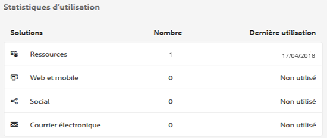
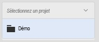
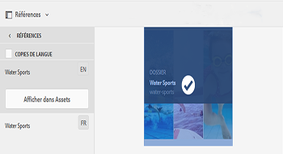
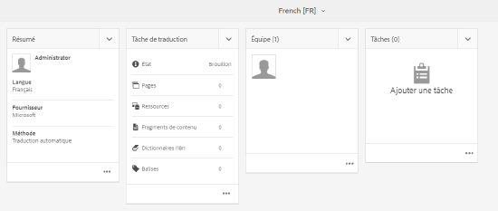
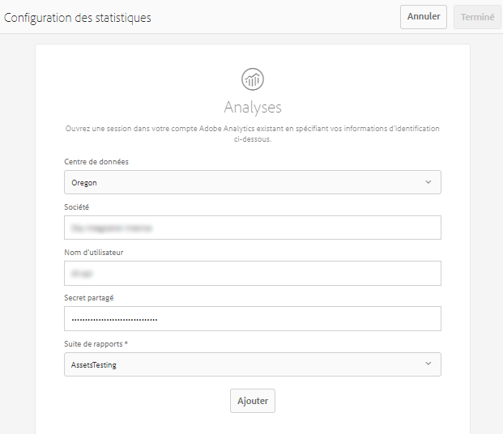
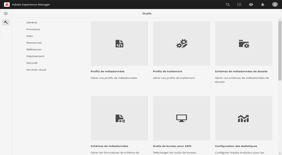

# Statistiques sur les ressources{#asset-insights}

<!-- TBD: Add uicontrol tags  -->

La fonction Statistiques sur les ressources vous permet d’effectuer le suivi des évaluations des utilisateurs et des statistiques d’utilisation des images utilisées dans les sites web tiers, les campagnes marketing et les solutions de création d’Adobe. Elle permet d’extraire les statistiques sur leurs performances et leur popularité.

La fonction Statistiques sur les ressources capture les détails de l’activité des utilisateurs, comme le nombre de fois qu’une image est évaluée et a fait l’objet d’un clic, ainsi que le nombre d’impressions (nombre de fois où une image est chargée sur le site web). Il attribue des scores aux images en fonction de ces statistiques. Vous pouvez utiliser les scores et les statistiques de performances pour sélectionner des images populaires à inclure dans des catalogues, des campagnes marketing, etc. Vous pouvez même formuler des stratégies de renouvellement de licence et d’archivage en fonction de ces statistiques.

Pour que la fonction Statistiques sur les ressources capture les statistiques d’utilisation des images à partir d’un site web, vous devez inclure le code intégré de l’image dans celui du site web.

Pour permettre aux statistiques sur les ressources d’afficher les statistiques d’utilisation des ressources, commencez par configurer la fonction afin qu’elle récupère les données de rapports d’Adobe Analytics. Pour plus d’informations, consultez la section [Configuration des statistiques sur les ressources](#configure-asset-insights).

>[!NOTE]
>
>Les statistiques sont uniquement prises en charge et fournies pour les images.

## View statistics for an image {#viewing-statistics-for-an-image}

Vous pouvez afficher les scores de statistiques sur les ressources à partir de la page des métadonnées.

1. From the Assets user interface (UI), select the image and then tap **[!UICONTROL Properties]** from the toolbar.
1. Dans la page Propriétés, appuyez sur **[!UICONTROL Statistiques]**.
1. Consultez les détails d’utilisation de la ressource dans l’onglet **[!UICONTROL Statistiques]**. The **[!UICONTROL Score]** section describes the total asset usage and performance sores of an asset .

   Le score d’utilisation indique le nombre de fois que la ressource est utilisée dans diverses solutions.

   Le score **[!UICONTROL Impressions]** correspond au nombre de fois que la ressource est chargée sur le site web. Le nombre affiché sous **[!UICONTROL Clics]** représente le nombre de fois que la ressource est cliquée.

1. Review the **[!UICONTROL Usage Statistics]** section to know which entities the asset was part of and which creative solutions recently used it. Plus l’utilisation est élevée, plus la ressource a de chances d’être populaire auprès des utilisateurs. Les données d’utilisation s’affichent sous les sections suivantes :

   * **Ressource** : nombre de fois où la ressource faisait partie d’une collection ou d’une ressource composite
   * **Web et mobile**: Nombre de fois où la ressource faisait partie de sites Web et d’applications
   * **Social** : nombre de fois où la ressource a été utilisée dans des solutions, comme Adobe Social et Adobe Campaign
   * **Courrier électronique** : nombre de fois où la ressource a été utilisée dans des campagnes par courrier électronique
   

   >[!NOTE]
   >
   >La fonctionnalité Statistiques des ressources récupérant généralement les données des solutions d’Adobe Analytics de manière périodique, la section Solutions ne peut pas afficher les données les plus récentes. La période pendant laquelle les données sont affichées dépend de la planification de l’opération de récupération que la fonction Statistiques sur les ressources exécute pour récupérer les données d’analyse.

1. Pour afficher les statistiques de performances de la ressource sous forme graphique sur une période, sélectionnez la période dans la section **[!UICONTROL Statistiques de performances]**. Les détails, y compris les clics et les impressions, sont affichés sous la forme de lignes de tendance d’un graphique.

   

   >[!NOTE]
   >
   >Contrairement à la section Solutions, la section Statistiques de performances affiche les données les plus récentes.

1. To obtain the embed code for the asset that you include in websites to gets performance data, tap/click **[!UICONTROL Get Embed Code]** below the asset thumbnail. <!-- For more information on how to include your Embed code in third-party web pages, see [Using Page Tracker and Embed code in web pages](/help/assets/use-page-tracker.md). -->

   

## View aggregate statistics for images {#viewing-aggregate-statistics-for-images}

Vous pouvez afficher les scores de toutes les ressources d’un dossier simultanément à l’aide du **[!UICONTROL mode Statistiques]**.

1. Dans l’IU Assets, accédez au dossier contenant les ressources dont vous souhaitez consulter les statistiques.
1. Appuyez/cliquez sur l’icône Mise en page de la barre d’outils, puis sélectionnez **[!UICONTROL Mode Statistiques]**.
1. La page affiche les scores d’utilisation pour les ressources. Comparez les évaluations des différentes ressources et tirez-en des conclusions.

## Planifier une tâche en arrière-plan {#scheduling-background-job}

La fonction Statistiques sur les ressources extrait les données d’utilisation des ressources à partir de suites de rapports Adobe Analytics de manière périodique. Par défaut, la fonction Statistiques sur les ressources exécute une tâche en arrière-plan toutes les 24 heures à 2 heures du matin pour récupérer les données. Cependant, vous pouvez modifier la fréquence et l’heure en configurant le service de **[!UICONTROL tâche de synchronisation de rapport de performances de ressource Adobe CQ DAM]** via la console Web.

1. Tap the AEM logo, and go to **[!UICONTROL Tools]** > **[!UICONTROL Operations]** > **[!UICONTROL Web Console]**.
1. Open the **[!UICONTROL Adobe CQ DAM Asset Performance Report Sync Job]** service configuration.

   

1. Spécifiez la fréquence du planificateur et l’heure de début désirées pour la tâche dans l’expression de planificateur de propriété. Enregistrez les modifications.

## Configuration des statistiques sur les ressources {#configure-asset-insights}

Adobe Experience Manager (AEM) Assets récupère les données d’utilisation des ressources AEM utilisées par les sites web tiers à partir d’Adobe Analytics. Pour permettre à la fonction Statistiques sur les ressources de récupérer ces données et de générer des informations, commencez par la configurer afin qu’elle s’intègre à Adobe Analytics.

>[!NOTE]
>
>Les statistiques sont uniquement prises en charge et fournies pour les images.

1. Dans AEM, cliquez sur **[!UICONTROL Outils]** > **[!UICONTROL Ressources]**.

   

1. Cliquez sur la vignette **[!UICONTROL Configuration des statistiques]**.
1. Dans l’assistant, sélectionnez un centre de données et fournissez vos informations d’identification, notamment le nom de votre société, votre nom d’utilisateur et votre secret partagé.

   
   *Figure : Configuration d’Adobe Analytics pour Assets Insights dans AEM*

1. Cliquez/appuyez sur **[!UICONTROL Authentifier]**. Une fois qu’AEM authentifie vos informations d’identification, dans la liste **[!UICONTROL Suite de rapports]**, sélectionnez une suite de rapports Adobe Analytics à partir de laquelle la fonction Statistiques sur les ressources doit récupérer les données. Cliquez sur **[!UICONTROL Ajouter]**.
1. After AEM sets up your report suite, tap **[!UICONTROL Done]**.

### Suivi de page {#page-tracker}

Une fois votre compte Adobe Analytics configuré, le code de suivi de page est généré à votre place. Pour permettre à la fonction Statistiques sur les ressources de surveiller les ressources AEM utilisées sur les sites web tiers, incluez le code de suivi de page dans le code du site web. Utilisez l’utilitaire de suivi de page d’AEM Assets pour générer le code de suivi de page. <!--  For more information on how to include your Page Tracker code in third-party web pages, see [Using Page Tracker and Embed code in web pages](/help/assets/use-page-tracker.md). -->

1. Dans AEM, cliquez sur **[!UICONTROL Outils]** > **[!UICONTROL Ressources]**.

   

1. From the **[!UICONTROL Navigation]** page, click the **[!UICONTROL Insights Page Tracker]** card.
1. Click **[!UICONTROL Download]** to download the page tracker code.

<!--

## Using demo package for Asset Insights {#using-demo-package-for-asset-insights}

Using the demo package, you can enable Adobe Asset Insights to capture data from and generate insights for a sample web page.

1. Configure Asset Insights using the instructions in [Configure Asset Insights](#configure-asset-insights).
1. Download the sample AEM Assets package from below and install the package from CRXDE package manager.

   [Get File](assets/insightsdemo.zip)

1. Download the ZIP file containing the sample web page from below and extract on your local file system.

   [Get File](assets/demosite.zip)

1. Click the web page to open it in the web browser.

   >[!CAUTION]
   >
   >Web Page is configured to load asset from the localhost server . In case your server is running somewhere else change server address from localhost to server address in the HTML content of the web page.

   >[!NOTE]
   >
   >The external web page can be in AEM itself.

-->
