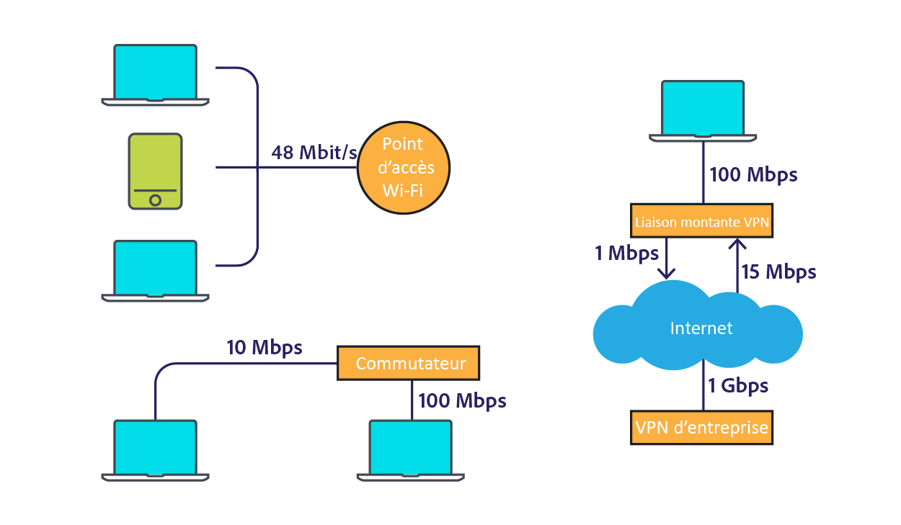
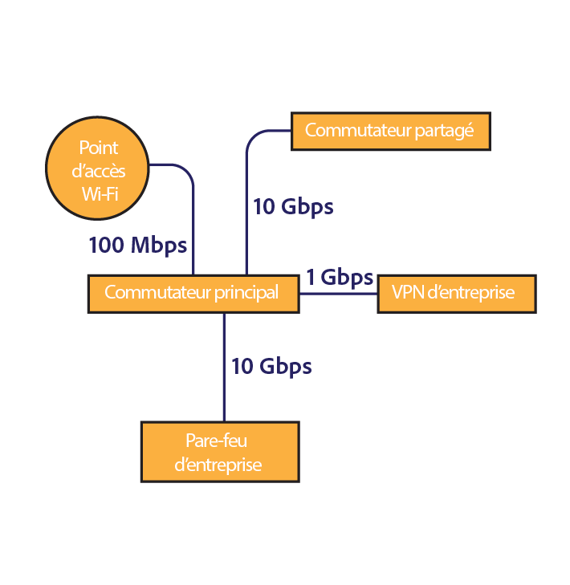
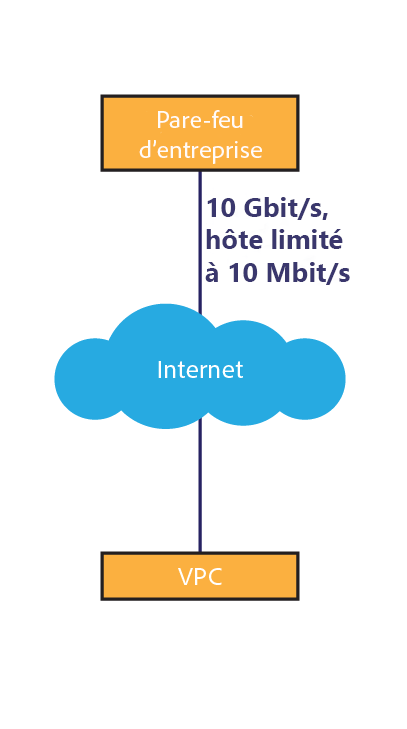
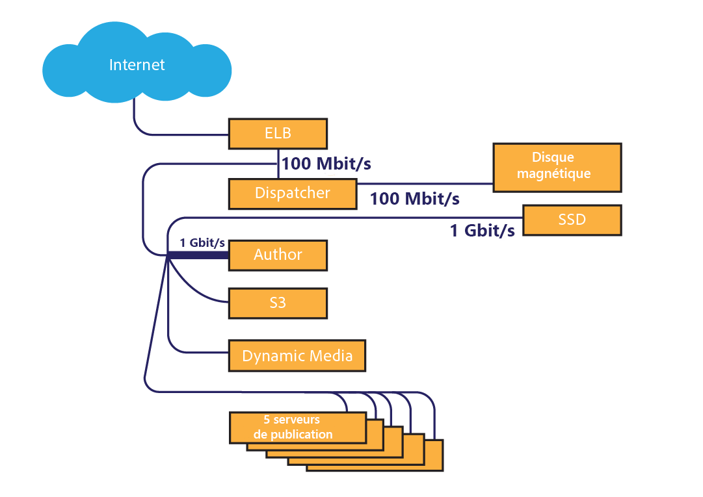
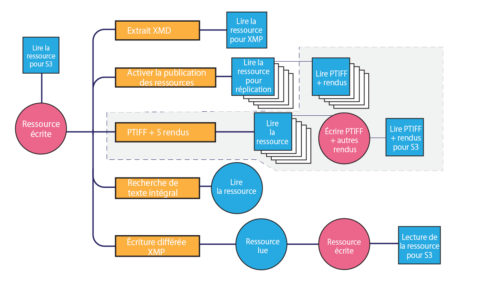

# Considérations sur le réseau d’Assets {#assets-network-considerations}

Une bonne connaissance du réseau est aussi importante que la compréhension d&#39;Adobe Experience Manager (AEM) Assets. Le réseau peut affecter les chargements, les téléchargements et l’expérience utilisateur. La création d’un diagramme de la topologie du réseau vous permet d’identifier les goulots d’étranglement et les zones sous-optimisées du réseau que vous devez optimiser pour améliorer les performances du réseau et l’expérience de l’utilisateur.

Veillez à inclure les éléments suivants dans votre diagramme de réseau :

* La connectivité du périphérique client (par exemple, l’ordinateur, le mobile ou la tablette) au réseau
* La topologie du réseau d’entreprise
* La liaison montante à Internet à partir du réseau d’entreprise et de l’environnement AEM
* La topologie de l’environnement AEM
* La définition des consommateurs simultanés de l’interface réseau AEM
* Processus définis de l’instance AEM

## Connectivité du périphérique client au réseau d’entreprise {#connectivity-from-the-client-device-to-the-corporate-network}

Commencez par créer le diagramme de la connectivité entre les différents périphériques client et le réseau d’entreprise. À ce stade, identifiez les ressources partagées, telles que les connexions Wi-Fi, pour lesquelles plusieurs utilisateurs accèdent au même point ou commutateur Ethernet pour transférer et télécharger des ressources.

Les périphériques client se connectent au réseau d’entreprise de différentes façons, telles que le wi-fi, Ethernet sur un commutateur partagé et le VPN. L’identification et la connaissance des goulots d’étranglement sur ce réseau est importante pour la planification d’Assets et pour modifier le réseau.

En haut à gauche du diagramme, on peut voir trois périphériques partageant un point d’accès WiFi de 48 Mbps. Si tous les périphériques effectuent un chargement simultané, la bande passante du réseau wi-fi est partagée entre les périphériques. Par rapport au système dans son ensemble, un utilisateur peut rencontrer un point de friction différent pour les trois clients sur ce canal divisé.

La mesure de la vitesse réelle d’un réseau Wi-Fi est complexe, car un périphérique lent peut impacter d’autres clients sur le point d’accès. Si vous prévoyez d’utiliser le Wi-Fi pour manipuler les ressources, effectuez un test de vitesse sur plusieurs clients en même temps pour évaluer le débit.

Le coin inférieur gauche du graphique présente deux périphériques connectés au réseau d’entreprise via des canaux indépendants. Par conséquent, chaque périphérique peut atteindre une vitesse comprise entre 10 Mbps et 100 Mbps.

L’ordinateur présenté à droite, connecté au réseau d’entreprise via un VPN, a un débit limité, avec une vitesse de 1 Mbps. L’expérience utilisateur est totalement différente avec une connexion de 1 Mbps et avec une connexion de 1 Gbps. En fonction de la taille des ressources que les utilisateurs manipulent, leur liaison VPN peut s’avérer insuffisante pour la tâche.

## Topologie du réseau d’entreprise {#topology-of-the-corporate-network}

Le diagramme présente des vitesses de liaison plus élevées au sein du réseau d’entreprise que ce qui est généralement utilisé. Ces canaux sont des ressources partagées. Si le commutateur partagé est censé gérer 50 clients, il peut se transformer en goulot d’étranglement. Dans le diagramme initial, seuls deux ordinateurs partagent la connexion.

## Liaison à Internet à partir du réseau d’entreprise et de l’environnement de AEM {#uplink-to-the-internet-from-the-corporate-network-and-aem-environment}

Il est important de prendre en compte les facteurs inconnus de la connexion Internet et VPC, car la bande passante sur Internet peut être restreinte par des pics de chargement ou des pannes de fournisseur à grande échelle. En général, une connexion Internet est fiable. Toutefois, cela peut parfois entraîner la création de goulots d’étranglement.

Au niveau de la liaison du réseau d’entreprise à Internet, il peut exister d’autres services utilisant la bande passante. Il est important de connaître la quantité de bande passante pouvant être dédiée ou donnée en priorité à AEM Assets. Par exemple, si un lien de 1 Gbps est déjà utilisé à 80 %, vous ne pouvez allouer qu’un maximum de 20 % de la bande passante aux ressources AEM.

Les pare-feux et les proxys de l’enterprise peuvent également former la bande passante de différentes manières. Ce type de périphérique peut prioriser la qualité du service de la bande passante, définir la bande passante maximale par utilisateur ou les limites de débit par hôte. Il est important d’analyser ces goulots d’étranglement, car ils peuvent avoir un impact significatif sur l’expérience utilisateur d’Assets.

Dans cet exemple, l’entreprise dispose d’une liaison de 10 Gbps. Cela doit être suffisant pour prendre en charge plusieurs clients. Par ailleurs, le pare-feu impose une limite de débit par hôte de 10 Mbps. Cette restriction risque de ralentir le trafic d’un seul hôte à 10 Mbps, même si la liaison montante à l’Internet est de 10 Gbps.

C’est le plus petit goulot d’étranglement axé sur le client. Cependant, vous pouvez opter pour une modification ou créer une liste blanche avec le groupe des opérations réseau responsable de ce pare-feu.

Les exemples de diagrammes vous permettent de conclure que six périphériques partagent un canal conceptuel de 10 Mbps. Selon la taille des ressources exploitées, cela peut s’avérer insuffisant pour répondre aux attentes de l’utilisateur.

## Topologie de l’environnement AEM {#topology-of-the-aem-environment}

La conception de la topologie de l’environnement AEM nécessite une connaissances détaillée de la configuration du système et de la manière dont le réseau est connecté à l’environnement de l’utilisateur.

L’exemple de scénario comprend une ferme de cinq serveurs, un espace de stockage binaire S3 et des médias dynamiques configurés.

Le Dispatcher partage une connexion de 100 Mbps avec deux entités, celle du monde externe et l’instance AEM. Pour les opérations simultanées de chargement et de téléchargement, vous devez diviser ce nombre par deux. L’espace de stockage externe joint utilise une connexion distincte.

L’instance AEM partage sa connexion de 1 Gbps/s avec plusieurs services. Du point de vue de la topologie du réseau, cela équivaut à partager un seul canal avec plusieurs services.

## Les workflow définis de votre instance AEM {#defined-workflows-of-the-aem-instance}

En tenant compte des performances du réseau, il peut être important de prendre en considération les workflow et la publication qui auront lieu dans le système. De plus, S3 ou tout autre stockage en réseau que vous utilisez, ainsi que les requêtes E/S consomment de la bande passante du réseau. Par conséquent, même dans un réseau entièrement optimisé, la performance peut être limitée par l’E/S du disque.

Pour simplifier les processus d’assimilation des ressources (notamment lors du chargement d’un grand nombre de ressources), vous devez explorer leurs workflow et en savoir plus sur leur configuration.

Lors de l’évaluation de la topologie interne du workflow, vous devez analyser ce qui suit :

* Les procédures d’écriture d’une ressource
* Les workflow/événements qui se déclenchent lorsqu’une ressource ou une métadonnée est modifiée
* Procédures de lecture d’une ressource

Voici quelques éléments à vérifier :

* Lecture/écriture différée des métadonnées XMP
* Activation et réplication automatiques
* Application d’un filigrane
* Assimilation de sous-ressources/Extraction de pages
* Chevauchement des workflow.

Voici un exemple de client pour la définition d’un workflow de ressource.

