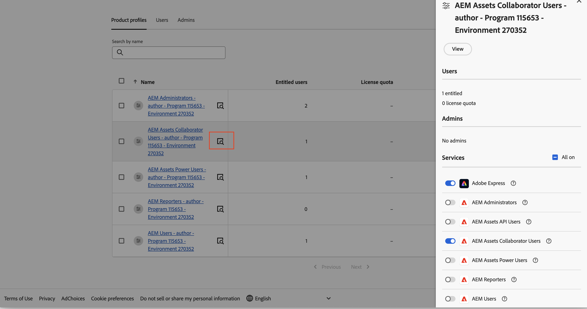

# [!DNL Assets] as a Cloud Service Prime  {#assets-prime}

| [Bonnes pratiques de recherche](/help/assets/search-best-practices.md) | [Bonnes pratiques relatives aux métadonnées](/help/assets/metadata-best-practices.md) | [Hub de contenus](/help/assets/product-overview.md) | [Fonctionnalités Dynamic Media avec OpenAPI](/help/assets/dynamic-media-open-apis-overview.md) | [Documentation de développement pour AEM Assets](https://developer.adobe.com/experience-cloud/experience-manager-apis/) |
| ------------- | --------------------------- |---------|----|-----|

Assets as a Cloud Service Prime comprend une gestion des actifs numériques légère qui vous permet d’exécuter diverses fonctionnalités clés, telles que :

* **Gestion des ressources et services de bibliothèque** : outils qui permettent aux utilisateurs et utilisatrices d’ingérer, de stocker, de cataloguer, de contrôler, de gérer et de gouverner les ressources numériques d’une marque dans un référentiel centralisé.

* **Recherche, découverte et collaboration** : outils qui permettent aux utilisateurs et utilisatrices de parcourir, de découvrir, de partager et de collaborer sur les ressources dont ils ont besoin pour créer des expériences client riches.

* **Sécurité et Rights Management** : outils de gestion de l’accès, des autorisations, des droits et de la sécurité pour garantir la conformité, la cohérence et l’intégrité de la marque.

* **Connexions Creative Cloud** : outils qui permettent aux équipes marketing et créatives de collaborer avec un accès, des commentaires, des révisions et des annotations simplifiés pour mettre à jour ou finaliser des ressources numériques.

* **Connexions Experience Cloud** : outils permettant de prendre en charge l’accès natif aux ressources numériques à partir d’autres applications et services Experience Cloud.

* **Expérience du portail de distribution sans options d’extensibilité (Content Hub)** : outils permettant d’étendre l’accès aux ressources numériques approuvées d’une marque à des parties prenantes étendues afin d’assurer la cohérence de l’utilisation et de la marque.

* **Intégrations** : intégrations à d’autres applications Adobe et autres qu’Adobe.

* **Dynamic Media (module complémentaire)** : outils permettant de transformer et de diffuser des images, des vidéos et d’autres contenus émergents pour des expériences multimédias riches, interactives et à grande échelle sur n’importe quel appareil.

  >[!NOTE]
  >
  >Dynamic Media avec les fonctionnalités OpenAPI, qui vous permet d’accéder à des modificateurs d’image de base tels que la rotation, le recadrage (manuel uniquement - aucun recadrage intelligent), le basculement, la taille, la préférence, la hauteur, la largeur, la qualité, le format et la diffusion vidéo adaptative en continu, est également disponible avec Assets Prime. Contactez l’équipe du compte d’Adobe pour en savoir plus.

1. [Créez un programme](/help/journey-onboarding/create-program.md).

Toutefois, à mesure que vos besoins en DAM s’accroissent et que vous avez besoin de davantage de fonctionnalités, telles que l’extensibilité de l’interface utilisateur, l’automatisation pilotée par les API et le déploiement de code personnalisé, vous devez envisager d’effectuer la mise à niveau vers [Assets Ultimate](/help/assets/assets-ultimate-overview.md).

Cet article fournit un workflow de bout en bout pour activer Assets as a Cloud Service Prime.

## Activer Assets as a Cloud Service Prime{#enable-assets-prime}

Activez Assets Prime lors de la création d’un programme à l’aide de Cloud Manager. Procédez comme suit :

1. En tant qu’administrateur système, connectez-vous à Cloud Manager. Assurez-vous de sélectionner la bonne organisation lors de la connexion.

   >[!NOTE]
   >
   >Assurez-vous d’être ajouté au profil de produit Cloud Manager approprié pour ajouter un nouveau programme. Pour plus d’informations, voir [Autorisations basées sur les rôles dans Cloud Manager](/help/onboarding/cloud-manager-introduction.md#role-based-permissions).

1. [Créez un programme](/help/journey-onboarding/create-program.md).

   Lors de la création du nouveau programme, dans l’onglet **[!UICONTROL Solutions &amp; Add-ons]**, sélectionnez **[!UICONTROL Assets Prime]**. Vous pouvez également développer **[!UICONTROL Assets Prime]** et sélectionner **[!UICONTROL Content Hub]** pour activer [Content Hub](/help/assets/product-overview.md) pour la distribution de ressources.

   

1. Cliquez sur **[!UICONTROL Créer]** pour créer le programme.

1. Cliquez sur la carte du programme et sur **[!UICONTROL Ajouter un environnement]**.

1. Indiquez le nom de l&#39;environnement, définissez une région et cliquez sur **[!UICONTROL Enregistrer]** pour créer l&#39;environnement.

   

>[!NOTE]
>
>Assets Prime vous permet uniquement de créer un environnement de production. L’option Ajouter un environnement n’est plus disponible une fois l’environnement de production créé.

Assets Prime est désormais activé pour Experience Manager Assets as a Cloud Service.

L’administrateur système est automatiquement autorisé en tant qu’administrateur AEM et reçoit un courrier électronique lui permettant d’accéder à l’Admin Console pour gérer les profils de produit.

Votre instance AEM as a Cloud Service sur Admin Console comprend les profils de produit suivants :

* Administrateurs et administratrices AEM

* Utilisateurs et utilisatrices AEM

* [Utilisateurs collaborateurs et utilisatrices collaboratrices AEM Assets](#onboard-collaborator-users)

* [Utilisateurs et utilisatrices experts AEM Assets](#onboard-power-users)

Vous pouvez commencer à ajouter des utilisateurs ou des groupes d’utilisateurs aux profils de produit Utilisateurs collaborateurs AEM Assets et Utilisateurs AEM Assets Power Users . Pour plus d’informations, voir [Utilisateurs collaborateurs d’AEM Assets intégrés](#onboard-collaborator-users) et [Utilisateurs Power d’AEM Assets intégrés](#onboard-power-users).

Si vous avez activé Content Hub pour Assets as a Cloud Service, une nouvelle instance est créée dans AEM Assets as a Cloud Service on Admin Console avec `delivery` comme suffixe :

>[!NOTE]
>
>Si vous avez configuré Content Hub avant le 14 août 2024, la nouvelle instance est créée avec `contenthub` comme suffixe.

Notez qu’il n’y a pas `author` ou `publish` dans le nom d’instance pour Content Hub.

Cliquez sur le nom de l’instance pour afficher le profil de produit `AEM Assets Limited Users` Content Hub.

Vous pouvez commencer à ajouter des utilisateurs ou des groupes d’utilisateurs à ce profil de produit pour leur permettre d’accéder à Content Hub.

>[!NOTE]
>
>Si vous avez configuré Content Hub avant le 14 août 2024, le profil de produit Content Hub a `contenthub` mentionné après `Limited Users` au lieu de `delivery`.

## Utilisateurs de collaborateur AEM Assets intégrés {#onboard-collaborator-users}

Les utilisateurs collaborateurs d’AEM Assets peuvent travailler avec des ressources d’Experience Manager via des intégrations d’Assets disponibles pour votre entreprise dans d’autres produits d’Adobe et applications non Adobes, créer et modifier des ressources à l’aide d’un Adobe Express intégré et d’un Firefly exploitant des modèles conçus de manière professionnelle, des kits de marque, des ressources Adobe Stock, etc., ainsi qu’accéder et exploiter des ressources approuvées de votre entreprise à l’aide du portail AEM Assets Content Hub.

Pour les utilisateurs de collaborateur intégrés :

1. Accédez aux profils de produit Experience Manager Assets en cliquant sur le nom du produit AEM as a Cloud Service dans la liste des produits sur Admin Console.

1. Cliquez sur l’instance d’auteur de production pour AEM as a Cloud Service :
   

1. Cliquez sur le profil de produit Utilisateurs collaborateurs et cliquez sur **[!UICONTROL Ajouter des utilisateurs]** pour ajouter l’utilisateur au profil de produit.
   

1. Cliquez sur **[!UICONTROL Enregistrer]** pour enregistrer les modifications.

Vous pouvez également accéder aux services affectés aux utilisateurs Collaborateurs et les afficher, comme illustré dans l’image suivante :

Les services `Adobe Express` et `AEM Assets Collaborator Users` sont activés par défaut. Vous pouvez activer et désactiver le bouton d’activation, mais selon vos besoins, Adobe recommande d’utiliser les services par défaut activés pour les profils de produit.

## Utilisateurs AEM Assets Power intégrés {#onboard-power-users}

Les utilisateurs AEM Assets Power peuvent accéder à toutes les fonctionnalités d’AEM Assets, notamment la gestion des ressources, les autorisations, les métadonnées et la gouvernance et l’automatisation globales des ressources numériques, travailler avec des ressources d’Experience Manager via des intégrations d’Assets disponibles pour votre entreprise dans d’autres applications d’Adobe et non-Adobe, créer et modifier des ressources à l’aide d’un Adobe Express intégré et d’un Firefly en utilisant des modèles conçus de manière professionnelle, des kits de marque, des ressources d’Adobe Stock, des ressources d’, des ressources d’et des ressources d’AEM Assets portail Content Hub.

Pour embarquer des utilisateurs Power :

1. Accédez aux profils de produit Experience Manager Assets en cliquant sur le nom du produit AEM as a Cloud Service dans la liste des produits sur Admin Console.

1. Cliquez sur l’instance d’auteur de production pour AEM as a Cloud Service :
   

1. Cliquez sur le profil de produit Power users et cliquez sur **[!UICONTROL Ajouter des utilisateurs]** pour ajouter l’utilisateur au profil de produit.
   

1. Cliquez sur **[!UICONTROL Enregistrer]** pour enregistrer les modifications.

Vous pouvez également accéder aux services affectés aux utilisateurs Power et les afficher, comme illustré dans l’image suivante :

Les services `Adobe Express` et `AEM Assets Power Users` sont activés par défaut. Vous pouvez activer et désactiver le bouton d’activation, mais selon vos besoins, Adobe recommande d’utiliser les services par défaut activés pour les profils de produit.
