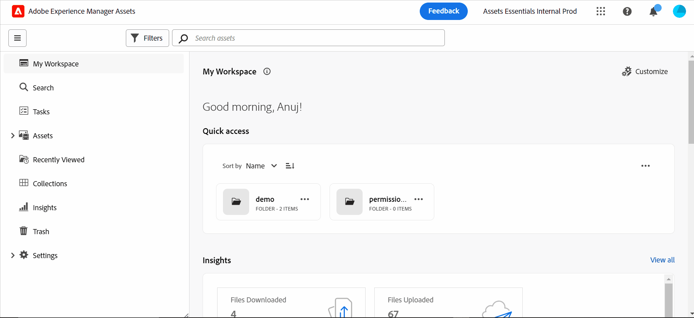

# Présentation de la vue Assets {#assets-view}

<table>
    <tr>
        <td>
            <i>Nouveau</i> <a href="/help/assets/dynamic-media/dm-prime-ultimate.md"><b>Dynamic Media Prime et Ultimate</b></a>
        </td>
        <td>
            <i>Nouveau</i> <a href="/help/assets/assets-ultimate-overview.md"><b>AEM Assets Ultimate</b></a>
        </td>
        <td>
            <i>Nouvelle</i> <a href="/help/assets/integrate-aem-assets-edge-delivery-services.md"><b>Intégration d’AEM Assets à Edge Delivery Services</b></a>
        </td>
        <td>
            <i>Nouveau</i> <a href="/help/assets/aem-assets-view-ui-extensibility.md"><b>Extensibilité de l’interface utilisateur</b></a>
        </td>
          <td>
            <i>Nouveau</i> <a href="/help/assets/dynamic-media/enable-dynamic-media-prime-and-ultimate.md"><b>Activation de Dynamic Media Prime et Ultimate</b></a>
        </td>
    </tr>
    <tr>
        <td>
            <a href="/help/assets/search-best-practices.md"><b>Bonnes pratiques de recherche</b></a>
        </td>
        <td>
            <a href="/help/assets/metadata-best-practices.md"><b>Bonnes pratiques relatives aux métadonnées</b></a>
        </td>
        <td>
            <a href="/help/assets/product-overview.md"><b>Hub de contenus</b></a>
        </td>
        <td>
            <a href="/help/assets/dynamic-media-open-apis-overview.md"><b>Fonctionnalités Dynamic Media avec OpenAPI</b></a>
        </td>
        <td>
            <a href="https://developer.adobe.com/experience-cloud/experience-manager-apis/"><b>Documentation de développement pour AEM Assets</b></a>
        </td>
    </tr>
</table>

Dans le paysage numérique actuel, où la création et la diffusion de contenu en temps réel sont essentielles, une expérience de gestion des actifs numériques (DAM) conçue pour la vitesse marketing en aval est primordiale. Adobe, grâce à son expertise dans l’autonomisation des professionnels du marketing et de la création, introduit une nouvelle expérience utilisateur qui change la donne. Cette approche axée sur les workflows permet de révolutionner la manière dont les entreprises gèrent leurs ressources numériques dynamiques, en permettant aux personnes spécialisées dans le marketing d’optimiser l’efficacité dans la recherche, la collaboration, la personnalisation et la diffusion des ressources. Ces workflows rationalisés accélèrent la vitesse du contenu et propulsent vos efforts marketing vers de nouveaux sommets.

Pour en savoir plus sur les expériences personnalisées disponibles pour Assets as a Cloud Service, voir [Présentation d’Assets as a Cloud Service](/help/assets/overview.md#persona-based-experiences).

## Comment accéder à la vue Assets ? {#access-assets-view}

Vous pouvez accéder à la vue Assets de la manière suivante :

<!--

* **Toggle in Admin view**

    * Log into [!DNL Experience Manager] using Cloud Manager.
    * Navigate to **[!UICONTROL Assets]** > **[!UICONTROL Files]**.
    * Click the profile icon on the top right corner.
    * Click **[!UICONTROL Switch View]** from the **[!UICONTROL Profile Settings]** section.
    Repeat these steps to switch back to the Admin view.

* **Product Switcher**
    * Log into [!DNL Experience Manager] and click .
    * Select **[!UICONTROL Experience Manager Assets]** to access the Assets view.
    * Select **[!UICONTROL Experience Manager]** to access the Admin view.

* **Quick Links** 
    * Log into experience.adobe.com.
    * Click **[!UICONTROL Experience Manager Assets]** to access the Assets view.
    * Click **[!UICONTROL Experience Manager Assets]** to access the Assets view.

    -->

## À quoi sert la vue Assets ?

La vue Assets offre les principaux avantages suivants, qui ne sont pas disponibles dans la vue Administration :

* [Tableau de bord Mon espace de travail offrant des expériences rationalisées](#my-workspace-for-streamlined-experience)
* [Approche axée sur la recherche en priorité pour une efficacité accrue](#search-first)
* [Insights pour la prise de décisions pilotées par les données](#insights-data)
* [Intégration d’Adobe Photoshop Express pour accélérer la collaboration](#accelerate-collaboration)
* [Chargements de dossiers pour la configuration de la structure hiérarchique de votre organisation](#folder-uploads)
* [Abonnement au contenu du référentiel pour une gestion efficace des ressources](#subscribe-content)
* [Suppression progressive des ressources pour un meilleur contrôle par les personnes administratrices](#soft-delete-assets)

### Tableau de bord Mon espace de travail offrant des expériences rationalisées {#my-workspace-for-streamlined-experience}

Découvrez une solution de gestion des ressources numériques qui comprend les divers besoins des différents rôles de l’entreprise. L’élégante vue Assets privilégie la facilité d’utilisation et la vitesse, répondant ainsi aux préférences des professionnels du marketing en matière d’attrait visuel et d’espaces de travail encombrants. Grâce au tableau de bord Mon espace de travail personnalisé en fonction de la personne qui l’utilise, les personnes spécialisées dans le marketing peuvent rapidement trouver, prévisualiser, modifier, gérer et diffuser des ressources avec une efficacité remarquable. Dites adieu aux interminables heures passées à rechercher des ressources spécifiques. Nous vous proposons aujourd’hui une expérience simplifiée qui met à votre portée tout ce dont vous avez besoin.

### Insights pour la prise de décisions pilotées par les données {#insights-data}

Pour suivre la vitesse du contenu, il est essentiel de pouvoir tirer parti d’informations exploitables. La vue Assets offre des informations avancées dans My Workspace, fournissant des données précieuses sur les performances des ressources, l’utilisation des audiences et les engagements. Les personnes spécialiées dans le marketing peuvent prendre des décisions pilotées par les données, optimiser les stratégies de contenu et affiner leur diffusion en aval pour obtenir des résultats optimaux. Grâce à l’accès à des informations pertinentes, les entreprises ont une longueur d’avance sur la concurrence et génèrent des résultats exceptionnels.

### Intégration d’Adobe Photoshop Express pour accélérer la collaboration {#accelerate-collaboration}

La nouvelle expérience fournit un solide ensemble de fonctionnalités de collaboration, notamment la modification en temps réel avec des fonctionnalités Adobe Photoshop intégrées, des contrôles de version et des outils d’annotation. Ainsi, la collaboration est transparente entre les équipes de conception, de création, de valorisation de marque et de marketing, ce qui leur permet de surmonter les goulets d’étranglement et d’accélérer le processus des opérations marketing. Les personnes spécialisées dans le marketing disposent désormais d’outils puissants pour accélérer la livraison des projets et accroître leur productivité globale.

Regardez cette vidéo pour comprendre la puissance de l’intégration de la vue Assets à Adobe Photoshop Express :

>[!VIDEO](https://video.tv.adobe.com/v/3420922)

Les prochaines versions d’Assets as a Cloud Service comprennent également l’[Intégration d’Adobe Firefly via Adobe Express](https://firefly.adobe.com/?gclid=EAIaIQobChMIlZeKuNfj_wIVeyCtBh3e5g2cEAAYASAAEgL56_D_BwE&amp;sdid=JM4FW6VL&amp;mv=search&amp;mv2=paidsearch&amp;ef_id=EAIaIQobChMIlZeKuNfj_wIVeyCtBh3e5g2cEAAYASAAEgL56_D_BwE:G:s&amp;s_kwcid=AL!3085!3!652077237594!e!!g!!adobe%20firefly!19870733758!148140507838).

### Chargements de dossiers pour la configuration de la structure hiérarchique de votre organisation {#folder-uploads}

Configurez rapidement une structure de dossiers pour votre organisation à l’aide de la vue Assets en chargeant les dossiers qui existent sur votre système de fichiers local. Il n’est pas nécessaire de créer des dossiers sous le dossier racine et de charger manuellement les ressources dans ces dossiers afin de conserver la structure hiérarchique logique. Tous les dossiers et ressources situés sous le dossier racine sont automatiquement chargés vers Experience Manager Assets.

### Approche axée sur la recherche en priorité pour une efficacité accrue {#search-first}

Déverrouillez tout le potentiel de la bibliothèque de ressources numériques de votre entreprise grâce à la puissance des recherches et aux fonctionnalités de pointe. Vous pouvez dire adieu aux tracas liés à la navigation manuelle dans d’innombrables fichiers et dossiers. Les utilisateurs et utilisatrices peuvent immédiatement localiser l’image, la vidéo ou le document dont ils ont besoin pour créer des campagnes marketing à couper le souffle, des présentations captivantes et du contenu engageant. Notre premier moteur de recherche vous permet de parcourir facilement les types de ressources, les métadonnées, les balises intelligentes et même le contenu lui-même sans connaître le mot-clé exact. Préparez l’avenir de la gestion des ressources numériques avec notre approche axée sur la recherche et libérez tout le potentiel de votre bibliothèque de ressources numériques.

### Abonnement au contenu du référentiel pour une gestion efficace des ressources {#subscribe-content}

La vue Assets permet de surveiller les opérations effectuées sur les ressources, dossiers ou collections disponibles dans le référentiel. Pour recevoir les notifications, vous devez sélectionner le contenu et vous y abonner. Vous pouvez également configurer les types d’événements, tels que la suppression de votre contenu abonné, les modifications apportées au contenu abonné, etc. Les notifications vous sont alors envoyées uniquement pour ces types d’événements.

### Suppression progressive des ressources pour un meilleur contrôle par les personnes administratrices {#soft-delete-assets}

Le dossier Corbeille disponible dans la vue Ressources répertorie les ressources supprimées du dossier Ressources racine. Vous pouvez sélectionner une ressource dans le dossier Corbeille pour la restaurer à l’emplacement d’origine ou la supprimer définitivement. Vous pouvez également spécifier un mot-clé ou appliquer des filtres standard ou personnalisés pour rechercher les ressources appropriées dans le dossier Corbeille.

En plus de ces fonctionnalités, la vue Ressources vous permet d’exécuter les fonctionnalités suivantes qui ne sont pas disponibles dans la vue Admin :

* Charger la nouvelle version d’une ressource portant un nom différent, depuis votre système de fichiers local vers le référentiel de ressources. La ressource chargée est disponible sous la forme d’une nouvelle version portant le même nom que la ressource d’origine.

* Renommer les ressources et le dossier disponibles dans le référentiel.

La vue Assets est conçue pour rationaliser les workflows, favoriser la collaboration et accélérer la diffusion des ressources. En adoptant la vitesse du contenu, les spécialistes du marketing peuvent exploiter tout le potentiel de leurs ressources numériques et libérer leur créativité comme jamais auparavant.

Utilisez ces liens pour commencer rapidement à utiliser la vue Assets :

* [Mon espace de travail](/help/assets/my-workspace-assets-view.md)
* [Prise en main de la vue Ressources](/help/assets/get-started-assets-view.md)
