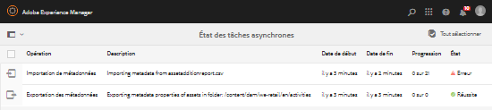
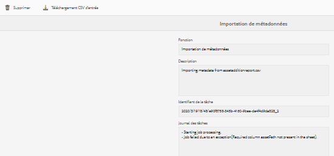

# Opérations asynchrones {#asynchronous-operations}

Pour réduire l’impact négatif sur les performances, Adobe Experience Manager (AEM) Assets traite de manière asynchrone certaines opérations sur les ressources de longue durée et requérant de nombreuses ressources système.

Ces opérations incluent :

* Suppression de nombreuses ressources
* Déplacement de nombreuses ressources ou de ressources avec de nombreuses références
* Exportation/importation de métadonnées de ressources en masse
* Récupération des ressources, qui sont au-dessus du seuil défini, à partir d’un déploiement AEM distant.

Le traitement asynchrone implique de mettre plusieurs tâches en file d’attente et de les exécuter par la suite en série selon la disponibilité des ressources système.

You can view the status of asynchronous jobs from the **[!UICONTROL Async Job Status]** page.

>[!NOTE]
>
>Par défaut, les tâches dans AEM Assets s’exécutent en parallèle. Si N est le nombre de cœurs d’unité centrale, N/2 tâches peuvent s’exécuter en parallèle, par défaut. Pour utiliser des paramètres personnalisés pour la file d’attente des travaux, modifiez la configuration **File d’attente par défaut des opérations asynchrones** à partir de la console web. For more information, see [Queue Configurations](https://sling.apache.org/documentation/bundles/apache-sling-eventing-and-job-handling.html#queue-configurations).

## Surveillance de l’état des opérations asynchrones {#monitoring-the-status-of-asynchronous-operations}

Chaque fois qu’AEM Assets traite une opération asynchrone, vous recevez une notification dans votre boîte de réception et par courrier électronique.

To view the status of the asynchronous operations in detail, navigate to the **[!UICONTROL Async Job Status]** page.

1. Appuyez/cliquez sur le logo AEM et accédez à **[!UICONTROL Assets]** > **[!UICONTROL Tâches]**.
1. In the **[!UICONTROL Async Job Status]** page, review the details of the operations.

   

   Pour vérifier la progression d’une opération particulière, reportez-vous à la valeur dans la colonne **[!UICONTROL État]**. Selon la progression, l’un des états suivants s’affiche :

   **[!UICONTROL Actif]** : l’opération est en cours de traitement.

   **[!UICONTROL Réussite]** : l’opération est terminée.

   **[!UICONTROL Échec]** ou **[!UICONTROL Erreur]** : l’opération n’a pas pu être traitée.

   **[!UICONTROL Planifié]** : l’opération est planifiée à une date ultérieure.

1. Pour arrêter une opération active, sélectionnez-la dans la liste, puis appuyez/cliquez sur l’icône **[!UICONTROL Arrêter]** de la barre d’outils.

   

1. Pour afficher des détails supplémentaires, par exemple, la description et les journaux, sélectionnez l’opération, puis appuyez/cliquez sur l’icône **[!UICONTROL Ouvrir]** de la barre d’outils.

   

   La page des détails de la tâche s’affiche.

   

1. Pour supprimer l’opération de la liste, sélectionnez **[!UICONTROL Supprimer]** dans la barre d’outils. Pour télécharger les détails dans un fichier CSV, appuyez/cliquez sur l’icône **[!UICONTROL Télécharger]**.

   >[!NOTE]
   >
   >Vous ne pouvez pas supprimer une tâche si son état est Actif ou Placé en file d’attente.

## Purge de tâches terminées {#purging-completed-jobs}

AEM Assets exécute une tâche de purge quotidienne à 1 h 00 du matin afin de supprimer les tâches asynchrones terminées depuis plus d’un jour.

Vous pouvez modifier la planification de la tâche de purge et la durée de conservation des détails des tâches terminées avant leur suppression. Vous pouvez également configurer le nombre maximal de tâches terminées pour lesquelles les détails sont conservés à un moment donné dans le temps.

1. Appuyez/cliquez sur le logo AEM, puis accédez à **[!UICONTROL Outils]** > **[!UICONTROL Opérations]** > **[!UICONTROL Console web]**.
1. Open the **[!UICONTROL Adobe CQ DAM Async Jobs Purge Scheduled]** job.
1. Indiquez le nombre limite de jours après la suppression des tâches terminées et le nombre maximal de tâches pour lesquelles les détails sont conservés dans l’historique.

   
   *Figure : Configuration pour planifier la purge des tâches asynchrones*

1. Enregistrez les modifications.

## Configuration des seuils pour traitement asynchrone {#configuring-thresholds-for-asynchronous-processing}

Vous pouvez configurer le nombre seuil de ressources ou de références pour AEM Assets afin de traiter une opération spécifique de façon asynchrone.

### Configuration des seuils pour les opérations de suppression asynchrones {#configuring-thresholds-for-asynchronous-delete-operations}

Si le nombre de ressources ou de dossiers à supprimer dépasse le nombre seuil, l’opération de suppression est effectuée de façon asynchrone.

1. Appuyez/cliquez sur le logo AEM, puis accédez à **[!UICONTROL Outils]** > **[!UICONTROL Opérations]** > **[!UICONTROL Console web]**.
1. From the web console, open the **[!UICONTROL Async Delete Operation Job Processing]** configuration.
1. In the **[!UICONTROL Threshold number of assets]** box, specify the threshold number of assets/folders for asynchronous processing of delete operations.

   

1. Enregistrez les modifications.

### Configuration des seuils pour les opérations de déplacement asynchrones {#configuring-thresholds-for-asynchronous-move-operations}

Si le nombre de ressources/dossiers ou de références à déplacer dépasse le nombre seuil, l’opération de déplacement est effectuée de façon asynchrone.

1. Appuyez/cliquez sur le logo AEM, puis accédez à **[!UICONTROL Outils]** > **[!UICONTROL Opérations]** > **[!UICONTROL Console web]**.
1. From the web console, open the **[!UICONTROL Async Move Operation Job Processing]** configuration.
1. In the **[!UICONTROL Threshold number of assets/references]** box, specify the threshold number of assets/folders or references for asynchronous processing of move operations.

   

1. Enregistrez les modifications.
