# Vérification de ressources dans des dossiers et des collections {#review-folder-assets-and-collections}

À l’aide des ressources d’Adobe Experience Manager (AEM), vous pouvez définir des workflows de révision ad hoc pour les ressources qui se trouvent dans un dossier ou dans une collection. Vous pouvez le partager avec des réviseurs ou des partenaires créatifs pour obtenir leurs commentaires. Vous pouvez soit associer le workflow de révision à un projet, soit créer une tâche de révision indépendante.

Une fois que vous avez partagé les ressources, les réviseurs peuvent les approuver ou les rejeter. Les notifications sont envoyées à différentes étapes du workflow pour informer les destinataires voulus de la fin des diverses tâches. Par exemple, lorsque vous partagez un dossier ou une collection, le réviseur reçoit une notification lui indiquant qu’un dossier/une collection a été partagé(e) pour la révision.

Une fois que le réviseur a terminé la révision (approuvé ou rejeté les ressources), vous recevez une notification de fin de révision.

## Création d’une tâche de révision pour des dossiers   {#creating-a-review-task-for-folders}

1. Dans l’interface utilisateur Assets, sélectionnez le dossier pour lequel vous souhaitez créer une tâche de révision.
1. Dans la barre d’outils, appuyez/cliquez sur l’icône **[!UICONTROL Créer une tâche de révision]** pour ouvrir la page **[!UICONTROL Tâche de révision]**. Si l’icône n’apparaît pas dans la barre d’outils, appuyez/cliquez sur **[!UICONTROL Plus]**, puis sélectionnez l’icône.

   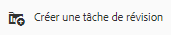

1. (Facultatif) Dans la liste **[!UICONTROL Projets]**, choisissez le projet auquel vous voulez associer la tâche de révision. Par défaut, l’option **[!UICONTROL Aucun]** est sélectionnée. Si vous ne souhaitez associer aucun projet à la tâche de révision, conservez cette sélection.

   >[!NOTE]
   >
   >Seuls les projets pour lesquels vous disposez d’autorisations de niveau Éditeur (ou supérieur) apparaissent dans la liste **[!UICONTROL Projets]**.

1. Entrez un nom pour la tâche de révision, puis sélectionnez un approbateur dans la liste **[!UICONTROL Affecter à.]**

   >[!NOTE]
   >
   >Les membres/groupes du projet sélectionné sont disponibles en tant qu’approbateurs dans la liste **[!UICONTROL Affecter à.]**

1. Entrez une description, la priorité et la date d’échéance de la tâche de révision.

   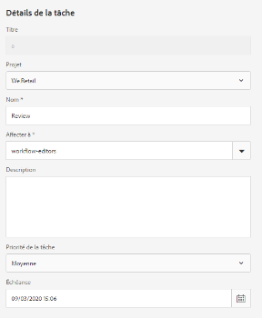

1. Dans l’onglet Avancé, entrez le libellé à utiliser pour créer l’URI.

   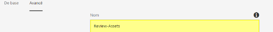

1. Appuyez/cliquez sur **[!UICONTROL Envoyer]**, puis sur **[!UICONTROL Terminé]** pour fermer le message de confirmation. Une notification pour la nouvelle tâche est envoyée à l’approbateur.
1. Connectez-vous à AEM Assets en tant qu’approbateur et accédez à l’IU Assets. Pour approuver des ressources, cliquez/appuyez sur l’icône **[!UICONTROL Notifications]**, puis sélectionnez la tâche de révision dans la liste.

   

1. Sur la page **[!UICONTROL Tâche de révision]**, examinez les détails de la tâche de révision, puis appuyez/cliquez sur **[!UICONTROL Réviser]**.
1. Sur la page **[!UICONTROL Tâche de révision]**, sélectionnez les ressources, puis appuyez/cliquez sur l’icône **[!UICONTROL Approuver/Rejeter]** pour approuver ou rejeter, de manière appropriée.

   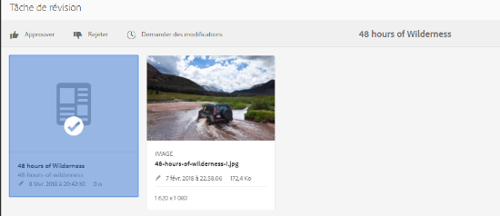

1. Appuyez/cliquez sur l’icône **[!UICONTROL Terminé]** dans la barre d’outils. Dans la boîte de dialogue, saisissez un commentaire, puis appuyez/cliquez sur **[!UICONTROL Terminé]** pour confirmer.
1. Accédez à l’IU Assets et ouvrez le dossier. Les icônes d’état d’approbation pour les ressources apparaissent dans les modes Carte et Liste.

   **Mode Carte**

   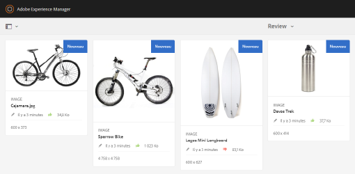

   **Mode Liste**

   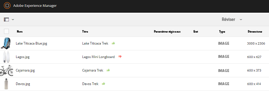

## Création d’une tâche de révision pour les collections {#creating-a-review-task-for-collections}

1. Sur la page Collections, sélectionnez la collection pour laquelle vous souhaitez créer une tâche de révision.
1. Dans la barre d’outils, appuyez/cliquez sur l’icône **[!UICONTROL Créer une tâche de révision]** pour ouvrir la page **[!UICONTROL Tâche de révision]**. Si l’icône n’apparaît pas dans la barre d’outils, appuyez/cliquez sur **[!UICONTROL Plus]**, puis sélectionnez l’icône.

   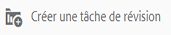

1. (Facultatif) Dans la liste **[!UICONTROL Projets]**, choisissez le projet auquel vous voulez associer la tâche de révision. Par défaut, l’option **[!UICONTROL Aucun]** est sélectionnée. Si vous ne souhaitez associer aucun projet à la tâche de révision, conservez cette sélection.

   >[!NOTE]
   >
   >Seuls les projets pour lesquels vous disposez d’autorisations de niveau Éditeur (ou supérieur) apparaissent dans la liste **[!UICONTROL Projets]**.

1. Entrez un nom pour la tâche de révision, puis sélectionnez un approbateur dans la liste **[!UICONTROL Affecter à.]**

   >[!NOTE]
   >
   >Les membres/groupes du projet sélectionné sont disponibles en tant qu’approbateurs dans la liste **[!UICONTROL Affecter à.]**

1. Entrez une description, la priorité et la date d’échéance de la tâche de révision.

   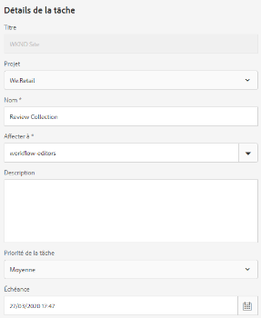

1. Appuyez/cliquez sur **[!UICONTROL Envoyer]**, puis sur **[!UICONTROL Terminé]** pour fermer le message de confirmation. Une notification pour la nouvelle tâche est envoyée à l’approbateur.
1. Connectez-vous à AEM Assets en tant qu’approbateur et accédez à la console Ressources. Pour approuver des ressources, appuyez/cliquez sur l’icône **[!UICONTROL Notifications]**, puis sélectionnez la tâche de révision dans la liste.
1. Sur la page **[!UICONTROL Tâche de révision]**, examinez les détails de la tâche de révision, puis appuyez/cliquez sur **[!UICONTROL Réviser]**.
1. Toutes les ressources situées dans la collection sont visibles dans le panneau de révision. Sélectionnez les ressources, puis appuyez/cliquez sur l’icône **[!UICONTROL Approuver/Rejeter]** pour approuver ou rejeter les ressources selon les besoins.

   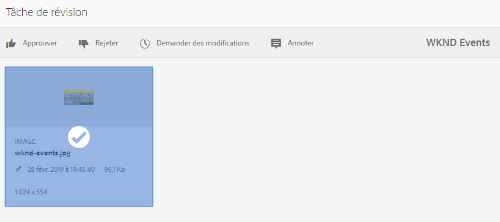

1. Appuyez/cliquez sur l’icône **[!UICONTROL Terminé]** dans la barre d’outils. Dans la boîte de dialogue, saisissez un commentaire, puis appuyez/cliquez sur **[!UICONTROL Terminé]** pour confirmer.
1. Accédez à la console Collections et ouvrez la collection. Les icônes d’état d’approbation pour les ressources apparaissent dans les modes Carte et Liste.

   **Mode Carte**

   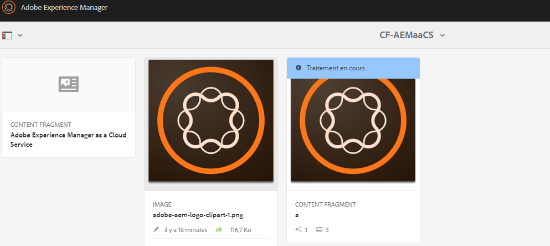

   **Mode Liste**

   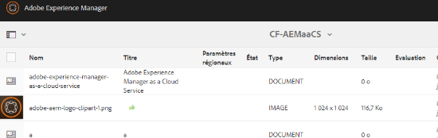

