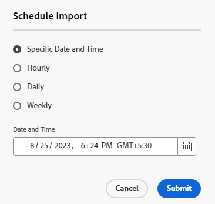

# Importation de ressources en bloc à l’aide de la vue Assets  {#bulk-import-assets-view}

L’importation en bloc dans la vue AEM Assets permet aux administrateurs d’importer un grand nombre de ressources d’une source de données vers AEM Assets. Les administrateurs n’ont plus besoin de charger des ressources ou des dossiers individuels vers AEM Assets.

>[!NOTE]
>
>L’importateur en masse d’affichage des ressources utilise le même serveur principal que celui de l’importateur en masse d’affichage administrateur. Cependant, il offre davantage de sources de données à importer et une expérience utilisateur plus simplifiée.

Vous pouvez importer des ressources à partir des sources de données suivantes :

* Azure
* AWS
* Google Cloud
* Dropbox

## Conditions préalables requises {#prerequisites}

| Source de données | Conditions préalables requises |
|-----|------|
| Azure | <ul> <li>Compte de stockage Azure </li> <li> Conteneur d’objets blob Azure <li> Clé d’accès Azure ou jeton SAS en fonction du mode d’authentification </li></ul> |
| AWS | <ul> <li>Région AWS </li> <li> Compartiment AWS <li> Clé d’accès AWS </li><li> Secret d’accès AWS </li></ul> |
| Google Cloud | <ul> <li>Compartiment GCP </li> <li> Adresse e-mail du compte de service GCP <li> Clé privée du compte de service GCP</li></ul> |
| Dropbox | <ul> <li>Identifiant du client Dropbox </li> <li> Secret client Dropbox</li></ul> |

Outre ces conditions préalables en fonction de la source de données, vous devez connaître le nom du dossier source disponible dans votre source de données, qui contient toutes les ressources à importer dans AEM Assets.

## Création d’une configuration d’importation en bloc {#create-bulk-import-configuration}

Pour créer une configuration d’import en bloc, procédez comme suit :

1. Accédez à **[!UICONTROL Paramètres]** > **[!UICONTROL Importation en bloc]** et cliquez sur **[!UICONTROL Créer un import]**.
1. Sélectionnez la source de données. Les options disponibles sont Azure, AWS, Google Cloud et Dropbox.
1. Indiquez un nom pour la configuration de l’importation en bloc dans la variable **[!UICONTROL Nom]** champ .
1. Spécifiez les informations d’identification spécifiques à la source de données, comme indiqué dans la section [Conditions préalables](#prerequisites).
1. Indiquez le nom du dossier racine qui contient les ressources de la source de données dans le champ **[!UICONTROL Dossier source]**.
1. (Facultatif) Sélectionnez le **[!UICONTROL Suppression du fichier source après importation]** pour supprimer les fichiers d’origine de l’entrepôt de données source une fois les fichiers importés dans Experience Manager Assets.
1. Sélectionnez le **[!UICONTROL Mode d’importation]**. Les modes suivants sont disponibles : **[!UICONTROL Ignorer]**, **[!UICONTROL Remplacer]** ou **[!UICONTROL Créer une version]**. Le mode Ignorer est le mode par défaut. Dans ce mode, l’éditeur ignore l’importation d’une ressource si elle existe déjà.
   

1. (Facultatif) Indiquez le fichier de métadonnées à importer, fourni au format CSV, dans le champ Fichier de métadonnées, puis cliquez sur **[!UICONTROL Suivant]** pour accéder à **[!UICONTROL Emplacement et filtres]**.
1. Pour définir un emplacement dans la gestion des ressources numériques où les ressources doivent être importées à l’aide de la variable **[!UICONTROL Dossier cible d’Assets]** , spécifiez un chemin d’accès. Par exemple, `/content/dam/imported_assets`.
1. (Facultatif) Dans la variable **[!UICONTROL Sélection des filtres]** , indiquez la taille de fichier minimale des ressources en Mo afin de les inclure dans le processus d’ingestion dans la variable **[!UICONTROL Filtrer par taille min.]** champ .
1. (Facultatif) Indiquez la taille de fichier maximale des ressources en Mo à inclure dans le processus d’ingestion dans le champ **[!UICONTROL Filtrer par taille maximale]**.
1. (Facultatif) Sélectionnez les types MIME à inclure dans le processus d’ingestion à l’aide du **[!UICONTROL Inclure le type MIME]** champ . Vous pouvez sélectionner plusieurs types MIME dans ce champ. Si vous ne définissez pas de valeur, tous les types MIME sont inclus dans le processus d’ingestion.

1. (Facultatif) Sélectionnez les types MIME à exclure dans le processus d’ingestion à l’aide du **[!UICONTROL Exclure le type MIME]** champ . Vous pouvez sélectionner plusieurs types MIME dans ce champ. Si vous ne définissez pas de valeur, tous les types MIME sont inclus dans le processus d’ingestion.

   

1. Cliquez sur **[!UICONTROL Suivant]**. Sélectionner **[!UICONTROL Enregistrer et exécuter l’import]** pour enregistrer la configuration et exécuter l’importation en bloc. Sélectionner **[!UICONTROL Enregistrer l&#39;import]** pour enregistrer la configuration pour maintenant afin de pouvoir l’exécuter ultérieurement.

   

1. Cliquez sur **[!UICONTROL Enregistrer]** pour exécuter l’option sélectionnée.

### Gestion des noms de fichier lors de l’importation en bloc {#filename-handling-bulkimport-assets-view}

Lorsque vous importez des ressources ou des dossiers en bloc, [!DNL Experience Manager Assets] importe toute la structure de ce qui existe dans la source d’import. [!DNL Experience Manager] suit les règles intégrées pour les caractères spéciaux dans les noms de ressources et de dossiers ; par conséquent, ces noms de fichier doivent être assainis. Pour les noms de dossier et de ressource, le titre défini par l’utilisateur reste inchangé et est stocké dans `jcr:title`.

Lors de l’importation en bloc, [!DNL Experience Manager] recherche les dossiers existants pour éviter de réimporter les ressources et les dossiers et vérifie également les règles d’assainissement appliquées dans le dossier parent où l’importation a lieu. Si les règles d’assainissement sont appliquées dans le dossier parent, les mêmes règles sont appliquées à la source d’importation. Pour une nouvelle importation, les règles d’assainissement suivantes sont appliquées pour gérer les noms de fichiers des ressources et dossiers.

Pour plus d’informations sur les noms interdits, la gestion des noms de ressources et la gestion des noms de dossiers lors de l’importation en bloc, voir [Gestion des noms de fichier lors de l’importation en bloc dans la vue d’administration](add-assets.md##filename-handling-bulkimport).

## Affichage des configurations d’importation en bloc existantes {#view-import-configuration}

Si vous choisissez d’enregistrer la configuration après sa création, celle-ci s’affiche dans la variable **[!UICONTROL Imports enregistrés]** .

Si vous choisissez d’enregistrer et d’exécuter l’importation, la configuration de l’importation s’affiche dans la variable **[!UICONTROL Imports exécutés]** .

Si vous planifiez un import, il s’affiche dans la variable **[!UICONTROL Imports planifiés]** .

## Modification de la configuration des imports en masse {#edit-import-configuration}

Pour modifier les détails de configuration, cliquez sur ... correspondant au nom de la configuration et cliquez sur . **[!UICONTROL Modifier]**. Notez que certains éléments ne sont pas modifiables, tels que le titre de la configuration et de la source de données d’importation. Vous pouvez modifier la configuration à l’aide des onglets Imports exécutés, planifiés ou enregistrés .

## Planification d’imports ponctuels ou récurrents {#schedule-imports}

Pour planifier une importation en bloc ponctuelle ou récurrente, procédez comme suit :

1. cliquez sur ... correspondant au nom de configuration disponible dans la **[!UICONTROL Imports exécutés]** ou **[!UICONTROL Imports enregistrés]** et cliquez sur **[!UICONTROL Planification]**. Vous pouvez également replanifier une importation planifiée existante en accédant à **[!UICONTROL Imports planifiés]** et cliquez sur **[!UICONTROL Planification]**.

1. Définissez une ingestion ponctuelle ou planifiez une planification horaire, quotidienne ou hebdomadaire. Cliquez sur **[!UICONTROL Envoyer]**.

   

## Exécution d’un contrôle de l’intégrité d’importation {#import-health-check}

Pour valider la connexion à la source de données, cliquez sur ... correspondant au nom de la configuration, puis cliquez sur **[!UICONTROL Vérifier]**. Si la connexion est établie, Experience Manager Assets affiche le message suivant :

## Exécution d’un essai avant l’exécution d’un import {#dry-run-bulk-import}

Cliquez sur ... correspondant au nom de la configuration, puis cliquez sur **[!UICONTROL Exécution d’essai]** pour appeler une exécution de test pour la tâche d’importation en bloc. Experience Manager Assets affiche les détails suivants sur la tâche d’importation en bloc :

## Exécution d’un import en bloc {#run-bulk-import}

Si vous avez enregistré l&#39;import lors de la création de la configuration, vous pouvez accéder à l&#39;onglet Imports enregistrés , cliquer sur ... correspondant à la configuration et cliquer sur . **[!UICONTROL Exécuter]**.

De même, si vous devez exécuter un import déjà exécuté, accédez à l&#39;onglet Imports exécutés , cliquez sur ... correspondant au nom de la configuration et cliquez sur . **[!UICONTROL Exécuter]**.

## Arrêter ou planifier une importation en cours {#schedule-stop-ongoing-report}

Vous pouvez planifier ou arrêter une importation en bloc en cours à l’aide de la boîte de dialogue d’état de l’importation en bloc qui s’affiche sur la page d’accueil de l’importation en bloc au cours d’une importation.

Vous pouvez également afficher les ressources importées dans le dossier cible en cliquant sur **[!UICONTROL Affichage des ressources]**.

## Suppression d’une configuration d’importation en bloc {#delete-bulk-import-configuration}

Cliquez sur ... correspondant au nom de configuration existant dans . **[!UICONTROL Imports exécutés]**, **[!UICONTROL Imports planifiés]**, ou **[!UICONTROL Imports enregistrés]** onglets et clic **[!UICONTROL Supprimer]** pour supprimer la configuration Import en bloc .

## Accès aux ressources après l’importation en bloc {#view-assets-after-bulk-import}

Pour afficher l’emplacement cible Ressources où les ressources sont importées après l’exécution de la tâche d’importation en bloc, cliquez sur ... correspondant au nom de la configuration, puis cliquez sur **[!UICONTROL Affichage des ressources]**.

