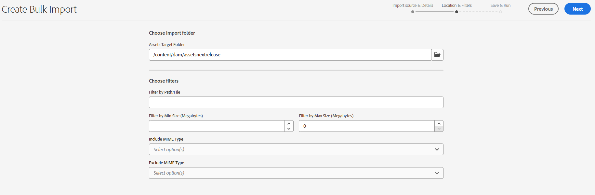
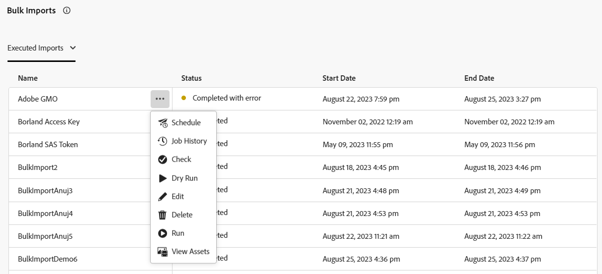

# Importer des ressources en bloc à l’aide de la vue Assets  {#bulk-import-assets-view}

| [Bonnes pratiques de recherche](/help/assets/search-best-practices.md) | [ Bonnes pratiques en matière de métadonnées](/help/assets/metadata-best-practices.md) | [Hub de contenus](/help/assets/product-overview.md) | [Dynamic Media avec fonctionnalités OpenAPI](/help/assets/dynamic-media-open-apis-overview.md) | [Documentation destinée aux développeurs AEM Assets](https://developer.adobe.com/experience-cloud/experience-manager-apis/) |
| ------------- | --------------------------- |---------|----|-----|

L’import en bloc dans la vue AEM Assets permet aux administrateurs et administratrices d’importer un grand nombre de ressources d’une source de données vers AEM Assets. Les administrateurs et administratrices n’ont plus besoin de charger des ressources ou des dossiers individuels vers AEM Assets.

>[!NOTE]
>
>L’importateur en masse d’affichage Assets utilise le même serveur principal que celui de l’importateur en masse d’affichage administrateur. Cependant, il offre davantage de sources de données à importer et une expérience utilisateur plus simplifiée.

Vous pouvez importer des ressources à partir des sources de données suivantes :

* Azure
* AWS
* Google Cloud
* Dropbox
* OneDrive

## Conditions préalables requises {#prerequisites}

| Source de données | Conditions préalables requises |
|-----|------|
| Azure | <ul> <li>Compte de stockage Azure </li> <li> Conteneur d’objets blob Azure <li> Clé d’accès Azure ou jeton SAS en fonction du mode d’authentification </li></ul> |
| AWS | <ul> <li>Région AWS </li> <li> Compartiment AWS <li> Clé d’accès AWS </li><li> Secret d’accès AWS </li></ul> |
| Google Cloud | <ul> <li>Compartiment GCP </li> <li> Adresse e-mail du compte de service GCP <li> Clé privée du compte de service GCP</li></ul> |
| Dropbox | <ul> <li>Identifiant du client Dropbox (clé d’application) </li> <li> Secret client Dropbox (secret d’application)</li></ul> |
| OneDrive | <ul> <li>Identifiant locataire OneDrive  </li> <li> Identifiant client OneDrive</li><li> Clé secrète client OneDrive</li></ul> |

Outre ces conditions préalables en fonction de la source de données, vous devez connaître le nom du dossier source disponible dans votre source de données, qui contient toutes les ressources à importer dans AEM Assets.

## Configurer l’application de développement Dropbox {#dropbox-developer-application}

Avant d’importer des ressources de votre compte Dropbox vers AEM Assets, créez et configurez l’application de développement Dropbox.

Procédez comme suit :

1. Connectez-vous à votre [compte Dropbox](https://www.dropbox.com/developers) et cliquez sur **[!UICONTROL Créer des applications]**.  Si vous utilisez un compte Dropbox d’entreprise, vous devez avoir accès au rôle d’administrateur ou d’administratrice de contenu.

1. Dans la section **[!UICONTROL Choisir une API]**, sélectionnez le seul bouton radio disponible.

1. Dans la section **[!UICONTROL Choisir le type d’accès dont vous avez besoin]**, sélectionnez l’une des options suivantes :

   * Sélectionnez **[!UICONTROL Dossier d’application]** si vous avez besoin d’accéder à un dossier unique créé dans votre application, dans votre compte Dropbox.

   * Sélectionnez **[!UICONTROL Full Dropbox]** si vous avez besoin d’accéder à tous les fichiers et dossiers de votre compte Dropbox.

1. Indiquez un nom pour votre application, puis cliquez sur **[!UICONTROL Créer l’application]**.

1. Dans l’onglet **[!UICONTROL Paramètres]** de votre application, ajoutez https://experience.adobe.com à la section **[!UICONTROL URI de redirection]**.

1. Copiez les valeurs des champs **[!UICONTROL Clé d’application]** et **[!UICONTROL Secret d’application]**. Les valeurs sont requises lors de la configuration de l’outil d’import en bloc dans AEM Assets.

1. Dans l’onglet **[!UICONTROL Autorisations]**, ajoutez les autorisations suivantes dans la section **[!UICONTROL Portées individuelles]**.

   * account_info.read

   * files.metadata.read

   * files.content.read

   * files.content.write

1. Cliquez sur **[!UICONTROL Soumettre]** pour enregistrer les modifications.

## Configurer l’application de développement OneDrive {#onedrive-developer-application}

Avant d’importer des ressources de votre compte OneDrive vers AEM Assets, créez et configurez l’application de développement OneDrive.

### Créer une application

1. Connectez-vous à votre [compte OneDrive](https://portal.azure.com/#view/Microsoft_AAD_RegisteredApps/ApplicationsListBlade) et cliquez sur **[!UICONTROL Nouvel enregistrement]**.

1. Spécifiez un nom pour l’application, sélectionnez **[!UICONTROL Comptes dans ce répertoire organisationnel uniquement (Adobe uniquement - client unique)]** depuis **[!UICONTROL Types de comptes pris en charge]**.

1. Suivez les étapes ci-après pour ajouter des URI de redirection :

   1. Dans le menu déroulant **[!UICONTROL Sélectionner une plateforme]**, sélectionnez **[!UICONTROL Web]**.

   1. Ajoutez https://experience.adobe.com à la section **[!UICONTROL URI de redirection]**.
   <!-- Add the first URI and click **[!UICONTROL Configure]** to add it. You can add more by clicking **[!UICONTROL Add URI]** option available in the **[!UICONTROL Web]** section on the **[!UICONTROL Authentication]** page. -->

1. Cliquez sur **[!UICONTROL Enregistrer]**. L’application est créée avec succès.

1. Copiez les valeurs des champs **[!UICONTROL ID d’application (client)]** et **[!UICONTROL ID de répertoire (client)]**. Les valeurs sont requises lors de la configuration de l’outil d’import en bloc dans AEM Assets.

1. Cliquez sur **[!UICONTROL Ajouter un certificat ou un secret]** correspondant à **[!UICONTROL Informations d’identification du client]**.

1. Cliquez sur **[!UICONTROL Nouveau secret client]**, indiquez la description et l’expiration du secret client, puis cliquez sur **[!UICONTROL Ajouter]**.

1. Après avoir créé le secret client, copiez le champ **[!UICONTROL Valeur]** (ne copiez pas le champ ID de secret). Ce dernier est requis lors de la configuration de l’import en bloc dans AEM Assets.

### Ajouter des autorisations d’API

Exécutez les étapes suivantes pour ajouter des autorisations d’API pour l’application :

1. Cliquez sur **[!UICONTROL Autorisations d’API]** dans le volet de gauche et cliquez sur **[!UICONTROL Ajouter une autorisation]**.
1. Cliquez sur **[!UICONTROL Microsoft Graph]** > **[!UICONTROL Autorisations déléguées]**. La section **[!UICONTROL Sélectionner l’autorisation]** affiche les autorisations disponibles.
1. Sélectionnez l’autorisation `offline_access` à partir d’`OpenId permissions` et l’autorisation `Files.ReadWrite.All` à partir de `Files`.
1. Cliquez sur **[!UICONTROL Ajouter des autorisations]** pour enregistrer les mises à jour.

## Créer une configuration d’import en bloc {#create-bulk-import-configuration}

Pour créer une configuration d’import en bloc dans [!DNL Experience Manager Assets], procédez comme suit :

1. Cliquez sur **[!UICONTROL Import en bloc]** dans le volet de gauche, puis cliquez sur **[!UICONTROL Créer un import]**.
1. Sélectionnez la source de données. Les options disponibles comprennent **[!UICONTROL Azure]**, **[!UICONTROL AWS]**, **[!UICONTROL Google Cloud]**, **[!UICONTROL Dropbox]** et **[!UICONTROL OneDrive]**.
1. Indiquez un nom pour la configuration de lʼimport en bloc dans le champ **[!UICONTROL Nom]**.
1. Indiquez les informations d’identification spécifiques à la source de données, comme mentionné dans les [conditions préalables](#prerequisites).
1. Indiquez le nom du dossier racine qui contient les ressources de la source de données dans le champ **[!UICONTROL Dossier source]**.

   >[!NOTE]
   >
   >Si vous utilisez Dropbox comme source de données, spécifiez le chemin du dossier source en fonction des règles suivantes :
   >* Si vous sélectionnez **Full Dropbox** lors de la création de l’application Dropbox et que le dossier contenant les ressources existe dans `https://www.dropbox.com/home/bulkimport-assets`, indiquez `bulkimport-assets` dans le champ **[!UICONTROL Dossier source]**.
   >* Si vous sélectionnez **Dossier d’application** lors de la création de l’application Dropbox et que le dossier contenant les ressources existe dans `https://www.dropbox.com/home/Apps/BulkImportAppFolderScope/bulkimport-assets`, indiquez `bulkimport-assets` dans le champ **[!UICONTROL Dossier source]**, où `BulkImportAppFolderScope` fait référence au nom de l’application. `Apps` est automatiquement ajouté après `home` dans ce cas.

   >[!NOTE]
   >
   >Si vous utilisez OneDrive comme source de données, spécifiez le chemin du dossier source en fonction des règles suivantes :
   >* Indiquez uniquement le nom du dossier racine, sans le domaine . Si le chemin URL complet du dossier est `https://my.sharepoint.com/my?id=/personal/user/Documents/Importfolder/`, spécifiez `/Importfolder/` dans le champ **[!UICONTROL Dossier Source]** .
   >* Si le nom du dossier contient plusieurs mots séparés par des espaces, indiquez le nom avec les espaces dans la configuration de l’importation en bloc.
   >* Le dossier source doit se trouver à la racine du répertoire. Les chemins de dossier ne sont pas pris en charge.

1. (Facultatif) Sélectionnez lʼoption **[!UICONTROL Supprimer le fichier source après lʼimport]** afin de supprimer les fichiers originaux du magasin de données source après lʼimport des fichiers dans Experience Manager Assets.
1. Sélectionnez le **[!UICONTROL Mode d’importation]**. Les modes suivants sont disponibles : **[!UICONTROL Ignorer]**, **[!UICONTROL Remplacer]** ou **[!UICONTROL Créer une version]**. Le mode par défaut est Ignorer. Dans ce mode, l’outil d’ingestion ignore l’import d’une ressource si elle existe déjà.
   

1. (Facultatif) Spécifiez le fichier de métadonnées à importer, fourni au format CSV, dans le champ **[!UICONTROL Fichier de métadonnées]**. Le fichier source des métadonnées doit se trouver dans le dossier source. Cliquez sur **[!UICONTROL Suivant]** pour accéder à **[!UICONTROL Emplacement et filtres]**.

   >[!NOTE]
   >
   >En fonction des règles de sécurité de votre entreprise, vous devrez peut-être demander le consentement de l’administrateur pour que cette application se connecte à l’outil d’importation en bloc. Si cela est nécessaire, l’administrateur doit fournir son consentement avant que la configuration de l’importation en bloc ne puisse être enregistrée.

1. Pour définir un emplacement dans la gestion des ressources numériques (DAM) où les ressources doivent être importées à l’aide du champ **[!UICONTROL Dossier cible des ressources]**, indiquez un chemin d’accès. Par exemple, `/content/dam/imported_assets`.
1. (Facultatif) Dans la section **[!UICONTROL Choisir des filtres]**, indiquez la taille de fichier minimale des ressources en Mo à inclure dans le processus d’ingestion dans le champ **[!UICONTROL Filtrer par taille minimale]**.
1. (Facultatif) Indiquez la taille de fichier maximale des ressources en Mo à inclure dans le processus d’ingestion dans le champ **[!UICONTROL Filtrer par taille maximale]**.
1. (Facultatif) Sélectionnez les types MIME à inclure dans le processus d’ingestion à l’aide du champ **[!UICONTROL Inclure le type MIME]**. Vous pouvez sélectionner plusieurs types MIME dans ce champ. Si vous ne définissez pas de valeur, tous les types MIME sont inclus dans le processus d’ingestion.

1. (Facultatif) Sélectionnez les types MIME à exclure dans le processus d’ingestion à l’aide du champ **[!UICONTROL Exclure le type MIME]**. Vous pouvez sélectionner plusieurs types MIME dans ce champ. Si vous ne définissez pas de valeur, tous les types MIME sont inclus dans le processus d’ingestion.

   

1. Cliquez sur **[!UICONTROL Suivant]**. Sélectionnez l’une des options suivantes en fonction de vos préférences :

   * Sélectionnez **[!UICONTROL Enregistrer l’import]** pour enregistrer la configuration afin de pouvoir l’exécuter ultérieurement.
   * Sélectionnez **[!UICONTROL Enregistrer et exécuter l’import]** pour enregistrer la configuration et exécuter l’import en bloc.
   * Sélectionnez **[!UICONTROL Enregistrer et planifier l’import]** pour enregistrer la configuration et planifier l’import en bloc ultérieurement. Vous pouvez choisir la fréquence de l’importation en bloc et définir la date et l’heure de l’importation. L’importation en bloc s’exécute à la date et à l’heure définies dans la fréquence choisie.

   

1. Cliquez sur **[!UICONTROL Enregistrer]** pour exécuter l’option sélectionnée.

### Gestion des noms de fichier lors de l’importation en bloc {#filename-handling-bulkimport-assets-view}

Lorsque vous importez des ressources ou des dossiers en bloc, [!DNL Experience Manager Assets] importe toute la structure de ce qui existe dans la source d’import. [!DNL Experience Manager] suit les règles intégrées pour les caractères spéciaux dans les noms de ressources et de dossiers ; par conséquent, ces noms de fichier doivent être assainis. Pour les noms de dossier et de ressource, le titre défini par l’utilisateur reste inchangé et est stocké dans `jcr:title`.

Lors de l’importation en bloc, [!DNL Experience Manager] recherche les dossiers existants pour éviter de réimporter les ressources et les dossiers et vérifie également les règles d’assainissement appliquées dans le dossier parent où l’importation a lieu. Si les règles d’assainissement sont appliquées dans le dossier parent, les mêmes règles sont appliquées à la source d’importation. Pour une nouvelle importation, les règles d’assainissement suivantes sont appliquées pour gérer les noms de fichiers des ressources et dossiers.

Pour plus d’informations sur les noms interdits, la gestion des noms de ressources et la gestion des noms de dossiers lors de l’importation en masse, voir [ Gestion des noms de fichier lors de l’importation en masse dans la vue d’administration](add-assets.md##filename-handling-bulkimport).

## Afficher les configurations d’import en bloc existantes {#view-import-configuration}

Pour afficher les imports en bloc existants, sélectionnez l’option **[!UICONTROL Imports en bloc]** dans le volet de gauche. La page Imports en bloc s’affiche avec la liste des **[!UICONTROL Imports exécutés]**.  
Vous pouvez également afficher les **[!UICONTROL Imports enregistrés]** et les **[!UICONTROL Imports planifiés]** dans la liste déroulante.

## Modifier la configuration d’import en bloc {#edit-import-configuration}

Pour modifier les détails de la configuration, cliquez sur l’ correspondant au nom de la configuration, puis sur **[!UICONTROL Modifier]**. Notez que certains éléments ne sont pas modifiables, tels que le titre de la configuration et la source de données d’import. Vous pouvez modifier la configuration à l’aide des onglets Imports exécutés, planifiés ou enregistrés.

## Planifier des imports ponctuels ou récurrents {#schedule-imports}

Pour planifier un import en bloc ponctuel ou récurrent, procédez comme suit :

1. cliquez sur l’ correspondant au nom de la configuration disponible dans l’onglet **[!UICONTROL Imports exécutés]** ou **[!UICONTROL Imports enregistrés]** et cliquez sur **[!UICONTROL Planifier]**. Vous pouvez également replanifier un import planifié existant en accédant à l’onglet **[!UICONTROL Imports planifiés]** et en cliquant sur **[!UICONTROL Planifier]**.

1. Définissez une ingestion ponctuelle ou planifiez une planification horaire, quotidienne ou hebdomadaire. Cliquez sur **[!UICONTROL Envoyer]**.

   

## Exécuter un contrôle de l’intégrité de l’import {#import-health-check}

Pour valider la connexion à la source de données, cliquez sur l’ correspondant à la configuration, puis sur **[!UICONTROL Vérifier]**. Si la connexion est établie, Experience Manager Assets affiche le message suivant :

## Effectuer un essai avant l’exécution d’un import {#dry-run-bulk-import}

Cliquez sur l’ correspondant au nom de la configuration et cliquez sur **[!UICONTROL Exécution dʼessai]** pour lancer une exécution test pour le traitement d’import en bloc. Experience Manager Assets affiche les informations suivantes sur la tâche d’import en bloc :

## Exécuter un import en bloc {#run-bulk-import}

Si vous avez enregistré l’import lors de la création de la configuration, vous pouvez accéder à l’onglet Imports enregistrés, cliquer sur l’ correspondant à la configuration, puis sur **[!UICONTROL Exécuter]**.

De même, si vous devez exécuter un import déjà exécuté, accédez à l’onglet Imports exécutés, cliquez sur l’ correspondant au nom de la configuration, puis sur **[!UICONTROL Exécuter]**.

## Arrêter ou planifier un import en cours {#schedule-stop-ongoing-report}

Vous pouvez planifier ou arrêter un import en bloc en cours à l’aide de la boîte de dialogue de statut d’import en bloc qui s’affiche sur la page d’accueil de l’import en bloc au cours d’un import.

Vous pouvez également afficher les ressources importées dans le dossier cible en cliquant sur **[!UICONTROL Afficher les ressources]**.

## Supprimer une configuration d’import en bloc {#delete-bulk-import-configuration}

Cliquez sur l’ correspondant au nom de la configuration qui existe dans les onglets **[!UICONTROL Imports exécutés]**, **[!UICONTROL Imports planifiés]** ou **[!UICONTROL Imports enregistrés]**, puis sur **[!UICONTROL Supprimer]** pour supprimer la configuration d’import en bloc.

## Accéder aux ressources après l’exécution de l’import en bloc {#view-assets-after-bulk-import}

Pour afficher l’emplacement cible des ressources où les ressources sont importées après l’exécution de la tâche d’import en bloc, cliquez sur l’ correspondant au nom de la configuration, puis sur **[!UICONTROL Afficher les ressources]**.

## Vidéo : Importation de ressources en bloc à l’aide de la vue Assets

>[!VIDEO](https://video.tv.adobe.com/v/3428012)
