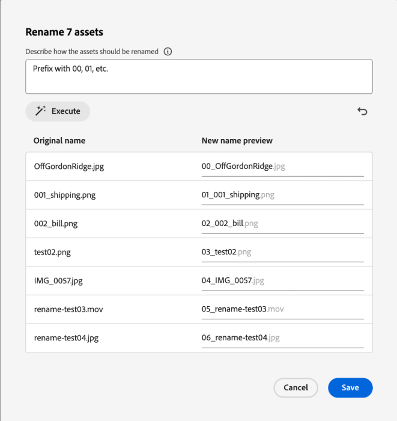

# Renommer une ressource ou un dossier dans [!DNL Assets view] {#rename-single-asset-or-folder}

Le changement de nom peut vous aider à mieux organiser, catégoriser et identifier les ressources sans modifier leur contenu ou leur emplacement. [!DNL Assets view] vous permet de renommer la ressource ou le dossier sélectionné.

Pour renommer une ressource ou un dossier, procédez comme suit :

1. Recherchez la ressource ou le dossier à renommer.

1. Utilisez l’une des méthodes suivantes pour renommer une ressource ou un dossier :

   * Sélectionnez la ressource ou le dossier et cliquez sur  **[!UICONTROL Renommer]** dans le menu supérieur.
   * Cliquez sur d’autres options `...` sur la ressource ou le dossier et sélectionnez **[!UICONTROL Renommer]**.
   * Vous pouvez également cliquer sur le titre d’une ressource ou d’un dossier à renommer. Mentionnez le nouveau texte dans la zone de texte **Renommer la ressource** et cliquez sur **Enregistrer**. Cette fonctionnalité est disponible dans les vues Grille, Galerie, Cascade et Liste.

## Renommage en bloc des ressources optimisées par l’IA {#rename-bulk-assets-using-ai}

[!DNL Assets view] permet de renommer plusieurs ressources en une seule fois à l’aide de l’intelligence artificielle. La fonctionnalité de renommage en bloc de l’IA peut uniquement être appliquée aux fichiers, pas aux dossiers. Vous pouvez sélectionner plusieurs fichiers à la fois et les renommer tous ensemble.

Suivez les étapes ci-dessous pour renommer la majeure partie des ressources à la fois à l’aide d’invites générées par l’IA :

1. Sélectionnez plusieurs ressources et cliquez sur **[!UICONTROL Renommer en bloc]** dans le menu supérieur.

1. Ajoutez le prompt décrivant la manière dont vous souhaitez renommer les ressources sélectionnées. Consultez [quelques exemples illustrant le changement de nom en bloc avec l’IA](#examples-ai-bulk-rename).

1. Cliquez sur **[!UICONTROL Exécuter]** pour permettre à l’IA de renommer les ressources comme indiqué dans le prompt.

1. [Facultatif] Cliquez sur l’ pour annuler la dernière action que vous avez effectuée.

1. Vérifiez vos modifications dans la colonne [!UICONTROL Aperçu du nouveau nom] et cliquez sur **[!UICONTROL Enregistrer]**.

   

## Quelques exemples illustrant le changement de nom en bloc de l’IA {#examples-ai-bulk-rename}

Voici quelques exemples d’utilisation de l’IA pour renommer des ressources en bloc en fonction d’un prompt d’IA :

* Préfixe avec 00, 01, etc. et suffixe avec la date du jour.
* Modifie tous les fichiers en « my-file » et ajoute un nombre incrémenté.
* Supprime le préfixe et le suffixe, conserve simplement la partie centrale du nom.
* Préfixe les fichiers de 001, 002, etc. et traduis-les en anglais.

>[!VIDEO](https://video.tv.adobe.com/v/3440975)

>[!NOTE]
>
> * Vous ne pouvez pas convertir d’émoticônes en texte.
> * Utilisez un nom unique pour éviter les messages d’avertissement lors du changement de nom des ressources. Vous pouvez toutefois réessayer avec un nouveau nom.
> * Vous pouvez également convertir des caractères Unicode ou non alphanumériques en texte.

## Étapes suivantes {#next-steps}

* [Regardez une vidéo pour gérer les formulaires de métadonnées dans la vue Assets .](https://experienceleague.adobe.com/docs/experience-manager-learn/assets-essentials/configuring/metadata-forms.html?lang=fr)

* Faites des commentaires sur le produit en utilisant l’option [!UICONTROL Commentaires] disponible dans l’interface utilisateur de la vue Assets

* Faites des commentaires sur la documentation en utilisant l’option [!UICONTROL Modifier cette page]  ou [!UICONTROL Enregistrer un problème]  disponible dans la barre latérale droite.

* Contactez l’[assistance clientèle](https://experienceleague.adobe.com/fr?support-solution=General#support).

**Voir également**

* [Traduire les ressources](/help/assets/translate-assets.md)
* [API HTTP Assets](/help/assets/mac-api-assets.md)
* [Formats de fichiers pris en charge par Assets](/help/assets/file-format-support.md)
* [Rechercher des ressources](/help/assets/search-assets.md)
* [Ressources connectées](/help/assets/use-assets-across-connected-assets-instances.md)
* [Rapports de ressources](/help/assets/asset-reports.md)
* [Schémas de métadonnées](/help/assets/metadata-schemas.md)
* [Télécharger des ressources](/help/assets/download-assets-from-aem.md)
* [Gestion des métadonnées](/help/assets/manage-metadata.md)
* [Gérer les modèles Dynamic Media](/help/assets/dynamic-media/manage-dynamic-media-templates.md)
* [Gérer les rapports](/help/assets/manage-reports-assets-view.md)
* [Facettes de recherche](/help/assets/search-facets.md)
* [Gérer les collections](/help/assets/manage-collections.md)
* [Import des métadonnées en bloc](/help/assets/metadata-import-export.md)
* [Publier des ressources sur AEM et Dynamic Media](/help/assets/publish-assets-to-aem-and-dm.md)
