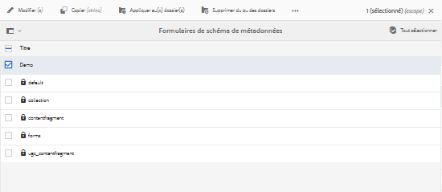
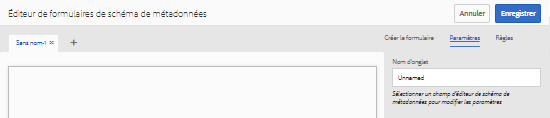
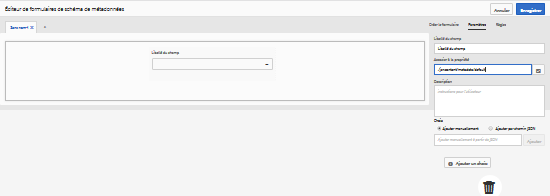
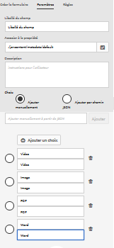
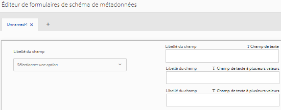
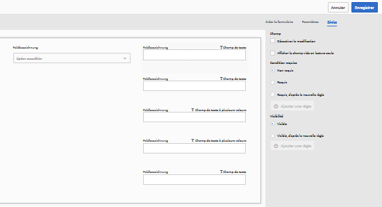
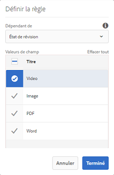
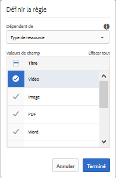
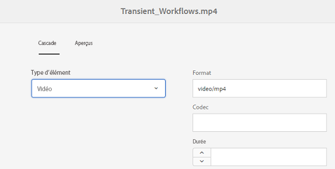
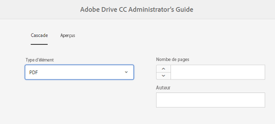

# Métadonnées en cascade {#cascading-metadata}

Lors de la capture des informations de métadonnées d’une ressource, les utilisateurs fournissent des informations dans les différents champs disponibles. Vous pouvez afficher des valeurs de champ ou des champs de métadonnées spécifiques en fonction des options sélectionnées dans les autres champs. Ce type d’affichage conditionnel des métadonnées est désigné sous le nom de métadonnées en cascade. En d’autres termes, vous pouvez créer une dépendance entre un champ/une valeur de métadonnées en particulier, ainsi qu’entre un ou plusieurs champs et/ou leurs valeurs.

Utilisez des schémas de métadonnées afin de définir des règles pour afficher les métadonnées en cascade. Par exemple, si votre schéma de métadonnées comprend un champ de type de ressource, vous pouvez définir un ensemble de champs pertinent à afficher en fonction du type de ressource qu’un utilisateur sélectionne.

Voici quelques cas d’utilisation pour lesquels vous pouvez définir des métadonnées en cascade :

* Lorsque l’emplacement de l’utilisateur est requis, afficher les noms de ville pertinents en fonction du choix de pays et d’état de l’utilisateur.
* Charger les noms de marques pertinents dans une liste en fonction du choix de catégorie de produits de l’utilisateur.
* Activer/désactiver la visibilité d’un champ spécifique en fonction de la valeur spécifiée dans un autre champ. Par exemple, afficher des champs d’adresse d’expédition distincts si l’utilisateur souhaite la livraison à une autre adresse.
* Désigner un champ comme obligatoire en fonction de la valeur spécifiée dans un autre champ.
* Modifier les options affichées pour un champ particulier en fonction de la valeur spécifiée dans un autre champ.
* Définir la valeur de métadonnées par défaut dans un domaine spécifique en fonction de la valeur spécifiée dans un autre champ.

## Configuration des métadonnées en cascade dans AEM   {#configure-cascading-metadata-in-aem}

Supposons que vous souhaitiez afficher les métadonnées en cascade en fonction du type de ressource sélectionné. Quelques exemples

* Pour une vidéo, affichez les champs applicables tels que le format, le codec, la durée, etc.
* Pour un document Word ou PDF, affichez des champs tels que le nombre de pages, l’auteur, etc.

Sans tenir compte du type de ressource choisi, affichez les informations de copyright comme étant un champ requis.

1. Appuyez/cliquez sur le logo AEM, puis accédez à **[!UICONTROL Outils]** > **[!UICONTROL Ressources]** > **[!UICONTROL Schémas de métadonnées]**.
1. Sur la page **[!UICONTROL Formulaires de schéma]**, sélectionnez un formulaire de schéma, puis appuyez/cliquez sur **[!UICONTROL Modifier]** dans la barre d’outils pour modifier le schéma.

   

1. (Facultatif) Dans l’éditeur de schéma de métadonnées, créez un champ pour l’application de conditions. Spécifiez un nom et un chemin de propriété sous l’onglet **[!UICONTROL Paramètres.]**

   Pour créer un onglet, appuyez/cliquez sur `+` afin d’ajouter un onglet, puis ajoutez un champ de métadonnées.

   

1. Ajoutez un champ de liste déroulante pour le type de ressource. Spécifiez un nom et un chemin de propriété sous l’onglet **[!UICONTROL Paramètres]**. Ajoutez une description facultative.

   

1. Les paires de clé/valeur sont les options fournies à un utilisateur de formulaire. Vous pouvez fournir des paires clé/valeur manuellement ou à partir d’un fichier JSON.

   * Pour spécifier les valeurs manuellement, sélectionnez **[!UICONTROL Ajouter manuellement]**, appuyez/cliquez sur **[!UICONTROL Ajouter un choix]**, puis spécifiez le texte et la valeur de l’option. Par exemple, spécifiez les types de ressources vidéo, PDF, Word et image.

   * Pour récupérer les valeurs d’un fichier JSON de façon dynamique, sélectionnez **[!UICONTROL Ajouter par chemin JSON]** et indiquez le chemin d’accès au fichier JSON. AEM récupère les paires clé/valeur en temps réel lorsque le formulaire est présenté à l’utilisateur.
   Les deux options s’excluent mutuellement. Vous ne pouvez pas importer les options d’un fichier JSON et les modifier manuellement.

   

   >[!NOTE]
   >
   >Lorsque vous ajoutez un fichier JSON, les paires clé/valeur ne sont pas affichées dans l’éditeur de schéma de métadonnées, mais sont disponibles dans le formulaire publié.

   >[!NOTE]
   >
   >Lorsque vous ajoutez des choix, si vous cliquez sur le champ de liste déroulante, l’interface se déforme et l’icône de suppression des choix cesse de fonctionner. Ne cliquez pas sur la liste déroulante tant que vous n’avez pas enregistré les modifications. Si vous rencontrez ce problème, enregistrez le schéma et rouvrez-le pour poursuivre l’édition.

1. (Facultatif) Ajoutez les autres champs requis ; par exemple, le format, le codec et la durée de la ressource de type vidéo.

   De la même façon, ajoutez des champs dépendants pour les autres types de ressources. Par exemple, ajoutez des champs Nombre de pages et Auteur pour les ressources de documents, tels que des fichiers PDF et Word.

   

1. Pour créer une dépendance entre le champ de type de ressource et d’autres champs, sélectionnez le champ dépendant et ouvrez l’onglet **[!UICONTROL Règles]**.

   

1. Sous **[!UICONTROL Condition requise]**, sélectionnez l’option **[!UICONTROL Requis, d’après la nouvelle règle]**.
1. Appuyez/cliquez sur **[!UICONTROL Ajouter une règle]**, puis sélectionnez le champ **[!UICONTROL Type de ressource]** pour créer une dépendance. Sélectionnez également la valeur de champ sur laquelle vous voulez créer la dépendance. Dans ce cas, sélectionnez **[!UICONTROL Vidéo]**. Appuyez/cliquez sur **[!UICONTROL Terminé]** pour enregistrer vos modifications.

   

   >[!NOTE]
   >
   >Le menu déroulant contenant des valeurs prédéfinies manuellement peut être utilisé avec des règles. Les menus déroulants avec le chemin d’accès JSON configuré ne peuvent pas être utilisés avec des règles qui utilisent des valeurs prédéfinies pour appliquer des conditions. Si les valeurs sont chargées à partir de JSON au moment de l’exécution, il n’est pas possible d’appliquer une règle prédéfinie.

1. Sous **[!UICONTROL Visibilité]**, sélectionnez l’option **[!UICONTROL Visible, d’après la nouvelle règle]**.

1. Appuyez/cliquez sur **[!UICONTROL Ajouter une règle]**, puis sélectionnez le champ **[!UICONTROL Type de ressource]** pour créer une dépendance. Sélectionnez également la valeur de champ sur laquelle vous voulez créer la dépendance. Dans ce cas, sélectionnez **[!UICONTROL Vidéo]**. Appuyez/cliquez sur **[!UICONTROL Terminé]** pour enregistrer vos modifications.

   

   >[!CAUTION]
   >
   >Pour réinitialiser les valeurs, cliquez ou appuyez sur un espace vide ou ailleurs sur l’interface (mais pas sur les valeurs). Si les valeurs sont réinitialisées, vous devez les sélectionner à nouveau.

   >[!NOTE]
   >
   >Vous pouvez appliquer les conditions **[!UICONTROL Condition requise]** et **[!UICONTROL Visibilité]** indépendamment l’une de l’autre.

1. De la même façon, créez une dépendance entre la valeur Vidéo dans le champ Type de ressource et d’autres champs, tels que Codec et Durée.
1. Répétez les étapes pour créer une dépendance entre les ressources de documents (PDF, Word) dans le champ [!UICONTROL Type de ressource] et des champs tels que [!UICONTROL Nombre de pages] et [!UICONTROL Auteur].
1. Cliquez sur **[!UICONTROL Enregistrer]**. Appliquez le schéma de métadonnées à un dossier.

1. Accédez au dossier auquel vous avez appliqué le schéma de métadonnées et ouvrez la page des propriétés d’une ressource. En fonction de votre choix dans le champ Type de ressource, les champs de métadonnées en cascade pertinents sont affichés.

   
   *Figure : Métadonnées en cascade pour une ressource vidéo*

   
   *Figure : Métadonnées en cascade pour une ressource de document*
