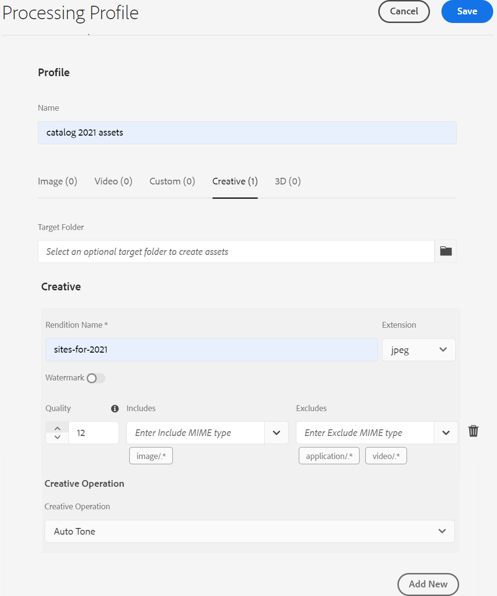

# Générer des variantes de ressources à l’aide de l’intégration [!DNL Adobe Creative Cloud] {#content-automation}

Le module complémentaire d’automatisation du contenu intègre des API [!DNL Adobe Experience Manager Assets as a Cloud Service] et [!DNL Adobe Creative Cloud] pour traiter vos ressources de manière créative à grande échelle. [!DNL Experience Manager] utilise des  [microservices de ](/help/assets/asset-microservices-overview.md) ressources basés sur le cloud pour utiliser les  [!DNL Adobe Creative Cloud] fonctionnalités et automatiser la création et la gestion des médias de ressources.

Pour modifier des ressources dans [!DNL Adobe Photoshop] et [!DNL Adobe Lightroom], il n’est pas nécessaire de télécharger des ressources à partir de [!DNL Experience Manager Assets], de les modifier et de les charger à nouveau. Vous devez simplement créer et configurer un profil de traitement dans [!DNL Experience Manager], appliquer le profil à un dossier et charger les ressources dans le dossier. Les ressources chargées sont retraitées en fonction des profils de traitement et vous obtenez des variantes de ces ressources. Le traitement en masse constant et sans effort permet d’économiser les efforts manuels et d’accroître la vitesse du contenu, ce qui également sans avoir besoin de super compétences créatives. En outre, les développeurs et les partenaires peuvent étendre les microservices de ressources avec un accès direct à ces API et inclure une logique personnalisée.
Les utilisateurs peuvent créer des profils de traitement afin d’automatiser les opérations de création suivantes sur leurs ressources :

* **Réglage automatique** : Utilise l’intelligence artificielle pour analyser le contenu de l’image et corrige intelligemment la lumière et les couleurs en fonction des attributs uniques de l’image.
* **Hauteur** automatique : Utilise l’intelligence artificielle pour analyser le contenu de l’image et corriger la perspective biaisée dans les images. Par exemple, pour créer des horizons de niveau.
* **Paramètres prédéfinis** Lightroom : Applique une apparence définie par l’utilisateur aux images afin d’obtenir un aspect cohérent à l’aide de paramètres prédéfinis personnalisés.
* **Découpage d’image** : Utilise l’intelligence artificielle pour créer une sélection autour d’objets importants et supprimer l’arrière-plan à l’aide d’une seule commande.
* **Masque d’image** : Utilise l’intelligence artificielle pour créer un masque autour des objets saillants à l’aide d’une seule commande.
* **Actions Photoshop** : Applique une série de tâches (dans Photoshop) à un fichier ou à un lot de fichiers.
* **Remplacement d’objet dynamique** : Effectue une personnalisation à grande échelle en vous permettant de permuter des images tout en conservant tous les effets et ajustements appliqués dans un fichier PSD.

## Utilisation d’un profil de traitement pour modifier vos ressources créatives en bloc {#process-assets}

Pour utiliser des profils de traitement afin de créer automatiquement des variations, procédez comme suit :

1. Contactez [l’Assistance clientèle d’Adobe](https://experienceleague.adobe.com/#support) pour recevoir la licence.

1. Accédez à **[!UICONTROL Outils]** > **[!UICONTROL Ressources]** > **[!UICONTROL Profils de traitement]**.

1. Sélectionnez **[!UICONTROL Créer]**, puis spécifiez un **[!UICONTROL Nom]**.

1. Sélectionnez l’onglet **[!UICONTROL Creative]**, indiquez le dossier de sortie, puis sélectionnez **[!UICONTROL Ajouter]** pour ajouter une configuration créative.

1. Indiquez **[!UICONTROL Nom du rendu]** (ou nom de sortie), **[!UICONTROL Extension]** (ou type de fichier), sélectionnez **[!UICONTROL Qualité]** (ou paramètres de sortie), sélectionnez Inclut et Exclut les listes de type MIME (ou saisissez un filtre de ressource d’entrée) et sélectionnez l’opération de création requise.
   

1. Certaines opérations nécessitent des paramètres supplémentaires (ressource). Si nécessaire, indiquez des valeurs pour ces paramètres supplémentaires.

1. Ajoutez d’autres opérations créatives dans le cadre du même profil de traitement ou enregistrez le profil.

1. Appliquez le profil de traitement à un dossier. Sur la page **[!UICONTROL Propriétés]** d’un dossier, sélectionnez **[!UICONTROL Traitement des ressources]**, puis sélectionnez le profil de traitement à appliquer.

Une fois le profil de traitement appliqué à un dossier DAM, toutes les ressources chargées ou mises à jour dans ce dossier exécutent les opérations définies en plus du traitement standard. Les sous-dossiers héritent des mêmes profils que ceux appliqués aux dossiers parents. Les utilisateurs peuvent remplacer cet héritage.

Pour traiter les ressources existantes, sélectionnez les ressources, sélectionnez l’option **[!UICONTROL Retraiter]**, puis sélectionnez le profil de traitement requis.

## Conseils et restrictions {#limitations-best-practices}

* [!DNL Experience Manager] limite le traitement des ressources à 300 requêtes par minute par environnement et à 700 requêtes par minute par organisation.
* La taille du fichier est limitée à 4 Go pour les opérations de l’API [!DNL Adobe Photoshop] et 1 Go pour les opérations [!DNL Adobe Lightroom].

>[!MORELIKETHIS]
>
>* [Configurer et utiliser les microservices de ressources via des profils de traitement](/help/assets/asset-microservices-configure-and-use.md).
>* [ [!DNL Experience Manager] Intégration avec [!DNL Creative Cloud]](/help/assets/aem-cc-integration-best-practices.md).
>* [Ingestion et traitement de ressources à l’aide des microservices de ressources : Une vue d’ensemble](/help/assets/asset-microservices-overview.md).

