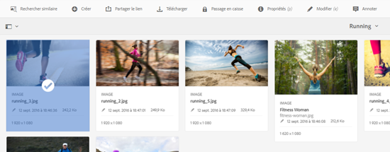
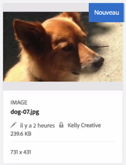
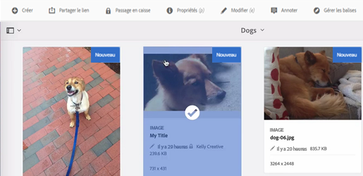

# Fichiers d&#39;arrivée et de départ dans Ressources {#check-in-and-check-out-files-in-assets}

Adobe Experience Manager (AEM) Assets permet d’extraire des ressources pour les modifier et de les archiver après avoir apporté les modifications. Après avoir extrait une ressource, vous seul pouvez la modifier, l’annoter, la publier, la déplacer ou la supprimer. Le fait d’extraire une ressource entraîne son verrouillage. Les autres utilisateurs ne peuvent effectuer aucune de ces opérations sur la ressource tant que vous ne l’avez pas archivée dans AEM Assets. Toutefois, ils peuvent modifier les métadonnées de la ressource verrouillée.

Vous avez besoin d’un accès en écriture à ces ressources pour être en mesure de les extraire ou de les archiver.

Cette caractéristique permet d’empêcher les autres utilisateurs d’écraser les modifications apportées par un auteur lorsque plusieurs utilisateurs issus de plusieurs équipes collaborent à la modification des workflow.

## Extraction de ressources {#checking-out-assets}

1. Dans l’interface utilisateur d’Assets, sélectionnez la ressource que vous souhaitez extraire. Vous pouvez également sélectionner plusieurs ressources à extraire.

   

1. Dans la barre d’outils, cliquez/appuyez sur l’icône **[!UICONTROL Extraction]**.

   

   Notez que l’icône **[!UICONTROL Extraction]** se transforme en icône **[!UICONTROL Archivage]** avec le verrou ouvert.

   

   Pour vérifier si d’autres utilisateurs peuvent modifier la ressource que vous avez extraite, connectez-vous comme un utilisateur différent. Une icône de verrouillage s’affiche sur la miniature de la ressource que vous avez extraite.

   

   Sélectionnez la ressource. Notez que la barre d’outils n’affiche aucune option permettant de modifier, d’annoter, de publier ou de supprimer la ressource.

   

   Vous pouvez, toutefois, cliquer/appuyer sur l’icône **[!UICONTROL Afficher les propriétés]** pour modifier les métadonnées de la ressource verrouillée.

1. Cliquez/appuyez sur l’icône Modifier pour ouvrir la ressource en mode d’édition.

   

1. Modifiez la ressource et enregistrez les modifications. Par exemple, recadrez l’image et enregistrez-la.

   

   Vous pouvez également choisir d’annoter ou de publier la ressource.

1. Sélectionnez la ressource modifiée dans l’interface utilisateur d’Assets, puis cliquez/appuyez sur l’icône **[!UICONTROL Archivage]** dans la barre d’outils.

   

   La ressource modifiée est archivée dans AEM Assets et est disponible pour que d’autres utilisateurs la modifie.

## Archivage forcé {#forced-check-in}

Les administrateurs peuvent archiver les ressources extraites par d’autres utilisateurs.

1. Connectez-vous à AEM Assets en tant qu’administrateur.
1. Dans l’interface utilisateur d’Assets, sélectionnez une ou plusieurs ressources extraites par d’autres utilisateurs.

   

1. Dans la barre d’outils, cliquez/appuyez sur l’icône **[!UICONTROL Libérer le verrou]**. La ressource est à nouveau archivée et disponible pour modification pour d’autres utilisateurs.

   