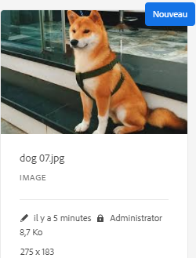
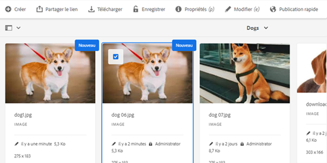

# Archivage et extraction de fichiers dans la gestion des ressources numériques [!DNL Experience Manager] {#check-in-and-check-out-files-in-assets}

<table>
    <tr>
        <td>
            <i>Nouveau</i> <a href="/help/assets/dynamic-media/dm-prime-ultimate.md"><b>Dynamic Media Prime et Ultimate</b></a>
        </td>
        <td>
            <i>Nouveau</i> <a href="/help/assets/assets-ultimate-overview.md"><b>AEM Assets Ultimate</b></a>
        </td>
        <td>
            <i>Nouvelle</i> <a href="/help/assets/integrate-aem-assets-edge-delivery-services.md"><b>Intégration d’AEM Assets à Edge Delivery Services</b></a>
        </td>
        <td>
            <i>Nouveau</i> <a href="/help/assets/aem-assets-view-ui-extensibility.md"><b>Extensibilité de l’interface utilisateur</b></a>
        </td>
          <td>
            <i>Nouveau</i> <a href="/help/assets/dynamic-media/enable-dynamic-media-prime-and-ultimate.md"><b>Activation de Dynamic Media Prime et Ultimate</b></a>
        </td>
    </tr>
    <tr>
        <td>
            <a href="/help/assets/search-best-practices.md"><b>Bonnes pratiques de recherche</b></a>
        </td>
        <td>
            <a href="/help/assets/metadata-best-practices.md"><b>Bonnes pratiques relatives aux métadonnées</b></a>
        </td>
        <td>
            <a href="/help/assets/product-overview.md"><b>Hub de contenus</b></a>
        </td>
        <td>
            <a href="/help/assets/dynamic-media-open-apis-overview.md"><b>Fonctionnalités Dynamic Media avec OpenAPI</b></a>
        </td>
        <td>
            <a href="https://developer.adobe.com/experience-cloud/experience-manager-apis/"><b>Documentation de développement pour AEM Assets</b></a>
        </td>
    </tr>
</table>

| Version | Lien de l’article |
| -------- | ---------------------------- |
| AEM 6.5 | [Cliquez ici](https://experienceleague.adobe.com/docs/experience-manager-65/assets/managing/check-out-and-submit-assets.html?lang=fr) |
| AEM as a Cloud Service | Cet article |

[!DNL Adobe Experience Manager Assets] permet d’extraire des ressources pour les modifier et de les ré-archiver après y avoir apporté les modifications. Après avoir extrait une ressource, vous seul pouvez la modifier, l’annoter, la publier, la déplacer ou la supprimer. Le fait d’extraire une ressource entraîne son verrouillage. Les autres utilisateurs ne peuvent effectuer aucune de ces opérations sur la ressource tant que vous ne l’avez pas archivée dans [!DNL Assets]. Toutefois, ils peuvent modifier les métadonnées de la ressource verrouillée.

Vous avez besoin d’un accès en écriture à ces ressources pour être en mesure de les extraire ou de les archiver.

Cette caractéristique permet d’empêcher les autres utilisateurs d’écraser les modifications apportées par un auteur lorsque plusieurs utilisateurs issus de plusieurs équipes collaborent à la modification des workflows.

## Extraction de ressources {#checking-out-assets}

1. Dans l’interface utilisateur d’[!DNL Assets], sélectionnez la ressource que vous souhaitez extraire. Vous pouvez également sélectionner plusieurs ressources à extraire.

1. Dans la barre d’outils, cliquez sur **[!UICONTROL Extraction]**. L’option **[!UICONTROL Extraction]** passe en **[!UICONTROL Archivage]**.
Pour vérifier si d’autres utilisateurs peuvent modifier la ressource que vous avez extraite, connectez-vous comme un utilisateur différent. L’icône  s’affiche sur la miniature de la ressource que vous avez extraite.

   

   Sélectionnez la ressource. Notez que la barre d’outils n’affiche aucune option vous permettant de modifier, d’annoter, de publier ou de supprimer la ressource.

   

   Pour modifier les métadonnées de la ressource verrouillée, cliquez sur **[!UICONTROL Afficher les propriétés]**.

1. Cliquez sur **[!UICONTROL Modifier]** pour ouvrir la ressource en mode d’édition.

1. Modifiez la ressource et enregistrez les modifications. Par exemple, recadrez l’image et enregistrez-la. Vous pouvez également choisir d’annoter ou de publier la ressource.

1. Sélectionnez la ressource modifiée dans l’interface [!DNL Assets], puis cliquez sur **[!UICONTROL Archiver]** dans la barre d’outils. La ressource modifiée est archivée dans [!DNL Assets] et peut être modifiée par les autres utilisateurs.

## Archivage forcé {#forced-check-in}

Les administrateurs peuvent archiver les ressources extraites par d’autres utilisateurs.

1. Connectez-vous à [!DNL Assets] en tant qu’administrateur.
1. Dans l’interface utilisateur d’[!DNL Assets], sélectionnez une ou plusieurs ressources extraites par d’autres utilisateurs.

   

1. Dans la barre d’outils, cliquez sur **[!UICONTROL Verrouillage de version]**. La ressource est à nouveau archivée et disponible pour modification pour d’autres utilisateurs.

## Bonnes pratiques et restrictions {#tips-limitations}

* Il est possible de supprimer un *dossier* contenant des fichiers de ressources extraits. Avant de supprimer un dossier, assurez-vous qu’aucune ressource numérique n’ait été extraite par les utilisateurs.

**Voir également**

* [Traduire les ressources](translate-assets.md)
* [API HTTP Assets](mac-api-assets.md)
* [Formats de fichiers pris en charge par Assets](file-format-support.md)
* [Rechercher des ressources](search-assets.md)
* [Ressources connectées](use-assets-across-connected-assets-instances.md)
* [Rapports de ressources](asset-reports.md)
* [Schémas de métadonnées](metadata-schemas.md)
* [Télécharger des ressources](download-assets-from-aem.md)
* [Gestion des métadonnées](manage-metadata.md)
* [Facettes de recherche](search-facets.md)
* [Gérer les collections](manage-collections.md)
* [Import des métadonnées en bloc](metadata-import-export.md)
* [Publier des ressources sur AEM et Dynamic Media](/help/assets/publish-assets-to-aem-and-dm.md)

>[!MORELIKETHIS]
>
>* [Présentation de l’archivage et de l’extraction dans l’appli de bureau [!DNL Experience Manager]  ](https://experienceleague.adobe.com/docs/experience-manager-desktop-app/using/using.html?lang=fr#how-app-works2)
>* [Tutoriel vidéo pour comprendre l’archivage et l’extraction [!DNL Assets]](https://experienceleague.adobe.com/docs/experience-manager-learn/assets/collaboration/check-in-and-check-out.html?lang=fr)
