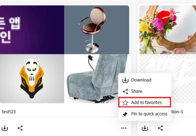

# Gestion des collections dans [!DNL Content Hub] {#manage-collections}

<!--  -->

Une collection fait référence à un ensemble de ressources pouvant être partagées entre les utilisateurs. Une collection peut inclure des ressources provenant de différents emplacements tout en conservant leur intégrité référentielle.

[!DNL Content Hub] permet de créer des collections publiques. Ces collections sont accessibles à tous les utilisateurs autorisés, ce qui crée un espace partagé où plusieurs utilisateurs peuvent accéder efficacement au contenu et l’utiliser. Les collections favorisent l’utilisation collaborative des ressources pour plus d’efficacité et de commodité. Dans la page de navigation des collections, vous pouvez :

* **Créer** : créez une ou plusieurs collections.
* **Affichage** : affichez les ressources et leurs propriétés.
* **Partager** : partagez des ressources sous la forme d’un lien avec d’autres personnes.
* **Télécharger** : téléchargez les ressources.
* **Supprimer** : permet de supprimer des ressources spécifiques d’une collection.
* **Supprimer** : permet de supprimer l’ensemble de la collection.
* **Épingler/Désépingler** : épingler ou désépingler une collection.
* **Favori** : marquer la collection comme favori.

Il permet aux utilisateurs et utilisatrices d’accéder facilement aux différentes ressources disponibles dans [!DNL Content Hub] et de les gérer.

## Conditions préalables {#prerequisites}

[Les utilisateurs de Content Hub](deploy-content-hub.md#onboard-content-hub-users) peuvent effectuer les actions mentionnées dans cet article.

## Créer des collections{#create-collections}

Vous pouvez choisir de [créer une nouvelle collection](#create-new-collection) ou [ajouter des ressources à une collection existante](#add-assets-to-existing-collection) tout en gérant la gouvernance.

### Créer une collection{#create-new-collection}

Pour contrôler l’accès lors de la création de collections, procédez comme suit :

1. Accédez à **[!DNL Collections]** onglet et cliquez sur **[!UICONTROL Créer une collection]**. Une nouvelle fenêtre Collection s’affiche.

1. Ajoutez **[!UICONTROL Titre]** et **[!UICONTROL Description]** pour la collection.

   

1. Sous **[!UICONTROL Qui peut accéder]** liste déroulante > sélectionnez le type de contrôle d’accès. Les options suivantes sont disponibles :

   | Méthode d’accès | Type d’accès | Description |
   |---|---|---|
   | **Seuls vous et les administrateurs pouvez modifier** | Privée | Seuls le créateur et les administrateurs peuvent modifier cette collection et y accéder. |
   | **Tout le monde peut voir** | Public | Tout le monde peut accéder à cette collection, mais seuls les créateurs et les administrateurs peuvent la modifier. |
   | **Tout le monde peut afficher et modifier** | Public | Cette collection est ouverte à tous, avec un accès complet et des autorisations de modification accordées sans restriction. |

   >[!NOTE]
   >
   > [!DNL Content Hub] administrateur peut afficher toutes les options disponibles dans la liste déroulante **[!UICONTROL Qui peut accéder]** tandis que pour les utilisateurs standard, vous devez [spécifier et configurer](configure-content-hub-ui-options.md) les options auxquelles ils peuvent accéder.

1. Cliquez sur **[!UICONTROL Créer]**. Une fois cette opération terminée, vous pouvez [ajouter des ressources à la collection](#add-assets-to-existing-collection).

>[!VIDEO](https://video.tv.adobe.com/v/3463336)

<!--
>[!NOTE]
>
>Collections governance is a limited availability feature. You can get it enabled  by creating a support ticket. Once enabled, you need to [Configure Collections in Content Hub](configure-content-hub-ui-options.md#configure-collections-content-hub).-->

<!--To create a new collection, navigate to the **[!UICONTROL Collections]** tab and click **[!UICONTROL Create new collection]**. Enter the **[!UICONTROL Title]** and provide an optional **[!UICONTROL Description]** for the assets. Click **[!UICONTROL Create]**.
          
-->

### Ajout de ressources à une collection existante{#add-assets-to-existing-collection}

Pour ajouter des ressources à une collection existante, sélectionnez les ressources à ajouter à la collection. Cliquez sur **[!UICONTROL Ajouter à la collection]**. Vous êtes invité à sélectionner la collection.

Sélectionnez la collection dans laquelle vous devez ajouter la ressource. Vous pouvez également rechercher la collection existante à l’aide de la barre de recherche.  Sélectionnez la ou les collections auxquelles vous devez ajouter les ressources, puis cliquez sur **[!UICONTROL Ajouter à la collection]**.

## Affichage des collections{#view-collections}

Accédez à l’onglet **[!UICONTROL Collections]** et recherchez le nom de la collection. Vous pouvez utiliser des filtres pour affiner vos résultats de recherche en sélectionnant des critères spécifiques, ce qui vous permet de trouver rapidement les collections les plus pertinentes.

Pour afficher la liste des ressources disponibles dans une collection, cliquez sur le nom de la collection. Vous pouvez également appliquer des filtres dans une collection pour affiner les résultats de la ressource. Cliquez sur la ressource à afficher dans une collection. [!DNL Content Hub] affiche la vue détaillée de la ressource. [Voir les détails de la ressource](asset-properties-content-hub.md).

### Filtrer la vue des collections {#filter-collections-view}

Content Hub vous permet de filtrer la vue des collections afin de trouver facilement ce que vous recherchez en réduisant les options en fonction de vos préférences. Assurez-vous de la [configuration des collections dans Content Hub](configure-content-hub-ui-options.md#configure-collections-content-hub).

Pour filtrer la vue Collections, accédez à **[!DNL Collections]** onglet et à la liste déroulante Collections . Choisissez l’une des options suivantes :

* **[!UICONTROL Toutes les collections] :** sélectionnez cette option pour afficher et modifier toutes les collections, y compris celles qui sont privées ou partagées avec vous.
* **[!UICONTROL Moi seul] :** sélectionnez cette option pour afficher les collections qui vous sont accessibles.
* **[!UICONTROL Tout le monde peut afficher] :** cette option permet de filtrer les collections accessibles à tous, mais modifiables uniquement par le créateur ou la créatrice.
* **[!UICONTROL Tout le monde peut modifier] :** sélectionnez cette option pour filtrer les collections qui sont à la fois accessibles et modifiables par tous.

  

De plus, pour filtrer la vue des collections en fonction des autorisations d’accès, accédez à **[!DNL Collections]**’onglet et à l’une des options suivantes :

* **[!UICONTROL Créé par n’importe qui] :** ce filtre vous limite à l’affichage des collections créées par n’importe quel utilisateur.

* **[!UICONTROL Créé par moi] :** ce filtre vous limite à l’affichage des collections créées par vous.

  

<!--

* **A**: Details and metadata of the asset 
* **B**: Zoom In or Zoom Out the asset 
* **C**: Reset Zoom view 
* **D**: View the previous or next asset 
* **E**: Download the asset 
* **F**: Open the asset in Adobe Express 
* **G**: Hide the metadata of the asset 
* **H**: Share the asset as a link 
-->

## Téléchargement des ressources disponibles dans une collection{#download-assets-within-collection}

Pour télécharger les ressources disponibles dans une collection, accédez à l’onglet **[!UICONTROL Collections]**.\
Cliquez sur l’icône  sur la carte de collection.

Toutes les ressources de la collection sont téléchargées.

Vous pouvez également ouvrir la collection pour télécharger les ressources individuellement. Cliquez sur la collection contenant les ressources à télécharger. Sélectionnez les ressources et cliquez sur **[!UICONTROL Télécharger]**.

Découvrez comment [télécharger une ressource à partir du  [!DNL Content Hub]](download-assets-content-hub.md).

## Partage des ressources disponibles dans une collection {#share-assets-available-within-collection}

Vous pouvez également partager les ressources disponibles dans une collection. Veillez à [activer le partage de liens public dans Content Hub](configure-content-hub-ui-options.md#enable-public-link-sharing). Accédez à l’onglet **[!UICONTROL Collections]**. Sélectionnez l’icône  sur la vignette de collection. Le lien de partage est copié. Vous pouvez partager le lien copié avec le destinataire. En savoir plus sur le [partage de ressources dans la  [!DNL Content Hub]](share-assets-content-hub.md).

Les collections Content Hub fournissent des outils de gouvernance complets pour une gestion efficace des ressources, y compris des autorisations de partage personnalisables et des fonctionnalités de collaboration. De l’accès en lecture seule au contrôle administratif complet, ces paramètres prennent en charge une gouvernance fine de la distribution des ressources. Lors du partage d’une ressource, que ce soit individuellement ou dans le cadre d’une collection, la portée de l’accès est déterminée par le niveau d’accès actuel de la collection attribué à l’utilisateur. Vous ne pouvez pas non plus partager une collection privée.

## Modification des détails d’une collection {#edit-details-of-collection}

Pour modifier **[!UICONTROL Titre]** et **[!UICONTROL Description]** d’une collection, cliquez sur le nom de la collection, puis sur l’icône . L’écran [!UICONTROL Détails de la collection] qui s’affiche vous permet de modifier le **[!UICONTROL Titre]** et le **[!UICONTROL Description]** d’une collection. Cliquez sur **[!UICONTROL Enregistrer les modifications]** pour confirmer les modifications. De plus, vous pouvez mettre à jour l’accès à la collection par le biais de la boîte de dialogue Modifier la collection , selon la configuration.

## Supprimer les ressources d’une collection{#remove-assets-from-a-collection}

Les utilisateurs suivants peuvent supprimer une ou plusieurs ressources d’une collection :

* Un administrateur
* Propriétaire de la collection
* Utilisateur non administrateur disposant de droits de modification

Pour supprimer des ressources d’une collection, cliquez sur la collection dans laquelle vous devez supprimer des ressources, sélectionnez-les et cliquez sur **[!UICONTROL Supprimer de la collection]**.

Vous êtes invité à confirmer la suppression de la ressource. Cliquez sur **[!UICONTROL Supprimer]**.\
Les ressources sélectionnées ont été supprimées de la collection.

## Suppression d’une collection{#delete-collection}

Seuls les administrateurs et les créateurs peuvent supprimer une collection. Pour supprimer une collection, accédez à l’onglet **[!UICONTROL Collections]** et cliquez sur la collection à supprimer. Cliquez sur l’icône  pour supprimer la collection.

## Épingler ou désépingler une collection {#pin-unpin-collection}

Les administrateurs et administratrices de Content Hub peuvent épingler des collections dans Content Hub pour un accès rapide. Les collections épinglées sont affichées dans une section épinglée dédiée sur la page d’accueil Collections, ce qui facilite la conservation des collections importantes à portée de main. Pour l’accès rapide, vous pouvez épingler ou désépingler une collection en procédant comme suit :

1. Parcourez les collections que vous souhaitez épingler ou désépingler.

1. Cliquez sur **[!UICONTROL Autres actions]**  et sélectionnez **[!UICONTROL Épingler pour accéder rapidement]**. Une boîte de confirmation s’affiche.

   

1. Cliquez sur **[!UICONTROL Épingler]** pour confirmer. Le message d’avertissement s’affiche lorsque vous épinglez une collection privée.

   

   Les collections épinglées s’affichent en haut pour un accès rapide. Pour désépingler la collection, vous pouvez également cliquer sur **[!UICONTROL Autres actions]**  et sélectionner **[!UICONTROL Désépingler]**.

   

## Marquer les collections comme favorites {#favorite-collection}

Vous pouvez marquer les collections comme Favoris dans Content Hub, ce qui facilite leur organisation et leur récupération. Une fois ajoutées, vos collections favorites sont facilement disponibles dans l’onglet Favoris de la page d’accueil de Content Hub. De plus, vous pouvez rechercher des ressources dans les collections favorites. Pour marquer les collections en tant que favoris, procédez comme suit :

1. Parcourez les collections que vous souhaitez épingler ou désépingler.

1. Cliquez sur **[!UICONTROL Autres actions]**  et sélectionnez **[!UICONTROL Ajouter aux favoris]** pour marquer la collection comme favorite.

   

   Les collections marquées comme Favoris apparaissent désormais sous l’onglet **[!UICONTROL Mes favoris]**. Vous pouvez également supprimer les collections de **[!UICONTROL Mes favoris]**. Pour ce faire, cliquez sur **[!UICONTROL Autres actions]**  et sélectionnez **[!UICONTROL Supprimer des favoris]**.

   

>[!NOTE]
>
>[Épingler ou désépingler la collection](#pin-unpin-collection) et [Marquer les collections comme favoris](#favorite-collection) sont des fonctionnalités à disponibilité limitée. Vous pouvez créer et envoyer un dossier d’assistance clientèle Adobe pour l’activer pour votre déploiement.

