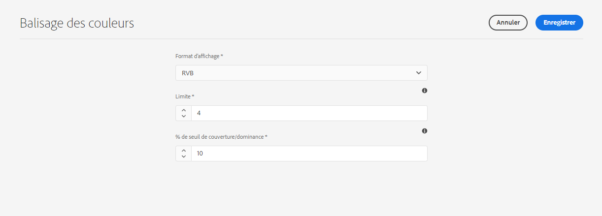
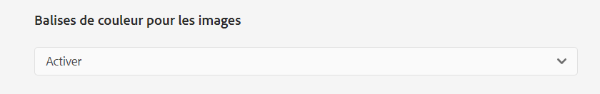
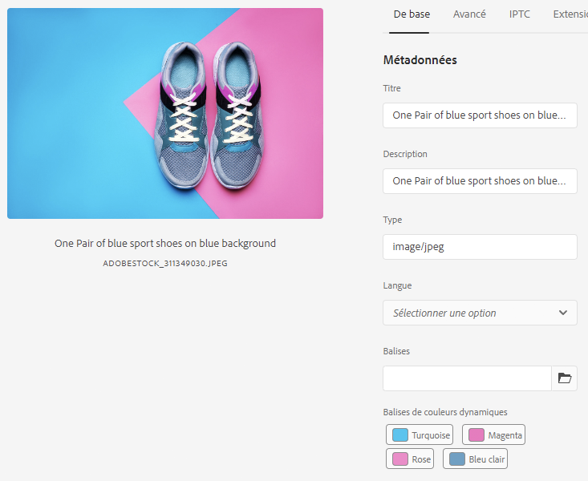
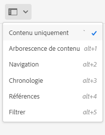
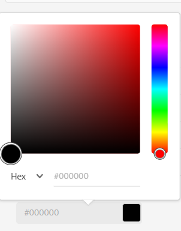

# Balises de couleurs pour les images {#color-tag-images}

Adobe Experience Manager (AEM) Assets utilise les fonctionnalités de l’IA d’Adobe Sensei pour faire la distinction entre les couleurs d’une image et les appliquer automatiquement sous forme de balises lors de l’ingestion. Ces balises permettent d’améliorer l’expérience de recherche en fonction de la composition des couleurs des images.

Vous pouvez configurer le nombre de couleurs, comprises entre un et 40, qui sont balisées vers une image afin de pouvoir rechercher ultérieurement des images en fonction de ces couleurs. Experience Manager Assets applique les balises en fonction de la couverture colorimétrique d’une image. Vous pouvez également configurer le format d’affichage d’une balise de couleur.

La figure suivante illustre l’ordre des tâches que vous effectuez pour configurer et gérer le balisage des couleurs pour les images dans Experience Manager Assets :

## Formats de fichiers pris en charge {#supported-file-formats-color-tags}

| Format de fichier | Extension | Type MIME | Espace colorimétrique d’entrée | Taille maximale de fichier source prise en charge | Résolution maximale de la taille de fichier prise en charge |
|---|---|---|---|---|---|
| JPEG | .jpg et .jpeg | image/jpeg | sRVB | 15 Go | 20000 × 20000 pixels |
| PNG | .png | image/png | sRVB | 15 Go | 20000 × 20000 pixels |
| TIFF | .tif et .tiff | image/tiff | sRGB | 4 Go (limitée par les spécifications de format) | 20000 × 20000 pixels |
| PSD | .psd | image/vnd.adobe.photoshop | sRGB | 2 Go (limitée par les spécifications de format) | 20000 × 20000 pixels |
| GIF | .gif | image/gif | sRVB | 15 Go | 20000 × 20000 pixels |
| BMP | .bmp | image/bmp | sRVB | 4 Go (limitée par les spécifications de format) | 20000 × 20000 pixels |

## Gérer les propriétés du balisage des couleurs {#manage-color-tagging-properties}

Pour gérer les propriétés de balisage des couleurs pour les images :

1. Accédez à **[!UICONTROL Outils > Ressources > Balisage des couleurs]**.

   

1. Spécifiez le format d’affichage de la balise de couleur dans le champ **[!UICONTROL Format d’affichage]**. Les options possibles incluent le nom de la couleur, le RGB ou le format HEX.

1. Indiquez le nombre de couleurs à baliser pour les images du champ **[!UICONTROL Limite]**. Ces couleurs s’affichent lorsque vous affichez les propriétés d’une image. Vous pouvez définir un nombre compris entre un et 40 dans ce champ. La valeur par défaut de ce champ est de dix couleurs.

1. Indiquez le pourcentage de couverture colorimétrique minimal pour inclure une balise de couleur dans les résultats de recherche dans le champ **[!UICONTROL % de seuil de couverture/dominance]**. Par exemple, si la couverture de la couleur rouge dans une image est de 10 % et que vous définissez 9 % dans ce champ, l’image est incluse lorsque vous recherchez des images de couleur rouge. Cependant, si la couverture de la couleur rouge dans une image est de 10 % et que vous définissez 11 % dans ce champ, l’image n’est pas incluse lorsque vous recherchez des images comprenant la couleur rouge.

   Vous pouvez indiquer tout nombre compris entre 5 et 100 dans ce champ. La valeur par défaut est 11.

   >[!NOTE]
   >
   >Adobe recommande d’utiliser une valeur proche de la valeur par défaut dans ce champ. La définition d’une valeur numérique élevée pour ce champ (par exemple, supérieure à 25) peut renvoyer peu de résultats de recherche. De même, la définition d’une valeur numérique faible (par exemple, inférieure à 6) peut renvoyer un trop grand nombre de résultats de recherche, ce qui peut ne pas être utile.

1. Cliquez sur **[!UICONTROL Enregistrer]**.

   >[!VIDEO](https://video.tv.adobe.com/v/340108)

### Désactiver le balisage des couleurs {#disable-color-tagging}

Le balisage des couleurs des images est activé par défaut. Vous pouvez désactiver le balisage des couleurs au niveau du dossier. Tous les dossiers enfants héritent des propriétés de balisage des couleurs du dossier parent.

Pour désactiver le balisage des couleurs au niveau du dossier :

1. Accédez à **[!UICONTROL Adobe Experience Manager > Ressources > Fichiers]**.

1. Sélectionnez le dossier et cliquez sur **[!UICONTROL Propriétés]**.

1. Dans l’onglet **[!UICONTROL Traitement des ressources]**, accédez au dossier **[!UICONTROL Balises de couleurs pour les images]**. Sélectionnez l’une des valeurs suivantes dans la liste déroulante :

   * Hérité : le dossier hérite des options d’activation ou de désactivation du dossier parent.

   * Activer : active le balisage de couleurs du dossier sélectionné.

   * Désactiver : désactive le balisage de couleurs pour le dossier sélectionné.

   

## Configurer le schéma de métadonnées pour ajouter le composant Balises de couleurs intelligentes {#configure-metadata-schema}

Les schémas de métadonnées contiennent des champs spécifiques pour renseigner des informations spécifiques. Il contient également des informations de mise en page pour afficher les champs de métadonnées de manière conviviale. Les propriétés de métadonnées incluent le titre, la description, les types MIME, les balises, etc. Vous pouvez utiliser l’éditeur de [!UICONTROL formulaires de schéma de métadonnées] pour modifier des schémas existants ou ajouter des schémas de métadonnées personnalisés.

>[!NOTE]
>
>Le champ Balise de couleur intelligente est disponible dans le schéma de métadonnées par défaut. Si vous utilisez un schéma de métadonnées personnalisé, configurez-le pour ajouter un champ de balise de couleur intelligente.

Pour ajouter le composant Balises de couleurs intelligentes à l’éditeur des formulaires de schéma de métadonnées :

1. Accédez à **[!UICONTROL Outils > Ressources > Schémas de métadonnées]**.

1. Sélectionnez le nom du schéma et cliquez sur **[!UICONTROL Modifier]**.

1. Faites glisser **[!UICONTROL Balises de couleurs intelligentes]** de l’onglet **[!UICONTROL Créer un formulaire]** à l’**[!UICONTROL Éditeur des formulaires de schéma de métadonnées]**.

1. Cliquez sur le **[!UICONTROL Champ de balise de couleur intelligente]** dans l’**[!UICONTROL Éditeur des formulaires du schéma de métadonnées]**.

1. Spécifiez une valeur appropriée dans le champ **[!UICONTROL Libellé du champ]** de l’onglet **[!UICONTROL Paramètres]**.

1. Cliquez sur **[!UICONTROL Enregistrer]**.

   >[!VIDEO](https://video.tv.adobe.com/v/340124)

## Balises de couleurs pour les images existantes dans la gestion des ressources numériques (DAM) {#color-tags-existing-images}

Les images existantes dans la gestion des ressources numériques ne sont pas automatiquement balisées par couleur. [!UICONTROL Retraiter Assets] manuellement pour générer leurs balises de couleurs.

Pour appliquer des balises de couleurs aux images ou aux dossiers (y compris les sous-dossiers) des ressources qui existent dans le référentiel des ressources, procédez comme suit :

1. Sélectionnez le logo [!DNL Adobe Experience Manager], puis les ressources dans la page [!UICONTROL Navigation].

1. Sélectionnez [!UICONTROL  Fichiers ].

1. Dans l’interface d’Assets, accédez au dossier auquel vous souhaitez appliquer des balises de couleurs.

1. Sélectionnez le dossier complet ou des images spécifiques.

1. Sélectionnez l’icône [!UICONTROL Retraiter les ressources]  et sélectionnez l’option [!UICONTROL Processus complet].

Une fois le processus terminé, accédez à la page [!UICONTROL Propriétés] de n’importe quelle image dans le dossier. Les balises ajoutées automatiquement sont affichées dans la section [!UICONTROL  Balises de couleurs intelligentes ] de l’onglet [!UICONTROL De base].

## Afficher les balises de couleurs intelligentes des images {#view-color-tags}

Pour afficher les balises de couleurs intelligentes pour les images :

1. Accédez à **[!UICONTROL Adobe Experience Manager > Ressources > Fichiers]**.

1. Cliquez sur le dossier approprié et sélectionnez l’image.

1. Sélectionnez **[!UICONTROL Propriétés]** et affichez les balises dans le champ **[!UICONTROL Balises de couleurs intelligentes]**.

   

   Pointez la souris sur une balise de couleur pour afficher le **[!UICONTROL % de seuil de couverture/dominance]** d’une couleur dans une image.

## Configurer le prédicat de couleur d’AEM Assets {#configure-search-predicate}

Vous pouvez configurer un filtre de recherche d’images. Vous pouvez ensuite baser vos critères de recherche sur une couleur spécifique pour filtrer les résultats.

>[!NOTE]
>
>Configurez le prédicat de couleur d’AEM Assets uniquement si vous n’utilisez pas le formulaire de recherche par défaut.

Pour configurer le filtre de recherche, créez un prédicat de couleur de ressource à l’aide du rail de recherche d’administrateurs de ressources.

Pour configurer le filtre de recherche :

1. Accédez à **[!UICONTROL Outils > Général > Formulaires de recherche]**.

1. Sélectionnez le **[!UICONTROL Rail de recherche d’administrateurs de ressources]** et cliquez sur **[!UICONTROL Modifier]**.

1. Faites glisser le **[!UICONTROL Prédicat de couleur de la ressource]** de l’onglet **[!UICONTROL Sélectionner un prédicat]** vers l’**[!UICONTROL Éditeur de formulaire de recherche]**.

1. Spécifiez une valeur appropriée dans le champ **[!UICONTROL Libellé du champ]** de l’onglet **[!UICONTROL Paramètres]**.

1. Pour enregistrer les paramètres, cliquez sur **[!UICONTROL Terminé]**.

   >[!VIDEO](https://video.tv.adobe.com/v/340110)

## Rechercher des images en fonction des couleurs {#search-images-based-on-colors}

>[!VIDEO](https://video.tv.adobe.com/v/340761)

Après avoir configuré toutes les propriétés de balisage des couleurs ainsi que [le prédicat de couleur d’Assets](#search-images-based-on-colors), vous pouvez rechercher des images en fonction d’une couleur appliquée comme filtre.

Pour rechercher des images en fonction des couleurs :

1. Accédez à **[!UICONTROL Ressources > Fichiers]**.

1. Sélectionnez **[!UICONTROL Filtrer]** dans la liste déroulante.
   

1. Sélectionnez le [prédicat de couleur d’AEM Assets](#configure-search-predicate).

1. Faites glisser le sélecteur de couleurs pour sélectionner la couleur appropriée. La couleur sélectionnée s’affiche dans le champ en lecture seule disponible sous le sélecteur de couleurs. Vous pouvez sélectionner RGB ou HEX comme format d’affichage de la couleur.

   

   Vous pouvez filtrer les images en fonction de la sélection d’une couleur. Les images dont la couleur sélectionnée fait partie des balises de couleurs intelligentes et se trouve au-dessus du [% de seuil de couverture/dominance](#manage-color-tagging-settings) s’affichent dans le volet de droite.

1. Effacez le filtre en cliquant sur X dans la barre de recherche.

**Voir également**

* [Traduire les ressources](translate-assets.md)
* [API HTTP Assets](mac-api-assets.md)
* [Formats de fichiers pris en charge par Assets](file-format-support.md)
* [Rechercher des ressources](search-assets.md)
* [Ressources connectées](use-assets-across-connected-assets-instances.md)
* [Rapports de ressources](asset-reports.md)
* [Schémas de métadonnées](metadata-schemas.md)
* [Télécharger des ressources](download-assets-from-aem.md)
* [Gestion des métadonnées](manage-metadata.md)
* [Facettes de recherche](search-facets.md)
* [Gérer les collections](manage-collections.md)
* [Import des métadonnées en bloc](metadata-import-export.md)
* [Publier des ressources sur AEM et Dynamic Media](/help/assets/publish-assets-to-aem-and-dm.md)
