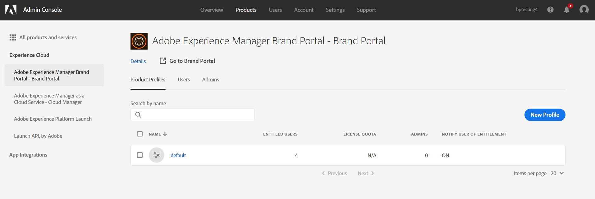

# Configurer Experience Manager Assets avec Brand Portal {#configure-aem-assets-with-brand-portal}

La configuration d’Adobe Experience Manager Assets Brand Portal permet de publier des ressources de marque approuvées d’Adobe Experience Manager Assets as a [!DNL Cloud Service] vers Brand Portal et de les distribuer aux utilisateurs de Brand Portal.

## Activation de Brand Portal à l’aide de Cloud Manager {#activate-brand-portal}

L’utilisateur de Cloud Manager active Brand Portal pour un Experience Manager Assets as a [!DNL Cloud Service] instance. Le workflow d’activation crée les configurations requises (jeton d’autorisation, configuration IMS et service cloud de Brand Portal) sur le serveur principal et reflète le statut du client Brand Portal dans Cloud Manager. L’activation de Brand Portal permet aux utilisateurs de Experience Manager Assets de publier des ressources sur Brand Portal et de les distribuer aux utilisateurs de Brand Portal.

**Conditions préalables**

Vous avez besoin des éléments suivants pour activer Brand Portal sur votre Experience Manager Assets as a [!DNL Cloud Service] instance :

* Experience Manager Assets en cours d’exécution en tant que [!DNL Cloud Service] instance.
* Utilisateur ayant accès à Cloud Manager, affecté aux Profils du produit Cloud Manager. Consultez [Accès à Cloud Manager](https://experienceleague.adobe.com/docs/experience-manager-cloud-service/security/ims-support.html?lang=fr#accessing-cloud-manager) pour plus d’informations.

>[!NOTE]
>
>Un environnement de production configuré est requis pour Experience Manager Assets as a [!DNL Cloud Service] pour se connecter au client Brand Portal.

**Étapes d’activation de Brand Portal**

Vous pouvez activer Brand Portal lors de la création des environnements de production pour votre Experience Manager Assets as a [!DNL Cloud Service] ou séparément. Supposons que l’environnement ait déjà été créé et que vous deviez à présent activer Brand Portal.

1. Connectez-vous à Adobe Cloud Manager et accédez à **[!UICONTROL Environnements]**.

   La page **[!UICONTROL Environnements]** affiche la liste de tous les environnements existants.

1. Sélectionnez les environnements (un par un) de la liste pour afficher les détails de l’environnement.

   Brand Portal a alloué à l’un des environnements disponibles et apparaît dans les **[!UICONTROL Informations sur l’environnement]**.

   Une fois que vous avez trouvé l’environnement associé à Brand Portal, cliquez sur le bouton **[!UICONTROL Activer Brand Portal]** pour lancer le processus d’activation.

   

1. L’activation du client Brand Portal prend quelques minutes car le processus d’activation crée les configurations requises sur le serveur principal. Une fois que le client Brand Portal est activé, son statut passe sur Activé.

   

>[!NOTE]
>
>Brand Portal doit être activé sur la même organisation IMS que dans Experience Manager Assets as a [!DNL Cloud Service] instance.
>
>Si vous disposez d’une configuration de cloud Brand Portal ([configuré manuellement à l’aide de la console Adobe Developer](#manual-configuration)) pour une organisation IMS (org1-existant) et votre Experience Manager Assets as a [!DNL Cloud Service] est configurée pour une autre organisation IMS (org2-new), l’activation de Brand Portal à partir de Cloud Manager réinitialise l’organisation IMS Brand Portal sur `org2-new`. Bien que la configuration cloud configurée manuellement sur `org1-existing` est visible dans l’instance d’auteur Experience Manager Assets, mais ne sera plus utilisé après l’activation de Brand Portal à partir de Cloud Manager.
>
>Si la configuration cloud Brand Portal existante et Experience Manager Assets as a [!DNL Cloud Service] Les instances utilisent la même organisation IMS (org1). Vous devez uniquement activer Brand Portal à partir de Cloud Manager.
>
>Ne modifiez aucun paramètre généré automatiquement.

**Voir aussi** :

* [Ajout d’utilisateurs et de rôles dans Experience Manager Assets as a Cloud Service](https://experienceleague.adobe.com/docs/experience-manager-cloud-manager/using/requirements/setting-up-users-and-roles.html?lang=fr)

* [Gestion des environnements dans Cloud Manager](https://experienceleague.adobe.com/docs/experience-manager-cloud-service/implementing/using-cloud-manager/manage-environments.html?lang=fr#adding-environments)

**Connexion à votre client Brand Portal**:

Après l’activation de votre client Brand Portal dans Cloud Manager, vous pouvez vous connecter à Brand Portal à partir de Admin Console ou directement à l’aide de l’URL du client.

L’URL par défaut de votre client Brand Portal est : `https://<tenant-id>.brand-portal.adobe.com/`.

dans lequel l’identifiant client est l’organisation IMS.

Suivez les étapes suivantes si vous n’êtes pas sûr de l’URL de Brand Portal :

1. Connectez-vous à [Admin Console](https://adminconsole.adobe.com/) et accédez à **[!UICONTROL Produits]**.
1. Dans le panneau de gauche, sélectionnez **[!UICONTROL Adobe Experience Manager Brand Portal - Brand Portal]**.
1. Cliquez sur **[!UICONTROL Accéder à Brand Portal]** pour ouvrir directement Brand Portal dans le navigateur.

   Vous pouvez également copier l’URL du client Brand Portal à partir du lien **[!UICONTROL Accéder à Brand Portal]** et la coller dans votre navigateur pour ouvrir l’interface de Brand Portal.

   

**Test de la connexion**

Effectuez les étapes suivantes pour valider la connexion entre votre Experience Manager Assets as a [!DNL Cloud Service] instance et client Brand Portal :

1. Connectez-vous à Experience Manager Assets.

1. Dans le panneau **Outils**, accédez à **[!UICONTROL Déploiement]** > **[!UICONTROL Distribution]**.

   

   Un agent de distribution Brand Portal (**[!UICONTROL bpdistributionagent0]**) est créé sous **[!UICONTROL Publier sur Brand Portal]**.

   

1. Cliquez sur **[!UICONTROL Publier sur Brand Portal]** pour ouvrir l’agent de distribution.

   Les files d’attente de distribution apparaissent dans l’onglet **[!UICONTROL État]**.

   Un agent de distribution contient deux files d’attente :
   * **processing-queue** : pour la distribution des ressources de Brand Portal.

   * **error-queue** : pour les ressources dont la distribution a échoué.
   >[!NOTE]
   >
   >Il est recommandé d’examiner les erreurs et d’effacer régulièrement la file d’attente **error-queue**.

   

1. Vérification de la connexion entre Experience Manager Assets as a [!DNL Cloud Service] et Brand Portal, cliquez sur le bouton **[!UICONTROL Tester la connexion]** icône .

   

   Un message s’affiche indiquant que votre *package de test a bien été livré*.

   >[!NOTE]
   >
   >Évitez de désactiver l’agent de distribution, car cela peut entraîner l’échec de la distribution des ressources (running-in-queue).

Vérification de la connexion entre votre Experience Manager Assets as a [!DNL Cloud Service] instance et client Brand Portal, publiez une ressource de Experience Manager Assets vers Brand Portal. Si la connexion est établie, la ressource publiée est visible dans l’interface de Brand Portal.

Vous pouvez maintenant effectuer les tâches suivantes :

* [Publication de ressources de Experience Manager Assets vers Brand Portal](publish-to-brand-portal.md)
* [Publication de dossiers de Experience Manager Assets vers Brand Portal](publish-to-brand-portal.md#publish-folders-to-brand-portal)
* [Publication de collections de Experience Manager Assets vers Brand Portal](publish-to-brand-portal.md#publish-collections-to-brand-portal)
* [Publication de ressources de Brand Portal vers Experience Manager Assets](https://experienceleague.adobe.com/docs/experience-manager-brand-portal/using/asset-sourcing-in-brand-portal/brand-portal-asset-sourcing.html?lang=fr) - Approvisionnement des ressources dans Brand Portal
* [Publication de paramètres prédéfinis, de schémas et de facettes sur Brand Portal](https://experienceleague.adobe.com/docs/experience-manager-brand-portal/using/publish/publish-schema-search-facets-presets.html?lang=fr)
* [Publication de balises sur Brand Portal](https://experienceleague.adobe.com/docs/experience-manager-brand-portal/using/publish/brand-portal-publish-tags.html?lang=fr)

Pour plus d’informations, voir [Publication de balises sur Brand Portal](https://experienceleague.adobe.com/docs/experience-manager-brand-portal/using/home.html?lang=fr).

**Journaux de distribution**

Vous pouvez surveiller les journaux de l’agent de distribution correspondant au workflow de publication de ressources.

Nous allons maintenant publier une ressource de Experience Manager Assets vers Brand Portal et consulter les journaux.

1. Suivez les étapes (1 à 4), comme indiqué dans la section **Test de la connexion**, puis accédez à la page de l’agent de distribution.
1. Cliquez sur **[!UICONTROL Journaux]** pour afficher les journaux de traitement et d’erreurs.

   

L’agent de distribution génère les journaux suivants :

* INFO : il s’agit d’un journal généré par le système qui se déclenche lors d’une configuration réussie de l’agent de distribution.
* DSTRQ1 (requête 1) : Déclencheurs lors du test de la connexion.

Lors de la publication de la ressource, les journaux de requête et de réponse suivants sont générés :

**Requête de l’agent de distribution** :

* DSTRQ2 (requête 2) : La requête de publication de ressource est déclenchée.
* DSTRQ3 (requête 3) : Le système déclenche une autre requête pour publier le dossier Experience Manager Assets (dans lequel se trouve la ressource) et réplique le dossier dans Brand Portal.

**Réponse de l’agent de distribution** :

* queue-bpdistributionagent0 (DSTRQ2) : La ressource est publiée sur Brand Portal.
* queue-bpdistributionagent0 (DSTRQ3) : Le système réplique le dossier Experience Manager Assets (contenant la ressource) dans Brand Portal.

Dans l’exemple ci-dessus, une requête et une réponse supplémentaires sont déclenchées. Le système n’a pas trouvé le dossier parent (Ajouter chemin d’accès) dans Brand Portal, car la ressource a été publiée pour la première fois. Par conséquent, il a déclenché une requête supplémentaire pour créer un dossier parent portant le même nom dans Brand Portal à l’emplacement où la ressource est publiée.

>[!NOTE]
>
>Une requête supplémentaire est générée si le dossier parent n’existe pas dans Brand Portal ou a été modifié dans Experience Manager Assets.

Outre le workflow d’automatisation pour activer Brand Portal sous Experience Manager Assets en tant que [!DNL Cloud Service], il existe une autre méthode pour configurer manuellement Experience Manager Assets en tant que [!DNL Cloud Service] avec Brand Portal utilisant la console Adobe Developer qui n’est plus recommandée.

>[!NOTE]
>
>Contactez le service clientèle si vous rencontrez un problème lors de l’activation de votre client Brand Portal.

## Configuration manuelle à l’aide d’Adobe Developer Console {#manual-configuration}

La section suivante décrit comment configurer manuellement Experience Manager Assets en tant que [!DNL Cloud Service] avec Brand Portal à l’aide de la console Adobe Developer.

Auparavant, Experience Manager Assets en tant que [!DNL Cloud Service] a été configuré manuellement avec Brand Portal via la console Adobe Developer, qui fournit un jeton de compte Adobe Identity Management Services (IMS) pour autoriser le client Brand Portal. Elle nécessite des configurations à la fois dans Experience Manager Assets et dans la console Adobe Developer.

1. Dans Experience Manager Assets, créez un compte IMS et générez une clé publique (certificat).
1. Dans Adobe Developer Console, créez un projet pour votre client Brand Portal (organisation).
1. Dans le projet, configurez une API à l’aide de la clé publique pour créer une connexion au compte de service.
1. Procurez-vous les informations d’identification du compte de service et les informations de charge utile JSON Web Token (JWT).
1. Dans Experience Manager Assets, configurez le compte IMS à l’aide des informations d’identification du compte de service et de la charge utile JWT.
1. Dans Experience Manager Assets, configurez le service cloud Brand Portal à l’aide du compte IMS et du point de terminaison Brand Portal (URL de l’organisation).
1. Testez votre configuration en publiant une ressource de Experience Manager Assets vers Brand Portal.

>[!NOTE]
>
>Une Experience Manager Assets en tant que [!DNL Cloud Service] ne doit être configurée qu’avec un seul client Brand Portal.

**Conditions préalables**

Pour configurer Experience Manager Assets avec Brand Portal, vous devez disposer des éléments suivants :

* Experience Manager Assets en cours d’exécution en tant que [!DNL Cloud Service] instance
* Une adresse URL du client Brand Portal
* Un utilisateur disposant de droits d’administrateur système sur l’organisation IMS du client Brand Portal

## Création d’une configuration {#create-new-configuration}

Effectuez les étapes suivantes dans la séquence spécifiée pour configurer Experience Manager Assets avec Brand Portal.

1. [Obtention d’un certificat public](#public-certificate)
1. [Création d’une connexion au compte de service (JWT)](#createnewintegration)
1. [Configuration du compte IMS](#create-ims-account-configuration)
1. [Configuration du service cloud](#configure-the-cloud-service)

### Création de la configuration IMS {#create-ims-configuration}

La configuration IMS authentifie votre Experience Manager Assets en tant que [!DNL Cloud Service] avec le client Brand Portal.

La configuration IMS comprend deux étapes :

* [Obtention d’un certificat public](#public-certificate)
* [Configuration du compte IMS](#create-ims-account-configuration)

### Obtention d’un certificat public {#public-certificate}

La clé publique (certificat) authentifie votre profil sur Adobe Developer Console.

1. Connectez-vous à Experience Manager Assets.
1. Dans le panneau **Outils**, accédez à **[!UICONTROL Sécurité]** > **[!UICONTROL Configurations d’Adobe IMS]**.
1. Dans la page Configurations d’Adobe IMS, cliquez sur **[!UICONTROL Créer]**. Vous êtes redirigé vers la page **[!UICONTROL Configuration du compte technique Adobe IMS]**. Par défaut, l’onglet **Certificat** s’ouvre.
1. Sélectionnez **[!UICONTROL Adobe Brand Portal]** dans la liste déroulante **[!UICONTROL Solution cloud]**.
1. Cochez la case **[!UICONTROL Créer un certificat]** et spécifiez un **alias** pour la clé publique. L’alias constitue le nom de la clé publique.
1. Cliquez sur **[!UICONTROL Créer un certificat]**. Cliquez sur **[!UICONTROL OK]** pour générer la clé publique.

   

1. Cliquez sur l’icône **[!UICONTROL Télécharger la clé publique]** et enregistrez le fichier de clé publique (CRT) sur votre ordinateur.

   La clé publique est utilisée ultérieurement pour configurer l’API de votre client Brand Portal et générer les informations d’identification de compte de service dans la console Adobe Developer.

   

1. Cliquez sur **[!UICONTROL Suivant]**.

   Dans l’onglet **Compte**, un compte Adobe IMS est créé, ce qui nécessite les informations d’identification du compte de service qui sont générées dans Adobe Developer Console. Gardez cette page ouverte pour l’instant.

   Ouvrez un nouvel onglet et [créez une connexion au compte de service (JWT) dans Adobe Developer Console](#createnewintegration) pour obtenir les informations d’identification et la charge utile JWT qui servent à configurer le compte IMS.

### Créer une connexion au compte de service (JWT) {#createnewintegration}

Dans Adobe Developer Console, les projets et les API sont configurés au niveau du client Brand Portal. La configuration d’une API crée une connexion au compte de service (JWT). Il existe deux méthodes pour configurer l’API : générer une paire de clés (clés privée et publique) ou télécharger une clé publique. Pour configurer Experience Manager Assets avec Brand Portal, vous devez générer une clé publique (certificat) dans Experience Manager Assets et créer des informations d’identification dans la console Adobe Developer en chargeant la clé publique. Ces informations d’identification sont requises pour configurer le compte IMS dans Experience Manager Assets. Une fois le compte IMS configuré, vous pouvez configurer le service cloud Brand Portal dans Experience Manager Assets.

Procédez comme suit pour générer les informations d’identification du compte de service et la charge utile JWT :

1. Connectez-vous à la console Adobe Developer avec les privilèges d’administrateur système sur l’organisation IMS (client Brand Portal). L’URL par défaut est [https://www.adobe.com/go/devs_console_ui](https://www.adobe.com/go/devs_console_ui).

   >[!NOTE]
   >
   >Assurez-vous d’avoir sélectionné l’organisation IMS appropriée (client Brand Portal) dans la liste déroulante (liste d’organisations) située dans l’angle supérieur droit.

1. Cliquez sur **[!UICONTROL Create new project]** (Créer un projet). Un projet vierge portant un nom généré par le système est créé pour votre organisation.

   Cliquez sur **[!UICONTROL Edit project]** (Modifier le projet) pour mettre à jour le **[!UICONTROL Project Title]** (Titre du projet) et la **[!UICONTROL Description]**, puis cliquez sur **[!UICONTROL Save]** (Enregistrer).

1. Dans l’onglet **[!UICONTROL Project overview]** (Aperçu du projet), cliquez sur **[!UICONTROL Add API]** (Ajouter une API).

1. Dans la fenêtre **[!UICONTROL Add API]** (Ajouter une API), sélectionnez **[!UICONTROL AEM Brand Portal]**, puis cliquez sur **[!UICONTROL Next]** (Suivant).

   Vérifiez que vous avez accès au service Brand Portal Experience Manager.

1. Dans la fenêtre **[!UICONTROL Configure API]** (Configurer l’API), cliquez sur **[!UICONTROL Upload your public key]** (Charger votre clé publique). Cliquez ensuite sur **[!UICONTROL Select a File]** (Sélectionner un fichier) et chargez la clé publique (fichier .crt) que vous avez téléchargé comme indiqué à la section [Obtain public certificate](#public-certificate) (Obtention d’un certificat public).

   Cliquez sur **[!UICONTROL Next]** (Suivant).

   

1. Vérifiez la clé publique et cliquez sur **[!UICONTROL Next]** (Suivant).

1. Sélectionnez **[!UICONTROL Assets Brand Portal]** comme profil de produit par défaut et cliquez sur **[!UICONTROL Save configured API]** (Enregistrer l’API configurée).

   

1. Après la configuration de l’API, vous êtes redirigé vers sa page d’aperçu. Dans le volet de navigation de gauche, sous **[!UICONTROL Credentials]** (Informations d’identification), cliquez sur **[!UICONTROL Service Account (JWT)]** (Compte de service (JWT)).

   >[!NOTE]
   >
   >Vous pouvez voir les informations d’identification et effectuer des actions (générer des jetons JWT, copier les informations d’identification, récupérer le secret client, etc.).

1. Dans l’onglet **[!UICONTROL Client Credentials]** (Informations d’identification client), copiez l’**[!UICONTROL ID client]**.

   Cliquez sur **[!UICONTROL Retrieve Client Secret]** (Récupérer le secret client) et copiez le **[!UICONTROL secret client]**.

   

1. Accédez à l’onglet **[!UICONTROL Generate JWT]** (Générer le jeton JWT) et copiez les informations **[!UICONTROL JWT Payload]** (Charge utile JWT).

Vous pouvez désormais utiliser l’ID client (clé API), le secret client et la charge utile JWT pour [configuration du compte IMS](#create-ims-account-configuration) dans Experience Manager Assets.

<!--
1. Click **[!UICONTROL Create Integration]**.

1. Select **[!UICONTROL Access an API]**, and click **[!UICONTROL Continue]**.

   

1. Create a new integration page opens. 
   
   Select your organization from the drop-down list.

   In **[!UICONTROL Experience Cloud]**, Select **[!UICONTROL AEM Brand Portal]** and click **[!UICONTROL Continue]**. 

   If the Brand Portal option is disabled for you, ensure that you have selected correct organization from the drop-down box above the **[!UICONTROL Adobe Services]** option. If you do not know your organization, contact your administrator.

   

1. Specify a name and description for the integration. Click **[!UICONTROL Select a File from your computer]** and upload the `AEM-Adobe-IMS.crt` file downloaded in the [obtain public certificates](#public-certificate) section.

1. Select the profile of your organization. 

   Or, select the default profile **[!UICONTROL Assets Brand Portal]** and click **[!UICONTROL Create Integration]**. The integration is created.

1. Click **[!UICONTROL Continue to integration details]** to view the integration information. 

   Copy the **[!UICONTROL API Key]** 
   
   Click **[!UICONTROL Retrieve Client Secret]** and copy the Client Secret key.

   

1. Navigate to **[!UICONTROL JWT]** tab, and copy the **[!UICONTROL JWT payload]**.

   The API Key, Client Secret key, and JWT payload information will be used to create IMS account configuration.

-->

### Configuration du compte IMS {#create-ims-account-configuration}

Vérifiez que vous avez effectué les étapes suivantes :

* [Obtention d’un certificat public](#public-certificate)
* [Créer une connexion au compte de service (JWT)](#createnewintegration)

Effectuez les étapes suivantes pour configurer le compte IMS.

1. Ouvrez la configuration IMS et accédez à l’onglet **[!UICONTROL Compte]**. Vous avez maintenu la page ouverte lors de l’[obtention du certificat public](#public-certificate).

1. Spécifiez un **[!UICONTROL titre]** pour le compte IMS.

   Dans le champ **[!UICONTROL Serveur d’autorisation]**, spécifiez l’adresse URL : [https://ims-na1.adobelogin.com/](https://ims-na1.adobelogin.com/)

   Spécifiez l’ID client dans le champ **[!UICONTROL Clé API]**, le **[!UICONTROL Secret client]** et la **[!UICONTROL Charge utile]** (charge utile JWT) que vous avez copiés lors de la [création d’une connexion au compte de service (JWT)](#createnewintegration).

   Cliquez sur **[!UICONTROL Créer]**.

   Le compte IMS est configuré.

   

1. Sélectionnez la configuration de compte IMS et cliquez sur **[!UICONTROL Contrôle de l’intégrité]**.

   Cliquez sur **[!UICONTROL Vérifier]** dans la boîte de dialogue. Une fois la configuration réussie, un message s’affiche avec la mention *Jeton récupéré avec succès*.

   

>[!CAUTION]
>
>Vous ne devez avoir qu’une seule configuration IMS.
>
>Assurez-vous que la configuration IMS réussit le contrôle d’intégrité. Si tel n’est pas le cas, elle n’est pas valide. Vous devez la supprimer et créer une configuration valide.

### Configuration du service cloud {#configure-the-cloud-service}

Pour configurer le service cloud Brand Portal, procédez comme suit :

1. Connectez-vous à Experience Manager Assets.

1. Dans le panneau **Outils**, accédez à **[!UICONTROL Cloud Services]** > **[!UICONTROL AEM Brand Portal]**.

1. Dans la page Configurations Brand Portal, cliquez sur **[!UICONTROL Créer]**.

1. Saisissez un **[!UICONTROL titre]** pour la configuration.

   Sélectionnez la configuration IMS que vous avez créée lors de la [configuration du compte IMS](#create-ims-account-configuration).

   Dans le champ **[!UICONTROL URL du service]**, entrez l’adresse URL de votre client Brand Portal (organisation).

   

1. Cliquez sur **[!UICONTROL Enregistrer et fermer]**. La configuration cloud est alors créée.

   Votre Experience Manager Assets as a [!DNL Cloud Service] est maintenant configurée avec le client Brand Portal.

Vous pouvez maintenant tester la configuration en vérifiant l’agent de distribution et en publiant les ressources sur Brand Portal.

<!--
### Test configuration {#test-configuration}

Perform the following steps to validate the configuration:

1. Login to AEM Assets.

1. From the **Tools** panel, navigate to **[!UICONTROL Deployment]** > **[!UICONTROL Distribution]**.

    

   A Brand Portal distribution agent (**[!UICONTROL bpdistributionagent0]**) is created under **[!UICONTROL Publish to Brand Portal]**.

   

1. Click **[!UICONTROL Publish to Brand Portal]** to open the distribution agent. 

   You can see the distribution queues under the **[!UICONTROL Status]** tab. 
   
   A distribution agent contains two queues: 
   * **processing-queue**: for the distribution of assets to Brand Portal. 

   * **error-queue**: for the assets where distribution has failed. 
   
   >[!NOTE]
   >
   >It is recommended to review the failures and  clear the **error-queue** periodically.  

   

1. To verify the connection between AEM Assets as a [!DNL Cloud Service] and Brand Portal, click on the **[!UICONTROL Test Connection]** icon.

   

   A message appears that your *test package is successfully delivered*.

   >[!NOTE]
   >
   >Avoid disabling the distribution agent, as it can cause the distribution of the assets (running-in-queue) to fail.

You can now:

* [Publish assets from AEM Assets to Brand Portal](publish-to-brand-portal.md)
* [Publish folders from AEM Assets to Brand Portal](publish-to-brand-portal.md#publish-folders-to-brand-portal)
* [Publish collections from AEM Assets to Brand Portal](publish-to-brand-portal.md#publish-collections-to-brand-portal)
* [Publish assets from Brand Portal to AEM Assets](https://experienceleague.adobe.com/docs/experience-manager-brand-portal/using/asset-sourcing-in-brand-portal/brand-portal-asset-sourcing.html) - Asset Sourcing in Brand Portal
* [Publish presets, schemas, and facets to Brand Portal](https://experienceleague.adobe.com/docs/experience-manager-brand-portal/using/publish/publish-schema-search-facets-presets.html)
* [Publish tags to Brand Portal](https://experienceleague.adobe.com/docs/experience-manager-brand-portal/using/publish/brand-portal-publish-tags.html)

See [Brand Portal documentation](https://experienceleague.adobe.com/docs/experience-manager-brand-portal/using/home.html) for more information.

## Distribution logs {#distribution-logs}

You can monitor the distribution agent logs for the asset publishing workflow. 

For example, we have published an asset from AEM Assets to Brand Portal to validate the configuration. 

1. Follow the steps (from 1 to 4) as shown in the [Test Configuration](#test-configuration) section and navigate to the distribution agent page.
1. Click **[!UICONTROL Logs]** to view the processing and error logs.

   

The distribution agent has generated the following logs:

* INFO: This is a system-generated log that triggers on successful configuration of the distribution agent. 
* DSTRQ1 (Request 1): Triggers on test connection.

On publishing the asset, the following request and response logs are generated:

**Distribution agent request**:

* DSTRQ2 (Request 2): The asset publishing request is triggered.
* DSTRQ3 (Request 3): The system triggers another request to publish the AEM Assets folder (in which the asset exists) and replicates the folder in Brand Portal.

**Distribution agent response**:

* queue-bpdistributionagent0 (DSTRQ2): The asset is published to Brand Portal.
* queue-bpdistributionagent0 (DSTRQ3): The system replicates the AEM Assets folder (containing the asset) in Brand Portal.

In the above example, an additional request and response is triggered. The system could not find the parent folder (Add Path) in Brand Portal because the asset was published for the first time, therefore, it triggered an additional request to create a parent folder with the same name in Brand Portal where the asset is published.  

>[!NOTE]
>
>Additional request is generated in case the parent folder does not exist in Brand Portal or has been modified in AEM Assets. 
-->

<!--

## Additional information {#additional-information}

Go to `/system/console/slingmetrics` for statistics related to the distributed content:

1. **Counter metrics**
   * sling: `mac_sync_request_failure`
   * sling: `mac_sync_request_received`
   * sling: `mac_sync_request_success`

1. **Time metrics**
   * sling: `mac_sync_distribution_duration`
   * sling: `mac_sync_enqueue_package_duration`
   * sling: `mac_sync_setup_request_duration`

-->

<!--
   Comment Type: draft

   <li> </li>
   -->

<!--
   Comment Type: draft

   <li>Step text</li>
-->
