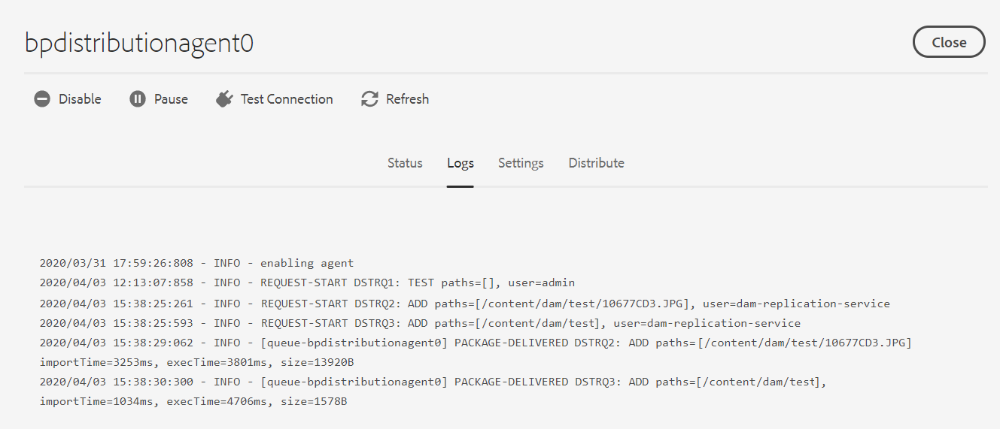

# Configuration d’AEM Assets avec Brand Portal {#configure-aem-assets-with-brand-portal}

Adobe Experience Manager (AEM) Assets est configuré avec Brand Portal via Adobe I/O, qui fournit un jeton IMS pour autoriser votre client Brand Portal.

## Conditions préalables {#prerequisites}

Pour configurer AEM Assets avec Brand Portal, vous devez disposer des éléments suivants :

* Une instance cloud AEM Assets en cours d’exécution.
* URL du client Brand Portal
* Un utilisateur disposant de droits d’administrateur système sur l’organisation IMS du client Brand Portal

**Contactez l&#39;assistance** pour obtenir d&#39;autres  de.

## Création d’une configuration {#create-new-configuration}

Vous pouvez créer une nouvelle configuration sur les E/S Adobe pour configurer votre instance cloud AEM Assets avec Brand Portal.

Effectuez les étapes suivantes dans la séquence répertoriée :
1. [Obtention d’un certificat public](#public-certificate)
1. [Créer l’intégration Adobe I/O](#createnewintegration)
1. [Créer une configuration de compte IMS](#create-ims-account-configuration)
1. [Configuration du service cloud](#configure-the-cloud-service)
1. [Configuration du test](#test-configuration)

### Création de la configuration IMS {#create-ims-configuration}

La configuration IMS authentifie votre client du portail de marque avec l’instance d’auteur AEM Assets.

La configuration IMS comprend deux étapes :

* [Obtention d’un certificat public](#public-certificate)
* [Créer une configuration de compte IMS](#create-ims-account-configuration)

### Obtention d’un certificat public {#public-certificate}

Le certificat public vous permet d’authentifier vos  d’sur les E/S Adobe.

1. Connexion à votre instance cloud AEM Assets

1. Dans le panneau **Outils**  , accédez à **[!UICONTROL Sécurité]** > Configurations **[!UICONTROL Adobe IMS.]**

   

1. La page Configurations d’Adobe IMS s’ouvre.

   Cliquez sur **[!UICONTROL Créer]**.

   Vous accéderez ainsi à la page Configuration **[!UICONTROL du compte technique IMS d’]** Adobe.

1. Par défaut, l’onglet **Certificat** s’ouvre.

   Dans la solution **** Cloud, sélectionnez **[!UICONTROL Adobe Brand Portal]**.

1. Cochez la case **[!UICONTROL Créer un nouveau certificat]** et spécifiez un **alias** pour le certificat. L’alias sert de nom à la boîte de dialogue.

1. Cliquez sur **[!UICONTROL Créer un certificat]**. Une boîte de dialogue s’affiche. Cliquez sur **[!UICONTROL OK]** pour générer le certificat public.

   

1. Click **[!UICONTROL Download Public Key]** and save the *AEM-Adobe-IMS.crt* certificate file on your machine. The certificate file is used to [create Adobe I/O integration](#createnewintegration).

   

1. Cliquez sur **[!UICONTROL Suivant]**.

   Dans l’onglet **Compte** , vous créez le compte Adobe IMS, mais vous aurez besoin des détails d’intégration. Gardez cette page ouverte pour l&#39;instant.

   Ouvrez un nouvel onglet et [créez une intégration](#createnewintegration) d’E/S Adobe pour obtenir les détails d’intégration des configurations de compte IMS.

### Créer l’intégration Adobe I/O {#createnewintegration}

L’intégration des E/S Adobe génère une clé d’API, une clé secrète client et une charge utile (JWT) requises pour configurer les configurations de compte IMS.

1. Connectez-vous à la console d’E/S Adobe avec les droits d’administrateur système sur l’organisation IMS du client du portail de marque.

   URL par défaut : [https://console.adobe.io/](https://console.adobe.io/)

1. Click **[!UICONTROL Create Integration]**.

1. Sélectionnez **[!UICONTROL Accéder à une API]**, puis cliquez sur **[!UICONTROL Continuer]**.

   

1. Créez une page d’intégration qui s’ouvre.

   Sélectionnez votre organisation dans le  déroulant.

   Dans **[!UICONTROL Experience Cloud]**, sélectionnez **[!UICONTROL AEM Brand Portal]** et cliquez sur **[!UICONTROL Continuer]**.

   If the Brand Portal option is disabled for you, ensure that you have selected correct organization from the drop-down box above the **[!UICONTROL Adobe Services]** option. Si vous ne connaissez pas le nom de votre entreprise, contactez votre administrateur.

   

1. Indiquez un nom et une description pour l’intégration. Click **[!UICONTROL Select a File from your computer]** and upload the `AEM-Adobe-IMS.crt` file downloaded in the [obtain public certificates](#public-certificate) section.

1. Sélectionnez le  de votre organisation.

   Ou bien, sélectionnez le portail **[!UICONTROL des marques]** Ressources par défaut et cliquez sur **[!UICONTROL Créer une intégration]**. L’intégration est alors créée.

1. Click **[!UICONTROL Continue to integration details]** to view the integration information.

   Copie de la clé **[!UICONTROL API]**

   Cliquez sur **[!UICONTROL Récupérer la clé secrète]** du client et copiez la clé secrète du client.

   

1. Accédez à l’onglet **[!UICONTROL JWT]** et copiez la charge **** JWT.

   La clé API, la clé secrète client et les informations de charge utile JWT seront utilisées pour créer la configuration du compte IMS.

### Créer une configuration de compte IMS {#create-ims-account-configuration}

Vérifiez que vous avez effectué les étapes suivantes :

* [Obtention d’un certificat public](#public-certificate)
* [Créer l’intégration Adobe I/O](#createnewintegration)

**Procédure de création de la configuration du compte IMS :**

1. Ouvrez la page Configuration IMS, onglet **[!UICONTROL Comptes]** . Vous avez gardé la page ouverte à la fin de la section [Obtenir des certificats publics](#public-certificate).

1. Spécifiez un **[!UICONTROL titre]** pour le compte IMS.

   Dans **[!UICONTROL Authorization Server]**, saisissez l’URL : [https://ims-na1.adobelogin.com/](https://ims-na1.adobelogin.com/)

   Collez la clé d’API, la clé secrète client et la charge utile JWT que vous avez copiée à la fin de l’intégration [d’E/S](#createnewintegration)Create Adobe.

   Cliquez sur **[!UICONTROL Créer]**.

   L’intégration est créée.

   

1. Select the IMS configuration and click **[!UICONTROL Check Health]**. Une boîte de dialogue s’affiche.

   Cliquez sur **[!UICONTROL Vérifier]**. Une fois la connexion établie, le message *Token retrieved successfully* (Jeton récupéré) s’affiche.

   

>[!CAUTION]
>
>Créez une seule configuration IMS valide. Ne créez pas plusieurs configurations IMS.
>
> Assurez-vous que la configuration est saine. Au cas où la configuration serait malsaine, supprimez-la et créez une nouvelle configuration saine.

### Configure cloud service {#configure-the-cloud-service}

Effectuez les étapes suivantes pour créer la configuration du service cloud de Portal de marque :

1. Connexion à votre instance cloud AEM Assets

1. Dans le panneau **Outils**  , accédez à Services **[!UICONTROL Cloud > Portail]** de marque AEM.

   La page Configurations du portail de marque s’ouvre.

1. Cliquez sur **[!UICONTROL Créer]**.

1. Specify a **[!UICONTROL Title]** for the configuration.

   Sélectionnez la configuration IMS que vous avez créée à l’étape, [créez la configuration](#create-ims-account-configuration)du compte IMS.

   Dans l’URL **[!UICONTROL du]** service, saisissez l’URL du client du portail de marque.

   

1. Click **[!UICONTROL Save and Close]**. La configuration cloud est alors créée. Votre instance cloud AEM Assets est maintenant configurée avec le client du portail de marque.

### Test configuration {#test-configuration}

1. Connectez-vous à votre instance cloud AEM Assets.

1. Dans le panneau **Outils**  , accédez à **[!UICONTROL Déploiement]** > **[!UICONTROL Distribution.]**

   

1. La page Distribution s’ouvre.

   Un agent de distribution du portail de marque `bpdistributionagent0` est créé sous **[!UICONTROL Publier sur le portail]** de marque.

   Click **[!UICONTROL Publish to Brand Portal]**.

   

   >[!NOTE]
   >
   >Par défaut, un agent de distribution est créé pour un client du portail de marques.

1. La page de l&#39;agent de distribution s&#39;ouvre. Par défaut, l’onglet **[!UICONTROL État]** s’ouvre, ce qui remplit les files d’attente de distribution.

   Un agent de distribution contient deux files d&#39;attente :
   * File d’attente de traitement pour la distribution des ressources vers le portail de marque.
   * File d’attente d’erreurs pour les ressources dont la distribution a échoué.
   

1. Pour vérifier la connexion entre AEM Assets et Brand Portal, cliquez sur **[!UICONTROL Tester la connexion]**.

   

   Un message s’affiche en bas de la page pour indiquer que votre package de test est livré avec succès.

   >[!NOTE]
   >
   >Evitez de désactiver l’agent de distribution, car cela peut entraîner l’échec de la distribution des ressources (en cours d’exécution).

Une fois que le portail de marque a été correctement configuré avec votre instance cloud AEM Assets, vous pouvez :

* [Publication de fichiers depuis AEM Assets vers Brand Portal](publish-to-brand-portal.md)
* [Publication de dossiers depuis AEM Assets vers Brand Portal](publish-to-brand-portal.md#publish-folders-to-brand-portal)
* [Publication de collections depuis AEM Assets vers Brand Portal](publish-to-brand-portal.md#publish-collections-to-brand-portal)

Outre ce qui précède, vous pouvez également publier des  de métadonnées, des paramètres d’image prédéfinis, des facettes de recherche et des balises d’AEM Assets sur le portail de marque.

* [Publication de paramètres prédéfinis, de  et de facettes sur Brand Portal](https://docs.adobe.com/content/help/en/experience-manager-brand-portal/using/publish/publish-schema-search-facets-presets.html)
* [Publication de balises sur Brand Portal](https://docs.adobe.com/content/help/en/experience-manager-brand-portal/using/publish/brand-portal-publish-tags.html)

See, [Brand Portal documentation](https://docs.adobe.com/content/help/en/experience-manager-brand-portal/using/home.html) for more information.

## Journaux de distribution {#distribution-logs}

Vous pouvez consulter les journaux pour obtenir des informations détaillées sur les actions effectuées sur l&#39;agent de distribution.

Par exemple, nous avons publié un fichier d’AEM Assets sur Brand Portal pour vérifier la configuration.

1. Suivez les étapes (Étape 1 à 4) comme indiqué dans **[!UICONTROL Test Connection]** et accédez à la page de l&#39;agent de distribution.

1. Cliquez sur **[!UICONTROL Journaux]** pour les journaux de distribution. Vous pouvez consulter les journaux de traitement et d’erreur ici.

   

L’agent de distribution génère les journaux suivants :

* INFO : Il s&#39;agit d&#39;un journal généré par le système et déclenché lors d&#39;une configuration réussie qui active l&#39;agent de distribution.
* DSTRQ1 (Demande 1) : Rogné sur la connexion test.

Lors de la publication du fichier, les journaux de requête et de réponse suivants sont générés :

**Demande** de l&#39;agent de distribution :
* DSTRQ2 (Demande 2) : La demande de publication de fichier est déclenchée.
* DSTRQ3 (Demande 3) : Le système déclenche une autre requête pour publier le dossier dans lequel le fichier existe et le répliquera dans le portail de marque.

**Réponse** de l&#39;agent de distribution :
* queue-bpdistributionagent0 (DSTRQ2) : Le fichier est publié sur le portail de marque.
* queue-bpdistributionagent0 (DSTRQ3) : Le système répliquera le dossier contenant le fichier dans Brand Portal.

Dans l’exemple ci-dessus, une requête et une réponse supplémentaires sont déclenchées. Le système n’a pas pu trouver le dossier parent (alias chemin d’accès Ajouter) dans le portail de marque, car la ressource a été publiée pour la première fois. Par conséquent, déclenche une demande supplémentaire pour créer un dossier parent portant le même nom dans le portail de marque où la ressource est publiée.

>[!NOTE]
>>Une requête supplémentaire est générée au cas où le dossier parent n’existerait pas dans Brand Portal (dans l’exemple ci-dessus) ou si le dossier parent avait été modifié dans AEM Assets.
>

## Informations complémentaires {#additional-information}

Accédez à `/system/console/slingmetrics` la section pour obtenir des statistiques relatives au contenu distribué :

1. **Mesures de compteur**
   * sling: `mac_sync_request_failure`
   * sling: `mac_sync_request_received`
   * sling: `mac_sync_request_success`

1. **Mesures temporelles**
   * sling: `mac_sync_distribution_duration`
   * sling: `mac_sync_enqueue_package_duration`
   * sling: `mac_sync_setup_request_duration`

<!--
   Comment Type: draft

   <li> </li>
   -->

<!--
   Comment Type: draft

   <li>Step text</li>
   -->
