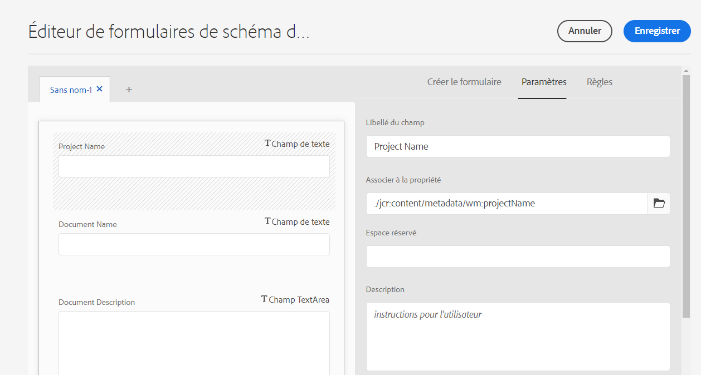

# Configurer le mappage des métadonnées de ressource entre Adobe Workfront et Experience Manager Assets {#asset-metadata-mapping-workfront-aem-assets}

| [Bonnes pratiques de recherche](/help/assets/search-best-practices.md) | [ Bonnes pratiques en matière de métadonnées](/help/assets/metadata-best-practices.md) | [Hub de contenus](/help/assets/product-overview.md) | [Dynamic Media avec fonctionnalités OpenAPI](/help/assets/dynamic-media-open-apis-overview.md) | [Documentation destinée aux développeurs AEM Assets](https://developer.adobe.com/experience-cloud/experience-manager-apis/) |
| ------------- | --------------------------- |---------|----|-----|

Vous pouvez mapper les champs de métadonnées des ressources entre les applications Adobe Workfront et Experience Manager as a Cloud Service. Suite au mappage des champs de métadonnées, lorsque vous envoyez une ressource de Workfront à Experience Manager Assets, vous pouvez afficher les métadonnées de ressource mappées dans Experience Manager Assets.

Par exemple, si vous devez conserver les champs de métadonnées d’une image tels que le nom, la description et le projet auxquels elle appartient dans Workfront lorsque vous envoyez l’image à Experience Manager Assets, configurez ces champs et mappez-les aux propriétés Experience Manager Assets.

**Cas d’utilisation**

Une image `add-users-workfront.png` se trouve dans le projet `Metadata Syncs` de l’application Adobe Workfront. Vous devez envoyer cette image à Experience Manager Assets as a Cloud Service avec les métadonnées suivantes :

* Nom du projet

* Nom du document

* Description du document

## Conditions préalables {#prerequisites}

* Un accès administrateur aux applications Workfront et Experience Manager Assets as a Cloud Service.

* Une intégration entre [les applications Workfront et Experience Manager Assets as a Cloud Service](https://experienceleague.adobe.com/docs/workfront/using/administration-and-setup/configure-integrations/setup-asset-essentials.html?lang=fr).

## Configurer le mappage des métadonnées dans Workfront {#set-up-metadata-mapping}

Pour définir le mappage des métadonnées pour les champs Nom du projet, Nom du document et Description du document dans Workfront :

1. Cliquez sur l’icône du menu principal  disponible dans le coin supérieur droit de l’application Adobe Workfront, puis cliquez sur **[!UICONTROL Configurer]**.

1. Sélectionnez **[!UICONTROL Documents]** dans le panneau de gauche, puis sélectionnez **[!UICONTROL Experience Manager Assets]**.

1. Sélectionnez l’intégration Experience Manager Assets et cliquez sur **[!UICONTROL Modifier]**.

1. Cliquez sur **[!UICONTROL Métadonnées]**. Sous l’onglet **[!UICONTROL Ressources]**, mappez le champ Workfront [!UICONTROL Projet] > [!UICONTROL Nom] au champ Experience Manager Assets `wm:projectName`. Si vous ne trouvez pas la correspondance exacte, Adobe vous recommande de rechercher la meilleure correspondance pour mapper le champ Workfront et Experience Manager Assets. Vous pouvez éviter de mapper des champs ayant différents types de données. Par exemple, le mappage d’un champ de date Workfront à un champ Ressources de description.
1. Mappez le champ Workfront [!UICONTROL Document] > [!UICONTROL Nom] au champ Experience Manager Assets `wm:documentName`.

   

1. Mappez le champ Workfront [!UICONTROL Document] > [!UICONTROL Description] au champ Experience Manager Assets `dc:description`.

   >[!VIDEO](https://video.tv.adobe.com/v/344255)

## Envoyer l’image de Workfront à Experience Manager Assets {#send-image-workfront-assets}

Pour envoyer l’image de Workfront à Experience Manager Assets :

1. Cliquez sur l’icône du menu principal  disponible dans le coin supérieur droit de l’application Adobe Workfront, puis cliquez sur **[!UICONTROL Projets]**.

1. Cliquez sur **[!UICONTROL Nouveau projet]** pour créer un projet.

1. Cliquez sur l’option **[!UICONTROL Documents]** disponible dans le volet de gauche, faites glisser l’image à envoyer à Experience Manager Assets, puis sélectionnez-la.

1. Cliquez sur **[!UICONTROL Envoyer à]**, puis choisissez le nom de l’intégration Experience Manager Assets Essentials.

   

1. Sélectionnez le dossier de destination de la ressource, puis cliquez sur **[!UICONTROL Sélectionner un dossier]**.

1. Cliquez sur **[!UICONTROL Enregistrer]**.

## Configurer le mappage des métadonnées de ressource dans Experience Manager as a Cloud Service {#metadata-mapping-aem}

Après avoir [configuré le mappage des métadonnées de ressource dans Adobe Workfront](#set-up-metadata-mapping), vous devez utiliser le même mappage dans l’application Experience Manager Assets as a Cloud Service pour afficher les résultats de métadonnées appropriés pour l’image.

Le mappage des métadonnées s’effectue à l’aide des schémas de métadonnées dans Experience Manager Assets. Vous pouvez modifier un formulaire de schéma de métadonnées existant ou nouvellement ajouté. Le formulaire de schéma de métadonnées comprend des onglets et des éléments de formulaire dans des onglets. Vous pouvez associer ou configurer ces éléments de formulaire dans un champ au sein d’un nœud de métadonnées dans le référentiel CRX. Vous pouvez ajouter des onglets ou des éléments de formulaire au formulaire de schéma de métadonnées. Pour plus d’informations, voir [Schémas de métadonnées](metadata-schemas.md).

Pour configurer le mappage des métadonnées à l’aide d’un nouveau formulaire de métadonnées dans Experience Manager Assets as a Cloud Service :

1. Accédez à **[!UICONTROL Outils]** > **[!UICONTROL Ressources]** > **[!UICONTROL Schémas de métadonnées]**.

1. Cliquez sur **[!UICONTROL Créer]** dans la barre d’outils. Dans la boîte de dialogue, saisissez le titre du formulaire de schéma, puis cliquez sur **[!UICONTROL Créer]** pour terminer la création du formulaire.

1. Sélectionnez le formulaire de schéma et cliquez sur **[!UICONTROL Modifier]**.

1. (Facultatif) Dans l’éditeur de formulaire de schéma de métadonnées, cliquez sur `+` pour créer un onglet pour les champs Workfront.

1. Cliquez sur l’onglet **[!UICONTROL Générer un formulaire]** et faites glisser le composant **[!UICONTROL Une seule ligne de texte]** vers le formulaire. Cliquez sur le composant dans le formulaire. Sous l’onglet **[!UICONTROL Générer un formulaire]** :

   1. Spécifiez `Project Name` dans le champ **[!UICONTROL Libellé du champ]**.

   1. Spécifiez `./jcr:content/metadata/wm:projectName` dans le champ **[!UICONTROL Mapper à la propriété]**. Pour vous guider, utilisez le modèle suivant pour définir les mappages de champs dans Experience Manager Assets :
      `./jcr:content/metadata/<mapping defined for the field in workfront>`.

      Lors de la configuration des mappages dans Workfront, vous avez mappé le champ Experience Manager Assets `wm:projectName` au champ Workfront Projet > Nom.

      `wm` fait référence au nom de l’espace de noms et `projectName` fait référence au titre de la propriété. Utilisez le format `namespace:propertyTitle` pour définir les mappages de champs de métadonnées.

      

1. Cliquez sur l’onglet **[!UICONTROL Générer un formulaire]** et faites glisser le composant **[!UICONTROL Une seule ligne de texte]** vers le formulaire. Cliquez sur le composant dans le formulaire. Sous l’onglet **[!UICONTROL Générer un formulaire]** :

   1. Spécifiez `Document Name` dans le champ **[!UICONTROL Libellé du champ]**.

   1. Spécifiez `./jcr:content/metadata/wm:documentName` dans le champ **[!UICONTROL Mapper sur la propriété]**.
Lors de la configuration des mappages dans Workfront, vous avez mappé le champ Experience Manager Assets `wm:documentName` au champ Worfront Document > Nom.

1. Cliquez sur l’onglet **[!UICONTROL Générer un formulaire]** et faites glisser le composant **[!UICONTROL Texte multiligne]** vers le formulaire. Cliquez sur le composant dans le formulaire. Sous l’onglet **[!UICONTROL Générer un formulaire]** :

   1. Spécifiez `Document Description` dans le champ **[!UICONTROL Libellé du champ]**.

   1. Spécifiez `./jcr:content/metadata/dc:description` dans le champ **[!UICONTROL Mapper sur la propriété]**.
Lors de la configuration des mappages dans Workfront, vous avez mappé le champ Experience Manager Assets `dc:description` au champ Workfront Document > Description.

1. Cliquez sur **[!UICONTROL Enregistrer]** pour enregistrer les modifications.

   >[!VIDEO](https://video.tv.adobe.com/v/344314)

## Appliquer les paramètres de métadonnées au dossier d’images {#apply-metadata-settings-image-folder}

Après avoir configuré les paramètres de métadonnées dans l’application as a Experience Manager as a Cloud Service, appliquez ces paramètres au dossier [contenant l’image envoyée à partir de l’application Workfront](#send-image-workfront-assets).

Pour appliquer des paramètres de métadonnées au dossier d’images :

1. Accédez à **[!UICONTROL Outils]** > **[!UICONTROL Ressources]** > **[!UICONTROL Schémas de métadonnées]**.

1. Sélectionnez le schéma de métadonnées dans la liste disponible et cliquez sur **[!UICONTROL Appliquer aux dossiers]**.

1. Sélectionnez le dossier de destination vers lequel [l’image est envoyée à partir de l’application Adobe Workfront](#send-image-workfront-assets) et cliquez sur **[!UICONTROL Appliquer]**.

Vous pouvez accéder à l’image dans Experience Manager Assets et afficher les métadonnées associées à l’image. Sélectionnez l’image et cliquez sur **[!UICONTROL Propriétés]** pour afficher les métadonnées de l’image.

**Voir également**

* [Traduire les ressources](translate-assets.md)
* [API HTTP Assets](mac-api-assets.md)
* [Formats de fichiers pris en charge par Assets](file-format-support.md)
* [Rechercher des ressources](search-assets.md)
* [Ressources connectées](use-assets-across-connected-assets-instances.md)
* [Rapports de ressources](asset-reports.md)
* [Schémas de métadonnées](metadata-schemas.md)
* [Télécharger des ressources](download-assets-from-aem.md)
* [Gestion des métadonnées](manage-metadata.md)
* [Facettes de recherche](search-facets.md)
* [Gérer les collections](manage-collections.md)
* [Import des métadonnées en bloc](metadata-import-export.md)
* [Publier des ressources sur AEM et Dynamic Media](/help/assets/publish-assets-to-aem-and-dm.md)
