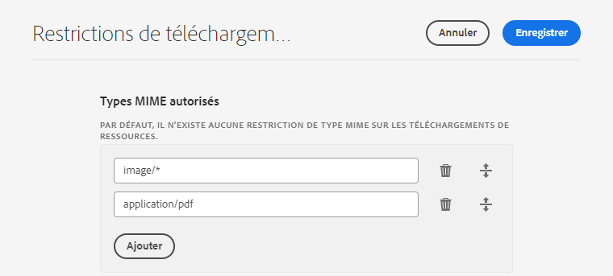
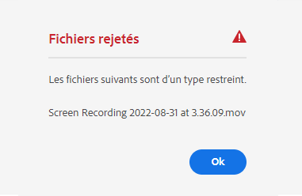
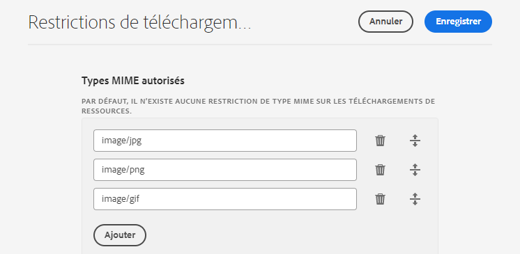

# Configurer des restrictions de téléchargement des ressources {#configure-asset-upload-restrictions}

<table>
    <tr>
        <td>
            <i>Nouveau</i> <a href="/help/assets/dynamic-media/dm-prime-ultimate.md"><b>Dynamic Media Prime et Ultimate</b></a>
        </td>
        <td>
            <i>Nouveau</i> <a href="/help/assets/assets-ultimate-overview.md"><b>AEM Assets Ultimate</b></a>
        </td>
        <td>
            <i>Nouvelle</i> <a href="/help/assets/integrate-aem-assets-edge-delivery-services.md"><b>Intégration d’AEM Assets à Edge Delivery Services</b></a>
        </td>
        <td>
            <i>Nouveau</i> <a href="/help/assets/aem-assets-view-ui-extensibility.md"><b>Extensibilité de l’interface utilisateur</b></a>
        </td>
          <td>
            <i>Nouveau</i> <a href="/help/assets/dynamic-media/enable-dynamic-media-prime-and-ultimate.md"><b>Activation de Dynamic Media Prime et Ultimate</b></a>
        </td>
    </tr>
    <tr>
        <td>
            <a href="/help/assets/search-best-practices.md"><b>Bonnes pratiques de recherche</b></a>
        </td>
        <td>
            <a href="/help/assets/metadata-best-practices.md"><b>Bonnes pratiques relatives aux métadonnées</b></a>
        </td>
        <td>
            <a href="/help/assets/product-overview.md"><b>Hub de contenus</b></a>
        </td>
        <td>
            <a href="/help/assets/dynamic-media-open-apis-overview.md"><b>Fonctionnalités Dynamic Media avec OpenAPI</b></a>
        </td>
        <td>
            <a href="https://developer.adobe.com/experience-cloud/experience-manager-apis/"><b>Documentation de développement pour AEM Assets</b></a>
        </td>
    </tr>
</table>

Vous pouvez configurer Adobe Experience Manager Assets de façon à restreindre le type de ressources que les utilisateurs peuvent télécharger en fonction du type MIME.

>[!IMPORTANT]
>
>Par défaut, Experience Manager Assets permet aux utilisateurs de télécharger des ressources quel que soit leur type MIME. Cependant, vous pouvez définir les paramètres afin d’empêcher les utilisateurs de télécharger des fichiers disposant de types MIME spécifiques.

## Prérequis {#prerequisites-asset-upload-restrictions}

Vous devez disposer de droits d’administrateur pour configurer les restrictions de téléchargement de ressources.

## Appliquer des restrictions aux téléchargements de ressources {#apply-restrictions-asset-uploadsssssss}

Pour configurer [!DNL Experience Manager] de façon à empêcher les utilisateurs de télécharger des fichiers de types MIME spécifiques, procédez comme suit :

1. Accédez à **[!UICONTROL Outils > Ressources > Configurations des ressources]**.

1. Cliquez sur **[!UICONTROL Restrictions de téléchargement]**.

1. Cliquez sur **[!UICONTROL Ajouter]** pour définir les types MIME autorisés.

1. Spécifiez le type MIME dans la zone de texte. Cliquez à nouveau sur **[!UICONTROL Ajouter]** pour renseigner d’autres types MIME autorisés. Vous pouvez également cliquer sur  pour supprimer un type MIME de la liste.

1. Cliquez sur **[!UICONTROL Enregistrer]**.

**Exemple 1 : autoriser le téléchargement de tous les fichiers images et PDF sur Experience Manager Assets**

Pour autoriser le téléchargement d’images dans tous les formats et de fichiers PDF sur Experience Manager Assets, définissez les paramètres suivants :

`image/*` : ce type MIME permet de télécharger des images dans tous les formats. `application/pdf` : ce type MIME permet de télécharger des fichiers PDF sur Experience Manager Assets.

Si vous tentez de télécharger un fichier qui n’est pas inclus dans la liste des types MIME autorisés, Experience Manager Assets affiche le message d’erreur suivant :

`Screen Recording 2022-08-31 at 3.36.09 PM.mov` fait référence à un nom de fichier qui n’est pas inclus dans les types MIME autorisés.

**Exemple 2 : autoriser le téléchargement de formats d’image spécifiques sur Experience Manager Assets**

Pour ajouter des formats d’image spécifiques aux types MIME autorisés et interdire le téléchargement de tous les autres formats de ressource, définissez les paramètres suivants :

En définissant les paramètres renseignés sur l’image, vous pouvez télécharger des images aux formats .JPG, .PNG et .GIF sur Experience Manager Assets.

**Voir également**

* [Traduire les ressources](translate-assets.md)
* [API HTTP Assets](mac-api-assets.md)
* [Formats de fichiers pris en charge par Assets](file-format-support.md)
* [Rechercher des ressources](search-assets.md)
* [Ressources connectées](use-assets-across-connected-assets-instances.md)
* [Rapports de ressources](asset-reports.md)
* [Schémas de métadonnées](metadata-schemas.md)
* [Télécharger des ressources](download-assets-from-aem.md)
* [Gestion des métadonnées](manage-metadata.md)
* [Facettes de recherche](search-facets.md)
* [Gérer les collections](manage-collections.md)
* [Import des métadonnées en bloc](metadata-import-export.md)
* [Publier des ressources sur AEM et Dynamic Media](/help/assets/publish-assets-to-aem-and-dm.md)
