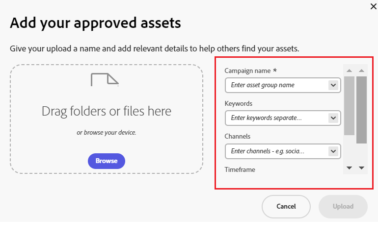
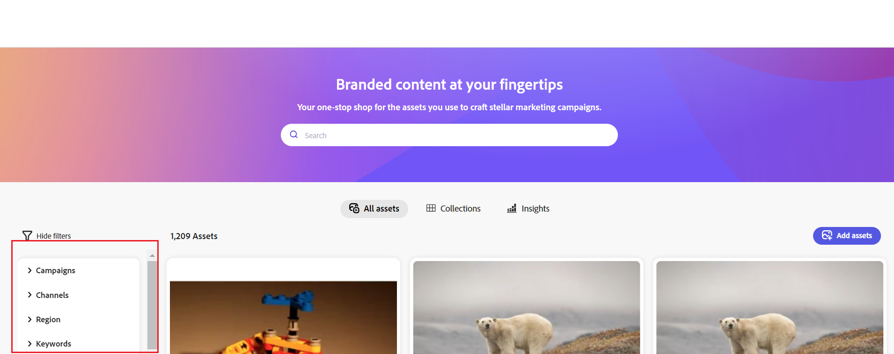

# Configurer l’interface d’utilisation du hub de contenus {#configure-content-hub-user-interface}

>[!CONTEXTUALHELP]
>id="configure_content_hub"
>title="Configurer l’interface d’utilisation du hub de contenus"
>abstract="Experience Manager Assets permet aux administrateurs de configurer les options disponibles dans l’interface utilisateur de Content Hub. En fonction des options de configuration sélectionnées par les administrateurs, les utilisateurs de Content Hub peuvent afficher les champs de Content Hub. Les options de configuration incluent des métadonnées lors de l’importation de ressources, des filtres, des propriétés de ressources, des métadonnées lors de la recherche de ressources, une valorisation de marque personnalisée et tout lien personnalisé."

<!--  -->

Experience Manager Assets permet aux administrateurs de configurer les options disponibles dans l’interface utilisateur de Content Hub. En fonction des options de configuration sélectionnées par les administrateurs, les utilisateurs de Content Hub peuvent afficher les champs de Content Hub. Les options de configuration incluent :

* Filtres disponibles pour les utilisateurs lors de la recherche de ressources.

* Détails ou propriétés des ressources disponibles pour chaque ressource.

* Champs de métadonnées disponibles pour les utilisateurs lors de l’ajout de ressources à Content Hub.

* Champs de métadonnées de ressource disponibles pour la recherche dans Content Hub.

* Contenu de marque que vous devez afficher pour votre entreprise.

* Tous les liens personnalisés que vous devez inclure dans Content Hub en plus des ressources, des collections et des insights.

## Prérequis {#prerequisites-configuration-ui}

[Les administrateurs Content Hub](/help/assets/deploy-content-hub.md#step-3-onboard-content-hub-administrator) peuvent définir les options de configuration pour d’autres utilisateurs de votre entreprise.

## Accès aux options de configuration sur Content Hub {#access-configuration-options-content-hub}

Pour accéder aux options de configuration sur Content Hub :

1. Cliquez sur l’icône utilisateur dans le volet de droite.

1. Dans la section **[!UICONTROL Paramètres du produit]**, sélectionnez **[!UICONTROL Configurations]**.

   

## Gestion des options de configuration dans Content Hub {#manage-configuration-options}

En tant qu’administrateur, gérez les options de configuration suivantes pour vos utilisateurs :

* [Import](#configure-import-options-content-hub)

* [Filtres](#configure-filters-content-hub)

* [Détails des ressources](#configure-asset-details-content-hub)

* [Recherche](#configure-metadata-search-content-hub)

* [Branding](#configure-branding-content-hub)

* [Liens personnalisés](#configure-custom-links-content-hub)

### Import {#configure-import-options-content-hub}

Vous pouvez configurer les champs de métadonnées qui s’affichent pour les utilisateurs lors du chargement ou de l’importation de ressources sur le portail Content Hub, tels que le nom de la campagne, les mots-clés, les canaux, la période, la région, etc. Pour cela, procédez comme suit :

1. Dans l’interface utilisateur [Configurations](#access-configuration-options-content-hub), cliquez sur **[!UICONTROL Importer]**.

1. Cliquez sur **[!UICONTROL Ajouter des métadonnées]**.

1. Spécifiez un libellé pour la propriété, mappez-le à une propriété à l’aide du champ **[!UICONTROL Metadata]** et sélectionnez le type d’entrée pour les nouvelles métadonnées de ressource.

1. Cliquez sur le bouton **[!UICONTROL Champ obligatoire]** pour rendre le nouveau champ de métadonnées obligatoire pour spécifier les utilisateurs lors du chargement de nouvelles ressources.

1. Cliquez sur **[!UICONTROL Confirmer]**. Les nouvelles métadonnées s’affichent dans la liste des propriétés de ressource existantes.

1. Cliquez sur **[!UICONTROL Enregistrer]** pour appliquer les modifications.

De même, vous pouvez cliquer sur , disponible en regard de chaque propriété disponible, pour modifier les étiquettes, rendre ces champs obligatoires ou non obligatoires pour les utilisateurs lors du chargement des ressources à l’aide du bouton d’activation/désactivation **[!UICONTROL Champ obligatoire]** ou cliquer sur l’icône Supprimer pour supprimer toute propriété de métadonnées.

Cliquez sur le bouton **[!UICONTROL Validation automatique]** si vous souhaitez que toutes les ressources que vous ajoutez au référentiel Experience Manager Assets soient automatiquement approuvées afin qu’elles soient disponibles dans Content Hub immédiatement. Autrement, les auteurs ou les administrateurs DAM doivent approuver manuellement les ressources pour les rendre disponibles sur Content Hub. Le bouton bascule est désactivé par défaut.

Cliquez sur **[!UICONTROL Enregistrer]** après avoir apporté toutes les modifications pour appliquer les modifications.

Les métadonnées activées dans l’interface utilisateur de configuration s’affichent sur la page de chargement des ressources :

### Filtres {#configure-filters-content-hub}

Content Hub permet aux administrateurs de configurer des filtres qui s’affichent lors de la recherche de ressources. Pour ajouter un nouveau filtre, procédez comme suit :

1. Dans l’interface utilisateur [Configurations](#access-configuration-options-content-hub), cliquez sur **[!UICONTROL Filtres]**.

1. Cliquez sur **[!UICONTROL Ajouter des filtres]**.

1. Spécifiez un libellé pour le filtre, mappez-le à une propriété à l’aide du champ **[!UICONTROL Metadata]** et sélectionnez le type d’entrée pour le nouveau filtre.
1. Cliquez sur **[!UICONTROL Confirmer]**. Le nouveau filtre s’affiche dans la liste des filtres existants.

1. Cliquez sur **[!UICONTROL Enregistrer]** pour appliquer les modifications afin que le nouveau filtre s’affiche sur la page Rechercher lors du filtrage des ressources.

   >[!NOTE]
   >
   >Le nouveau filtre s’affiche sur la page Recherche uniquement s’il existe une autre ressource dans le référentiel correspondant aux critères de filtrage.

De même, vous pouvez cliquer sur , disponible en regard de chaque filtre disponible, pour modifier les étiquettes ou cliquer sur l’icône Supprimer pour supprimer tout filtre existant. Cliquez sur **[!UICONTROL Enregistrer]** après avoir apporté toutes les modifications pour appliquer les modifications.

Les filtres activés dans l’interface utilisateur de configuration s’affichent sur la page Rechercher :

### Détails des ressources {#configure-asset-details-content-hub}

Vous pouvez également configurer les propriétés de ressource qui s’affichent pour chaque ressource, telles que le nom de fichier, le titre, le format, la taille, etc. Pour cela, procédez comme suit :

1. Dans l’interface utilisateur [Configurations](#access-configuration-options-content-hub), cliquez sur **[!UICONTROL Détails de la ressource]**.

1. Cliquez sur **[!UICONTROL Ajouter des métadonnées]**.

1. Spécifiez un libellé pour la propriété, mappez-le à une propriété à l’aide du champ **[!UICONTROL Metadata]** et sélectionnez le type d’entrée pour les nouvelles métadonnées de ressource.
1. Cliquez sur **[!UICONTROL Confirmer]**. Les nouvelles métadonnées s’affichent dans la liste des propriétés de ressource existantes.

1. Cliquez sur **[!UICONTROL Enregistrer]** pour appliquer les modifications afin que la nouvelle propriété s’affiche sur la page des détails de la ressource.

De même, vous pouvez cliquer sur , disponible en regard de chaque propriété disponible, pour modifier les étiquettes ou cliquer sur l’icône Supprimer pour supprimer les détails de ressource existants. Cliquez sur **[!UICONTROL Enregistrer]** après avoir apporté toutes les modifications pour appliquer les modifications.

Les propriétés activées dans l’interface utilisateur de configuration s’affichent sur la page Détails de la ressource :

### Recherche {#configure-metadata-search-content-hub}

Les administrateurs peuvent définir les champs de métadonnées qui font l’objet d’une recherche lorsqu’un utilisateur spécifie un critère de recherche sur Content Hub. Procédez comme suit :

1. Dans l’interface utilisateur [Configurations](#access-configuration-options-content-hub), cliquez sur **[!UICONTROL Ajouter des métadonnées]**.

1. Spécifiez le champ de métadonnées et cliquez sur **[!UICONTROL Confirmer]**.

1. Cliquez sur **[!UICONTROL Enregistrer]** pour appliquer les modifications afin que la nouvelle propriété de métadonnées s’affiche dans la liste des champs de métadonnées.

De même, vous pouvez cliquer sur , disponible en regard de chaque propriété de métadonnées disponible, pour modifier la propriété ou cliquer sur l’icône de suppression pour supprimer une propriété existante. Cliquez sur **[!UICONTROL Enregistrer]** après avoir apporté toutes les modifications pour appliquer les modifications.

### Branding {#configure-branding-content-hub}

Les administrateurs peuvent également personnaliser le titre et le corps du texte sur la bannière du portail Content Hub, en fonction de vos besoins en termes de branding. Pour cela, procédez comme suit :

1. Dans l’interface utilisateur [Configurations](#access-configuration-options-content-hub), cliquez sur **[!UICONTROL Valorisation de marque]**.

1. Spécifiez le texte dans les champs **[!UICONTROL Texte du titre sur la bannière]** et **[!UICONTROL Texte du corps sur la bannière]** .

1. Cliquez sur **[!UICONTROL Enregistrer]** pour appliquer les modifications.

Les mises à jour de branding activées dans l’interface utilisateur de configuration s’affichent sur la bannière du portail Content Hub :

### Liens personnalisés {#configure-custom-links-content-hub}

Vous pouvez également ajouter des onglets personnalisés en plus des onglets **[!UICONTROL Tous les Assets]**, **[!UICONTROL Collections]** et **[!UICONTROL Statistiques]** standard sur le portail Content Hub juste en dessous de la bannière. Pour cela, procédez comme suit :

1. Dans l’interface utilisateur [Configurations](#access-configuration-options-content-hub), cliquez sur **[!UICONTROL Liens personnalisés]**.

1. Cliquez sur **[!UICONTROL Ajouter un lien]**.

1. Spécifiez le texte dans les champs **[!UICONTROL Libellé]** et **[!UICONTROL URL]** . Le libellé que vous définissez s&#39;affiche sous forme d&#39;onglet et lorsque vous cliquez sur le libellé, vous accédez à l&#39;URL définie dans le champ **[!UICONTROL URL]**.

1. Cliquez sur **[!UICONTROL Confirmer]**.

1. Cliquez sur **[!UICONTROL Enregistrer]** pour appliquer les modifications.

De même, vous pouvez cliquer sur , disponible en regard de chaque URL, pour modifier les liens ou cliquer sur l’icône Supprimer pour supprimer toute URL existante. Cliquez sur **[!UICONTROL Enregistrer]** après avoir apporté toutes les modifications pour appliquer les modifications.

Le lien personnalisé s’affiche sous forme d’un nouvel onglet en regard de l’onglet Statistiques sur la page d’accueil de Content Hub.

