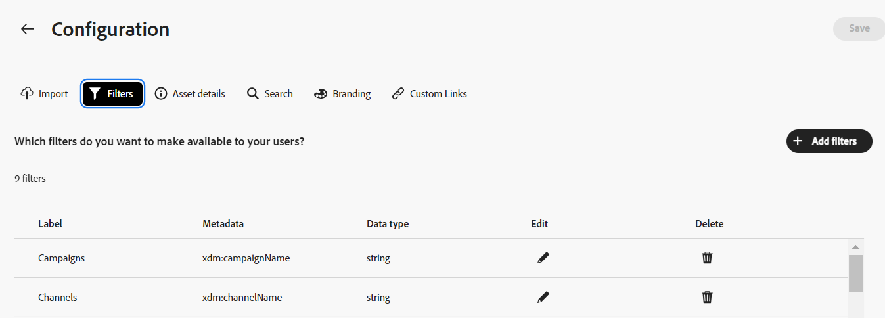

# Configurer l’interface d’utilisation du hub de contenus {#configure-content-hub-user-interface}

<table>
    <tr>
        <td>
            <i>Nouveau</i> <a href="/help/assets/dynamic-media/dm-prime-ultimate.md"><b>Dynamic Media Prime et Ultimate</b></a>
        </td>
        <td>
            <i>Nouveau</i> <a href="/help/assets/assets-ultimate-overview.md"><b>AEM Assets Ultimate</b></a>
        </td>
        <td>
            <i>Nouvelle</i> <a href="/help/assets/integrate-aem-assets-edge-delivery-services.md"><b>Intégration d’AEM Assets à Edge Delivery Services</b></a>
        </td>
        <td>
            <i>Nouveau</i> <a href="/help/assets/aem-assets-view-ui-extensibility.md"><b>Extensibilité de l’interface utilisateur</b></a>
        </td>
          <td>
            <i>Nouveau</i> <a href="/help/assets/dynamic-media/enable-dynamic-media-prime-and-ultimate.md"><b>Activation de Dynamic Media Prime et Ultimate</b></a>
        </td>
    </tr>
    <tr>
        <td>
            <a href="/help/assets/search-best-practices.md"><b>Bonnes pratiques de recherche</b></a>
        </td>
        <td>
            <a href="/help/assets/metadata-best-practices.md"><b>Bonnes pratiques relatives aux métadonnées</b></a>
        </td>
        <td>
            <a href="/help/assets/product-overview.md"><b>Hub de contenus</b></a>
        </td>
        <td>
            <a href="/help/assets/dynamic-media-open-apis-overview.md"><b>Fonctionnalités Dynamic Media avec OpenAPI</b></a>
        </td>
        <td>
            <a href="https://developer.adobe.com/experience-cloud/experience-manager-apis/"><b>Documentation de développement pour AEM Assets</b></a>
        </td>
    </tr>
</table>

>[!CONTEXTUALHELP]
>id="configure_content_hub"
>title="Configurer l’interface d’utilisation du hub de contenus"
>abstract="Experience Manager Assets permet à l’équipe d’aministration de configurer les options disponibles dans l’interface d’utilisation du hub de contenus. En fonction des options de configuration sélectionnées par l’équipe d’aministration, les utilisateurs et utilisatrices du hub de contenus peuvent afficher les champs sur le hub de Contenus. Les options de configuration incluent des métadonnées lors de l’import des ressources, des filtres, des propriétés de ressources, des métadonnées lors de la recherche de ressources, d’une image de marque personnalisée et de tout lien personnalisé."
>additional-url="https://images-tv.adobe.com/mpcv3/4477/74a81d1c-0cfe-41f4-8a06-18ff70604e45_1732023385.854x480at800_h264.mp4" text="Regarder la vidéo"

<!--  -->

>[!AVAILABILITY]
>
>Le guide de Content Hub est désormais disponible au format PDF. Téléchargez l’intégralité du guide et utilisez l’assistant IA Adobe Acrobat pour répondre à vos requêtes.
>
>[!BADGE Guide PDF de Content Hub]{type=Informative url="https://helpx.adobe.com/content/dam/help/fr/experience-manager/aem-assets/content-hub.pdf"}

Experience Manager Assets permet à l’équipe d’aministration de configurer les options disponibles dans l’interface d’utilisation du hub de contenus. En fonction des options de configuration sélectionnées par l’équipe d’aministration, les utilisateurs et utilisatrices du hub de contenus peuvent afficher les champs sur le hub de Contenus. Les options de configuration incluent :

* Filtres disponibles pour les utilisateurs lors de la recherche de ressources.

* Détails ou propriétés de la ressource disponibles pour chaque ressource.

* Champs de métadonnées disponibles pour les utilisateurs lors de l’ajout de ressources à Content Hub.

* Champs de métadonnées de ressource disponibles pour une recherche dans Content Hub.

* Valorisation de marque du contenu que vous devez afficher pour votre organisation.

* Tous les liens personnalisés que vous devez inclure sur Content Hub en plus des ressources, des collections et des informations.

## Prérequis {#prerequisites-configuration-ui}

Les [administrateurs Content Hub](/help/assets/deploy-content-hub.md#step-3-onboard-content-hub-administrator) peuvent définir les options de configuration pour d&#39;autres utilisateurs de votre organisation.

## Accéder aux options de configuration sur Content Hub {#access-configuration-options-content-hub}

Pour accéder aux options de configuration de Content Hub :

1. Cliquez sur l’icône utilisateur dans le volet de droite.

1. Dans la section **[!UICONTROL Paramètres du produit]**, sélectionnez **[!UICONTROL Configurations]**.

   

## Gestion des options de configuration sur Content Hub {#manage-configuration-options}

En tant qu’administrateur, gérez les options de configuration suivantes pour vos utilisateurs :

* [Import](#configure-import-options-content-hub)

* [Filtres](#configure-filters-content-hub)

* [Détails des ressources](#configure-asset-details-content-hub)
* [Carte de ressources](#asset-card)

* [Recherche](#configure-metadata-search-content-hub)

* [Branding](#configure-branding-content-hub)

* [Ressources expirées](#expired-assets-content-hub)

* [Rendus](#renditions-content-hub)

* [Liens personnalisés](#configure-custom-links-content-hub)

### Import {#configure-import-options-content-hub}

Vous pouvez configurer les champs de métadonnées qui s’affichent pour les utilisateurs lors du chargement ou de l’importation de ressources sur le portail Content Hub, tels que le nom de la campagne, les mots-clés, les canaux, la période, la région, etc. Pour cela, procédez comme suit :

1. Dans l’interface utilisateur [Configurations](#access-configuration-options-content-hub), cliquez sur **[!UICONTROL Importer]**.

1. Cliquez sur **[!UICONTROL Ajouter des métadonnées]**.

1. Indiquez un libellé pour la propriété, mappez-le à une propriété à l’aide du champ **[!UICONTROL Métadonnées]** et sélectionnez le type d’entrée des nouvelles métadonnées de la ressource.

1. Cliquez sur le bouton (bascule) **[!UICONTROL Champ obligatoire]** pour rendre le nouveau champ de métadonnées obligatoire à spécifier pour les utilisateurs lors du chargement de nouvelles ressources.

1. Cliquez sur **[!UICONTROL Confirmer]**. Les nouvelles métadonnées s’affichent dans la liste des propriétés de la ressource existante.

1. Cliquez sur **[!UICONTROL Enregistrer]** pour appliquer les modifications.

De même, vous pouvez cliquer sur , disponible en regard de chaque propriété disponible, pour modifier les libellés, rendre ces champs obligatoires ou non obligatoires pour les utilisateurs lors du chargement de ressources à l’aide du bouton (bascule) **[!UICONTROL champ obligatoire]** ou cliquer sur l’icône Supprimer pour supprimer une propriété de métadonnées.

Cliquez sur le bouton (bascule) **[!UICONTROL Approbation automatique]** si vous avez besoin que toutes les ressources que vous ajoutez au référentiel Experience Manager Assets soient approuvées automatiquement afin qu’elles soient disponibles immédiatement dans Content Hub. Dans le cas contraire, les auteurs ou les administrateurs de gestion des ressources numériques doivent approuver manuellement les ressources pour les rendre disponibles sur Content Hub. Par défaut, le bouton (bascule) est défini sur l’état Désactivé .

Cliquez sur **[!UICONTROL Enregistrer]** après avoir effectué toutes les modifications pour appliquer les modifications.

Les métadonnées activées dans l’interface utilisateur de configuration s’affichent dans la page de chargement des ressources :

### Filtres {#configure-filters-content-hub}

Content Hub permet aux administrateurs de configurer des filtres qui s’affichent lors de la recherche de ressources. Pour ajouter un nouveau filtre, procédez comme suit :

1. Dans l’interface utilisateur [Configurations](#access-configuration-options-content-hub), cliquez sur **[!UICONTROL Filtres]**.

1. Cliquez sur **[!UICONTROL Ajouter des filtres]**.

1. Indiquez un libellé pour le filtre, mappez-le à une propriété à l’aide du champ **[!UICONTROL Métadonnées]** et sélectionnez le type d’entrée du nouveau filtre.
1. Cliquez sur **[!UICONTROL Confirmer]**. Le nouveau filtre s’affiche dans la liste des filtres existants.

1. Cliquez sur **[!UICONTROL Enregistrer]** pour appliquer les modifications afin que le nouveau filtre s’affiche sur la page Rechercher lors du filtrage des ressources.

   >[!NOTE]
   >
   >Le nouveau filtre ne s’affiche sur la page Rechercher que s’il existe au moins une ressource dans le référentiel correspondant aux critères de filtre.

De même, vous pouvez cliquer sur , disponible en regard de chaque filtre disponible, pour modifier les libellés ou cliquer sur l’icône de suppression pour supprimer un filtre existant. Cliquez sur **[!UICONTROL Enregistrer]** après avoir effectué toutes les modifications pour appliquer les modifications.

Les filtres activés dans l’interface utilisateur de configuration s’affichent dans la page Rechercher :

### Détails des ressources {#configure-asset-details-content-hub}

Vous pouvez également configurer les propriétés de la ressource qui s’affichent pour chaque ressource, telles que le nom du fichier, le titre, le format, la taille, etc. Pour cela, procédez comme suit :

1. Dans l’interface utilisateur [Configurations](#access-configuration-options-content-hub), cliquez sur **[!UICONTROL Détails de la ressource]**.

1. Cliquez sur **[!UICONTROL Ajouter des métadonnées]**.

1. Indiquez un libellé pour la propriété, mappez-le à une propriété à l’aide du champ **[!UICONTROL Métadonnées]** et sélectionnez le type d’entrée des nouvelles métadonnées de la ressource.
1. Cliquez sur **[!UICONTROL Confirmer]**. Les nouvelles métadonnées s’affichent dans la liste des propriétés de la ressource existante.

1. Cliquez sur **[!UICONTROL Enregistrer]** pour appliquer les modifications de sorte que la nouvelle propriété s’affiche sur la page des détails de la ressource.

De même, vous pouvez cliquer sur , disponible en regard de chaque propriété disponible, pour modifier les libellés ou cliquer sur l’icône de suppression pour supprimer tout détail de ressource existant. Cliquez sur **[!UICONTROL Enregistrer]** après avoir effectué toutes les modifications pour appliquer les modifications.

Les propriétés activées dans l’interface utilisateur de configuration s’affichent dans la page Détails de la ressource :

### Carte de ressources {#asset-card}

Vous pouvez également configurer les champs de métadonnées clés que vous devez afficher sur la **Carte des ressources** jusqu’à 6 champs maximum. Pour cela, procédez comme suit :

1. Dans l’interface utilisateur [Configurations](#access-configuration-options-content-hub), cliquez sur **Carte des ressources**.
2. Cliquez sur **Ajouter des métadonnées**. La boîte de dialogue **Ajouter des métadonnées de carte de ressources** s’affiche.
3. Indiquez le nom des métadonnées dans le champ **Libellé** et sélectionnez une propriété de métadonnées dans le champ **Métadonnées**.
4. Cliquez sur **Confirmer** puis sur **Enregistrer** pour appliquer les modifications afin que la nouvelle propriété s’affiche sur la page des détails de la ressource.
   

De même, cliquez sur  disponible en regard de chaque propriété disponible pour apporter les modifications nécessaires ou cliquez sur  pour supprimer une propriété de métadonnées existante. Cliquez sur **Enregistrer** après avoir effectué toutes les modifications pour appliquer les modifications.

### Recherche {#configure-metadata-search-content-hub}

L’administration peut définir les champs de métadonnées qui font l’objet d’une recherche lorsqu’un utilisateur spécifie un critère de recherche dans Content Hub. Procédez comme suit :

1. Dans l’interface utilisateur [Configurations](#access-configuration-options-content-hub), cliquez sur **[!UICONTROL Ajouter des métadonnées]**.

1. Spécifiez le champ de métadonnées et cliquez sur **[!UICONTROL Confirmer]**.

1. Cliquez sur **[!UICONTROL Enregistrer]** pour appliquer les modifications de sorte que la nouvelle propriété de métadonnées s’affiche dans la liste des champs de métadonnées.

De même, vous pouvez cliquer sur , disponible en regard de chaque propriété de métadonnées disponible, pour modifier la propriété ou cliquer sur l’icône de suppression pour supprimer une propriété existante. Cliquez sur **[!UICONTROL Enregistrer]** après avoir effectué toutes les modifications pour appliquer les modifications.

### Branding {#configure-branding-content-hub}

Les administrateurs peuvent également personnaliser le titre et le corps du texte de la bannière du portail Content Hub, en fonction de vos exigences de marque. Pour cela, procédez comme suit :

1. Dans l’interface utilisateur [Configurations](#access-configuration-options-content-hub), cliquez sur **[!UICONTROL Branding]**.

1. Spécifiez du texte dans les champs **[!UICONTROL Texte du titre sur la bannière]** et **[!UICONTROL Texte du corps sur la bannière]**.

1. Cliquez sur **[!UICONTROL Enregistrer]** pour appliquer les modifications.

Les mises à jour d’identité graphique activées dans l’interface utilisateur de configuration s’affichent dans la bannière du portail Content Hub :

### Ressources expirées{#expired-assets-content-hub}

Les administrateurs peuvent décider s’ils souhaitent que les ressources expirées soient visibles sur Content Hub. Si les ressources expirées sont rendues visibles, les administrateurs et administratrices peuvent également définir si les personnes peuvent les télécharger.

Par défaut, les ressources arrivées à expiration ne s’affichent pas dans Content Hub.

Pour cela, procédez comme suit :

1. Dans l’interface utilisateur [Configurations](#access-configuration-options-content-hub), cliquez sur **[!UICONTROL Assets expirée]**.

1. Dans la section **[!UICONTROL Visible]**, activez le bouton (bascule) **[!UICONTROL Autoriser les utilisateurs à afficher les ressources expirées]** pour rendre toutes les ressources expirées visibles sur Content Hub.

1. Après avoir activé la visibilité des ressources, vous pouvez activer ou désactiver la possibilité de télécharger les ressources expirées à l’aide du bouton **[!UICONTROL Autoriser les utilisateurs à télécharger les ressources expirées]**.

1. Cliquez sur **[!UICONTROL Enregistrer]** pour appliquer les modifications.

   

Après avoir activé la visibilité des ressources, vous pouvez afficher les ressources expirées sur Content Hub, comme illustré dans l’image suivante :

Si l’administrateur a activé le téléchargement, les utilisateurs de Content Hub peuvent également les télécharger, comme indiqué dans l’image.

Si la visibilité des ressources arrivées à expiration est activée, Content Hub met également en surbrillance les ressources arrivant à expiration dans les 15 prochains jours à l’aide du message `Expiring in n days` sur la carte des ressources.

### Rendus {#renditions-content-hub}

Les rendus sont des versions personnalisées des ressources numériques, telles que les images, les documents, etc., conçues pour différents appareils et plateformes afin d’assurer des performances optimales. En savoir plus sur les [rendus dans Adobe Experience Manager Assets](https://experienceleague.adobe.com/en/docs/experience-manager-cloud-service/content/assets/assets-view/renditions).

Pour cela, procédez comme suit :

Dans l’interface utilisateur [Configurations](#access-configuration-options-content-hub), cliquez sur **[!UICONTROL Rendus]**. Les options suivantes sont disponibles :

* Activez le bouton (bascule) [!UICONTROL Activer la disponibilité des rendus] pour rendre tous les rendus visibles sur Content Hub.

* Activez ou désactivez le bouton (bascule) **[!UICONTROL Autoriser les utilisateurs à télécharger les ressources d’origine]** pour contrôler la disponibilité du téléchargement des ressources d’origine.

  

Pour plus d’informations sur l’affichage et le téléchargement des rendus dans Content Hub, voir [téléchargement de ressources dans Content Hub](/help/assets/download-assets-content-hub.md).

### Liens personnalisés {#configure-custom-links-content-hub}

Vous pouvez également ajouter des onglets personnalisés en plus des onglets standard **[!UICONTROL Toutes les Assets]**, **[!UICONTROL Collections]** et **[!UICONTROL Informations]** sur le portail Content Hub, juste en dessous de la bannière. Pour cela, procédez comme suit :

1. Dans l’interface utilisateur [Configurations](#access-configuration-options-content-hub), cliquez sur **[!UICONTROL Liens personnalisés]**.

1. Cliquez sur **[!UICONTROL Ajouter un lien]**.

1. Spécifiez du texte dans les champs **[!UICONTROL Libellé]** et **[!UICONTROL URL]**. Le libellé que vous définissez s’affiche sous la forme d’un onglet et, lorsque vous cliquez sur le libellé, vous accédez à l’URL définie dans le champ **[!UICONTROL URL]**.

1. Cliquez sur **[!UICONTROL Confirmer]**.

1. Cliquez sur **[!UICONTROL Enregistrer]** pour appliquer les modifications.

De même, vous pouvez cliquer sur , disponible en regard de chaque URL, pour modifier les liens ou cliquer sur l’icône de suppression pour supprimer une URL existante. Cliquez sur **[!UICONTROL Enregistrer]** après avoir effectué toutes les modifications pour appliquer les modifications.

Le lien personnalisé s’affiche sous la forme d’un nouvel onglet en regard de l’onglet Insights sur la page d’accueil de Content Hub.

