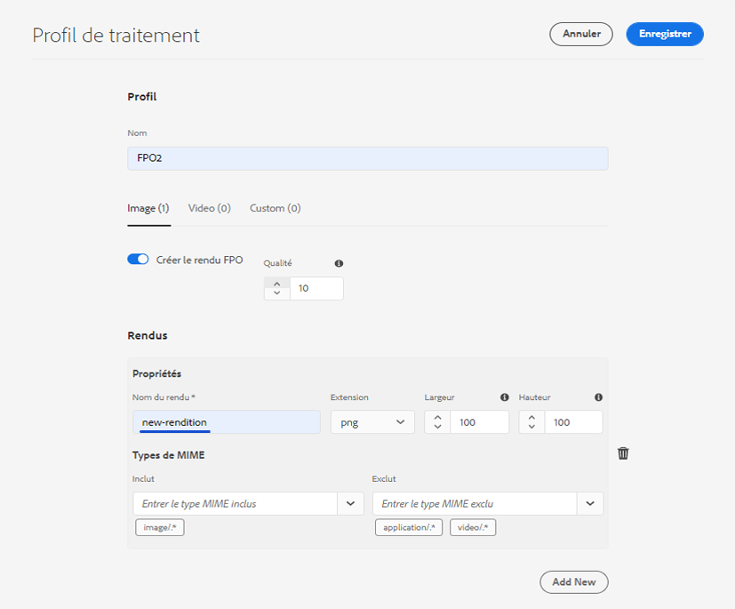
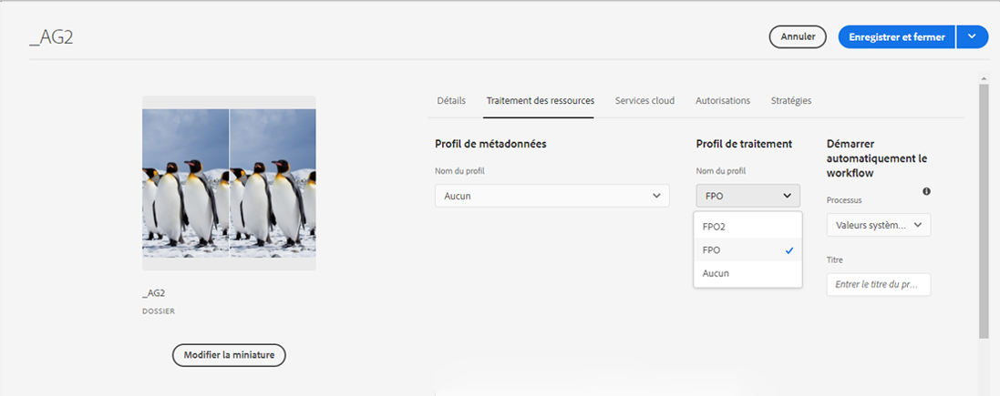
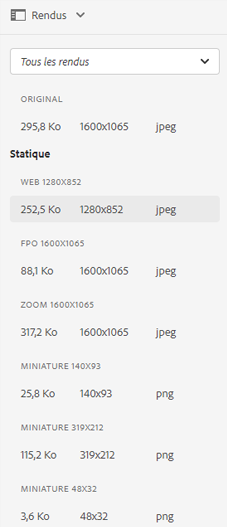

# Génération de rendus pour placement uniquement pour Adobe InDesign {#fpo-renditions}

| Version | Lien de l’article |
| -------- | ---------------------------- |
| AEM 6.5 | [Cliquez ici](https://experienceleague.adobe.com/docs/experience-manager-65/assets/administer/configure-fpo-renditions.html?lang=en) |
| AEM as a Cloud Service | Cet article |

Lorsque vous transférez des ressources volumineuses d’Experience Manager vers des documents Adobe InDesign, un professionnel de la création doit attendre un temps conséquent avant de [placer une ressource](https://helpx.adobe.com/fr/indesign/using/placing-graphics.html). Pendant ce temps, l’utilisateur ne peut pas utiliser InDesign. Cela interrompt le flux créatif et a un impact négatif sur l’expérience utilisateur. Adobe permet de placer temporairement dans des documents InDesign des rendus de petite taille pour commencer. Lorsque la sortie finale est requise, par exemple pour les workflows d’impression et de publication, les ressources d’origine en pleine résolution remplacent le rendu temporaire en arrière-plan. Cette mise à jour asynchrone en arrière-plan accélère le processus de conception pour améliorer la productivité et n’entrave pas le processus de création.

Assets fournit des rendus utilisés uniquement pour placement (FPO). Ces rendus FPO ont une taille de fichier réduite, mais présentent les mêmes proportions. Si un rendu FPO n’est pas disponible pour une ressource, Adobe InDesign utilise la ressource d’origine à la place. Ce mécanisme de secours garantit que le workflow créatif se poursuit sans interruption.

Experience Manager as a Cloud Service offre des fonctionnalités de traitement des ressources natives dans le cloud pour générer les rendus FPO. Utilisez les microservices de ressources pour la génération de rendu. Vous pouvez configurer la génération de rendu des ressources nouvellement chargées et des ressources qui existent dans Experience Manager.

Vous trouverez ci-dessous les étapes de génération des rendus FPO :

1. [Création d’un profil de traitement](#create-processing-profile).

1. Configurez Experience Manager pour utiliser ce profil afin de [traiter les nouvelles ressources](#generate-renditions-of-new-assets).
1. Utilisez les profils pour [traiter les ressources existantes](#generate-renditions-of-existing-assets).

## Création d’un profil de traitement {#create-processing-profile}

Pour générer des rendus FPO, créez un **[!UICONTROL profil de traitement]**. Les profils utilisent des microservices de ressources natifs dans le cloud pour le traitement. Pour plus d’informations, voir [Création de profils de traitement pour les microservices de ressources](asset-microservices-configure-and-use.md).

Sélectionnez **[!UICONTROL Créer le rendu FPO]** pour générer le rendu FPO. Si vous le souhaitez, cliquez sur **[!UICONTROL Ajouter nouveau]** pour ajouter d’autres paramètres de rendu au même profil.

## Génération de rendus de nouvelles ressources {#generate-renditions-of-new-assets}

Pour générer des rendus FPO de nouvelles ressources, appliquez le **[!UICONTROL Profil de traitement]** au dossier dans les propriétés du dossier. Dans la page Propriétés d’un dossier, cliquez sur l’onglet **[!UICONTROL Traitement des ressources]**, sélectionnez le **[!UICONTROL profil FPO]** en tant que **[!UICONTROL Profil de traitement]** et enregistrez les modifications. Toutes les nouvelles ressources chargées dans le dossier sont traitées à l’aide de ce profil.

## Génération de rendus de ressources existantes {#generate-renditions-of-existing-assets}

Pour générer des rendus, sélectionnez les ressources et procédez comme suit.

## Affichage des rendus FPO {#view-fpo-renditions}

Vous pouvez vérifier les rendus FPO générés une fois le workflow terminé. Dans l’interface utilisateur Experience Manager Assets, cliquez sur la ressource pour ouvrir un aperçu volumineux. Ouvrez le rail de gauche et sélectionnez **[!UICONTROL Rendus]**. Vous pouvez également utiliser le raccourci clavier `Alt + 3` lorsque l’aperçu est ouvert.

Cliquez sur **[!UICONTROL Rendu FPO]** pour charger son aperçu. Vous pouvez éventuellement cliquer avec le bouton droit sur le rendu et l’enregistrer dans votre système de fichiers. Recherchez les rendus disponibles dans le rail de gauche.

**Voir également**

* [Traduire les ressources](translate-assets.md)
* [API HTTP Assets](mac-api-assets.md)
* [Formats de fichiers pris en charge par Assets](file-format-support.md)
* [Recherche de ressources](search-assets.md)
* [Ressources connectées](use-assets-across-connected-assets-instances.md)
* [Rapports de ressources](asset-reports.md)
* [Schémas de métadonnées](metadata-schemas.md)
* [Téléchargement de ressources](download-assets-from-aem.md)
* [Gestion des métadonnées](manage-metadata.md)
* [Facettes de recherche](search-facets.md)
* [Gestion des collections](manage-collections.md)
* [Importation de métadonnées en bloc](metadata-import-export.md)
