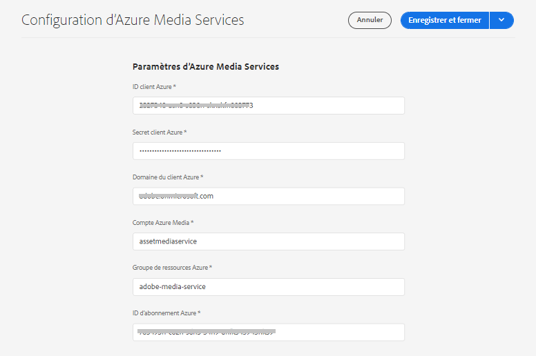
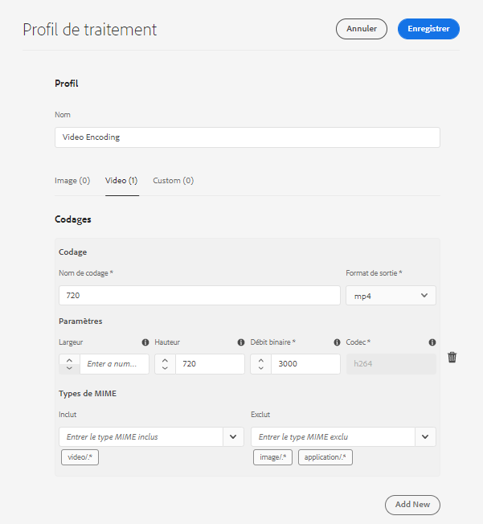
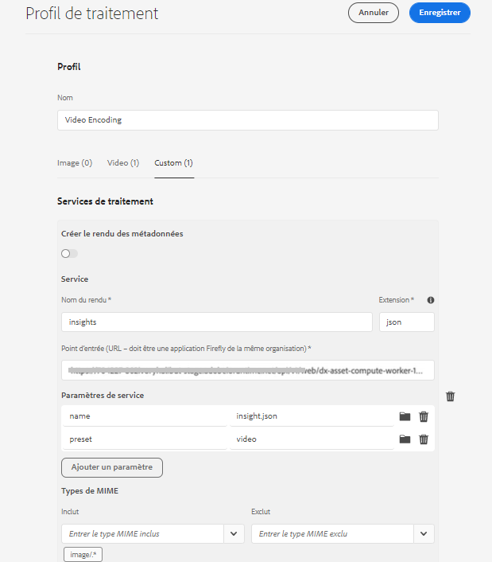
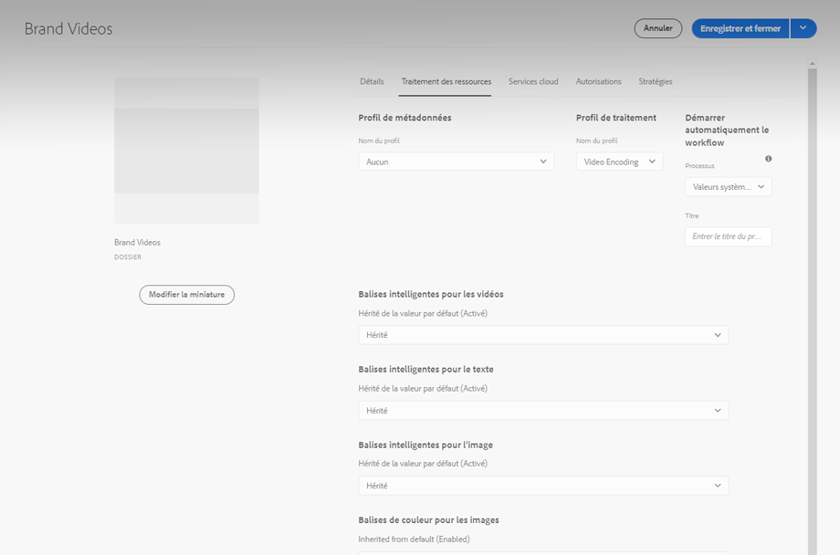
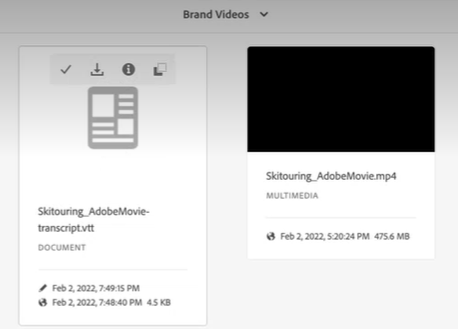

# Configuration de la transcription dans [!DNL Experience Manager Assets] {#configure-transcription-service}

| [Bonnes pratiques de recherche](/help/assets/search-best-practices.md) | [ Bonnes pratiques en matière de métadonnées](/help/assets/metadata-best-practices.md) | [Hub de contenus](/help/assets/product-overview.md) | [Dynamic Media avec fonctionnalités OpenAPI](/help/assets/dynamic-media-open-apis-overview.md) | [Documentation destinée aux développeurs AEM Assets](https://developer.adobe.com/experience-cloud/experience-manager-apis/) |
| ------------- | --------------------------- |---------|----|-----|

La transcription est le processus de traduction de l’audio d’un fichier audio ou vidéo en texte (voix vers texte) à l’aide de la technologie de reconnaissance vocale.
[!DNL Adobe Experience Manager Assets] est configuré avec les [!DNL Azure Media Services] qui génèrent automatiquement une transcription textuelle de la langue parlée dans un fichier audio ou vidéo pris en charge au format WebVTT (.vtt). Lorsqu’une ressource audio ou vidéo est traitée dans [!DNL Experience Manager Assets], le service de transcription génère automatiquement le rendu de transcription texte de la ressource audio ou vidéo et le stocke au même emplacement que la ressource d’origine dans votre référentiel de ressources. Le service de transcription d’[!DNL Experience Manager Assets] permet aux marketeurs et marketeuses de gérer efficacement leur contenu audio et vidéo en permettant de trouver plus facilement le contenu texte et en augmentant le retour sur investissement de ces ressources par la prise en charge de l’accessibilité et de la localisation.

Les transcriptions sont des versions textuelles de contenu parlé ; un exemple est un film que vous visionnez sur n’importe quelle plateforme OTT, qui comprend souvent des sous-titres pour faciliter l’accessibilité ou pour consommer du contenu dans d’autres langues. Ou encore, tout fichier audio ou vidéo utilisé à des fins de marketing, d’apprentissage ou de divertissement. Ces expériences commencent par une transcription qui est ensuite formatée ou traduite selon les besoins. La transcription audio ou vidéo est un processus long et susceptibles de contenir des erreurs lorsqu’elle est exécutée manuellement. Il est également difficile d’adapter manuellement le processus à grande échelle, compte tenu de la demande croissante de contenu audio-vidéo. [!DNL Experience Manager Assets] utilise la transcription basée sur l’IA d’Azure qui permet un traitement à grande échelle des ressources audio et vidéo et qui génère les transcriptions textuelles (fichiers .vtt) ainsi que les informations de date et heure. Tout comme dans Assets, la fonctionnalité de transcription est prise en charge avec Dynamic Media.

La fonction de transcription est disponible sans coût supplémentaire dans [!DNL Experience Manager Assets]. Toutefois, les administrateurs et administratrices ont besoin des informations d’identification Azure de l’utilisateur ou de l’utilisatrice pour configurer le service de transcription dans [!DNL Experience Manager Assets]. Vous pouvez également [obtenir les informations d’identification d’évaluation](https://azure.microsoft.com/en-us/pricing/details/media-services/) directement depuis Microsoft® pour découvrir la fonctionnalité de transcription audio ou vidéo dans Assets.

## Conditions préalables à la transcription {#prerequisites}

1. Une instance [!DNL Experience Manager Assets as a Cloud Service] opérationnelle.
1. Les informations d’identification Azure suivantes sont nécessaires pour la configuration dans [!DNL Experience Manager Assets] :

   * ID client (clé API)
   * Clé secrète client
   * Point d’entrée du client (domaine)
   * Compte Media
   * Groupe de ressources
   * ID d’abonnement

   Consultez la [Documentation Azure](https://docs.microsoft.com/en-us/azure/media-services/latest/access-api-howto?tabs=portal) pour obtenir des informations d’identification pour accéder à l’API Azure Media Services.

1. Assurez-vous que le compte Azure dispose d’un crédit suffisant pour traiter les nouvelles demandes.

## Configuration de la transcription dans [!DNL Experience Manager Assets] {#configure-transcription}

Voici les configurations requises pour activer la fonction de transcription dans [!DNL Experience Manager Assets] :

1. [Configuration d’Azure Media Services](#configure-azure-media-service)
1. [Configuration du profil de traitement pour la transcription audio/vidéo](#configure-processing-profile-for-transcription)

### Configuration d’Azure Media Services {#configure-azure-media-services}

[!DNL Experience Manager Assets] utilise les [!DNL Azure Media Services] qui génèrent automatiquement des transcriptions textuelles de la langue parlée dans une [fichier audio ou vidéo pris en charge](#supported-file-formats-for-transcription) au format WebVTT (.vtt). Les administrateurs peuvent configurer les [!DNL Azure Media Services] dans [!DNL Experience Manager Assets] à l’aide des informations d’identification Azure. La liste des [conditions préalables à la transcription](#transcription-prerequisites) répertorie les informations d’identification [!DNL Azure] requises pour la configuration. Si vous ne disposez pas d’un compte et d’informations d’identification [!DNL Azure], consultez la [Documentation d’Azure Media Services](https://azure.microsoft.com/en-us/pricing/details/media-services/) pour obtenir des informations d’identification d’évaluation.

Accédez à **[!UICONTROL Outils]** > **[!UICONTROL Cloud Services]** > **[!UICONTROL Configuration d’Azure Media Services]**. Sélectionnez un dossier (emplacement) dans le rail de gauche et cliquez sur le bouton [!UICONTROL Créer] pour configurer la connexion à votre compte [!DNL Azure]. Ce dossier correspond à l’emplacement où votre configuration cloud [!DNL Azure] est stockée dans Experience Manager Assets. Saisissez les informations d’identification [!DNL Azure] et cliquez sur **[!UICONTROL Enregistrer et fermer]**.

### Configuration du profil de traitement pour la transcription {#configure-processing-profile}

Une fois que les [!DNL Azure Media Services] sont configurés dans Experience Manager Assets, l’étape suivante consiste à créer un profil de traitement des ressources pour générer une transcription basée sur l’IA des ressources audio et vidéo. Le profil de traitement basé sur l’IA génère des transcriptions de la [ressource audio ou vidéo prise en charge](#supported-file-formats-for-transcription) comme rendu dans Experience Manager Assets et stocke la transcription (fichier .vtt) dans le même dossier que celui où réside la ressource d’origine. Il est donc plus facile pour les utilisateurs de rechercher et de localiser la ressource et son rendu de transcription.

Accédez à **[!UICONTROL Outils]** > **[!UICONTROL Assets]** > **[!UICONTROL Profils de traitement]** et cliquez sur le bouton **[!UICONTROL Créer]** pour créer un profil de traitement basé sur l’IA pour générer la transcription de vos fichiers audio et vidéo. Par défaut, la page du profil de traitement ne reflète que trois onglets (Image, Vidéo et Personnalisé). Cependant, un onglet **[!UICONTROL IA dédiée au contenu]** est visible si vous avez configuré les [!DNL Azure Media Services] dans votre instance [!DNL Experience Manager Assets]. Vérifiez vos informations d’identification [!DNL Azure] si vous ne voyez pas l’onglet **[!UICONTROL IA dédiée au contenu]** lors de la création d’un profil de traitement.

Dans l&#39;onglet **[!UICONTROL Content AI]**, cliquez sur le bouton **[!UICONTROL Ajouter nouveau]** pour configurer la transcription. Ici, vous pouvez inclure et exclure les formats de fichiers (types MIME) pour générer les transcriptions en sélectionnant les types de fichiers dans la liste déroulante. Dans l’illustration suivante, tous les fichiers audio et vidéo pris en charge sont inclus et les fichiers texte sont exclus.

Activez le bouton (bascule) **[!UICONTROL Créer une transcription VTT dans le même répertoire]** pour créer et stocker le rendu de transcription (fichier .vtt) dans le même dossier que la ressource d’origine. Les autres rendus sont également générés par le workflow de traitement des ressources de la gestion des actifs numériques par défaut, quel que soit ce paramètre.

L’illustration suivante présente un profil vidéo personnalisé créé dans Experience Manager Assets.

Le profil vidéo contient également les configurations personnalisées suivantes. Consultez la [documentation du profil de traitement](/help/assets/asset-microservices-configure-and-use.md) pour plus d’informations sur la création d’un profil de traitement personnalisé.

Nous allons maintenant configurer la transcription dans ce profil vidéo. Accédez à l’onglet **[!UICONTROL Content AI]** et cliquez sur le bouton **[!UICONTROL Ajouter nouveau]** . Incluez tous les fichiers audio et vidéo et excluez les fichiers image et application. Activez le bouton (bascule) **[!UICONTROL Créer une transcription VTT dans le même répertoire]** et enregistrez la configuration.

Une fois le profil de traitement configuré pour la transcription des fichiers audio et vidéo, vous pouvez appliquer ce profil de traitement aux dossiers à l’aide de l’une des méthodes suivantes :

* Sélectionnez une définition de profil de traitement dans **[!UICONTROL Outils]** > **[!UICONTROL Assets]** > **[!UICONTROL Profils de traitement]** et utilisez l’action **[!UICONTROL Appliquer le profil aux dossiers]**. L’explorateur de contenu vous permet d’accéder à un dossier spécifique, de sélectionner un dossier et de confirmer l’application du profil.
* Sélectionnez un dossier dans l’interface utilisateur d’Assets, puis cliquez sur **[!UICONTROL Propriétés]** pour ouvrir les propriétés du dossier. Cliquez sur l’onglet **[!UICONTROL Traitement des ressources]** et sélectionnez le profil de traitement approprié pour le dossier dans la liste **[!UICONTROL Profil de traitement]**. Pour enregistrer les modifications, cliquez sur **[!UICONTROL Enregistrer et fermer]**.

  

* Les utilisateurs peuvent sélectionner des dossiers ou des ressources spécifiques dans l’interface utilisateur d’Assets pour appliquer un profil de traitement, puis sélectionner l’option **[!UICONTROL Retraiter les ressources]** dans les options disponibles dans la partie supérieure.

>[!TIP]
>Un seul profil de traitement peut être appliqué à un dossier.
>
>Une fois qu’un profil de traitement a été appliqué à un dossier, toutes les nouvelles ressources chargées (ou mises à jour) dans ce dossier ou dans l’un de ses sous-dossiers sont traitées à l’aide du profil de traitement supplémentaire configuré. Ce dernier s’ajoute au profil par défaut standard.

>[!NOTE]
>
>Un profil de traitement appliqué à un dossier fonctionne pour l’ensemble de l’arborescence. Il peut cependant être remplacé par un autre qui est appliqué à un sous-dossier.
>
>Lorsque des ressources sont chargées dans un dossier, Experience Manager communique avec les propriétés du dossier conteneur pour identifier le profil de traitement. Si aucun dossier parent n’est appliqué, un dossier parent dans la hiérarchie est vérifié pour appliquer un profil de traitement.

## Générer la transcription de vos ressources audio ou vidéo {#generate-transcription}

Lors du traitement d’une ressource vidéo, le [Profil de traitement basé sur l’IA](#configure-processing-profile-for-transcription) génère automatiquement la transcription (fichier .vtt) en tant que rendu avec la ressource d’origine dans le même dossier.

Vous pouvez également afficher le rendu de transcription en accédant aux Rendus de la ressource vidéo d’origine. Pour accéder au panneau **[!UICONTROL Rendus]**, sélectionnez la ressource vidéo d’origine, puis ouvrez le rail de gauche. Vous pouvez constater que le rendu de transcription (fichier .vtt) est visible sous le titre **[!UICONTROL TRANSCRIPTVTT]**.

Vous pouvez télécharger la transcription (fichier texte .vtt) directement à partir du dossier sous la forme d’un rendu de ressource distinct ou à partir du panneau **[!UICONTROL Rendus]** de la ressource d’origine en téléchargeant tous les rendus de la ressource.

Actuellement, Experience Manager ne prend pas en charge l’aperçu de texte intégral ou la modification native des fichiers VTT. Vous pouvez toutefois télécharger le rendu de transcription et utiliser n’importe quel éditeur de texte pour modifier ou vérifier la transcription. La transcription reflète la langue parlée sous forme de texte selon l’horodatage donné dans la vidéo avec le degré de confiance (précision) de la transcription.

## Utilisation de la transcription dans Dynamic Media {#using-transcription-in-dynamic-media}

Si vous avez [configuré Dynamic Media](/help/assets/dynamic-media/config-dm.md) dans votre instance Experience Manager Assets, vous pouvez publier la ressource (fichier audio ou vidéo) et sa transcription (fichier .vtt) dans Dynamic Media. Ce faisant, la ressource d’origine (fichier audio ou vidéo) et son rendu transcrit (fichier .vtt) sont publiés sur Dynamic Media dans le même dossier. L’administrateur Dynamic Media peut [activer l’expérience de sous-titrage codé CC](/help/assets/dynamic-media/video.md#adding-captions-to-video) pour le fichier audio ou vidéo utilisant le rendu de transcription (fichier .vtt).

Voir également :

* [Tutoriel vidéo sur l’ajout d’un sous-titrage codé CC à Dynamic Media](https://experienceleague.adobe.com/docs/experience-manager-learn/assets/dynamic-media/dynamic-media-overview-feature-video-use.html?lang=fr#add-cc-closed-captioning-to-dynamic-media-video)
* [Publication de vidéos Dynamic Media sur YouTube](/help/assets/dynamic-media/video.md#publishing-videos-to-youtube)

Dans l’illustration suivante, l’URL reflète la partie des sous-titres qui fait référence à la transcription (fichier .vtt). La vidéo reflète la langue parlée (texte transcrit) en tant que **[!UICONTROL Sous-titrage codé]** selon l’horodatage donné dans la vidéo. L’utilisateur peut activer ou désactiver les sous-titres à l’aide du bouton **[!UICONTROL CC]**.

## Formats de fichiers pris en charge pour la transcription {#supported-file-format}

Les formats de fichiers audio et vidéo suivants sont pris en charge pour la transcription :

| Formats audio/vidéo pris en charge | Extensions |
|----|----|
| FLV (avec les codecs H.264 et AAC) | (.flv) |
| MXF | (.mxf) |
| MPEG2-PS, MPEG2-TS, 3GP | (.ts, .ps, .3gp, .3gpp, .mpg) |
| Windows Media Video (WMV)/ASF | (.wmv, .asf) |
| AVI (8 bits/10 bits non compressés) | (.avi) |
| MP4 |  (.mp4, .m4a, .m4v) |
| Microsoft® Digital Video Recording (DVR-MS) | (.dvr-ms) |
| Matroska/WebM | (.mkv) |
| WAVE/WAV | (.wav) |
| QuickTime | (.mov) |

>[!NOTE]
>
>Les ressources (fichiers audio ou vidéo) de type application ne sont pas prises en charge pour la transcription.

## Limites connues {#known-limitations}

* La fonction de transcription est prise en charge pour les vidéos d’une durée maximale de 10 minutes.
* Le titre de la vidéo doit comporter 80 caractères ou moins.
* La taille de fichier prise en charge peut aller jusqu’à 15 Go.
* La durée de traitement maximale prise en charge est de 60 minutes.
* Avec un compte payant [!DNL Azure], vous pouvez charger jusqu’à 50 films par minute. Cependant, dans un compte d’évaluation, vous pouvez télécharger jusqu’à cinq films par minute.

## Conseils de dépannage {#troubleshooting}

Connectez-vous à votre compte [!DNL Azure Media Services] avec les mêmes informations d’identification (que vous avez utilisées pour la configuration) pour vérifier le statut de la requête. Contactez l’assistance [!DNL Azure] si votre demande n’est pas traitée correctement.

**Voir également**

* [Traduire les ressources](translate-assets.md)
* [API HTTP Assets](mac-api-assets.md)
* [Formats de fichiers pris en charge par Assets](file-format-support.md)
* [Rechercher des ressources](search-assets.md)
* [Ressources connectées](use-assets-across-connected-assets-instances.md)
* [Rapports de ressources](asset-reports.md)
* [Schémas de métadonnées](metadata-schemas.md)
* [Télécharger des ressources](download-assets-from-aem.md)
* [Gestion des métadonnées](manage-metadata.md)
* [Facettes de recherche](search-facets.md)
* [Gérer les collections](manage-collections.md)
* [Import des métadonnées en bloc](metadata-import-export.md)
* [Publier des ressources sur AEM et Dynamic Media](/help/assets/publish-assets-to-aem-and-dm.md)
