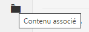
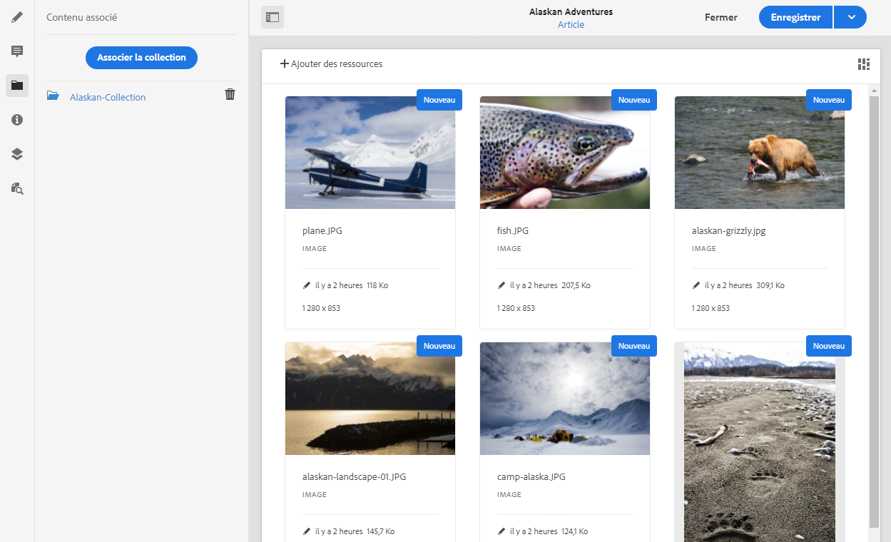

# Contenu associé{#associated-content}

Le contenu associé fournit la connexion afin que les ressources puissent (éventuellement) être utilisées avec le fragment lorsqu’il est ajouté à une page de contenu. Vous bénéficiez ainsi d’une certaine souplesse,[ car vous disposez d’une gamme de ressources auxquelles accéder lors de l’utilisation du fragment de contenu sur une page.](/help/sites-cloud/authoring/fundamentals/content-fragments.md#using-associated-content) Cela permet aussi de réduire le temps nécessaire pour rechercher la ressource appropriée.

## Ajout de contenu associé {#adding-associated-content}

>[!NOTE]
>
>Différentes méthodes permettent d’ajouter des [ressources visuelles (des images, par exemple)](/help/assets/content-fragments/content-fragments.md#fragments-with-visual-assets) au fragment et/ou à la page.

Pour effectuer l’association, vous devez d’abord [ajouter les ressources multimédias à une collection](/help/assets/manage-collections.md). Après cela, vous pouvez :

1. Open your fragment and select **Associated Content** from the side panel.

   

2. Sélectionnez **Associer le contenu** ou **Associer la collection** (le cas échéant, selon que des collections ont été associées ou non).
3. Sélectionnez la collection requise.

   Si vous le souhaitez, vous pouvez ajouter le fragment à la collection sélectionnée, car cela facilite le suivi.

   

4. Confirmez (en cochant). La collection sera répertoriée comme associée.

   

## Modification du contenu associé {#editing-associated-content}

Une fois que vous avez associé une collection, vous pouvez effectuer les opérations suivantes :

* **Supprimer** l’association.
* **Ajouter des ressources** à la collection.
* Sélectionner une ressource en vue d’effectuer d’autres opérations.
* Modifier la ressource.
