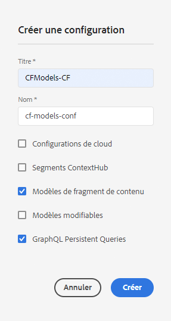
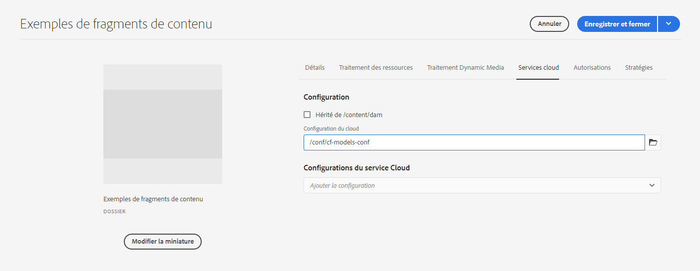

# Fragments de contenu - Navigateur de configuration{#content-fragments-configuration-browser}

>[!CAUTION]
>
>L’AEM API GraphQL, pour Content Fragment Diffusion, sera disponible début 2021.
>
>La documentation correspondante est déjà disponible à des fins de prévisualisation.

## Activer la fonctionnalité de fragment de contenu pour votre instance {#enable-content-fragment-functionality-instance}

Avant d’utiliser les fragments de contenu, vous devez utiliser le **navigateur de configuration** pour activer les éléments suivants :

* **Modèles**  de fragment de contenu - obligatoire
* **Requêtes**  persistantes GraphQL - facultatif

>[!CAUTION]
>
>Si vous n’activez pas **les modèles de fragment de contenu**, l’option **Créer** n’est pas disponible pour la création de modèles.

Pour activer la fonctionnalité de fragment de contenu, vous devez effectuer les opérations suivantes :

* Activer l’utilisation de la fonctionnalité de fragments de contenu par le biais du navigateur de configuration
* appliquer la configuration à votre dossier de ressources ;

### Activation de la fonctionnalité de fragment de contenu dans l’explorateur de configuration {#enable-content-fragment-functionality-in-configuration-browser}

Pour [utiliser certaines fonctionnalités de fragment de contenu](#creating-a-content-fragment-model), **vous &lt;a2/>devez d&#39;abord** les activer via l&#39;**navigateur de configuration** :

>[!NOTE]
>
>Pour plus de détails, voir également [Navigateur de configuration:](/help/implementing/developing/introduction/configurations.md#using-configuration-browser).

1. Accédez à **Outils**, **Général**, puis ouvrez l’**explorateur de configurations**.
2. Sélectionnez l’emplacement approprié pour votre site web.
3. Utilisez le bouton **Créer** pour ouvrir la boîte de dialogue.

   1. Spécifiez un **Titre**.
   2. Pour activer leur utilisation, sélectionnez
      * **Modèles de fragment de contenu**
      * **Requêtes persistantes GraphQL**

      

4. Sélectionnez **Créer** pour enregistrer la définition.

### Application de la configuration à votre dossier de ressources {#apply-the-configuration-to-your-assets-folder}

Lorsque la configuration **global** est activée pour la fonctionnalité de fragment de contenu, s’applique à tout dossier Assets.

Pour utiliser d’autres configurations (c’est-à-dire à l’exclusion de la version globale) avec un dossier de ressources comparable, vous devez définir la connexion. Pour ce faire, utilisez **Configuration** sous l’onglet **Services cloud** des **Propriétés du dossier** du dossier approprié.

